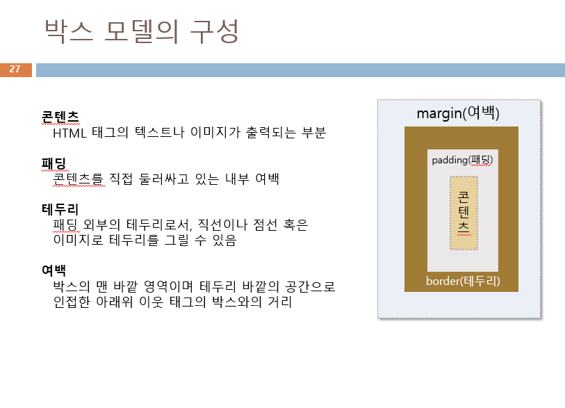

# AWS CSS 수업 23.08.31

## class 셀렉터

태그 셀렉터보다 우선 순위가 높다.

태그 내부에 class 값을 설정해서 css에서 ‘.클래스명’을 사용해서 작업한다.

부모 태그 내부에 있는 자식 태그에만 css 스타일을 적용하고 싶으면 부모 태그와 자식 태그를 연속해서 적으면 된다.

## id 셀렉터

class 셀렉터보다 우선 순위가 높다

태그 내부에 id 값을 설정해서 css에서 ‘#id명’을 사용해서 작업한다.

마찬가지로 자식 태그에만 css 스타일을 적용하고 싶으면 부모 태그와 자식 태그를 연속해서 적으면 된다.

## ::first-letter

첫 글자를 가리킨다.

셀렉터 뒤에 사용해서 셀렉터가 가리키는 글자의 첫 글자를 가리킬 수 있다. 이를 통해 첫 글자에만 css 스타일을 적용할 수도 있다.

다음은 다양한 셀렉터를 활용해서 css 스타일 작업을 하는 예제이다.

```html
<!DOCTYPE html>
<html lang="en">
<head>
    <meta charset="UTF-8">
    <meta name="viewport" content="width=device-width, initial-scale=1.0">
    <title>Document</title>
    <style>
        .title{font-size: 30px;}
        .title b{background-color: yellow;}
        #list{font-size: 30px;}
        #list span{color: fuchsia;}
        .f{color: red;}
        h2::first-letter{color: aqua;}
    </style>
</head>
<body class="bb">
    <h2>Web Programming</h2>

    <hr />
    <div class="title">2학기 <b>학습 내용</b></div>>
    <ul id="list">
        <li><span>HTML5</span></li>
        <li><em>CSS</em></li>
        <li>JAVASCRIPT</li>
    </ul>
    <div class="f">60점 이하는 F!</div>
</body>
</html>
```

예제 2

```html
<!DOCTYPE html>
<html lang="en">
<head>
    <meta charset="UTF-8">
    <meta name="viewport" content="width=device-width, initial-scale=1.0">
    <title>Document</title>
    <style>
        /*
        .title{color: blue;}
        .p1{color: magenta;}
        */
    </style>
</head>
<body>

    <h2>도형 서식 폼 만들기</h2>
    <hr />
    <fieldset>
        <legend>도형 서식 입력</legend>
        선종류 
        <select>
            <option value="line">실선</option>
            <option value="dot-line">점선</option>
            <option value="none">선없음</option>
        </select>
        <br />
        선두께 <input type="text"> 선색<input type="color"><br />
        투명도(0~100): <input type="range">
    </fieldset>>
</body>
</html>
```

## 전체 셀렉터

와일드 문자(*)를 사용해서 모든 태그에 적용시키는 셀렉터이다.

## 속성 셀렉터

HTML 태그의 특정 속성에 대해 값이 일치하는 태그에만 스타일을 적용하는 셀렉터이다.

예를 들면 input[type=text]{color:red;} 처럼 사용하면 type 속성값이 text인 input 태그에 적용된다.

## 색 관련 프로퍼티

color : 글자 색

background-color : 배경색

border-color : 테두리 색

## 텍스트 스타일

text-indent : 들여쓰기

→ 속성 값을 3em처럼 주면 3글자 들여쓰기

text-align : 정렬

→ left, center, right, justify(양쪽정렬) 정렬이 가능

text-decoration : 텍스트 꾸미기

→ overline, underline, line-through 등 텍스트 기준으로 줄 위치 설정 가능

```html
<style>
        .p1{
            font-family: "Times New Roman", Times, serif;
            font-size: large;
        }
        .p2{
            font-family: "Dotum", 돋움, sans-serif;
            font-size: small;
        }
    </style>
</head>
<body>
    <!-- 글자 굵기 지정 -->
    <p class="p1" style="font-weight:900">font-weight</p>
    <p class="p2" style="font-weight:100">font-weight</p>
    <p><b>font-weight</b></p>
    <!-- 글자 기울이기 -->
    <p style="font-style:italic">font-style</p>
    <p style="font-style: oblique">font-style</p>
    <!-- em은 몇배인지를 나타낸다 -->
    <p>현재 크기의 <span style="font-size: 3em">3배</span></p>
</body>
```

## css 박스 모델



