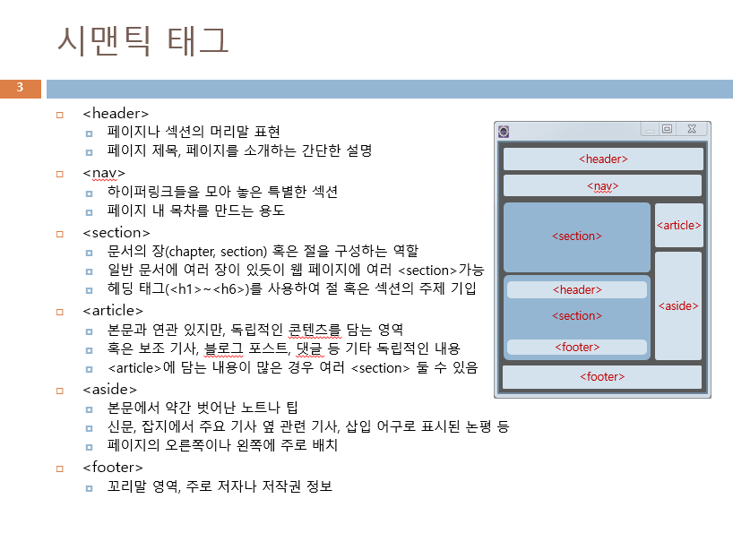

# AWS HTML 수업 23.08.30

## 실습

```html
<!--
    <h1>레드향</h1>
    <p>껍질에 붉은 빛이 돌아 <strong>레드향</strong>이라 불린다.</p>
    <p>
      레드향은 <em>한라봉과 귤을 교배</em>한 것으로<br />
      일반 귤보다 2~3배 크고, 과육이 붉고 통통하다.<br />
    </p>
    <p>
      <em>비타민 C</em>와 <em>비타민 P</em>가 풍부해<br />
      혈액순환<sup>1</sup> 또는 감기예방<sub>2</sub> 등에 좋<del
        >은 것으로 알려져 있</del
      >다.
    </p>
    -->
    <!--
    <h1>아침</h1>
    <hr />
    <pre>
      오늘 아침 학원에 왔다 아침온도는 22&deg;로 덥다 노래&sung;가 생각난다

      Monday Tuesday Wednesday Thursday Friday
      Seven days a week

      &copy;Copyright 정국 All rights reserved. &phone;010-0000-9999
    </pre>
    -->
    <!--
    <h1>공부하는 방법</h1>
    <hr />
    <ol>
      <li>계획을 세운다.</li>
      <li>배웠던 내용을 정리한다.</li>
      <li>정리한 내용을 응용한다.</li>
    </ol>
    -->
<!--
    <table border="1">
      <tr>
        <td>
          
        </td>
        <td>
          
        </td>
        <td>
          
        </td>
      </tr>
    </table>
    -->
    <!--
    <a href="https://www.naver.com">네이버</a>
    <a href="https://www.google.com">구글</a>
    <a href="https://www.daum.net"
      ></a>
    -->
<!--
    <h1>탐라국 입춘굿</h1>
    <p>
      탐라국 입춘굿은 입춘을 맞아 풍년을 기원하는 행사로, 제주도의 문화 축제
      중에서 유일하게 탐라 시대부터 이어져 왔다.
    </p>

    <p>
      제주에서는 입춘을 새철이라 한다.<br />
      신구간이 끝나 하늘의 1만 8,000 신이 지상으로 내려와 새해 일을 시작하는
      때다.
    </p>

    <p><a href="http://tig0204.kr/index.php">자세한 정보 보기</a></p>

    <h3>일정</h3>
    <ol type="1">
      <li>입춘맞이 : 1/27(월) ~ 1/31(금)</li>
      <li>낭쉐코사 : 2/1(토)</li>
      <li>거리굿 : 2/2(일)</li>
      <li>열림굿 : 2/3(월)</li>
      <li>입춘굿 : 2/4(화)</li>
    </ol>
    <h2>먹거리</h2>
    <table border="1">
      <tbody>
        <tr>
          <th>입춘 천냥 국수</th>
          <td>11:00 ~ 16:00</td>
          <td>목관아 주차장</td>
        </tr>
        <tr>
          <th>제주 향토 음식</th>
          <td>10:30 ~ 17:00</td>
          <td>관덕정 마당</td>
        </tr>
        <tr>
          <th>입춘 주전부리</th>
          <td>10:30 ~ 17:00</td>
          <td>관덕정 마당</td>
        </tr>
        <tr>
          <th>차 나눔</th>
          <td>10:30 ~ 17:00</td>
          <td>관덕정 마당</td>
        </tr>
      </tbody>
    </table>
    -->
    <!--
    <table border="1">
      <caption>
        학력사항
      </caption>
      <tbody>
        <tr>
          <th>출신학교</th>
          <th>전공</th>
          <th>기간</th>
          <th>졸업구분</th>
        </tr>
        <tr>
          <td>ㅇㅇㅇ고등학교</td>
          <td>(해당사항 없음)</td>
          <td>2001.3~2004.2</td>
          <td>졸업</td>
        </tr>
        <tr>
          <td>ㅁㅁ대학교</td>
          <td>컴퓨터공학</td>
          <td>2004.3~2008.2</td>
          <td>졸업</td>
        </tr>
      </tbody>
    </table>
    -->
    <!--
    <h1>상품 구성</h1>
    <table border="1">
      <caption>
        선물용과 가정용 상품 구성
      </caption>
      <thead>
        <tr>
          <th>용도</th>
          <th>중량</th>
          <th>개수</th>
          <th>가격</th>
        </tr>
      </thead>
      <tbody>
        <tr>
          <td>선물용</td>
          <td>3kg</td>
          <td>11~16과</td>
          <td>35,000원</td>
        </tr>
        <tr>
          <td>선물용</td>
          <td>5kg</td>
          <td>18~26과</td>
          <td>52,000원</td>
        </tr>
        <tr>
          <td>가정용</td>
          <td>3kg</td>
          <td>11~16과</td>
          <td>30,000원</td>
        </tr>
        <tr>
          <td>가정용</td>
          <td>5kg</td>
          <td>18~26과</td>
          <td>47,000원</td>
        </tr>
      </tbody>
    </table>
    -->
    <!--
    <dl>
      <dt><strong>Califonia</strong></dt>
      <dd>태평양의 아름다운 해변을 가짐</dd>

      <dt><strong>Texas</strong></dt>
      <dd>텍사스 바베큐로 유명한 주</dd>

      <dt><strong>Florida</strong></dt>
      <dd>미국의 동남부</dd>
    </dl>
    -->
    <!--
    <ul>
      <li>좋아하는 음식</li>
      <ul>
        <li>파스타</li>
        <li>스테이크</li>
        <li>피자</li>
      </ul>
      <li>파스타 만들기</li>
      <ol type="1">
        <li>물을 끓인다</li>
        <li>면을 넣는다</li>
        <li>맛있게 먹는다</li>
      </ol>
    </ul>
    -->
    <!--
    <h1>수습 국원 모집</h1>
    <h2>방송에 관심 있는 새내기 여러분 환영합니다</h2>
    교내 방송국에서 신입생을 대상으로 수습 국원을 모집합니다. 학부나 전공에
    상관없습니다.<br />
    평소 방송에 관심있었던 여러 학우들의 지원바랍니다.
    <br />
    <ul>
      <li><strong>모집 기간</strong> : 3월 2일 ~ 3월 11일</li>
      <li><strong>모집 분야</strong> : 아나운서, PD, 엔지니어</li>
      <li><strong>지원 방법</strong> : 양식 작성 후 이메일 접수</li>
      <i>지원서 양식은 교내 방송국 홈페이지 공지 게시판에 있습니다.</i>
    </ul>
    <h3>혜택</h3>
    <ol type="a">
      <li>수습기자 활동 중 소정의 활동비 지급</li>
      <li>정기자로 진급하면 장학금 지급</li>
    </ol>
    -->
    <!--
    <h1>레드향 샐러드 레시피</h1>
    <p><b>재료</b>: 레드향 1개, 아보카도 1개, 토마토 1개, 샐러드 채소 30g</p>
    <p><b>드레싱</b>: 올리브유 1큰술, 레몬즙 2큰술, 꿀 1큰술, 소금 약간</p>
    <h4>재료 준비</h4>
    <ol type="a">
      <li>샐러드 채소를 씻고 물기를 제거한 후 준비합니다.</li>
      <li>레드향과 아보카도, 토마토를 먹기 좋은 크기를 썰어둡니다.</li>
    </ol>
    <h4>드레싱 준비</h4>
    <ol type="a" start="3">
      <li>드레싱 재료를 믹서에 갈아줍니다.</li>
    </ol>
    <h4>샐러드 완성</h4>
    <ol type="a" start="4">
      <li>
        볼에 샐러드 채소와 썰어 둔 레드향, 아보카도, 토마토를 넣고 드레싱을
        뿌리면 끝!
      </li>
    </ol>
    -->
    <!--
    <ul>
      <li>자바</li>
      <li>DB</li>
      <li>html</li>
    </ul>
    -->
    <!--
    <ol type="A">
      <li>물을 끓인다</li>
      <li>라면을 넣는다</li>
      <li>스프를 넣는다</li>
      <li>냠냠</li>
    </ol>
    -->
    <!-- <h1~6> 주석 처리
    <h1>1장 자바언어</h1>
    <h2>2장 자바언어</h2>
    <h3>3장 자바언어</h3>
    <h4>4장 자바언어</h4>
    <h5>5장 자바언어</h5>
    <h6>6장 자바언어</h6>
    -->
    <!-- <p>, <br /> 주석 처리
    <p>
      올해 본예산보다 2.8% 늘어난 것으로, 재정통계가 정비된 2005년 이후로<br />
      20년만의 최소 증가 폭이다. 정부가 예상하는 내년도 경상 성장률(4.9%)에
      크게<br />
      못 미치는 '긴축 재정'으로 평가된다.<br />
    </p>
    <p>
      내년도 총수입은 총지출보다 45조원가량 부족한 612조1천억원 규모로
      짜였다.<br />
      역대급 '세수 펑크' 속에 나라살림의 허리띠를 바짝 조였음에도,
      관리재정수지<br />
      적자가 국내총생산(GDP) 대비 3.9%까지 불어나면서 정부가 추진하는
      재정준칙<br />
      한도(3.0%)를 넘어서게 됐다.<br />
    </p>
    -->
    <!-- <hr /> 주석 처리
    <hr />
    <p>hr 태그는 horizontal에서 따온 글자</p>
    <hr />
    <p>종료!!</p>
    -->

    <!-- 문자, 기호, 심볼 입력
    &gt; <br />
    &lt; <br />
    &amp; <br />
    2 &nbsp; 3 <br />
    &copy; <br />
    &sung; <br />
    &phone; <br />
    -->

    <!-- 주석 처리
    안녕하세요 오늘은 화요일이며 8월 29일입니다.

    <pre>
      개발자가 원하는 포맷 그대로
      출력할 것이다!
    </pre>
    -->
    <!-- 각종 태그들 주석 처리
    <p>
      <b>진하게</b><br />
      <strong>중요한</strong><br />
      <em>강조</em><br />
      <i>이탤릭체로 강조</i><br />
      <del>삭제</del><br />
      <ins>추가</ins><br />
      문자의<sup>윗첨자</sup><br />
      문자의<sub>아래첨자</sub><br />
      <mark>하이라이트 형광펜</mark><br />
    </p>
    -->
    <!--  주석 처리
    
    -->

    <!-- 카페 문제 푼것 주석 처리
    <b>가사</b><br />
    <br />
    오늘 아침 온도는 25도이었다.<br />
    <br />
    모든 게 궁금해 뭐가 널 행복하게 하는지<br />
    our every picture 내 머리맡에 두고 싶어<br />
    Come be my teacher<br />
    네 모든 걸 다 가르쳐줘<br />
    <br />
    &copy;Copyright&lt;홍길동&gt;All rights reserved. &#9742;010-0000-9999
    -->
<!--
    <h1>스마트폰</h1>
    <br />
    휴대 전화에 여러 컴퓨터 지원 기능을 추가한 지능형 단말기. 응용 소프트웨어
    설치가 자유로운 것이 특징이며 인류 역사에 혁신적인 기여를 한 위대한 물건중
    하나이다. 사실상 휴대전화 기능을 탑재한 포터블 컴퓨터라고 보면 될 정도로
    오늘날 PC나 TV 라디오 등의 기능들을 전부 합친 기계이다.

    <ul>
      <li><a href="#history">역사</a></li>
      <li><a href="#smartphone">스마트폰</a></li>
      <li><a href="#iphone">아이폰</a></li>
      <li><a href="#sample">샘플</a></li>
    </ul>
    <h3 id="history">
      <a href="https://namu.wiki/w/%EC%97%AD%EC%82%AC" target="_blank">
        역사
      </a>
    </h3>
    <h3 id="smartphone">
      <a
        href="https://namu.wiki/w/%EC%8A%A4%EB%A7%88%ED%8A%B8%ED%8F%B0"
        target="_black"
      >
        스마트폰
      </a>
    </h3>
    -->
```

## HTML5의 문서 구조화

기존 HTML은 웹 문서 구조를 표현하는 태그가 없었다. 검색 엔진이 좋아하는 웹 페이지 작성의 필요성이 대두되어 문서 구조화가 일어났다.

시멘틱 웹은 웹 문서를 구조화하여 의미있는 내용 탐색이 용이한 웹이다.

문서의 구조와 의미를 전달하기 위해 기존 태그를 시멘틱 태그로 바꿔서 사용한다.

## 시멘틱 태그



시멘틱 태그는 위치, 색, 모양이 자동으로 결정되지 않으므로 css를 이용해서 개발자가 직접 위치와 색, 모양을 지정해야 한다.

## 웹 폼(굉장히 중요!!)

웹 페이지에서 사용자 입력을 받는 폼

로그인, 등록, 검색, 예약, 쇼핑 등에 활용된다.

폼 요소는 폼을 만드는 다양한 태그로, input태그, textarea태그, select 태그 등이 있다.

보통 input태그가 가장 많이 활용된다.
form태그의 속성에는 name속성, action 속성, method 속성 등이 있다.

name 속성 : 폼의 이름 지정

action 속성 : 폼 데이터를 처리할 웹 서버 응용 프로그램의 이름 지정, submit 버튼이 눌리면 브라우저는 action에 지정된 웹 서버 응용 프로그램 실행 요청, 웹 서버 응용 프로그램은 Java, JSP, PHP, C/C++ 등 다양한 언어로 작성된다.

method 속성 : 폼 데이터를 웹 서버로 전송하는 형식이다. 대표적인 전송 방식은 get, post가 있다.

### 폼 요소의 종류


input태그 속성 중 placeholder는 연하게 고정된 메시지를 텍스트 입력 창에 표시할 수 있다.

## 데이터 목록을 가진 텍스트 입력창

datalist태그를 활용해서 목록 리스트를 작성할 수 있다. 선택할 수 있는 목록창을 만들어주는데 목록 하나 하나는 option태그로 표현한다.

다음과 같은 형태로 작성한다.

```html
<!--
나라 : <input type="text" list="countries" />
<datalist id="countries">
  <option value="가나"></option>
  <option value="스위스"></option>
  <option value="브라질"></option>
</datalist>
-->
```

## colspan 속성

표의 각 셀을 합치고 싶을 때 사용한다. colspan 속성에서 합칠 열 개수를 설정하면 해당 열의 개수만큼 가로 한 줄이 합쳐진다.

다음은 colaspan 속성과 input태그를 함께 사용한 표를 생성한 예제이다.

```html
<table border="1">
	<caption>
		<h1>교재비 동의서</h1>
	</caption>
	<tr>
		<td>성명</td>
		<td><input type="text" /></td>
		<td>생년월일</td>
		<td><input type="text" /></td>
	</tr>
	<tr>
		<td>개강일자</td>
		<td><input type="date" /></td>
		<td>담당자</td>
		<td><input type="text" placeholder="꼭 작성" /></td>
	</tr>
	<tr>
		<td>연락처</td>
		<td colspan="3"><input type="text" /></td>
	</tr>
	<tr>
		<td>수강과목</td>
		<td colspan="3"><input type="text" /></td>
	</tr>
	<tr>
		<td colspan="4">
		<textarea cols="70" rows="10">(주)이젠에서 실시하는...</textarea>
		</td>
	</tr>
</table>
```

## 체크박스와 라디오 버튼

input type을 checkbox로 설정하면 체크박스를 만들 수 있다. 이때 checked 속성을 사용하면 초기값을 체크된 상태로 만들 수 있다.

체크박스를 체크하면 value 값이 웹 서버로 전달된다.

다음 체크박스 예제에서는 짜장면을 선택하면 웹서버로 1이 전달되고, 짬뽕은 2, 탕수육은 3이 전달된다.

```html
<form>
	짜장면 <input type="checkbox" value="1" /> 짬뽕
  <input type="checkbox" value="2" /> 탕수육
  <input type="checkbox" value="3" checked />
</form>
```

이러한 value값을 활용해서 자바에서 조건을 만들게 된다.

체크박스를 하나로 묶는 블록을 만들고 싶다면 fieldset태그를 사용해서 전체를 묶는다. 그 안에 블록을 나타낼 이름을 legend태그로 설정하고, 이후에 input type을 checkbox로 설정해서 체크박스를 만들면 된다.

예제는 다음과 같다.

```html
<fieldset>
	<legend>먹고싶은거 선택해</legend>
  짜장면 <input type="checkbox" value="1" /> 탕수육
  <input type="checkbox" value="2" checked /> 짬뽕
  <input type="checkbox" value="3" />
</fieldset>
```

## label

label태그로 글자와 input type으로 만든 입력창을 묶으면 글자를 클릭해도 입력창에 클릭이 인식된다.

다음은 예제 코드이다.

```html
<form>
  <label>사용자 ID : <input id="user" type="text" /></label>
  <label>사용자 PW : <input id="pass" type="password" /></label>
</form>
```

## input type=”color”

색상을 고를 수 있고, 스포이드로 추출해 낼 수도 있는 기능이 있는 아이콘이 웹 문서에 생긴다.

## css란

HTML문서의 색이나 모양 등 외관을 꾸미는 언어

CSS로 작성된 코드를 스타일 시트라고 부른다.

현재는 CSS3으로 CSS level 3

CSS4는 현재 표준화 작업중

CSS3의 기능은 색상, 배경, 텍스트, 폰트, 박스 모델, 비주얼 포맷 및 효과, 리스트, 테이블, 사용자 인터페이스 등이 있다.

## css3 스타일 시트 구성

**셀렉터** : css3 스타일 시트를 HTML 페이지에 적용하도록 만든 이름

**프로퍼티** : 스타일 속성 이름. 약 200개 정도의 프로퍼티가 있다.

**값** : 프로퍼티의 값

**주석문** : 스타일 시트 내에 붙이는 설명문

**대소문자 구분** : 구분하지 않으나 관례상 소문자 사용

## style태그

style태그는 항상 head태그 사이에서만 사용한다.

style태그는 여러번 작성 가능하다.

style태그에 작성된 스타일 시트는 웹 페이지 전체에 적용된다.

## css 우선순위

외부 css 파일에서 css 스타일을 설정하는 것보다 html 내부에서 style태그로 설정한 것이 우선순위가 더 높다.

## css 스타일의 상속

자식 태그는 부모 태그의 스타일을 상속받는다

## css 실습

```html
<!DOCTYPE html>
<html lang="en">
  <head>
    <meta charset="UTF-8" />
    <meta name="viewport" content="width=device-width, initial-scale=1.0" />
    <title>Document</title>
    <link type="text/css" rel="stylesheet" href="mycss.css" />
    <style>
      bold {
        font-weight: 700;
      }
      highlight {
        font-weight: 700;
        background-color: black;
        color: white;
      }
      blue_b {
        font-weight: 700;
        color: blue;
      }
      brown {
        font-weight: 700;
        color: brown;
      }
      blue {
        color: blue;
      }
    </style>
  </head>
  <body>
    <p><bold>회사 소개</bold></p>
    <p><highlight>"사람을 도와주는 책"</highlight></p>
    <p>나는 <brown>'사람들에게 도움을 주는 개발자 입니다.</brown></p>
    <p>
      IT 기술과 실생활에 접목시킨 개발을 하고 있으며 브랜드로 출간하고 있습니다.
    </p>
    <p><blue_b>나의 미션</blue_b></p>
    <p>사람에게 <blue>도움</blue>을 주는 책</p>
    <p>열심히 사는 사람들에게 도움이 되고 싶습니다.</p>
    <p>
      <blue
        >개발의 지름길을 만들어 빠르게 원하는 곳으로 가도록 도와주는 개발자.
        이익을 얻을 수 있도록 도움이 되는 책을 만들<br />
        고 싶습니다.</blue
      >
    </p>
	</body>
```