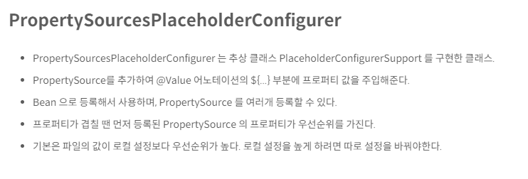

# BoardProject 스프링 레거시 23.10.24~23.11.01

## 스프링 mvc 3tier

화면 계층, 비즈니스(서비스) 계층, 영속 계층 or 데이터 계층이 있다.

## BoardProject 스프링 레거시

-절대 경로 : http://www.naver.com

-고유 경로 : c\jsp\tomcat

-상대 경로 : 현재 위치 기준으로 설정

절대 경로로 넣으면 새로운 요청이 발생했을 때 localhost:8080 주소만 남는다. 그 뒤에 href=”ezen/main”만 남기 때문에 하위 경로가 어떻게 되어 있든 상관없이 원하는 페이지를 직접 요청할 수 있다. contextpath를 이용한 절대 경로 사용이 실무에서 많이 쓰인다.

컨트롤러 : @Controller(웹 요청과 응답처리)

로직 : @Service(자바 로직 처리), 비즈니스 계층

@Repository(DB, 외부 작업 처리)

@Controller, @Service, @Repository, @Component는 @ComponentScan으로 빈 등록을 할 수 있다.

### Ajax(Asynchronous Javascript and Xml)

비동기 자바스크립트와 xml이라는 의미이다.

JavaScript의 라이브러리중 하나이다.

비동기적인 웹 애플리케이션 개발을 위한 웹 개발 기법이다.

웹서버와 비동기적으로 데이터를 교환한다.(xml, 텍스트, json)

동적인 웹페이지를 만들기 위해 브라우저가 가지고 있는 XMLHttpRequest 객체를 이용해서 웹 페이지 전체를 로딩하는 것이 아닌 일부분만 갱신하는 것이 가능하다. 이처럼 페이지의 일부만을 위한 데이터를 로드할 수 있고, JavaScript를 사용한 비동기 통신, 클라이언트와 서버 간에 XML 데이터를 주고 받을 수 있게 하는 기술이다. 즉, 자바스크립트를 통해서 서버에 데이터를 요청하는 것이다.

ajax : 요청 → 웹서버 → DB → json, xml, html… → front

### MyBatis에서 알아야 할 추가적인 부분

@SelectKey : 사전에 어떤 키 값을 가져와서 증가시켜서 입력하는 경우, 입력 후에 증가된 키 값을 가져오는 경우에 사용한다.

## xs, sm, md, lg

xs : extra small

sm : small

md : medium

lg : large

스크린 크기를 의미한다.

## properties 파일이 2개 이상일 때 충돌 문제 해결



## 에러메시지 등록 문법

### 어노테이션 사용시

어노테이션이름.빈이름(설정하지 않았다면 클래스 이름과 동일).필드명=에러메시지

### 사용자 정의 에러일 시

에러이름.빈이름(설정하지 않았다면 클래스 이름과 동일).rejectValue에서 설정한 이름=에러메시지

## 게시판 만들기

### 스프링 DI, AOP, IoC 이용해서 게시판 만드는 순서

DB 테이블 →  VO → Mapper(인터페이스) → DB 세팅 → DAO → 서비스 → Controller → jsp

### Mapper 인터페이스, DAO, 서비스를 만드는 이유

유지보수 때문이다.

### 중복확인

UserMapper에서 아이디 기준으로 이름을 추출하는 작업 → UserDao → UserService → 사용할 수 있는 아이디면(이름 추출한 값이 null이면) true, 그렇지 않으면 false → ResController에서 경로 매핑

@RestController로 설정한 ResController처럼 데이터를 직접 보내는 restAPI는 보통 주소로 보낸다. 이것을 ajax에서 받았다.

### kr.co.ezen.beans 패키지

**BoardInfo.java파일**

1팀~4팀에 해당하는 팀별 게시판을 식별할 게시판 번호와 이름을 다루는 클래스이다. DB의 board_info_table과 연결되어 값을 조회, 삽입, 변경, 삭제할 수 있도록 만들어 놓은 클래스이다.

```java
package kr.co.ezen.beans;

public class BoardInfo {

	private int board_info_idx;
	private String board_info_name;
	
	public int getBoard_info_idx() {
		return board_info_idx;
	}
	public void setBoard_info_idx(int board_info_idx) {
		this.board_info_idx = board_info_idx;
	}
	public String getBoard_info_name() {
		return board_info_name;
	}
	public void setBoard_info_name(String board_info_name) {
		this.board_info_name = board_info_name;
	}
	
	
}
```

**Content.java파일**

각각의 게시글의 정보를 저장하는 클래스이다. DB의 content_table과 연결되어 각각의 게시글의 정보를 조회, 삽입, 변경, 삭제할 수 있도록 만들어 놓은 클래스이다.

```java
package kr.co.ezen.beans;

import javax.validation.constraints.NotBlank;

public class Content {
	
	private int content_idx;
	
	@NotBlank
	private String content_subject;
	
	@NotBlank
	private String content_text;
	
	private int content_writer_idx;
	private int content_board_idx;
	private String content_date;
	
	private String content_writer_name;
	
	public int getContent_idx() {
		return content_idx;
	}
	public void setContent_idx(int content_idx) {
		this.content_idx = content_idx;
	}
	public String getContent_subject() {
		return content_subject;
	}
	public void setContent_subject(String content_subject) {
		this.content_subject = content_subject;
	}
	public String getContent_text() {
		return content_text;
	}
	public void setContent_text(String content_text) {
		this.content_text = content_text;
	}
	public int getContent_writer_idx() {
		return content_writer_idx;
	}
	public void setContent_writer_idx(int content_writer_idx) {
		this.content_writer_idx = content_writer_idx;
	}
	public int getContent_board_idx() {
		return content_board_idx;
	}
	public void setContent_board_idx(int content_board_idx) {
		this.content_board_idx = content_board_idx;
	}
	public String getContent_date() {
		return content_date;
	}
	public void setContent_date(String content_date) {
		this.content_date = content_date;
	}
	public String getContent_writer_name() {
		return content_writer_name;
	}
	public void setContent_writer_name(String content_writer_name) {
		this.content_writer_name = content_writer_name;
	}
	
	
	
}
```

**Page.java파일**

페이지네이션(Pagination)에 필요한 것들을 설정해 놓은 클래스이다. 한 페이지에 페이지를 이동할 수 있는 페이지 번호 버튼을 몇 개까지 나타나게 만들 것인지, n번 페이지에 있을 때 페이지를 이동하는 버튼의 페이지 번호의 최대, 최소값은 어떤 것인지, 이전 버튼과 다음 버튼을 눌렀을 때 각각 어떤 페이지로 이동할 것인지 등을 설정해서 원하는 페이지로 이동할 수 있도록 설정한다.

```java
package kr.co.ezen.beans;

public class Page {
	
	// 최소 페이지 번호
	private int min;
	
	// 최대 페이지 번호
	private int max;
	
	// 이전 버튼 누르면 이동할 페이지 번호
	private int prePage;
	
	// 다음 버튼 누르면 이동할 페이지 번호
	private int nextPage;
	
	// 전체 페이지 개수
	private int pageCnt;
	
	// 현재 페이지 번호
	private int currentPage;
	
	public Page(int contentCnt, int currentPage, int contentPageCnt, int pa) {
		
		this.currentPage=currentPage;
		
		// 전체 페이지 개수 = 전체 게시글 개수 / 각 페이지에 표시되는 게시글 개수(10)
		// 만약 나누어 떨어지지 않으면 1 증가해야 함
		pageCnt = contentCnt/contentPageCnt;
		if(contentCnt % contentPageCnt > 0) {
			pageCnt++;
		}
		// 현재 페이지 기준으로 최소 페이지 번호
		min=((currentPage -1) / contentPageCnt) * contentPageCnt + 1;
		
		// 현재 페이지 기준으로 최대 페이지 번호
		max = min + pa - 1;
		
		// 최대 페이지 번호가 전체 페이지 개수를 넘어서면
		// 최대 페이지 번호를 전체 페이지 개수와 동일하게 설정
		if(max > pageCnt) {
			max=pageCnt;
		}
		
		// 이전 페이지는 최소 페이지 번호를 1 감소
		prePage=min-1;

		// 다음 페이지는 최대 페이지 번호를 1 증가
		nextPage=max+1;
		
		// 다음 페이지가 전체 페이지 개수를 넘어서면
		// 다음 페이지 번호를 전체 페이지 개수와 동일하게 설정
		if(nextPage > pageCnt) {
			nextPage=pageCnt;
		}
		
	}

	public int getMin() {
		return min;
	}

	public int getMax() {
		return max;
	}

	public int getPrePage() {
		return prePage;
	}

	public int getNextPage() {
		return nextPage;
	}

	public int getPageCnt() {
		return pageCnt;
	}

	public int getCurrentPage() {
		return currentPage;
	}
	
	

}
```

**User.java파일**

DB의 user_table과 연결되어 유저 정보를 조회, 삽입, 변경, 삭제할 수 있는 클래스이다.

```java
package kr.co.ezen.beans;

import javax.validation.constraints.Pattern;
import javax.validation.constraints.Size;

public class User {
	
	private int user_idx;
	
	private boolean existId;
	private boolean userLogin;
	
	
	public User() {
		// 처음에는 사용할 수 없는 아이디로 설정
		this.existId=false;
		this.userLogin=false;
	}
	
	@Size(min=2, max=4)
	@Pattern(regexp="[가-힣]*")
	private String user_name;
	
	@Size(min=4, max=20)
	@Pattern(regexp="[a-zA-Z0-9]*")
	private String user_id;
	
	@Size(min=4, max=20)
	@Pattern(regexp="[a-zA-Z0-9]*")
	private String user_pw;
	
	@Size(min=4, max=20)
	@Pattern(regexp="[a-zA-Z0-9]*")
	private String user_pw2;

	public int getUser_idx() {
		return user_idx;
	}

	public void setUser_idx(int user_idx) {
		this.user_idx = user_idx;
	}

	public boolean isExistId() {
		return existId;
	}

	public void setExistId(boolean existId) {
		this.existId = existId;
	}

	public boolean isUserLogin() {
		return userLogin;
	}

	public void setUserLogin(boolean userLogin) {
		this.userLogin = userLogin;
	}

	public String getUser_name() {
		return user_name;
	}

	public void setUser_name(String user_name) {
		this.user_name = user_name;
	}

	public String getUser_id() {
		return user_id;
	}

	public void setUser_id(String user_id) {
		this.user_id = user_id;
	}

	public String getUser_pw() {
		return user_pw;
	}

	public void setUser_pw(String user_pw) {
		this.user_pw = user_pw;
	}

	public String getUser_pw2() {
		return user_pw2;
	}

	public void setUser_pw2(String user_pw2) {
		this.user_pw2 = user_pw2;
	}
	
	
	
}
```

### kr.co.ezen.config 패키지

**ConfigClass.java파일**

AbstractAnnotationConfigDispatcherServletInitializer 클래스를 상속받아서 메소드 오버라이딩을 통해 Bean들을 정의하기 위한 클래스, MVC 설정을 위한 클래스를 지정하고, DispatcherServlet에 매핑할 요청 주소를 세팅한다. 또한 UTF-8로 인코딩하기 위해서 파라미터 인코딩 필터를 설정한다.

```java
package kr.co.ezen.config;

import javax.servlet.Filter;

import org.springframework.web.filter.CharacterEncodingFilter;
import org.springframework.web.servlet.support.AbstractAnnotationConfigDispatcherServletInitializer;

public class ConfigClass extends AbstractAnnotationConfigDispatcherServletInitializer {

	// 웹에서 사용할 Bean들을 정의하기 위한 클래스를 지정해야함
	@Override
	protected Class<?>[] getRootConfigClasses() {
		return new Class[] { RootAppContext.class };
	}

	// MVC설정위한 클래스 지정
	@Override
	protected Class<?>[] getServletConfigClasses() {
		return new Class[] { ServletAppContext.class };
	}

	// DispatcherServlet에 매핑할 요청주소를 세팅
	@Override
	protected String[] getServletMappings() {
		return new String[] { "/" };

	}
	// 파라미터 인코딩 필터 설정

	protected Filter[] getServletFilters() {

		CharacterEncodingFilter encodingFilter = new CharacterEncodingFilter();
		encodingFilter.setEncoding("UTF-8");
		return new Filter[] { encodingFilter };
	}

}
```

**RootAppContext.java파일**

사용자가 정의한 빈을 등록하는 클래스이다.

```java
package kr.co.ezen.config;

import org.springframework.context.annotation.Bean;
import org.springframework.context.annotation.Configuration;
import org.springframework.web.context.annotation.SessionScope;

import kr.co.ezen.beans.Content;
import kr.co.ezen.beans.User;

@Configuration
public class RootAppContext {
	
	@Bean("loginBean")
	@SessionScope
	public User loginBean() {
		return new User();
	}
	
}
```

**ServletAppContext.java파일**

사용자 정의가 아닌 Mapper, properties 등을 빈으로 등록하고, 어노테이션을 통해 Controller, Dao, Service로 등록한 클래스들을 사용할 수 있도록 @ComponentScan으로 등록한다.

또한 DB 연결을 위해 필요한 정보들을 작성한 db.properties 파일을 @PropertySource로 등록해서 각각의 정보들을 @Value로 가져온다.

페이지 이동 시 jsp 파일명을 제외한 앞부분 경로와 “.jsp”를 자동으로 포함하도록 ViewResolverRegistry를 통해 설정해서 매핑 시 return 값에 jsp 파일명만으로 페이지를 이동할 수 있도록 만든다.

```java
package kr.co.ezen.config;

import javax.annotation.Resource;

import org.apache.commons.dbcp2.BasicDataSource;
import org.apache.ibatis.session.SqlSessionFactory;
import org.mybatis.spring.SqlSessionFactoryBean;
import org.mybatis.spring.mapper.MapperFactoryBean;
import org.springframework.beans.factory.annotation.Autowired;
import org.springframework.beans.factory.annotation.Value;
import org.springframework.context.annotation.Bean;
import org.springframework.context.annotation.ComponentScan;
import org.springframework.context.annotation.Configuration;
import org.springframework.context.annotation.PropertySource;
import org.springframework.context.support.PropertySourcesPlaceholderConfigurer;
import org.springframework.context.support.ReloadableResourceBundleMessageSource;
import org.springframework.web.servlet.config.annotation.EnableWebMvc;
import org.springframework.web.servlet.config.annotation.InterceptorRegistration;
import org.springframework.web.servlet.config.annotation.InterceptorRegistry;
import org.springframework.web.servlet.config.annotation.ResourceHandlerRegistry;
import org.springframework.web.servlet.config.annotation.ViewResolverRegistry;
import org.springframework.web.servlet.config.annotation.WebMvcConfigurer;

import kr.co.ezen.beans.Content;
import kr.co.ezen.beans.User;
import kr.co.ezen.interceptor.LoginInterceptor;
import kr.co.ezen.interceptor.TopInterceptor;
import kr.co.ezen.interceptor.WriterInterceptor;
import kr.co.ezen.mapper.BoardMapper;
import kr.co.ezen.mapper.TopMenuMapper;
import kr.co.ezen.mapper.UserMapper;
import kr.co.ezen.service.BoardService;
import kr.co.ezen.service.TopMenuService;

@Configuration
@EnableWebMvc
@ComponentScan("kr.co.ezen.controller")
@ComponentScan("kr.co.ezen.dao")
@ComponentScan("kr.co.ezen.service")
@PropertySource("/WEB-INF/properties/db.properties")
public class ServletAppContext implements WebMvcConfigurer {
	
	@Value("${db.classname}")
	private String db_classname;
	
	@Value("${db.url}")
	private String db_url;
	
	@Value("${db.username}")
	private String db_username;
	
	@Value("${db.password}")
	private String db_password;
	
	@Autowired
	private TopMenuService topMenuService;
	
	@Autowired
	private BoardService boardService;
	
	@Resource(name="loginBean")
	private User loginBean;
	

	@Override
	public void configureViewResolvers(ViewResolverRegistry registry) {
		WebMvcConfigurer.super.configureViewResolvers(registry);
		registry.jsp("/WEB-INF/views/", ".jsp");
	}
	
	public void addResourceHandlers(ResourceHandlerRegistry registry) {

		WebMvcConfigurer.super.addResourceHandlers(registry);
		registry.addResourceHandler("/**").addResourceLocations("/resources/");
	}
	
	
	@Bean
	public BasicDataSource dataSource() {
		BasicDataSource source = new BasicDataSource();
		source.setDriverClassName(db_classname);
		source.setUrl(db_url);
		source.setUsername(db_username);
		source.setPassword(db_password);

		return source;
	}

	@Bean
	public SqlSessionFactory factory(BasicDataSource source) throws Exception {

		SqlSessionFactoryBean f = new SqlSessionFactoryBean();

		f.setDataSource(source);
		SqlSessionFactory fac = f.getObject();
		return fac;
	}

	@Bean
	public MapperFactoryBean<BoardMapper> mm(SqlSessionFactory fac) throws Exception {

		MapperFactoryBean<BoardMapper> m = new MapperFactoryBean<BoardMapper>(BoardMapper.class);

		m.setSqlSessionFactory(fac);
		return m;

	}

	@Bean
	public MapperFactoryBean<TopMenuMapper> mm2(SqlSessionFactory fac) throws Exception {

		MapperFactoryBean<TopMenuMapper> m2 = new MapperFactoryBean<TopMenuMapper>(TopMenuMapper.class);

		m2.setSqlSessionFactory(fac);
		return m2;

	}
	
	@Bean
	public MapperFactoryBean<UserMapper> mm3(SqlSessionFactory fac) throws Exception {
		
		MapperFactoryBean<UserMapper> m3 = new MapperFactoryBean<UserMapper>(UserMapper.class);

		m3.setSqlSessionFactory(fac);
		return m3;
	}
	
	
	
	public void addInterceptors(InterceptorRegistry re) {
		
		WebMvcConfigurer.super.addInterceptors(re);
		
		TopInterceptor top = new TopInterceptor(topMenuService, loginBean);
		
		InterceptorRegistration re1 = re.addInterceptor(top);
		re1.addPathPatterns("/**");
		// 어떠한 주소 요청이 와도 상단 메뉴에 해당하는 1,2,3,4,1팀,2팀,3팀,4팀을 뿌려야 한다.
		
		LoginInterceptor lo = new LoginInterceptor(loginBean);
		
		InterceptorRegistration re2 = re.addInterceptor(lo);
		// 로그인이 되어 있어야 사용자 정보 수정, 로그아웃, 게시글 crud 가능
		re2.addPathPatterns("/user/modify", "/user/logout", "/board/*");
		re2.excludePathPatterns("/board/main");
		
		// 로그인한 계정과 작성자가 일치해야 수정, 삭제를 할 수 있도록 설정
		WriterInterceptor wri = new WriterInterceptor(loginBean, boardService);
		InterceptorRegistration re3 = re.addInterceptor(wri);
		re3.addPathPatterns("/board/modify", "/board/delete");
		
	}
	
	// 프로퍼티 파일을 2개 이상 등록하면 충돌이 발생할 수 있기 때문에
	// 충돌을 방지하기 위해 PropertySourcesPlaceholderConfigurer를
	// 빈으로 등록해준다.
	// 원래는 ${db.classname}을 찾지 못했던 문제를 이것으로 해결이 가능하다.
	@Bean
	public static PropertySourcesPlaceholderConfigurer PropertySourcesPlaceholderConfigurer() {
		return new PropertySourcesPlaceholderConfigurer();
	}
	
	
	// 프로퍼티 파일을 메시지로 등록해야 한다. -> 그래야 jsp에서 띄울 수 있다.
	@Bean
	public ReloadableResourceBundleMessageSource messageSource() {

		ReloadableResourceBundleMessageSource re = new ReloadableResourceBundleMessageSource();

		re.setBasename("WEB-INF/properties/error");

		return re;

	}
}
```

### kr.co.ezen.controller 패키지

**BoardController.java파일**

board 폴더에 있는 jsp로 페이지를 이동할 수 있도록 매핑 작업을 하는 컨트롤러이다. 페이지를 이동할 때 특정 값을 가지고 이동하거나 특정 메소드를 실행하는 등의 작업을 수행한다.

매핑할 때 유효성 검사 결과를 나타내도록 BindingResult 객체를 사용해서 에러 발생 시 특정 페이지로 이동하여 form 태그로 에러 메시지를 받아올 수 있게 한다.

```java
package kr.co.ezen.controller;

import java.util.List;

import javax.annotation.Resource;
import javax.validation.Valid;

import org.apache.ibatis.session.RowBounds;
import org.springframework.beans.factory.annotation.Autowired;
import org.springframework.stereotype.Controller;
import org.springframework.ui.Model;
import org.springframework.validation.BindingResult;
import org.springframework.web.bind.annotation.GetMapping;
import org.springframework.web.bind.annotation.ModelAttribute;
import org.springframework.web.bind.annotation.PostMapping;
import org.springframework.web.bind.annotation.RequestMapping;
import org.springframework.web.bind.annotation.RequestParam;

import kr.co.ezen.beans.Content;
import kr.co.ezen.beans.Page;
import kr.co.ezen.beans.User;
import kr.co.ezen.service.BoardService;

@Controller
@RequestMapping("/board")
public class BoardController {
	
	@Autowired
	private BoardService boardService;
	
	@Resource(name="loginBean")
	private User loginBean;
	
	
	@GetMapping("/main")
	public String main(@RequestParam("board_info_idx") int board_info_idx, @RequestParam(value="page", defaultValue="1") int page, Model m) {
		
		m.addAttribute("board_info_idx", board_info_idx);
		
		String boardName = boardService.getBoardName(board_info_idx);
		m.addAttribute("boardName", boardName);
		
		List<Content> contentLi = boardService.getContent(board_info_idx, page);
		m.addAttribute("contentLi", contentLi);
		
		Page pBean = boardService.getCnt(board_info_idx, page);
		m.addAttribute("pBean", pBean);
		m.addAttribute("page", page);
		
		return "board/main";
	}
	
	@GetMapping("/read")
	public String read(@RequestParam("board_info_idx") int board_info_idx, @RequestParam("content_idx") int content_idx, @RequestParam("page") int page, Model m) {
		
		m.addAttribute("board_info_idx", board_info_idx);
		
		// 어떤 글을 삭제하고 수정하는지 알아야 하기 때문에 필요한 글 인덱스 번호
		m.addAttribute("content_idx", content_idx);
		
		m.addAttribute("page", page);
		
		Content readContent = boardService.getInfo(content_idx);
		m.addAttribute("readContent", readContent);
		
		m.addAttribute("loginBean", loginBean);
		
		
		return "board/read";
	}
	
	@GetMapping("/write")
	public String write(@ModelAttribute("writeBean") Content writeBean, @RequestParam("board_info_idx") int board_info_idx) {
		
		writeBean.setContent_board_idx(board_info_idx);
		
		return "board/write";
	}

	@PostMapping("/write_pro")
	public String write_pro(@Valid @ModelAttribute("writeBean") Content writeBean, BindingResult result, Model m) {
		
		if(result.hasErrors()) {
			
			return "board/write";
		}
		
		// 작성하기 버튼을 누르면 DB에 입력한 내용들이 삽입된다.
		boardService.addContent(writeBean);
		
//		List<Content> li = boardService.getContent(writeBean.getContent_board_idx(), 1);
//		m.addAttribute("li", li);
		m.addAttribute("page", 1);
		
		//System.out.println(li.get(0).getContent_idx());
		
		return "board/write_success";
		
	}
	
	@GetMapping("/modify")
	public String modify(@RequestParam("board_info_idx") int board_info_idx, @RequestParam("content_idx") int content_idx, @ModelAttribute("modifyBean") Content modifyBean, @RequestParam("page") int page, Model m) {
		
		m.addAttribute("board_info_idx", board_info_idx);
		m.addAttribute("content_idx", content_idx);
		m.addAttribute("page", page);
		
		Content temp = boardService.getInfo(content_idx);
		
		modifyBean.setContent_writer_name(temp.getContent_writer_name());
		modifyBean.setContent_date(temp.getContent_date());
		modifyBean.setContent_subject(temp.getContent_subject());
		modifyBean.setContent_text(temp.getContent_text());
		modifyBean.setContent_writer_idx(temp.getContent_writer_idx());
		modifyBean.setContent_board_idx(board_info_idx);
		modifyBean.setContent_idx(content_idx);
		
		return "board/modify";
	}
	
	@PostMapping("/modify_pro")
	public String modify_pro(@Valid @ModelAttribute("modifyBean") Content modifyBean, BindingResult result, @RequestParam("page") int page, Model m) {
		
		m.addAttribute("page", page);

		if (result.hasErrors()) {

			return "board/modify";
		}
		
		boardService.modifyInfo(modifyBean);

		return "board/modify_success";
		
	}
	
	@GetMapping("/delete")
	public String delete(@RequestParam("board_info_idx") int board_info_idx, @RequestParam("content_idx") int content_idx, @ModelAttribute("modifyBean") Content modifyBean, Model m) {
		
		boardService.deleteInfo(content_idx);
		m.addAttribute("board_info_idx", board_info_idx);
			
		return "board/delete";
	}
	
	
	@GetMapping("/not_writer")
	public String not_writer() {
		return "board/not_writer";
	}
	
	
	
}
```

**HomeController.java파일**

프로젝트 파일을 Run 했을 때 서버를 통해 가장 먼저 나타나는 메인 페이지를 매핑해주는 클래스이다.

```java
package kr.co.ezen.controller;

import org.springframework.stereotype.Controller;
import org.springframework.web.bind.annotation.RequestMapping;
import org.springframework.web.bind.annotation.RequestMethod;

@Controller
public class HomeController {
	
	@RequestMapping(value="/",method=RequestMethod.GET)
	public String home() {
		return "redirect:/main";
	}
	
	
}
```

**MainController.java파일**

각 팀별 게시판 정보와 게시글 정보를 DB에서 받아와서 각 jsp로 정보를 보낸다.

```java
package kr.co.ezen.controller;

import java.util.ArrayList;
import java.util.List;

import org.springframework.beans.factory.annotation.Autowired;
import org.springframework.stereotype.Controller;
import org.springframework.ui.Model;
import org.springframework.web.bind.annotation.GetMapping;

import kr.co.ezen.beans.BoardInfo;
import kr.co.ezen.beans.Content;
import kr.co.ezen.service.MainService;
import kr.co.ezen.service.TopMenuService;

@Controller
public class MainController {
	
	@Autowired
	private MainService mainService;
	
	@Autowired
	private TopMenuService topMenuService;

	@GetMapping("/main")
	public String main(Model m) {
		
		ArrayList<List<Content>> li = new ArrayList<>();
		
		for(int i=1; i<=4; i++) {
			List<Content> li1 = mainService.getMenu(i);
			li.add(li1);
		}
		m.addAttribute("li", li);
		
		List<BoardInfo> li2 = topMenuService.getTopMenuList();
		m.addAttribute("li2", li2);
		
		return "main";
	}
	
}
```

**ResController.java파일**

@RestController 어노테이션을 사용해서 RestController로 등록한다. 일반 Controller는 jsp를 리턴해서 화면을 전달하여 출력하는 것과 달리 RestController는 실제 데이터를 보내서 출력한다. 또한 주로 ajax와 함께 사용한다.

UserMapper에서 아이디를 기준으로 이름을 추출해서 UserService에서 그 값이 있는지 확인해서 id 중복확인을 하고 참, 거짓을 반환하여 매핑할 때 ajax에서 설정한 url로 매핑하면서 @PathVariable로 템플릿 변수와 동일한 이름을 갖는 파라미터를 추가하여 join.jsp의 ajax와 연결한다.

```java
package kr.co.ezen.controller;

import org.springframework.beans.factory.annotation.Autowired;
import org.springframework.web.bind.annotation.GetMapping;
import org.springframework.web.bind.annotation.PathVariable;
import org.springframework.web.bind.annotation.RestController;

import kr.co.ezen.service.UserService;

// 일반 @Controller는 리턴값을 jsp로 해서 화면을 전달하여 출력한다.
// @RestController는 실제 데이터를 보내서 출력한다.
@RestController
public class ResController {
	
	@Autowired
	private UserService userService;
	
	@GetMapping("/user/chexistId/{user_id}")
	public String existId(@PathVariable String user_id) {
		
		boolean chk = userService.existId(user_id);
		
		// jsp화면이 아닌 실제 데이터를 넘긴다.
		return chk+"";
	}
	
	
}
```

**UserController.java파일**

user 폴더에 있는 jsp로 페이지를 이동할 수 있도록 매핑 작업을 하는 컨트롤러이다. 페이지를 이동할 때 특정 값을 가지고 이동하거나 특정 메소드를 실행하는 등의 작업을 수행한다.

매핑할 때 유효성 검사 결과를 나타내도록 BindingResult 객체를 사용해서 에러 발생 시 특정 페이지로 이동하여 form 태그로 에러 메시지를 받아올 수 있게 한다.

```java
package kr.co.ezen.controller;

import javax.annotation.Resource;
import javax.validation.Valid;

import org.springframework.beans.factory.annotation.Autowired;
import org.springframework.stereotype.Controller;
import org.springframework.ui.Model;
import org.springframework.validation.BindingResult;
import org.springframework.web.bind.WebDataBinder;
import org.springframework.web.bind.annotation.GetMapping;
import org.springframework.web.bind.annotation.InitBinder;
import org.springframework.web.bind.annotation.ModelAttribute;
import org.springframework.web.bind.annotation.PostMapping;
import org.springframework.web.bind.annotation.RequestMapping;
import org.springframework.web.bind.annotation.RequestParam;

import kr.co.ezen.beans.User;
import kr.co.ezen.service.UserService;
import kr.co.ezen.validator.UserValidator;

@Controller
@RequestMapping("/user")
public class UserController {
	
	@Autowired
	private UserService userService;
	
	@Resource(name="loginBean")
	private User loginBean;
	
	@GetMapping("/login")
	public String login(@ModelAttribute("loginProBean") User loginProBean, @RequestParam(value="fail", defaultValue = "false") boolean fail, Model model) {
		
		// 로그인 실패하면 true가 boolean fail에 저장된다. 이름은 fail로 저장한다.
		model.addAttribute("fail", fail);
		return "user/login";
	}
	
	@PostMapping("login_pro")
	public String login_pro(@Valid @ModelAttribute("loginProBean") User loginProBean, BindingResult result) {
		
		if(result.hasErrors()) {
			return "user/login";
		}
		
		userService.getLoginUser(loginProBean);
		
		// 로그인 성공 여부 확인
		if(loginBean.isUserLogin()==true) {
			return "user/login_success";
		}
		else {
			return "user/login_fail";
		}
	}
	
	@GetMapping("/join")
	public String join(@ModelAttribute("joinBean") User joinBean) {
		return "user/join";
	}
	
	@PostMapping("/join_pro")
	public String join_pro(@Valid @ModelAttribute("joinBean") User joinBean, BindingResult result) {
		
		if(result.hasErrors()) {
			return "user/join";
		}
		
		userService.addUser(joinBean);
		
		return "user/join_success";
	}
	
	// Validator를 컨트롤러에 등록해야 한다.(@InitBinder 사용)
	// 사용할 validator가 하나면 setValidator
	// 하나 이상이면 addValidator 메소드를 사용한다.
	@InitBinder
	public void initBinder(WebDataBinder binder) {
		
		UserValidator v1 = new UserValidator();
		binder.addValidators(v1);
	}
	
	@GetMapping("/modify")
	public String modify(@ModelAttribute("modifyBean") User modifyBean) {
		
		userService.getModifyUser(modifyBean);
		
		return "user/modify";
	}
	
	@PostMapping("/modify_pro")
	public String modify_pro(@Valid @ModelAttribute("modifyBean") User modifyBean, BindingResult result) {
		
		if(result.hasErrors()) {
			return "user/modify";
		}
		
		userService.modifyUser(modifyBean);
		
		return "user/modify_success";
	}
	
	@GetMapping("/logout")
	public String logout() {
		// 로그아웃 시 세션 연결을 끊는다.
		loginBean.setUserLogin(false);
		return "user/logout";
	}
	
	@GetMapping("/not_login")
	public String not_login() {
		return "user/not_login";
	}
	
}
```

### kr.co.ezen.dao 패키지

**BoardDao.java파일**

BoardMapper 타입의 변수를 자동 주입 받아서 BoardMapper 인터페이스에서 선언한 메소드를 오버라이딩한다.

```java
package kr.co.ezen.dao;

import java.util.List;

import org.apache.ibatis.session.RowBounds;
import org.springframework.beans.factory.annotation.Autowired;
import org.springframework.stereotype.Repository;

import kr.co.ezen.beans.Content;
import kr.co.ezen.mapper.BoardMapper;

@Repository
public class BoardDao {
	
	@Autowired
	private BoardMapper boardMapper;
	
	
	public void addContent(Content writeBean) {
		boardMapper.addContent(writeBean);
	}
	
	public String getBoardName(int board_info_idx) {
		return boardMapper.getBoardName(board_info_idx);
	}
	
	public List<Content> getContent(int board_info_idx, RowBounds rowBounds){
		return boardMapper.getContent(board_info_idx, rowBounds);
	}
	
	public Content getInfo(int content_idx) {
		return boardMapper.getInfo(content_idx);
	}
	
	public void modifyInfo(Content modifyBean) {
		boardMapper.modifyInfo(modifyBean);
	}
	
	public void deleteInfo(int content_idx) {
		boardMapper.deleteInfo(content_idx);
	}
	
	public int getCnt(int content_board_idx) {
		return boardMapper.getCnt(content_board_idx);
	}
}
```

**TopMenuDao.java파일**

TopMenuMapper 타입의 변수를 자동 주입 받아서 TopMenuMapper 인터페이스에서 선언한 메소드를 오버라이딩한다.

```java
package kr.co.ezen.dao;

import java.util.List;

import org.springframework.beans.factory.annotation.Autowired;
import org.springframework.stereotype.Repository;

import kr.co.ezen.beans.BoardInfo;
import kr.co.ezen.mapper.TopMenuMapper;

@Repository
public class TopMenuDao {
	
	@Autowired
	private TopMenuMapper topMenuMapper;
	
	public List<BoardInfo> getTopMenuList(){
		
		// order by가 있는 쿼리문이 실행되면서
		// 1, 2, 3, 4 순서대로 1팀, 2팀, 3팀, 4팀 순서가 된다.
		List<BoardInfo> topMenuList = topMenuMapper.getTopMenuList();
		return topMenuList;
		
	}
	
	

}
```

**UserDao.java파일**

UserMapper 타입의 변수를 자동 주입 받아서 UserMapper 인터페이스에서 선언한 메소드를 오버라이딩한다.

```java
package kr.co.ezen.dao;

import org.springframework.beans.factory.annotation.Autowired;
import org.springframework.stereotype.Repository;

import kr.co.ezen.beans.User;
import kr.co.ezen.mapper.UserMapper;

@Repository
public class UserDao {
	
	@Autowired
	private UserMapper userMapper;
	
	public String existId(String user_id) {
		return userMapper.existId(user_id);
	}
	
	public void addUser(User joinBean) {
		userMapper.addUser(joinBean);
	}
	
	public User getLoginUser(User loginProBean) {
		return userMapper.getLoginUser(loginProBean);
	}
	
	public User getModifyUser(int user_idx) {
		return userMapper.getModifyUser(user_idx);
	}
	
	public void modifyUser(User modifyBean) {
		userMapper.modifyUser(modifyBean);
	}
}
```

### kr.co.ezen.interceptor 패키지

**LoginInterceptor.java파일**

페이지 이동 전에 로그인 되어 있는지를 확인하여 참, 거짓을 반환하는 메소드를 호출하여 그 값이 false이면 not_login 페이지로 이동하고, true이면 이동하고자 했던 페이지로 이동하게 해서 로그인 여부에 따라 볼 수 있는 페이지와 볼 수 없는 페이지를 구분한다.

```java
package kr.co.ezen.interceptor;

import java.util.List;

import javax.annotation.Resource;
import javax.servlet.http.HttpServletRequest;
import javax.servlet.http.HttpServletResponse;

import org.springframework.web.servlet.HandlerInterceptor;

import kr.co.ezen.beans.User;

public class LoginInterceptor implements HandlerInterceptor {
	
	private User loginBean;
	
	public LoginInterceptor(User loginBean) {
		this.loginBean=loginBean;
	}
	
	@Override
	public boolean preHandle(HttpServletRequest request, HttpServletResponse response, Object handler) throws Exception {
		
		if(loginBean.isUserLogin()==false) {
			// 현재 경로를 알아낸다.
			String con = request.getContextPath();
			response.sendRedirect(con+"/user/not_login");
			return false;
		}
		return true;
	}
	
}
```

**TopInterceptor.java파일**

페이지를 이동할 때 로그인한 유저의 정보인 User 객체를 request 객체에 담아서 보낸다. 이렇게 보낸 정보는 top_menu.jsp에서 받아서 core 태그의 when과 otherwise로 로그인 여부의 조건을 확인해서 조건에 따라 상단 메뉴에서 어떤 요소를 나타낼 지 결정하는 데에 활용된다.

```java
package kr.co.ezen.interceptor;

import java.util.List;

import javax.annotation.Resource;
import javax.servlet.http.HttpServletRequest;
import javax.servlet.http.HttpServletResponse;

import org.springframework.web.servlet.HandlerInterceptor;

import kr.co.ezen.beans.BoardInfo;
import kr.co.ezen.beans.User;
import kr.co.ezen.service.TopMenuService;

// 무슨 주소를 요청해도 상단 메뉴(1,2,3,4팀)를 통과해야하기 때문에 인터셉터를 추가한다.
public class TopInterceptor implements HandlerInterceptor {
	
	private TopMenuService topMenuService;
	
	@Resource(name="loginBean")
	private User loginBean;
	
	public TopInterceptor(TopMenuService topMenuService, User loginBean) {
		
		this.topMenuService=topMenuService; // 1,2,3,4, 1팀,2팀,3팀,4팀
		this.loginBean=loginBean;
	}
	
	@Override
	public boolean preHandle(HttpServletRequest request, HttpServletResponse response, Object handler) throws Exception {
		
		List<BoardInfo> team = topMenuService.getTopMenuList();
		request.setAttribute("team", team);	
		request.setAttribute("loginBean", loginBean);
		
		return true;
	}
	
	

}
```

**WriterInterceptor.java파일**

게시글 작성자가 아닌 다른 사람이 수정, 삭제를 하지 못하도록 설정하기 위한 인터셉터이다. 페이지 이동 전에 해당 게시글 번호를 통해 게시글의 모든 정보를 DB에서 알아내고, 로그인한 유저의 user_idx와 게시글 작성자의 writer_idx가 일치할 때만 수정, 삭제가 가능하도록 만든다. 일치하지 않으면 not_writer.jsp로 강제 이동시킨다.

```java
package kr.co.ezen.interceptor;

import javax.servlet.http.HttpServletRequest;
import javax.servlet.http.HttpServletResponse;

import org.springframework.web.servlet.HandlerInterceptor;

import kr.co.ezen.beans.Content;
import kr.co.ezen.beans.User;
import kr.co.ezen.service.BoardService;

public class WriterInterceptor implements HandlerInterceptor {
	
	private User loginBean;
	private BoardService boardService;
	
	public WriterInterceptor(User loginBean, BoardService boardService) {
		this.loginBean=loginBean;
		this.boardService=boardService;
	}
	
	// 게시글 작성자가 아닌 다른 사람이 수정, 삭제를 하지 못하도록 설정
	@Override
	public boolean preHandle(HttpServletRequest request, HttpServletResponse response, Object handler) throws Exception{
		
		String str = request.getParameter("content_idx");
		int content_idx = Integer.parseInt(str);
		
		Content con = boardService.getInfo(content_idx);
		
		if(con.getContent_writer_idx() != loginBean.getUser_idx()) {
			
			String s = request.getContextPath();
			response.sendRedirect(s+"/board/not_writer");
			
			return false;
		}
		return true;
		
	}
}
```

### kr.co.ezen.mapper 패키지

**BoardMapper.java(인터페이스)파일**

게시글과 관련된 작업을 수행하는 메소드와 쿼리문을 작성한다. 작성한 게시글을 조회, 삽입, 수정, 삭제할 수 있고, 페이지네이션을 위해 전체 게시글 개수를 가져올 수도 있다. DB와 자바를 연결하는 창구 역할을 한다.

```java
package kr.co.ezen.mapper;

import java.util.List;

import org.apache.ibatis.annotations.Delete;
import org.apache.ibatis.annotations.Insert;
import org.apache.ibatis.annotations.Select;
import org.apache.ibatis.annotations.SelectKey;
import org.apache.ibatis.annotations.Update;
import org.apache.ibatis.session.RowBounds;

import kr.co.ezen.beans.Content;

public interface BoardMapper {
	
	// 게시판에서 입력을 수행할 때 content_idx값을 가져오고 그 이후에 1증가
	@SelectKey(statement = "select content_seq.nextval from dual", keyProperty = "content_idx", before=true, resultType=int.class)
	

	// 게시글 등록
	@Insert("insert into content_table(content_idx, content_subject, content_text, content_writer_idx, content_board_idx, content_date) values (content_seq.currval, #{content_subject}, #{content_text}, #{content_writer_idx}, #{content_board_idx}, sysdate)")
	void addContent(Content writeBean);	
	
	@Select("select board_info_name from board_info_table where board_info_idx=#{board_info_idx}")
	String getBoardName(int board_info_idx);
	
	// content_table(a1), user_table(a2) 조인
	// 최신 게시글이 위로 가도록 내림차순으로 정렬
	@Select("select a1.content_idx, a1.content_subject, a2.user_name as content_writer_name, to_char(a1.content_date, 'YYYY-MM-DD') as content_date from content_table a1, user_table a2 where a1.content_writer_idx = a2.user_idx and a1.content_board_idx = #{board_info_idx} order by a1.content_idx desc")
	List<Content> getContent(int board_info_idx, RowBounds rowBounds);
	
	// content_table(a1), user_table(a2) 조인
	// 로그인한 사람과 작성자 비교
	// 하나의 게시글 정보를 가져온다.
	@Select("select a2.user_name as content_writer_name, to_char(a1.content_date, 'YYYY-MM-DD') as content_date, a1.content_subject, a1.content_text, a1.content_writer_idx from content_table a1, user_table a2 where a1.content_writer_idx = a2.user_idx and a1.content_idx = #{content_idx}")
	Content getInfo(int content_idx);
	
	@Update("update content_table set content_subject=#{content_subject}, content_text=#{content_text} where content_idx=#{content_idx}")
	void modifyInfo(Content writeBean);
	
	@Delete("delete from content_table where content_idx=#{content_idx}")
	void deleteInfo(int content_idx);
	
	// 전체 게시글 개수를 가져온다.
	@Select("select count(*) from content_table where content_board_idx=#{content_board_idx}")
	int getCnt(int content_board_idx); 
}
```

**TopMenuMapper.java(인터페이스)파일**

상단 메뉴바와 관련된 작업을 수행하는 메소드와 쿼리문을 작성한다. 각 팀별 게시판 번호와 이름을 DB에서 가져온다. DB와 자바를 연결하는 창구 역할을 한다.

```java
package kr.co.ezen.mapper;

import java.util.List;

import org.apache.ibatis.annotations.Select;

import kr.co.ezen.beans.BoardInfo;

public interface TopMenuMapper {
	
	@Select("select board_info_idx, board_info_name from board_info_table order by board_info_idx")
	public List<BoardInfo> getTopMenuList();

}
```

**UserMapper.java(인터페이스)파일**

유저 정보와 관련된 작업을 수행하는 메소드와 쿼리문을 작성한다.

위 메소드와 쿼리문으로 아이디 중복 확인, 로그인 유효성 검사, 회원가입(유저 정보 저장), 비밀번호 변경, 유저 정보 변경 등의 작업을 한다.

아이디를 기준으로 이름을 추출해서 userService에서 그 값이 null이 아니면 아이디가 이미 존재한다는 것이므로 회원가입에서 사용할 수 없는 중복된 아이디로 분류하고 에러 메시지를 띄울 수 있도록 유효성 검사를 하는 메소드를 만든다.

아이디와 비밀번호를 기준으로 user_idx와 user_name을 추출하여 userDao를 거쳐 userService에서 추출한 값이 null이 아니면 로그인을 성공시키는 방식으로 로그인 유효성 검사를 하는 메소드를 만든다.

user_idx가 같은 user_pw를 변경하도록 쿼리문과 메소드를 설정한다.

회원가입 시 User 클래스에 저장된 값을 DB에 저장하는 insert문을 설정한다.

```java
package kr.co.ezen.mapper;

import org.apache.ibatis.annotations.Insert;
import org.apache.ibatis.annotations.Select;
import org.apache.ibatis.annotations.Update;

import kr.co.ezen.beans.User;

public interface UserMapper {
	// 아이디를 기준으로 이름 추출
	@Select("select user_name from user_table where user_id=#{user_id}")
	String existId(String user_id);
	
	@Insert("insert into user_table(user_idx, user_name, user_id, user_pw) values (user_seq.nextval, #{user_name}, #{user_id}, #{user_pw})")
	void addUser(User joinBean);
	
	// 아이디와 비밀번호 기준으로 user_idx, user_name 추출
	@Select("select user_idx, user_name from user_table where user_id=#{user_id} and user_pw=#{user_pw}")
	User getLoginUser(User loginProBean);
	
	// user_idx를 기준으로 user_id, user_name을 추출
	@Select("select user_id, user_name from user_table where user_idx=#{user_idx}")
	User getModifyUser(int user_idx);
	
	
	
	// user_idx가 같은 user_pw를 변경
	@Update("update user_table set user_pw=#{user_pw} where user_idx=#{user_idx}")
	void modifyUser(User modifyBean);
	
}
```

### kr.co.ezen.service 패키지

**BoardService.java파일**

BoardDao, 로그인한 유저 정보를 담고 있는 loginBean 객체, 각 페이지 당 화면에 보여지는 게시글 개수와 화면에 보여지는 페이지 개수를 자동 주입 받는다.

@PropertySource로 경로를 지정하여 option.properties에서 선언한 page에 관련된 내용을 사용할 수 있도록 설정한다.

BoardDao의 메소드들을 실행하는 메소드들을 선언한다. 이 메소드들은 BoardController에서 호출되어 사용된다.

Page 클래스의 생성자를 호출하여 Page의 객체를 반환하는 메소드를 선언하여 페이지네이션 작업을 한다.

```java
package kr.co.ezen.service;

import java.util.List;

import javax.annotation.Resource;

import org.apache.ibatis.session.RowBounds;
import org.springframework.beans.factory.annotation.Autowired;
import org.springframework.beans.factory.annotation.Value;
import org.springframework.context.annotation.PropertySource;
import org.springframework.stereotype.Service;

import kr.co.ezen.beans.Content;
import kr.co.ezen.beans.Page;
import kr.co.ezen.beans.User;
import kr.co.ezen.dao.BoardDao;

@Service
@PropertySource("/WEB-INF/properties/option.properties")
public class BoardService {
	
	@Value("${page.listcount}")
	private int page_listcount;
	
	@Value("${page.pa}")
	private int page_pa;
	
	@Autowired
	private BoardDao boardDao;
	
	@Resource(name="loginBean")
	private User loginBean;
	
	public void addContent(Content writeBean) {
		
		// 작성자 idx를 로그인한 계정의 user_idx 정보로 세팅한다.
		writeBean.setContent_writer_idx(loginBean.getUser_idx());
		
		boardDao.addContent(writeBean);
	}
	
	public String getBoardName(int board_info_idx) {
		return boardDao.getBoardName(board_info_idx);
	}
	
	public List<Content> getContent(int board_info_idx, int page){
		
		// 1페이지 시작은 0, 2페이지 10, 3페이지 20, ... n페이지 10(n-1)
		int start=(page-1) *page_listcount;
		RowBounds rowBounds = new RowBounds(start, page_listcount);
		
		return boardDao.getContent(board_info_idx, rowBounds);
	}
	
	public Content getInfo(int content_idx) {
		return boardDao.getInfo(content_idx);
	}
	
	public void modifyInfo(Content modifyBean) {
		boardDao.modifyInfo(modifyBean);
	}
	
	public void deleteInfo(int content_idx) {
		boardDao.deleteInfo(content_idx);
	}
	
	public Page getCnt(int content_board_idx, int currentPage) {
		
		int content_cnt = boardDao.getCnt(content_board_idx);
		
		Page p = new Page(content_cnt, currentPage, page_listcount, page_pa);
		
		return p;
	}
}
```

**MainService.java파일**

BoardDao를 자동 주입 받아서 BoardDao의 메소드를 수행하는 메소드를 선언한다. 이때, 게시글들을 가져오는 작업을 함께 수행하는데 RowBounds를 이용해서 특정 개수만큼 게시글들을 List로 가져온다.

이렇게 가져온 게시글들은 미리보기 형태로 5개씩 views폴더의 main.jsp에서 보여지게 된다.

```java
package kr.co.ezen.service;

import java.util.List;

import org.apache.ibatis.session.RowBounds;
import org.springframework.beans.factory.annotation.Autowired;
import org.springframework.stereotype.Service;

import kr.co.ezen.beans.Content;
import kr.co.ezen.dao.BoardDao;

@Service
public class MainService {
	
	@Autowired
	private BoardDao boardDao;
	
	public List<Content> getMenu(int board_info_idx){
		RowBounds rowBounds = new RowBounds(0, 5);
		return boardDao.getContent(board_info_idx, rowBounds);
	}

}
```

**TopMenuService.java파일**

TopMenuDao를 자동주입 받아서 TopMenuDao의 메소드를 수행하는 메소드를 선언한다. 이 메소드를 사용해서 상단 메뉴바의 정보를 가져올 수 있도록 한다.

```java
package kr.co.ezen.service;

import java.util.List;

import org.springframework.beans.factory.annotation.Autowired;
import org.springframework.stereotype.Service;

import kr.co.ezen.beans.BoardInfo;
import kr.co.ezen.dao.TopMenuDao;

@Service
public class TopMenuService {
	
	@Autowired
	private TopMenuDao topMenuDao;
	
	public List<BoardInfo> getTopMenuList(){
		List<BoardInfo> topMenuList = topMenuDao.getTopMenuList();
		return topMenuList;
	}
	
	
}
```

**UserService.java파일**

UserDao와 로그인한 유저의 정보를 담은 User 객체를 자동 주입 받아서 UserDao의 메소드를 실행하는 메소드를 선언하고, 비교를 위해 로그인한 유저의 특정 정보를 가져오는 작업을 수행한다. 이곳에서 선언된 메소드를 Controller에서 사용함으로써 회원가입, id 중복 확인, 비밀번호 변경 등 유저 정보와 관련해서 다룰 수 있는 작업들이 수행된다.

```java
package kr.co.ezen.service;

import javax.annotation.Resource;

import org.springframework.beans.factory.annotation.Autowired;
import org.springframework.stereotype.Service;

import kr.co.ezen.beans.User;
import kr.co.ezen.dao.UserDao;

@Service
public class UserService {
	
	@Autowired
	private UserDao userDao;
	
	@Resource(name="loginBean")
	private User loginBean;
	
	public boolean existId(String user_id) {
		
		// user_name에 id에 해당하는 이름을 DB에서 찾아서 대입
		String user_name=userDao.existId(user_id);
		
		// id에 해당하는 이름이 없으면
		// id가 없다는 의미이므로 회원가입에 사용할 수 있는 아이디이다.
		if(user_name==null) {
			return true;
		}
		// id에 해당하는 이름이 있으면
		// 중복되는 아이디이므로 회원가입에 사용할 수 없는 아이디이다.
		else {
			return false;
		}
	}
	
	public void addUser(User joinBean) {
		userDao.addUser(joinBean);
	}
	
	public void getLoginUser(User loginProBean) {
		
		User loginProBean2 = userDao.getLoginUser(loginProBean);
		
		// 아이디, 비밀번호를 기준으로 가져온 값이 있다는 것은
		// 아이디와 비밀번호가 DB에 있다는 것이므로 유저 정보가 일치한다는 것이다.
		if(loginProBean2 != null) { // 로그인 성공 시
			loginBean.setUser_idx(loginProBean2.getUser_idx());
			loginBean.setUser_name(loginProBean2.getUser_name());
			loginBean.setUserLogin(true); // 로그인 성공 시 세션 영역에 idx, name을 저장
		}
	}
	
	public void getModifyUser(User modifyBean) {
		
		// 로그인한 사람의 user_idx를 가져온다.
		User u = userDao.getModifyUser(loginBean.getUser_idx());
		
		modifyBean.setUser_id(u.getUser_id());
		modifyBean.setUser_name(u.getUser_name());
		modifyBean.setUser_idx(loginBean.getUser_idx());
	}
	
	public void modifyUser(User modifyBean) {
		
		modifyBean.setUser_idx(loginBean.getUser_idx());
		
		userDao.modifyUser(modifyBean);
	}
	
}
```

### kr.co.ezen.validator 패키지

**UserValidator.java파일**

사용자가 원하는 유효성 검사를 등록하는 곳이다. 회원 가입과 정보수정에서 비밀번호와 비밀번호 확인이 다를 경우, id가 중복될 경우에 에러가 발생하도록 설정하고, 에러의 이름을 설정한다.

```java
package kr.co.ezen.validator;

import org.springframework.validation.Errors;
import org.springframework.validation.Validator;

import kr.co.ezen.beans.User;

public class UserValidator implements Validator{

	@Override
	public boolean supports(Class<?> clazz) {
		
		return User.class.isAssignableFrom(clazz);
	}

	@Override
	public void validate(Object target, Errors errors) {
		
		User user = (User) target;
		
		String beanName = errors.getObjectName();
		
		String user_pw = user.getUser_pw();
		String user_pw2 = user.getUser_pw2();
		
		// 회원가입에서 비밀번호와 비밀번호 확인이 다르면 에러 발생
		if(beanName.equals("joinBean")) {
		
			if(user_pw.equals(user_pw2)==false) {
				errors.rejectValue("user_pw", "NotEqual");
				errors.rejectValue("user_pw2", "NotEqual");
			}
			
			if(user.isExistId()==false) {
				errors.rejectValue("user_id", "NotCheck");
			}
			
		}
		
		// 정보 수정에서 비밀번호와 비밀번호 확인이 다르면 에러 발생
		if(beanName.equals("modifyBean")) {
			
			if(user_pw.equals(user_pw2)==false) {
				errors.rejectValue("user_pw", "NotEqual");
				errors.rejectValue("user_pw2", "NotEqual");
			}
			
		}
		
	}
	
	

}
```

### WEB-INF 폴더의 views 폴더

**main.jsp**

프로젝트 파일을 Run했을 때 가장 먼저 나타나는 페이지이다.

```html
<%@ page language="java" contentType="text/html; charset=UTF-8"
    pageEncoding="UTF-8"%>
<%@ taglib prefix="c" uri="http://java.sun.com/jsp/jstl/core" %>

<c:set var='root' value="${pageContext.request.contextPath }/" />
<!DOCTYPE html>
<html>
<head>
<meta charset="UTF-8">
<meta name="viewport" content="width=device-width, initial-scale=1">
<title>우리반 화이팅</title>
<!-- Bootstrap CDN -->
<link rel="stylesheet" href="https://maxcdn.bootstrapcdn.com/bootstrap/4.1.0/css/bootstrap.min.css">
<script src="https://ajax.googleapis.com/ajax/libs/jquery/3.3.1/jquery.min.js"></script>
<script src="https://cdnjs.cloudflare.com/ajax/libs/popper.js/1.14.0/umd/popper.min.js"></script>
<script src="https://maxcdn.bootstrapcdn.com/bootstrap/4.1.0/js/bootstrap.min.js"></script>
</head>
<body>
<c:import url="/WEB-INF/views/include/top_menu.jsp"/>

<!-- 게시판(1팀~4팀) 4개 미리보기 -->
<div class="container" style="margin-top:100px">
   <div class="row">
   <c:forEach var="obj" items="${li }" varStatus="idx">
      <div class="col-lg-6" style="margin-top:30px">
         <div class="card-shadow">
            <div class="card-body">
                <h5 class="card-title">${li2[idx.index].board_info_name }</h5>
                   <table class="table table-hover" id='board_list'>
                      <thead>
                         <tr>
                            <th class="text-center">글번호</th>
                            <th>제목</th>
                            <th class="text-center">작성날짜</th>
                         </tr>
                      </thead>
                      
                      <tbody>
                      <c:forEach var="obj" items="${obj }">
                         <tr>
                            <td class="text-center">${obj.content_idx }</td>
                            <th><a href='${root }board/read?board_info_idx=${li2[idx.index].board_info_idx}&content_idx=${obj.content_idx}&page=1'>${obj.content_subject }</a></th>
                            <td class="text-center">${obj.content_date }</td>
                         </tr>
                      </c:forEach>
                      </tbody>
                </table>
         
         <a href="${root }board/main?board_info_idx=${li2[idx.index].board_info_idx}" class="btn btn-primary">더보기</a>
         
            </div>
         </div>
      </div>
      </c:forEach>
   </div>
</div>

<c:import url="/WEB-INF/views/include/bottom_info.jsp"/>
</body>
</html>
```

### WEB-INF 폴더의 properties 폴더

**db.properties**

DB와 연결하기 위해 드라이버, url, DB의 아이디, DB의 비밀번호를 입력하는 곳이다.

```
db.classname=oracle.jdbc.OracleDriver
db.url=jdbc:oracle:thin:@localhost:1521/xe
db.username=sys as sysdba
db.password=1234
```

**error.properties**

유효성 검사를 통해 에러가 발생했을 때 어떤 에러 메시지를 띄울 것인지 설정하는 곳이다.

```
#joinBean
Size.joinBean.user_name=이름은 2글자 이상 4글자 이하여야 합니다.
Pattern.joinBean.user_name=이름은 한글이어야 합니다.

Size.joinBean.user_id=아이디는 4글자 이상 20글자 이하여야 합니다.
Pattern.joinBean.user_id=아이디는 영어대소문자 및 숫자로 작성해야 합니다.

Size.joinBean.user_pw=비밀번호는 4글자 이상 20글자 이하여야 합니다.
Pattern.joinBean.user_pw=비밀번호는 영어대소문자 및 숫자로 작성해야 합니다.

Size.joinBean.user_pw2=비밀번호 확인은 4글자 이상 20글자 이하여야 합니다.
Pattern.joinBean.user_pw2=비밀번호 확인은 영어대소문자 및 숫자로 작성해야 합니다.

NotEqual.joinBean.user_pw=비밀번호가 일치하지 않습니다.
NotEqual.joinBean.user_pw2=비밀번호 확인이 일치하지 않습니다.

NotCheck.joinBean.user_id=id 중복 확인을 해주세요.

#user폴더쪽 modifyBean
Size.modifyBean.user_pw=비밀번호는 4글자 이상 20글자 이하여야 합니다.
Pattern.modifyBean.user_pw=비밀번호는 영어대소문자 및 숫자로 작성해야 합니다.

Size.modifyBean.user_pw2=비밀번호 확인은 4글자 이상 20글자 이하여야 합니다.
Pattern.modifyBean.user_pw2=비밀번호 확인은 영어대소문자 및 숫자로 작성해야 합니다.

NotEqual.modifyBean.user_pw=비밀번호와 비밀번호 확인이 일치하지 않습니다.
NotEqual.modifyBean.user_pw2=비밀번호와 비밀번호 확인이 일치하지 않습니다.

#writeBean
NotBlank.writeBean.content_subject=제목은 반드시 작성해야 합니다.
NotBlank.writeBean.content_text=내용은 반드시 작성해야 합니다.

#loginProBean
Size.loginProBean.user_id=아이디는 4글자 이상 20글자 이하여야 합니다.
Pattern.loginProBean.user_id=아이디는 영어대소문자 및 숫자로 작성해야 합니다.

Size.loginProBean.user_pw=비밀번호는 4글자 이상 20글자 이하여야 합니다.
Pattern.loginProBean.user_pw=비밀번호는 영어대소문자 및 숫자로 작성해야 합니다.

#board 폴더쪽 modifyBean
NotBlank.modifyBean.content_subject=제목은 반드시 작성해야 합니다.
NotBlank.modifyBean.content_text=내용은 반드시 작성해야 합니다.
```

**option.properties**

페이지네이션에서 각 페이지마다 화면에 몇 개의 게시글을 보여줄 것인지와 각 화면에 이동할 수 있는 페이지 버튼을 몇 개로 보여줄 것인지를 설정하는 곳이다.

```
#각 페이지당 화면에 보여지는 게시글 개수
page.listcount=10

#화면에 보여지는 페이지 개수
page.pa=10
```

### WEB-INF 폴더의 views 폴더의 board 폴더

**delete.jsp**

삭제하기 버튼을 누르면 이동하는 jsp이다. 삭제되었다는 팝업을 띄우고 게시판 번호를 가지고 board 폴더의 main.jsp로 이동해서 게시판 번호에 매치되는 게시판에서 게시글이 삭제된 것을 확인할 수 있도록 한다.

```html
<%@ page language="java" contentType="text/html; charset=UTF-8"
    pageEncoding="UTF-8"%>
<%@ taglib prefix="c" uri="http://java.sun.com/jsp/jstl/core" %>

<c:set var='root' value="${pageContext.request.contextPath }/"/>

<script>
	alert('삭제되었습니다')
	location.href='${root}board/main?board_info_idx=${board_info_idx}'
</script>
```

**main.jsp**

board_info_idx 값에 따라서 각 팀별 게시판에 등록된 게시글들을 나타내는 페이지이다.

```html
<%@ page language="java" contentType="text/html; charset=UTF-8"
    pageEncoding="UTF-8"%>
<%@ taglib prefix="c" uri="http://java.sun.com/jsp/jstl/core" %>

<c:set var='root' value="${pageContext.request.contextPath }/"/>
<!DOCTYPE html>
<html>
<head>
<meta charset="UTF-8">
<meta name="viewport" content="width=device-width, initial-scale=1">
<title>우리반 화이팅</title>
<!-- Bootstrap CDN -->
<link rel="stylesheet" href="https://maxcdn.bootstrapcdn.com/bootstrap/4.1.0/css/bootstrap.min.css">
<script src="https://ajax.googleapis.com/ajax/libs/jquery/3.3.1/jquery.min.js"></script>
<script src="https://cdnjs.cloudflare.com/ajax/libs/popper.js/1.14.0/umd/popper.min.js"></script>
<script src="https://maxcdn.bootstrapcdn.com/bootstrap/4.1.0/js/bootstrap.min.js"></script>
</head>
<body>
<c:import url="/WEB-INF/views/include/top_menu.jsp"/>

<!-- 게시판(1팀~4팀) 4개 미리보기 -->
<div class="container" style="margin-top:100px">
	<div class="row">
		<div class="col-lg-6" style="margin-top:30px">
			<div class="card-shadow">
				<div class="card-body">
    				<h5 class="card-title">${requestScope.boardName }</h5>
    					<table class="table table-hover" id='board_list'>
    						<thead>
    							<tr>
    								<th class="text-center">글번호</th>
    								<th class="w-50">제목</th>
    								<th class="text-center">작성자</th>
    								<th class="text-center">작성날짜</th>
    							</tr>
    						</thead>
    						
    						<tbody>
    							<c:forEach var="obj" items="${contentLi}">
    								<tr>
	    								<td class="text-center d-none d-md-table-cell">${obj.content_idx }</td>
    									<td><a href='${root}board/read?board_info_idx=${board_info_idx}&content_idx=${obj.content_idx}&page=${page}'>${obj.content_subject }</a></td>
    									<td class="text-center d-none d-md-table-cell">${obj.content_writer_name }</td>
    									<td class="text-center d-none d-md-table-cell">${obj.content_date }</td>
    								</tr>
    							</c:forEach>    						
    						</tbody>
    						
    						
    				</table>
    				<div class="d-none d-md-block">
    					<ul class="pagination justify-content-center">
    						<li class="page-item">
    							<a href="${root }board/main?board_info_idx=${board_info_idx}&page=${pBean.prePage}" class="page-link">이전</a>
    						</li>
    						<c:forEach var="idx" begin="${pBean.min }" end="${pBean.max }">
    							<c:choose>
    								<c:when test="${idx==pBean.currentPage }">
    									<li class="page-item active">
    										<a href="${root }board/main?board_info_idx=${board_info_idx}&page=${idx}" class="page-link">
    											${idx }
    										</a>
    									</li>
    								</c:when>
    								<c:otherwise>
    									<li class="page-item">
    										<a href="${root }board/main?board_info_idx=${board_info_idx}&page=${idx}" class="page-link">
    											${idx }
    										</a>
    									</li>
    								</c:otherwise>
    								
    								
    								
    							</c:choose>
    						</c:forEach>
    						
    						
    						<li class="page-item">
    							<a href="${root }board/main?board_info_idx=${board_info_idx}&page=${pBean.nextPage}" class="page-link">다음</a>
    						</li>
    					
    					</ul>
    					</div>    					
    					
    					<div class="text-right">
    						<a href="${root }board/write?board_info_idx=${board_info_idx}&page=${idx}" class="btn btn-primary">글쓰기</a>    					
    					</div>
    				
    							
				</div>
			</div>
		</div>
	</div>
</div>

<c:import url="/WEB-INF/views/include/bottom_info.jsp"/>

</body>
</html>
```

**modify_success.jsp**

게시글 수정에 성공했을 때 이동하는 페이지이다. 수정이 완료되었다는 팝업을 띄우고, board 폴더의 read.jsp로 이동한다. 이동할 때 쿼리스트링으로 게시판 번호, 게시글 번호, 페이지 번호를 가지고 이동한다.

```html
<%@ page language="java" contentType="text/html; charset=UTF-8"
    pageEncoding="UTF-8"%>
<%@ taglib prefix="c" uri="http://java.sun.com/jsp/jstl/core"%>

<c:set var='root' value="${pageContext.request.contextPath }/"/>

<script>
	alert("수정 완료되었습니다.")
	location.href="${root}board/read?board_info_idx=${modifyBean.content_board_idx}&content_idx=${modifyBean.content_idx}&page=${page}"
</script>
```

**modify.jsp**

특정 게시글을 수정할 수 있는 페이지이다. 이곳에서 입력한 내용에 따라 게시글이 수정된다. 필수 입력 사항을 입력하지 않으면 에러 메시지가 뜬다.

```html
<%@ page language="java" contentType="text/html; charset=UTF-8"
    pageEncoding="UTF-8"%>
<%@ taglib prefix="c" uri="http://java.sun.com/jsp/jstl/core" %>
<%@ taglib prefix="form" uri="http://www.springframework.org/tags/form" %>

<c:set var='root' value="${pageContext.request.contextPath }/"/>
<!DOCTYPE html>
<html>
<head>
<meta charset="UTF-8">
<meta name="viewport" content="width=device-width, initial-scale=1">
<title>우리반 화이팅</title>
<!-- Bootstrap CDN -->
<link rel="stylesheet" href="https://maxcdn.bootstrapcdn.com/bootstrap/4.1.0/css/bootstrap.min.css">
<script src="https://ajax.googleapis.com/ajax/libs/jquery/3.3.1/jquery.min.js"></script>
<script src="https://cdnjs.cloudflare.com/ajax/libs/popper.js/1.14.0/umd/popper.min.js"></script>
<script src="https://maxcdn.bootstrapcdn.com/bootstrap/4.1.0/js/bootstrap.min.js"></script>
</head>
<body>
<c:import url="/WEB-INF/views/include/top_menu.jsp"/>

	<div class="container" style="margin-top: 100px">
		<div class="row">
			<div class="col-sm-3"></div>
			<div class="col-sm-6">
				<div class="card-shadow">
					<div class="card-body">
					<form:form action="${root }board/modify_pro" method="post" modelAttribute="modifyBean">
					<form:hidden path="content_idx"/>
					<form:hidden path="content_board_idx"/>
					<input type="hidden" name="page" value="${page }"/>
						<div class="form-group">
							<form:label path="content_writer_name">작성자</form:label>
							<form:input class="form-control" path="content_writer_name" readonly="true" />
						</div>
						
						<div class="form-group">
							<form:label path="content_date">작성날짜</form:label>
							<form:input class="form-control" path="content_date" readonly="true" />
						</div>
		
						<div class="form-group">
							<form:label path="content_subject">제목</form:label>
							<form:input class="form-control" path="content_subject" />
							<form:errors path="content_subject" style='color:red'/>
						</div>

						<div class="form-group">
							<form:label path="content_text">내용</form:label>
							<form:textarea class="form-control" path="content_text" name="board_content" rows="10" style="resize: none"/>
							<form:errors path="content_text" style='color:red'/>
						</div>
						
						<div class="form-group">
							<div class="text-right">
								<form:button class="btn btn-primary">수정완료</form:button>
								<a href="${root }board/read?board_info_idx=${board_info_idx}&content_idx=${content_idx}&page=${page}" class="btn btn-info">취소</a>
							</div>
						</div>
						</form:form>

					</div>
				</div>
			</div>
			<div class="col-sm-3"></div>
		</div>
	</div>
	<c:import url="/WEB-INF/views/include/bottom_info.jsp"/>
</body>
</html>
```

**not_writer.jsp**

WriterInterceptor에서 게시글 작성자와 로그인 사용자가 다를 경우에 반환받는 페이지이다. 이 경우에 not_writer.jsp로 이동해서 잘못된 접근이라는 팝업을 띄우고 views 폴더의 main.jsp로 이동한다.

```html
<%@ page language="java" contentType="text/html; charset=UTF-8"
    pageEncoding="UTF-8"%>
<%@ taglib prefix="c" uri="http://java.sun.com/jsp/jstl/core"%>

<c:set var='root' value="${pageContext.request.contextPath }/"/>

<script>
	alert("잘못된 접근입니다.")
	location.href="${root}main"
</script>
```

**read.jsp**

하나의 특정 게시글을 나타내는 페이지이다. 목록보기, 수정하기, 삭제하기 버튼을 통해 목록으로 이동, 게시글 수정, 게시글 삭제 작업을 수행할 수 있다.

```html
<%@ page language="java" contentType="text/html; charset=UTF-8"
    pageEncoding="UTF-8"%>
<%@ taglib prefix="c" uri="http://java.sun.com/jsp/jstl/core" %>

<c:set var='root' value="${pageContext.request.contextPath }/"/>
<!DOCTYPE html>
<html>
<head>
<meta charset="UTF-8">
<meta name="viewport" content="width=device-width, initial-scale=1">
<title>우리반 화이팅</title>
<!-- Bootstrap CDN -->
<link rel="stylesheet" href="https://maxcdn.bootstrapcdn.com/bootstrap/4.1.0/css/bootstrap.min.css">
<script src="https://ajax.googleapis.com/ajax/libs/jquery/3.3.1/jquery.min.js"></script>
<script src="https://cdnjs.cloudflare.com/ajax/libs/popper.js/1.14.0/umd/popper.min.js"></script>
<script src="https://maxcdn.bootstrapcdn.com/bootstrap/4.1.0/js/bootstrap.min.js"></script>
</head>
<body>
<c:import url="/WEB-INF/views/include/top_menu.jsp"/>

	<div class="container" style="margin-top: 100px">
		<div class="row">
			<div class="col-sm-3"></div>
			<div class="col-sm-6">
				<div class="card-shadow">
					<div class="card-body">
					
						<div class="form-group">
							<label for="board_writer_name">작성자</label>
							<input type="text" class="form-control" id="board_writer_name" name="board_writer_name"	value="${readContent.content_writer_name }" disabled="disabled" />
						</div>
						
						<div class="form-group">
							<label for="board_date">작성날짜</label>
							<input type="text" class="form-control" id="board_date" name="board_date" value="${readContent.content_date }" disabled="disabled" />
						</div>
		
						<div class="form-group">
							<label for="board_subject">제목</label> <input type="text"
								class="form-control" id="board_subject" name="board_subject"
								value="${readContent.content_subject }" disabled="disabled" />
						</div>

						<div class="form-group">
							<label for="board_content">내용</label>
							<textarea type="text" class="form-control" id="board_content" name="board_content" rows="10" style="resize: none" disabled="disabled">${readContent.content_text }</textarea>
						</div>
						
						<div class="form-group">
							<div class="text-right">
								<a href="${root }board/main?board_info_idx=${board_info_idx}&page=${page}" class="btn btn-primary">목록보기</a>
								<c:if test="${loginBean.user_idx == readContent.content_writer_idx }">
								<a href="${root }board/modify?board_info_idx=${board_info_idx}&content_idx=${content_idx}&page=${page }" class="btn btn-info">수정하기</a>
								<a href="${root }board/delete?board_info_idx=${board_info_idx}&content_idx=${content_idx}" class="btn btn-danger">삭제하기</a>
								</c:if>
							</div>
						</div>

					</div>
				</div>
			</div>
			<div class="col-sm-3"></div>
		</div>
	</div>
<c:import url="/WEB-INF/views/include/bottom_info.jsp"/>
</body>
</html>
```

**write_success.jsp**

글쓰기에 성공했을 때 이동하는 페이지이다. 작성이 완료되었다는 팝업과 함께 작성한 게시글을 확인할 수 있도록 board 폴더의 read.jsp 페이지로 이동한다. 이때 특정 게시글을 나타낼 수 있도록 쿼리스트링으로 해당 게시글의 게시판 번호, 게시글 번호, 페이지 번호를 가지고 이동한다.

```html
<%@ page language="java" contentType="text/html; charset=UTF-8"
    pageEncoding="UTF-8"%>
<%@ taglib prefix="c" uri="http://java.sun.com/jsp/jstl/core"%>

<c:set var='root' value="${pageContext.request.contextPath }/"/>

<script>
	alert("작성 완료되었습니다.")
	location.href="${root}board/read?board_info_idx=${writeBean.content_board_idx}&content_idx=${writeBean.content_idx}&page=${page}"
</script>
```

**write.jsp**

게시글을 작성하는 페이지이다. 제목과 내용을 입력하고 작성하기 버튼을 누르면 작성이 성공했을 때 최종적으로 write_success를 거쳐 read로 이동하고, 게시글을 확인할 수 있게 된다. 만약 필수 입력 사항을 입력하지 않았다면 에러 메시지가 나타난다.

```html
<%@ page language="java" contentType="text/html; charset=UTF-8"
    pageEncoding="UTF-8"%>
<%@ taglib prefix="c" uri="http://java.sun.com/jsp/jstl/core" %>
<%@ taglib prefix="form" uri="http://www.springframework.org/tags/form" %>

<c:set var='root' value="${pageContext.request.contextPath }/"/>
<!DOCTYPE html>
<html>
<head>
<meta charset="UTF-8">
<meta name="viewport" content="width=device-width, initial-scale=1">
<title>우리반 화이팅</title>
<!-- Bootstrap CDN -->
<link rel="stylesheet" href="https://maxcdn.bootstrapcdn.com/bootstrap/4.1.0/css/bootstrap.min.css">
<script src="https://ajax.googleapis.com/ajax/libs/jquery/3.3.1/jquery.min.js"></script>
<script src="https://cdnjs.cloudflare.com/ajax/libs/popper.js/1.14.0/umd/popper.min.js"></script>
<script src="https://maxcdn.bootstrapcdn.com/bootstrap/4.1.0/js/bootstrap.min.js"></script>
</head>
<body>
<c:import url="/WEB-INF/views/include/top_menu.jsp"/>

	<div class="container" style="margin-top: 100px">
		<div class="row">
			<div class="col-sm-3"></div>
			<div class="col-sm-6">
				<div class="card-shadow">
					<div class="card-body">

						<form:form action="${root }board/write_pro" method="post" modelAttribute="writeBean">
							<form:hidden path="content_board_idx"/>
							<div class="form-group">
								<form:label path="content_subject">제목</form:label>
								<form:input class="form-control" path="content_subject"/>
								<form:errors path="content_subject" style='color:red'/>
							</div>
							<div class="form-group">
								<form:label path="content_text">내용</form:label>
								<form:textarea class="form-control" path="content_text" rows="10" style="resize: none"/>
								<form:errors path="content_text" style='color:red'/>
							</div>

							<div class="form-group">
								<div class="text-right">
									<form:button class="btn btn-primary">작성하기</form:button>
								</div>
							</div>

						</form:form>
					</div>
				</div>
			</div>
			<div class="col-sm-3"></div>
		</div>
	</div>

	<c:import url="/WEB-INF/views/include/bottom_info.jsp"/>
</body>
</html>
```

### WEB-INF 폴더의 views 폴더의 include 폴더

**bottom_info.jsp**

하단에 공통된 내용을 띄우기 위해 만들어 놓은 jsp이다. core 태그를 사용해서 경로를 지정해서 import받아서 다른 페이지에 이 jsp의 내용을 나타낸다.

```html
<%@ page language="java" contentType="text/html; charset=UTF-8"
    pageEncoding="UTF-8"%>

<div class="container-fluid" style="margin-top:50px;padding-top:30px;padding-bottom:30px">
  <p>1402 우리반 화이팅</p>
  <p>주소: 서울시 서초구 서초동</p>
  <p>사업자 번호 : 111-222-333</p>
</div>
```

**top_menu.jsp**

공통된 상단 메뉴를 띄우기 위해 만들어 놓은 jsp이다. core 태그를 사용해서 경로를 지정해서 import받아서 다른 페이지에 이 jsp의 내용을 나타낸다. 상단 메뉴는 로그인 되어 있을 때와 로그아웃 상태일 때 나타나는 내용이 다르도록 설정하였다.

```html
<%@ page language="java" contentType="text/html; charset=UTF-8"
    pageEncoding="UTF-8"%>
<%@ taglib prefix="c" uri="http://java.sun.com/jsp/jstl/core" %>
<c:set var='root' value="${pageContext.request.contextPath }/"/>

<!-- 상단 메뉴 -->
<nav class="navbar navbar-expand-md bg-dark text-white fixed-top shadow-lg">
	 <a class="navbar-brand" href="${root }main">화이팅♥</a>
	 <button class="navbar-toggler" type="button" data-toggle="collapse" 
	 		data-target="#navMenu">
      <span class="navbar-toggler-icon"></span>
	</button>
	<div class="collapse navbar-collapse" id="navbarNav">
      <ul class="navbar-nav">
      	<c:forEach var="obj" items="${team }" varStatus="status">
      		<li class="nav-item">
      			<a href="${root }board/main?board_info_idx=${obj.board_info_idx }" class="nav-link">${obj.board_info_name }</a>
      		</li>
      		
      	</c:forEach>
      </ul>
      <ul class="navbar-nav ml-auto">
	      <c:choose>
	      	<c:when test="${loginBean.userLogin==true }">
	      		<li class="nav-item">
	          		<a class="nav-link" href="${root }user/modify">정보수정</a>
	       		</li>
	       		<li class="nav-item">
	       			<a class="nav-link" href="${root }user/logout">로그아웃</a>
		        </li>
		    </c:when>
		    <c:otherwise>
		    	<li class="nav-item">
	          		<a class="nav-link" href="${root }user/login">로그인</a>
	       		</li>
	       
	        	<li class="nav-item">
	          		<a class="nav-link" href="${root }user/join">회원가입</a>
	       		</li>   	   
		    </c:otherwise>
	      </c:choose>
      </ul>
     </div>
     </nav>
```

### WEB-INF 폴더의 views 폴더의 user 폴더

**join_success.jsp**

회원가입 완료 시 회원가입에 성공하면 이동하는 페이지이다. 가입이 완료되었다는 팝업을 띄우고, user 폴더의 login.jsp 페이지로 이동한다.

```html
<%@ page language="java" contentType="text/html; charset=UTF-8"
    pageEncoding="UTF-8"%>
<%@ taglib prefix="c" uri="http://java.sun.com/jsp/jstl/core" %>

<c:set var='root' value="${pageContext.request.contextPath }/"/>    
<script>
	alert('가입이 완료되었습니다')
	location.href="${root}user/login"
</script>
```

**join.jsp**

회원가입을 하는 페이지이다. 유저 정보를 입력하고 회원가입을 완료하면 Controller를 통해 Service, Dao, Mapper를 거쳐 DB에 그 정보가 저장된다. ajax를 사용해서 아이디 중복 검사를 한다. 

```html
<%@ page language="java" contentType="text/html; charset=UTF-8"
    pageEncoding="UTF-8"%>
<%@ taglib prefix="c" uri="http://java.sun.com/jsp/jstl/core" %>
<%@ taglib prefix="form" uri="http://www.springframework.org/tags/form" %>

<c:set var='root' value="${pageContext.request.contextPath }/"/>
<!DOCTYPE html>
<html>
<head>
<meta charset="UTF-8">
<meta name="viewport" content="width=device-width, initial-scale=1">
<title>우리반 화이팅</title>
<!-- Bootstrap CDN -->
<link rel="stylesheet" href="https://maxcdn.bootstrapcdn.com/bootstrap/4.1.0/css/bootstrap.min.css">
<script src="https://ajax.googleapis.com/ajax/libs/jquery/3.3.1/jquery.min.js"></script>
<script src="https://cdnjs.cloudflare.com/ajax/libs/popper.js/1.14.0/umd/popper.min.js"></script>
<script src="https://maxcdn.bootstrapcdn.com/bootstrap/4.1.0/js/bootstrap.min.js"></script>
</head>

<script>
	// class는 점 연산자, id는 #연산자 사용
	// id 대신 path를 사용했고 path도 #연산자 사용
	// 제이쿼리는 $기호를 사용
	function chexistId(){
		
		// val() 메소드는 입력된 값을 가져오는 함수
		var user_id=$("#user_id").val()
		
		if(user_id.length==0){
			alert('아이디를 입력해주세요')
			return
		}
		
		$.ajax({
			
			url:'${root}/user/chexistId/'+user_id,
			type:'get',
			dataType:'text',
			success:function(result){
				if(result.trim()=='true'){
					alert('사용할 수 있는 아이디입니다')
					$("#existId").val('true')
				}
				else{
					alert('사용할 수 없는 아이디입니다')
					$("#existId").val('false')
				}
			}
			
			
		})
	}
	
	function resetUser(){		
		$("#existId").val('false')
	}
</script>

<body>
<c:import url="/WEB-INF/views/include/top_menu.jsp"/>

	<div class="container" style="margin-top: 100px">
		<div class="row">
			<div class="col-sm-3"></div>
			<div class="col-sm-6">
				<div class="card-shadow">
					<div class="card-body">

						<form:form action="${root }user/join_pro" method="post" modelAttribute="joinBean">
						<form:hidden path="existId"/>
							<div class="form-group">
								<form:label path="user_name">이름</form:label>
								<form:input	path="user_name" class="form-control" />
								<form:errors path="user_name" style='color:red'/>
							</div>

							<div class="form-group">
								<form:label path="user_id">아이디</form:label>
								<div class="input-group">
									<form:input path="user_id" class="form-control" onkeypress="resetUser()"/>
									<div class="input-group-append">
										<button type="button" class="btn btn-primary" onclick="chexistId()">중복확인</button>
									</div>
								</div>
								<form:errors path="user_id" style='color:red'/>
							</div>

							<div class="form-group">
								<form:label path="user_pw">비밀번호</form:label>
								<form:password path="user_pw" class="form-control" />
								<form:errors path="user_pw" style='color:red'/>
							</div>

							<div class="form-group">
								<form:label path="user_pw2">비밀번호 확인</form:label>
								<form:password path="user_pw2" class="form-control" />
								<form:errors path="user_pw2" style='color:red'/>
							</div>

							<div class="form-group">
								<div class="text-right">
									<form:button type="submit" class="btn btn-primary">회원가입</form:button>
								</div>
							</div>

						</form:form>
					</div>
				</div>
			</div>
			<div class="col-sm-3"></div>
		</div>
	</div>
<c:import url="/WEB-INF/views/include/bottom_info.jsp"/>
</body>
</html>
```

**login.fail.jsp**

로그인에 실패했을 때 이동하는 페이지이다. 로그인 페이지로 이동할 때 쿼리스트링으로 fail=true를 가지고 이동해서 login.jsp에서 조건을 만족시킴으로써 로그인에 실패했다는 에러 메시지가 나타나게 한다.

```html
<%@ page language="java" contentType="text/html; charset=UTF-8"
    pageEncoding="UTF-8"%>
<%@ taglib prefix="c" uri="http://java.sun.com/jsp/jstl/core"%>

<c:set var='root' value="${pageContext.request.contextPath }/"/>

<script>
	alert("로그인에 실패했습니다.")
	location.href='${root}user/login?fail=true'
</script>
```

**login_success.jsp**

로그인에 성공했을 때 이동하는 페이지이다. 로그인 되었다는 팝업을 띄우고, views 폴더의 main.jsp로 페이지를 이동시킨다.

```html
<%@ page language="java" contentType="text/html; charset=UTF-8"
    pageEncoding="UTF-8"%>
<%@ taglib prefix="c" uri="http://java.sun.com/jsp/jstl/core"%>

<c:set var='root' value="${pageContext.request.contextPath }/"/>

<script>
	alert("로그인 되었습니다.")
	location.href='${root}main'
</script>
```

**login.jsp**

로그인을 할 수 있는 페이지이다. 아이디와 비밀번호를 입력하면 매핑 작업 때 일치하는지 확인하여 login_fail 또는 login_success로 이동한다. 만약 아이디나 비밀번호를 입력하지 않거나 영문 또는 숫자로 입력하지 않으면 유효성 검사를 통해 에러 메시지도 출력된다.

```html
<%@ page language="java" contentType="text/html; charset=UTF-8"
    pageEncoding="UTF-8"%>
<%@ taglib prefix="c" uri="http://java.sun.com/jsp/jstl/core" %>
<%@ taglib prefix="form" uri="http://www.springframework.org/tags/form" %>
<c:set var='root' value="${pageContext.request.contextPath }/"/>
<!DOCTYPE html>
<html>
<head>
<meta charset="UTF-8">
<meta name="viewport" content="width=device-width, initial-scale=1">
<title>우리반 화이팅</title>
<!-- Bootstrap CDN -->
<link rel="stylesheet" href="https://maxcdn.bootstrapcdn.com/bootstrap/4.1.0/css/bootstrap.min.css">
<script src="https://ajax.googleapis.com/ajax/libs/jquery/3.3.1/jquery.min.js"></script>
<script src="https://cdnjs.cloudflare.com/ajax/libs/popper.js/1.14.0/umd/popper.min.js"></script>
<script src="https://maxcdn.bootstrapcdn.com/bootstrap/4.1.0/js/bootstrap.min.js"></script>
</head>
<body>
<c:import url="/WEB-INF/views/include/top_menu.jsp"/>

	<div class="container" style="margin-top: 100px">
		<div class="row">
			<div class="col-sm-3"></div>
			<div class="col-sm-6">
				<div class="card-shadow">
					<div class="card-body">
					<c:if test="${fail==true }">
						<div class="alert alert-danger" role="alert">
							<h4>로그인 실패</h4>
							<p>아이디와 비밀번호를 확인하세요</p>
						</div>
					</c:if>

						<form:form action="${root }user/login_pro" method="post" modelAttribute="loginProBean">
							<div class="form-group">
								<form:label path="user_id">아이디</form:label>
								<form:input path="user_id" name="user_id" class="form-control" />
								<form:errors path="user_id" style='color:red'/>
							</div>

							<div class="form-group">
								<form:label path="user_pw">비밀번호</form:label>
								<form:password path="user_pw" name="user_pw" class="form-control" />
								<form:errors path="user_pw" style='color:red'/>
							</div>

							<div class="form-group text-right">
								<form:button class="btn btn-primary">로그인</form:button>
								<a href="${root }user/join" class="btn btn-danger">회원가입</a>
							</div>
						</form:form>
					</div>
				</div>
			</div>
			<div class="col-sm-3"></div>
		</div>
	</div>
	<c:import url="/WEB-INF/views/include/bottom_info.jsp"/>
</body>
</html>
```

**logout.jsp**

로그아웃 했을 때 이동하는 페이지이다. 로그아웃 되었다는 팝업을 띄우고 view 폴더의 main.jsp로 이동한다.

```html
<%@ page language="java" contentType="text/html; charset=UTF-8"
    pageEncoding="UTF-8"%>
<%@ taglib prefix="c" uri="http://java.sun.com/jsp/jstl/core"%>

<c:set var='root' value="${pageContext.request.contextPath }/"/>

<script>
	alert("로그아웃 되었습니다.")
	location.href='${root}main'
</script>
```

**modify_success.jsp**

비밀번호 변경이 성공했을 때 이동하는 페이지이다. 수정이 완료되었다는 팝업을 띄우고 user 폴더의 modify.jsp로 이동한다.

```html
<%@ page language="java" contentType="text/html; charset=UTF-8"
    pageEncoding="UTF-8"%>
<%@ taglib prefix="c" uri="http://java.sun.com/jsp/jstl/core"%>

<c:set var='root' value="${pageContext.request.contextPath }/"/>

<script>
	alert("수정이 완료되었습니다.")
	location.href='${root}user/modify'
</script>
```

**modify.jsp**

비밀번호를 수정할 수 있는 페이지이다. 변경할 비밀번호를 작성하고 그 비밀번호를 확인하는 부분도 작성해서 두 값이 일치하면 비밀번호가 변경된다. 일치하지 않으면 에러 메시지를 띄운다.

```html
<%@ page language="java" contentType="text/html; charset=UTF-8"
    pageEncoding="UTF-8"%>
<%@ taglib prefix="c" uri="http://java.sun.com/jsp/jstl/core" %>
<%@ taglib prefix="form" uri="http://www.springframework.org/tags/form" %>

<c:set var='root' value="${pageContext.request.contextPath }/"/>
<!DOCTYPE html>
<html>
<head>
<meta charset="UTF-8">
<meta name="viewport" content="width=device-width, initial-scale=1">
<title>우리반 화이팅</title>
<!-- Bootstrap CDN -->
<link rel="stylesheet" href="https://maxcdn.bootstrapcdn.com/bootstrap/4.1.0/css/bootstrap.min.css">
<script src="https://ajax.googleapis.com/ajax/libs/jquery/3.3.1/jquery.min.js"></script>
<script src="https://cdnjs.cloudflare.com/ajax/libs/popper.js/1.14.0/umd/popper.min.js"></script>
<script src="https://maxcdn.bootstrapcdn.com/bootstrap/4.1.0/js/bootstrap.min.js"></script>
</head>
<body>
<c:import url="/WEB-INF/views/include/top_menu.jsp"/>

	<div class="container" style="margin-top: 100px">
		<div class="row">
			<div class="col-sm-3"></div>
			<div class="col-sm-6">
				<div class="card-shadow">
					<div class="card-body">

						<form:form action="${root }user/modify_pro" method="post" modelAttribute="modifyBean">
							<div class="form-group">
								<form:label path="user_name">이름</form:label>
								<form:input path="user_name" class="form-control" readonly="true"/>
							</div>

							<div class="form-group">
								<form:label path="user_id">아이디</form:label>
								<form:input path="user_id" class="form-control" readonly="true"/>
							</div>

							<div class="form-group">
								<form:label path="user_pw">비밀번호</form:label>
								<form:password path="user_pw" class="form-control"/>
								<form:errors path="user_pw" style='color:red'/>
							</div>

							<div class="form-group">
								<form:label path="user_pw2">비밀번호 확인</form:label>
								<form:password path="user_pw2" class="form-control"/>
								<form:errors path="user_pw2" style='color:red'/>
							</div>

							<div class="form-group">
								<div class="text-right">
									<form:button class="btn btn-primary">정보수정</form:button>
								</div>
							</div>
						</form:form>
					</div>
				</div>
			</div>
			<div class="col-sm-3"></div>
		</div>
	</div>
	<c:import url="/WEB-INF/views/include/bottom_info.jsp"/>

</body>
</html>
```

**not_login.jsp**

로그인 하지 않았을 때 로그인 시 사용할 수 있는 페이지에 접근하면 뜨는 페이지이다. 로그인 해야 한다는 팝업을 띄우고 user 폴더의 login.jsp로 이동한다.

```html
<%@ page language="java" contentType="text/html; charset=UTF-8"
    pageEncoding="UTF-8"%>
<%@ taglib prefix="c" uri="http://java.sun.com/jsp/jstl/core"%>

<c:set var='root' value="${pageContext.request.contextPath }/"/>

<script>
	alert("로그인 해주세요.")
	location.href='${root}user/login'
</script>
```