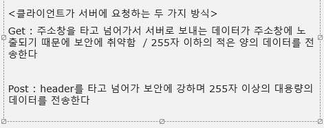

# JSP 수업 23.09.13

## 톰캣(Tomcat) 설치

아파치 톰캣 9.0.80 다운로드 후 이클립스에서 window 메뉴 → show view → servers 선택 → no server… 나온 메시지 클릭 후 browse에서 톰캣을 다운받은 폴더 선택 후 finish → servers 창에 Tomcat v_9.0 이런식으로 나오면 성공

## 웹 프로젝트 시작

file → new → new project → dynamic web project → target runtime이 Apache Tomcat v9.0인지 확인 → 모두 next 후 finish

webapp 폴더 우클릭하고 new에서 jsp file 선택 후 finish하면 jsp 파일 생성됨

window → preferences → web browser → use external web browser 선택(이클립스창에서 안뜨고 크롬창으로 띄우기 위함) → Chrome 선택(없으면 Microsoft Edge) → apply and close

f11 누르고 → 톰캣 선택후 → next → 오른쪽에 내가 만든 프로젝트가 있는지 확인 후 → finish

window → preferences → jsp flies → encoding → UTF-8 선택

## SERVLET

Servlet : Server + Applet의 합성어

서버에서 실행되는 Applet으로 자바를 이용하여 웹에서 실행되는 프로그램을 작성한다.(자바 클래스 형태의 웹 애플리케이션)

서블릿은 서버에서 실행되다가 웹 브라우저에서 요청을 하면 해당 기능을 수행 한 후 웹 브라우저로 결과를 전송한다.
Ex) 로그인 시도를 할 때, 서버가 클라이언트에서 입력되는 아이디와 비밀번호를 확인하고 결과 응답하는데 이러한 역할을 수행하는 것이다.

서블릿은 JVM에서 동작해야 하므로 클래스 파일이 생성되어야 한다. → 클래스 형태로 작성한다.(자바 소스파일 .java형태)

HttpServlet 클래스를 상속받아 구현해야 한다.

이클립스에서 src/main/java에서 우클릭하고 new에서 servlet 선택 → 계속 next 누르고 finish(이 과정에서 doGet, doPost 선택되어 있는지 확인하기) → servlet 생성완료

서블릿은 DB와 직접적인 연결이 가능하다.

## HTTPSERVLET

톰캣을 설치하면 제공되는 클래스로, 웹 어플리케이션으로 동작하는 기본 동작이다.

클라이언트가 서버에 요청하는 두 가지 방식은 다음과 같다.



이 HTTPSERVLET을 상속 받아서 SERVLET을 만드는 것이다.

servlet을 생성하면 HttpServletRequest의 request 객체, HttpServletResponse의 response 객체가 생성된다. 각각 요청과 응답을 한다.

Get은 보안에 취약하기 때문에 검색 같은 기능은 get으로 줄 수 있지만, 아이디, 비밀번호 등 보안이 필요한 경우에는 Post로 주어야 한다.

Get보다는 Post가 더 많이 사용된다.

## JSP(JAVA SERVER PAGE)

자바로 서버 페이지를 작성하기 위한 언어이다.

HTML과 JSP 태그로 구성되어 화면을 작성하는데 유리하다.

웹 서버에서 실행되는 페이지로 요청에 필요한 페이지를 위한 로직, 데이터베이스와의 연동을 위해 필요한 것들을 포함한다.

웹을 띄우기 위한 방법으로 서블릿과 JSP가 있는데, 서블릿의 단점을 보안해서 나온 것이 JSP이다.


SERVLET과 JSP 모두 동적인 HTML을 생성한다.

동적인 HTML이 가능한 종류에는 JSP, ASP, PHP, PYTHON(FLASK, DJANGO) 등이 있고, JSP와 PYTHON을 많이 쓴다.

JSP를 만들 때는 반드시 web app에 만들어 주어야 한다.

## 스크립트 요소

JSP 프로그래밍에서 사용되는 문법의 표현 형태이다.

스크립트 요소에는 다음 4가지 요소가 있다.


웹에 띄울 때는 <%= ‘코드’ %> 형태로 작성한다. 이것이 표현식이다.

스크립트릿으로 변수를 선언하고 웹에 띄워도 작동하지만, 선언문에 변수를 선언하는 것과 차이점이 있다. 선언문에 변수를 선언하면 멤버 변수로 선언되어 다른 곳에서도 변수를 참조할 수 있지만, 스크립트릿에 변수를 선언하면 지역 변수로 선언되어 다른 곳에서는 참조할 수 없다.

```html
<%@ page language="java" contentType="text/html; charset=UTF-8"
    pageEncoding="UTF-8"%>
<!DOCTYPE html>
<html>
<head>
<meta charset="UTF-8">
<title>Insert title here</title>
</head>
<body>
	<%!
		String name = "JSPStudy";
		int year = 2013;
		int a = 3;
		int b = 4;
	%>
	<%= a+b %>
</body>
</html>
```

## 멤버 변수 선언

선언문에서 선언된 변수는 JSP 페이지가 서블릿 코드로 변환이 되면 서블릿 클래스의 멤버 변수로 변환된다.

## 메소드 선언

선언문에서 선언된 메소드는 JSP 페이지 내에서는 일반적인 형태의 메소드로 선언된다.

멤버변수 name이 있다면 getName() 메소드는 멤버 변수 name 값을 리턴 시켜주는 메소드로 선언한다.

## 스크립트릿

JSP 페이지가 서블릿으로 변환되고 요청될 때 jspService 메소드 안에 선언이 되는 요소이다.

스크립트릿은 선언문과 달리 선언된 변수는 지역변수로 선언이 되고, 메소드 선언은 할 수 없다.

만약 스크립트릿에서 메소드 선언을 하게 되면 메소드 안에 메소드를 선언한 것이기 때문에 만들 수가 없다.

## 표현식

<%= 변수 혹은 메소드 %> 형태로 작성한다.


## 주석

HTML 형식의 주석, JSP 형식의 주석, 스크립트 요소의 주석이 모두 달라서 각각에 맞게 사용해야 한다.


## 기본 제어문(For, While)


## 반복문 사용 예시

for문을 사용할 때 실행부에서 표현식을 사용할 경우에는 반복문 조건 선언부, 실행부, 마지막 괄호 닫는 부분을 구분해서 스크립트릿을 적용해주어야 한다.

```html
<%@ page language="java" contentType="text/html; charset=UTF-8"
    pageEncoding="UTF-8"%>
<!DOCTYPE html>
<html>
<head>
<meta charset="UTF-8">
<title>Insert title here</title>
</head>
<body>
	<% 
		int i;
		for(i=1; i<=10; i++){
	%>
			<%= i %> <!-- i를 출력하기 위해 표현식 사용 -->
	<%	}
	%>
</body>
</html>
```

```html
<%@ page language="java" contentType="text/html; charset=UTF-8"
    pageEncoding="UTF-8"%>
<!DOCTYPE html>
<html>
<head>
<meta charset="UTF-8">
<title>Insert title here</title>
</head>
<body>
	<%
		int i, sum=0;
		for(i=1; i<=10; i++){
			if(i<10){
	%>
				<%= i + "+" %> <!-- 1+2+3+...+9 -->
	<%				
			}
			else{
				out.print(i+"="); // out.print는 자바 언어
			}
			sum+=i;
		}
	%>
		<%= sum %>
</body>
</html>
```

## 예제

멤버 변수와 메소드를 선언하고 body에서 표현식으로 출력하는 예제

```html
<%@ page language="java" contentType="text/html; charset=UTF-8"
    pageEncoding="UTF-8"%>
    
<%!
	String str = "hi"; // 멤버 변수 선언
	int a = 5, b = -4; // 멤버 변수 선언
	
	public int max(int a, int b){
		return a>b?a:b; // 메소드 선언
	}
%>    

<!DOCTYPE html>
<html>
<head>
<meta charset="UTF-8">
<title>Insert title here</title>
</head>
<body>
	<%= str %><br />
	<%= max(a, b) %>
	<%
		out.print(str + "<br>");
		out.print(max(a,b));
	%>
</body>
</html>
```

테이블을 생성해서 셀에 스크립트릿으로 값을 넣는 예제

```html
<%@ page language="java" contentType="text/html; charset=UTF-8"
    pageEncoding="UTF-8"%>

<!DOCTYPE html>
<html>
<head>
<meta charset="UTF-8">
<title>Insert title here</title>
<style>
	table{
		border-collapse:collapse;
		text-align:center;
	}
</style>
</head>
<body>
	<%!
		String name[] = {"수원", "지수", "예솔", "창표"};
	%> <!-- 선언부에서 배열을 멤버변수로 선언 -->
	
	<table border="1" width="200">
		<%
			for(int i=0; i<name.length; i++){
		%>
				<tr>
					<td><%=i %></td>
					<td><%=name[i] %></td>
				</tr>
		<%	}
		%>	
	</table>
</body>
</html>
```

선언문, 스크립트릿, 표현식을 사용해서 메소드를 사용하는 예제

이때, import하지 않고 클래스를 사용하려면 패키지에서 점 연산자로 클래스에 접근해야 한다.

```html
<%@ page language="java" contentType="text/html; charset=UTF-8"
    pageEncoding="UTF-8"%>
<!DOCTYPE html>
<html>
<head>
<meta charset="UTF-8">
<title>Insert title here</title>
</head>
<body>
	<%!
		public int big(int a, int b){
			return a>b?a:b;
		}
	%>
	<%
		int x = 30;
		int y = 40;
		
		// import한 것이 아니기 때문에 패키지를 통해서 클래스 접근
		java.util.Date date = new java.util.Date();
		
		int hour = date.getHours();
	%>
	두 수 중 큰 수는 <%= big(x, y) %>이다.<br />
	지금은 오후? 오전? <%= hour < 12 ? "오전" : "오후" %>	
</body>
</html>
```

구구단 출력하기

```html
<%@ page language="java" contentType="text/html; charset=UTF-8"
    pageEncoding="UTF-8"%>
    
<!DOCTYPE html>
<html>
<head>
<meta charset="UTF-8">
<title>Insert title here</title>
<style>
	
</style>
</head>
<body>
	<!--  구구단 출력(for문 중첩 -->
	<%
		for(int i=1; i<=9; i++){
			for(int j=1; j<=9; j++){
	%>
		<%=i %><%="*" %><%=j %><%="=" %><%=i*j %><br>
					
	<% 		}
		}
	%>	
</body>
</html>
```

구구단을 테이블 표 각 셀 안에 넣기

```html
<%@ page language="java" contentType="text/html; charset=UTF-8"
    pageEncoding="UTF-8"%>
    
<!DOCTYPE html>
<html>
<head>
<meta charset="UTF-8">
<title>Insert title here</title>
<style>
	
</style>
</head>
<body>
	<table border="1", width="200">
		<tr>
			<td></td>
			<%
				for(int i=2; i<10; i++){
			%>
					<td><%= i + "단" %></td>
			<%
				}
			%>
		</tr>
		<%
			for(int j=1; j<10; j++){
		%>
				<tr><td><%=j %></td>
				<%
					for(int i=2; i<10; i++){
				%>
						<td><%=i + "*"+j+"="+(i*j) %></td>
				<%
					}
				%>
		<%	}
		%>
	</table>	
	
</body>
</html>
```

## servlet과 jsp를 연결하기

method는 어떤 방식으로 전달할지(get, post) 선택하는 것

action은 이동할 페이지를 의미한다.

jsp 파일에서는 다음과 같이 작성한다.

```html
<%@ page language="java" contentType="text/html; charset=UTF-8"
    pageEncoding="UTF-8"%>
    
<!DOCTYPE html>
<html>
<head>
<meta charset="UTF-8">
<title>Insert title here</title>

</head>
<body>
	<form method="get" action="Mservlet">
		<input type="submit" value="get">
	</form>
	
	<br>
	<form method="post" action="Mservlet">
		<input type="submit" value="post">
	</form>
</body>
</html>
```

servlet 파일에서는 다음과 같이 작성한다.(파일명은 jsp 파일의 action의 값과 동일하게 만들어야 한다)

```java
package test1;

import java.io.IOException;
import java.io.PrintWriter;

import javax.servlet.ServletException;
import javax.servlet.annotation.WebServlet;
import javax.servlet.http.HttpServlet;
import javax.servlet.http.HttpServletRequest;
import javax.servlet.http.HttpServletResponse;

/**
 * Servlet implementation class Mservlet
 */
@WebServlet("/Mservlet")
public class Mservlet extends HttpServlet {
	private static final long serialVersionUID = 1L;
       
    /**
     * @see HttpServlet#HttpServlet()
     */
    public Mservlet() {
        super();
        // TODO Auto-generated constructor stub
    }

	/**
	 * @see HttpServlet#doGet(HttpServletRequest request, HttpServletResponse response)
	 */
	protected void doGet(HttpServletRequest request, HttpServletResponse response) throws ServletException, IOException {
		// 한글이 깨지는 것을 방지하기 위해 UTF-8로 설정
		response.setContentType("text/html;charset=UTF-8");
		// 문자 단위의 출력 객체 생성
		PrintWriter out = response.getWriter();
		// 출력 객체가 생성되어서 print 함수를 호출 가능
		out.print("<h1> get 방식으로 처리되었다!!! </h1>");
		out.close();
		
		//response.getWriter().append("Served at: ").append(request.getContextPath());
	}

	/**
	 * @see HttpServlet#doPost(HttpServletRequest request, HttpServletResponse response)
	 */
	protected void doPost(HttpServletRequest request, HttpServletResponse response) throws ServletException, IOException {
		// 한글이 깨지는 것을 방지하기 위해 UTF-8로 설정
		response.setContentType("text/html;charset=UTF-8");
		// 문자 단위의 출력 객체 생성
		PrintWriter out = response.getWriter();
		// 출력 객체가 생성되어서 print 함수를 호출 가능
		out.print("<h1> post 방식으로 처리되었다!!! </h1>");
		out.close();
		
		//doGet(request, response);
	}

}
```

텍스트 필드에 텍스트를 입력하고 전송버튼을 누르면 입력한 값이 출력되게 만드는 예제

jsp 파일에서는 다음과 같이 작성한다.

```html
<%@ page language="java" contentType="text/html; charset=UTF-8"
    pageEncoding="UTF-8"%>
    
<!DOCTYPE html>
<html>
<head>
<meta charset="UTF-8">
<title>Insert title here</title>

</head>
<body>
	<form method="post" action="Info">
		이름: <input type="text" name="name"><br>
		주소: <input type="text" name="addr"><br>
		<input type="submit" value="전송">
	</form>
</body>
</html>
```

servlet 파일에서는 다음과 같이 작성한다.

```java
package test1;

import java.io.IOException;
import java.io.PrintWriter;

import javax.servlet.ServletException;
import javax.servlet.annotation.WebServlet;
import javax.servlet.http.HttpServlet;
import javax.servlet.http.HttpServletRequest;
import javax.servlet.http.HttpServletResponse;

/**
 * Servlet implementation class Info
 */
@WebServlet("/Info")
public class Info extends HttpServlet {
	private static final long serialVersionUID = 1L;
       
    /**
     * @see HttpServlet#HttpServlet()
     */
    public Info() {
        super();
        // TODO Auto-generated constructor stub
    }

	/**
	 * @see HttpServlet#doGet(HttpServletRequest request, HttpServletResponse response)
	 */
	protected void doGet(HttpServletRequest request, HttpServletResponse response) throws ServletException, IOException {
		// TODO Auto-generated method stub
		response.getWriter().append("Served at: ").append(request.getContextPath());
	}

	/**
	 * @see HttpServlet#doPost(HttpServletRequest request, HttpServletResponse response)
	 */
	protected void doPost(HttpServletRequest request, HttpServletResponse response) throws ServletException, IOException {
		
		response.setContentType("text/html;charset=UTF-8");
		request.setCharacterEncoding("UTF-8");
		
		// 입력한 값을 읽어내는 함수
		String name = request.getParameter("name");
		String addr = request.getParameter("addr");
		
		PrintWriter out = response.getWriter(); // 출력 객체 생성
		
		out.print(name + "<br>");
		out.print(addr + "<br>");
		
	}

}
```

확인 버튼을 누르면 라디오 버튼으로 선택한 성별의 value값과 textarea의 내용이 출력되게 만들기

jsp 파일에서는 다음과 같이 작성한다.

```html
<%@ page language="java" contentType="text/html; charset=UTF-8"
    pageEncoding="UTF-8"%>
<!DOCTYPE html>
<html>
<head>
<meta charset="UTF-8">
<title>Insert title here</title>
</head>
<body>
	<form method="get" action="LoginServlet">
		<label for="gender">성별</label>
		<input type="radio" id="gender" name="gender" value = "man" checked>남
		<input type="radio" id="gender" name="gender" value = "woman">여<br><br>
		
		<label for="con">남기고 싶은 말</label>
		<textarea rows="3" cols="30" id="con" name="con"></textarea>
		
		<input type="submit" value="확인">
	</form>
</body>
</html>
```

servlet 파일에서는 다음과 같이 작성한다.

```java
import java.io.IOException;
import java.io.PrintWriter;

import javax.servlet.ServletException;
import javax.servlet.annotation.WebServlet;
import javax.servlet.http.HttpServlet;
import javax.servlet.http.HttpServletRequest;
import javax.servlet.http.HttpServletResponse;

/**
 * Servlet implementation class LoginServlet
 */
@WebServlet("/LoginServlet")
public class LoginServlet extends HttpServlet {
	private static final long serialVersionUID = 1L;
       
    /**
     * @see HttpServlet#HttpServlet()
     */
    public LoginServlet() {
        super();
        // TODO Auto-generated constructor stub
    }

	/**
	 * @see HttpServlet#doGet(HttpServletRequest request, HttpServletResponse response)
	 */
	protected void doGet(HttpServletRequest request, HttpServletResponse response) throws ServletException, IOException {
		
		response.setContentType("text/html;charset=UTF-8");
		
		String gender = request.getParameter("gender");
		String con = request.getParameter("con");
		
		PrintWriter out = response.getWriter();
		
		out.print(gender+"<br>");
		out.print(con+"<br>");
		
		// 자바 스크립트의 history 객체에서 go(-1)을 하면 이전 페이지로 이동한다.
		out.print("<a href='javascript:history.go(-1)'>다시</a>"); // BOM 객체
		
		out.close();
	}

	/**
	 * @see HttpServlet#doPost(HttpServletRequest request, HttpServletResponse response)
	 */
	protected void doPost(HttpServletRequest request, HttpServletResponse response) throws ServletException, IOException {
		// TODO Auto-generated method stub
		doGet(request, response);
	}

}
```

체크박스를 선택하고 버튼을 누르면 선택한 체크 박스의 value 값이 모두 출력되도록 만들기

주의할 점 : 체크박스는 라디오 버튼과는 달리 여러 값을 선택할 수 있기 때문에 배열로 값을 받아야 한다.

jsp 파일에서는 다음과 같이 작성한다.

```html
<%@ page language="java" contentType="text/html; charset=UTF-8"
    pageEncoding="UTF-8"%>
<!DOCTYPE html>
<html>
<head>
<meta charset="UTF-8">
<title>Insert title here</title>
</head>
<body>
	<form method="get" action="CheckServlet">
		<input type="checkbox" name="ch" value="java">자바<br>
		<input type="checkbox" name="ch" value="c">c<br>
		<input type="checkbox" name="ch" value="db">db<br>
		<input type="checkbox" name="ch" value="html">html<br>
		<input type="submit" value="체크">
		
	</form>
</body>
</html>
```

servlet 파일에서는 다음과 같이 작성한다.

```java
package test1;

import java.io.IOException;
import java.io.PrintWriter;

import javax.servlet.ServletException;
import javax.servlet.annotation.WebServlet;
import javax.servlet.http.HttpServlet;
import javax.servlet.http.HttpServletRequest;
import javax.servlet.http.HttpServletResponse;

/**
 * Servlet implementation class CheckServlet
 */
@WebServlet("/CheckServlet")
public class CheckServlet extends HttpServlet {
	private static final long serialVersionUID = 1L;
       
    /**
     * @see HttpServlet#HttpServlet()
     */
    public CheckServlet() {
        super();
        // TODO Auto-generated constructor stub
    }

	/**
	 * @see HttpServlet#doGet(HttpServletRequest request, HttpServletResponse response)
	 */
	protected void doGet(HttpServletRequest request, HttpServletResponse response) throws ServletException, IOException {
		
		response.setContentType("text/html;charset=UTF-8");

		PrintWriter out = response.getWriter();
		String str[] = request.getParameterValues("ch");
		
		if(str==null) { // 아무것도 선택하지 않았으면 메시지 출력
			out.print("아무것도 선택하지 않았다");
		}
		else { // 선택했으면 선택한 값 전부 출력
			for(String s : str) {
				out.print(s + " ");
			}
		}
		
		out.close();
				
	}

	/**
	 * @see HttpServlet#doPost(HttpServletRequest request, HttpServletResponse response)
	 */
	protected void doPost(HttpServletRequest request, HttpServletResponse response) throws ServletException, IOException {
		// TODO Auto-generated method stub
		doGet(request, response);
	}

}
```

select 태그에서 여러 값을 선택할 때 모든 값의 value를 출력하는 예제

jsp 파일은 다음과 같이 작성한다.

```html
<%@ page language="java" contentType="text/html; charset=UTF-8"
    pageEncoding="UTF-8"%>
<!DOCTYPE html>
<html>
<head>
<meta charset="UTF-8">
<title>Insert title here</title>
</head>
<body>
	<form method="get" action="SelServlet">
	   <label for="job">직업</label>
	   <select id="job" name="job" size='4' multiple="multiple">
	      <option value="student">학생</option>
	      <option value="pro">개발자</option>
	      <option value="teacher">교사</option>
	      <option value="doctor">의사</option>
	   </select>
	   
	   <input type="submit" value="확인">
</form>
</body>
</html>
```

servlet 파일은 다음과 같이 작성한다.

```java
package test1;

import java.io.IOException;
import java.io.PrintWriter;

import javax.servlet.ServletException;
import javax.servlet.annotation.WebServlet;
import javax.servlet.http.HttpServlet;
import javax.servlet.http.HttpServletRequest;
import javax.servlet.http.HttpServletResponse;

/**
 * Servlet implementation class SelServlet
 */
@WebServlet("/SelServlet")
public class SelServlet extends HttpServlet {
	private static final long serialVersionUID = 1L;
       
    /**
     * @see HttpServlet#HttpServlet()
     */
    public SelServlet() {
        super();
        // TODO Auto-generated constructor stub
    }

	/**
	 * @see HttpServlet#doGet(HttpServletRequest request, HttpServletResponse response)
	 */
	protected void doGet(HttpServletRequest request, HttpServletResponse response) throws ServletException, IOException {
		
		response.setContentType("text/html;charset=UTF-8");
		
		PrintWriter out = response.getWriter();
		String job[] = request.getParameterValues("job");
		
		if(job==null) {
			out.print("아무것도 선택하지 않았다");
		}
		else {
			for(String j :job) {
				out.print(j + " ");
			}
		}
		out.close();
			
		
	}

	/**
	 * @see HttpServlet#doPost(HttpServletRequest request, HttpServletResponse response)
	 */
	protected void doPost(HttpServletRequest request, HttpServletResponse response) throws ServletException, IOException {
		// TODO Auto-generated method stub
		doGet(request, response);
	}

}
```

## jsp, servlet, javascript 파일을 서로 연결하기

전송 버튼을 눌렀을 때 servlet이 실행되고, javascript에서 ch() 메소드가 실행되게 만들기

이때 ch() 메소드는 유효성 검사를 하도록 설정한다.

유효성 검사란 정상적인 값이 들어왔는지 확인하는 것이다.

jsp는 다음과 같이 작성한다.

```html
<%@ page language="java" contentType="text/html; charset=UTF-8"
    pageEncoding="UTF-8"%>
<!DOCTYPE html>
<html>
<head>
<meta charset="UTF-8">
<title>Insert title here</title>
<script type="text/javascript" src="param.js"></script>
</head>
<body>
	<form method="get" action="ParamServlet" name="fr">
		id: <input type="text" name="id"><br>
		study: <input type="text" name="study"><br>
		age: <input type="text" name="age"><br>
		
		<input type="submit" value="전송" onclick="return ch()">
	</form>
</body>
</html>
```

servlet은 다음과 같이 작성한다.

```java
package test1;

import java.io.IOException;
import java.io.PrintWriter;

import javax.servlet.ServletException;
import javax.servlet.annotation.WebServlet;
import javax.servlet.http.HttpServlet;
import javax.servlet.http.HttpServletRequest;
import javax.servlet.http.HttpServletResponse;

/**
 * Servlet implementation class ParamServlet
 */
@WebServlet("/ParamServlet")
public class ParamServlet extends HttpServlet {
	private static final long serialVersionUID = 1L;
       
    /**
     * @see HttpServlet#HttpServlet()
     */
    public ParamServlet() {
        super();
        // TODO Auto-generated constructor stub
    }

	/**
	 * @see HttpServlet#doGet(HttpServletRequest request, HttpServletResponse response)
	 */
	protected void doGet(HttpServletRequest request, HttpServletResponse response) throws ServletException, IOException {
		
		response.setContentType("text/html;charset=UTF-8");
		
		String id = request.getParameter("id");
		String study = request.getParameter("study");
		int age = Integer.parseInt(request.getParameter("age"));
		
		PrintWriter out = response.getWriter();
		
		out.print(id + "<br>");
		out.print(study + "<br>");
		out.print(age + "<br>");
		
		// BOM 객체, 이전 페이지로 보내는 작업
		// go의 매개변수가 1이면 기록이 있을 때만 다음 페이지로 보낸다.
		out.print("<a href='javascript:history.go(-1)'>다시</a>");
		
		out.close();
	}

	/**
	 * @see HttpServlet#doPost(HttpServletRequest request, HttpServletResponse response)
	 */
	protected void doPost(HttpServletRequest request, HttpServletResponse response) throws ServletException, IOException {
		// TODO Auto-generated method stub
		doGet(request, response);
	}

}
```

javascript는 다음과 같이 작성한다

```jsx
function ch(){
	
	if(document.fr.id.value==""){ // id의 value가 공백이면(값을 안적었으면)
		alert("id값이 없습니다");
		return false;
	}
	else if(document.fr.age.value==""){ // 나이에 값을 안적었으면
		alert("나이값이 없습니다");
		return false;
	}
	else if(isNaN(document.fr.age.value)){ // 숫자가 아니면
		alert("나이값이 잘못되었습니다");
		return false;
	}
	
	else if(document.fr.study.value==""){
		alert("과목명이 없습니다");
		return false;
	}
	else{
		return true;
	}
}
```

## 내부 객체

request 내부 객체는 브라우저에서 JSP 페이지로 전달되는 데이터의 묶음으로 HTTP 헤더와 HTTP 바디로 구성된다.

