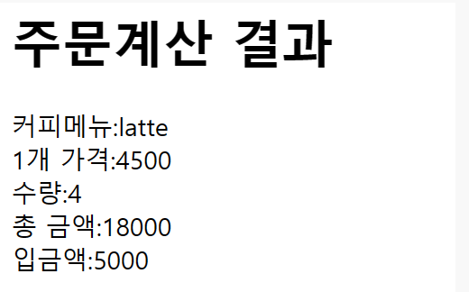

# JSP 수업 23.09.14

## JSP와 JSP 연결하기(JSP로 서버 연결하는 것)

회원가입 창을 만들기

화면 구성을 만든 jsp는 다음과 같이 작성한다.

```html
<%@ page language="java" contentType="text/html; charset=UTF-8"
	pageEncoding="UTF-8"%>
<!DOCTYPE html>
<html>
<head>
<meta charset="UTF-8">
<title>Insert title here</title>
</head>
<style>
	.center{
		text-align:center;
	}
</style>
<body>
	<form action="join.jsp">
		<table border="1">
			<tr>
				<td class="center" width="150" height="50">아이디</td>
				<td><input type="text" name="id" placeholder="id 넣어라"></td>
			</tr>
			<tr>
				<td class="center" width="150" height="50">패스워드</td>
				<td><input type="password" name="pw1" placeholder="pw 넣어라"></td>			
			</tr>
			<tr>
				<td class="center" width="150" height="50">패스워드 확인</td>
				<td><input type="password" name="pw2"></td>
			</tr>
			<tr>
				<td class="center" width="150" height="50">이메일</td>
				<td><input type="email" name="email"></td>
			</tr>
			<tr>
				<td class="center" width="150" height="50">전화번호</td>
				<td><input type="tel" name=tel></td>
			</tr>
			<tr>
				<td class="center" width="150" height="50">취미</td>
				<td class="center">
					<input type="checkbox" name="hobby" value="독서">독서
					<input type="checkbox" name="hobby" value="음악">음악
					<input type="checkbox" name="hobby" value="캠핑">캠핑
					<input type="checkbox" name="hobby" value="여행">여행
				</td>
			</tr>
			<tr>
				<td class="center" width="150" height="50">좋아하는 영화</td>
				<td class="center">
					<select name="movie">
						<option value="오펜하이머">오펜하이머</option>
						<option value="인터스텔라">인터스텔라</option>
						<option value="해리포터">해리포터</option>
					</select>
				</td>
			</tr>
			<tr>
				<td class="center" width="150" height="50">연령대</td>
				<td class="center">
					<input type="radio" name="age" value="20대">20대
					<input type="radio" name="age" value="30대">30대
					<input type="radio" name="age" value="40대">40대
					<input type="radio" name="age" value="50대">50대
				</td>
			</tr>
			<tr>
				<td class="center" width="150" height="100">남기고 싶은 말</td>
				<td class="center"><textarea cols="20" rows="5" name="info"></textarea></td>
			</tr>
			<tr>
				<td colspan="2">
					<input type="submit" value="회원가입">
					<input type="reset" value="취소">
				<td>
			</tr>
			
		</table>
	</form>

</body>
</html>
```

연결되는 jsp는 다음과 같이 작성한다.

```html
<%@ page language="java" contentType="text/html; charset=UTF-8"
    pageEncoding="UTF-8"%>
<!DOCTYPE html>
<html>
<head>
<meta charset="UTF-8">
<title>Insert title here</title>
</head>
<body>
	<%	
		// 데이터가 넘어올 때 한글이 깨질 수 있기 때문에 UTF-8로 설정
		request.setCharacterEncoding("UTF-8");
	
		// 사용자로부터 넘어온 데이터를 저장
		String id = request.getParameter("id");
		String pw1 = request.getParameter("pw1");
		String pw2 = request.getParameter("pw2");
		String email = request.getParameter("email");
		String tel = request.getParameter("tel");
		
		String [] hobby = request.getParameterValues("hobby");
		
		String movie = request.getParameter("movie");
		String age = request.getParameter("age");
		String info = request.getParameter("info");
		
		if(!pw1.equals(pw2)){
	%>
			<script type="text/javascript">
				alert("비밀번호가 틀립니다");
				history.go(-1);
			</script>
	<%
		}		
	%>
		<%= id %>
		<%= email %>
		<%= tel %>
		<% for(String h:hobby){
		%>	
			<%= h %>
		<%
			}
		%>
	
</body>
</html>
```

다음과 같이 나올 수 있게 만들어라.

```markdown
이름: text

성별: radio

좋아하는 색: checkbox

전송, 취소버튼

이름불러오고

성별은 남자면 남자, 여자면 여자

출력문은 out.println으로 출력

좋아하는 색은

for문안에 switch문을 사용해 출력(out)
```

화면 구성을 하는 jsp는 다음과 같이 작성한다.

```html
<%@ page language="java" contentType="text/html; charset=UTF-8"
    pageEncoding="UTF-8"%>
<!DOCTYPE html>
<html>
<head>
<meta charset="UTF-8">
<title>Insert title here</title>
</head>
<body>
	<form action="testresult.jsp">
		이름 : <input type="text" name="name"><br>
		성별 : <input type="radio" name="gender" value="male" id="male"> <label for="male">남성</label>
		<input type="radio" name="gender" value="female" id="female"> <label for="female">여성</label><br>
		좋아하는 색 :
		<input type="checkbox" name="color" value="blue" id="blue"> <label for="blue">파란색</label>
		<input type="checkbox" name="color" value="red" id="red"> <label for="red">빨간색</label>
		<input type="checkbox" name="color" value="yellow" id="yellow"> <label for="yellow">노란색</label>
		<input type="checkbox" name="color" value="black" id="black"> <label for="black">검정색</label>
		
		<input type="submit" value="전송">
	
	</form>
</body>
</html>
```

연결되는 jsp는 다음과 같이 작성한다.

```html
<%@ page language="java" contentType="text/html; charset=UTF-8"
    pageEncoding="UTF-8"%>
<!DOCTYPE html>
<html>
<head>
<meta charset="UTF-8">
<title>Insert title here</title>
</head>
<body>
	<%
		request.setCharacterEncoding("UTF-8");
	
		String name = request.getParameter("name");
		String gender = request.getParameter("gender");
		String [] color = request.getParameterValues("color");
		
		out.println(name);
		if(gender.equals("male")){
			out.println("남자");	
		}
		else{
			out.println("여자");
		}
		
		for(int i=0; i<color.length; i++){
			switch(color[i]){
				case "blue":
					out.println("파란색");
					break;
				case "red":
					out.println("빨간색");
					break;
				case "yellow":
					out.println("노란색");
					break;
				case "black":
					out.println("검정색");
					break;				
			}
		}
	%>
</body>
</html>
```

다음 사진과 같이 나오도록 만들어라



화면을 구성하는 jsp는 다음과 같이 작성한다.

```html
<%@ page language="java" contentType="text/html; charset=UTF-8"
    pageEncoding="UTF-8"%>
<!DOCTYPE html>
<html>
<head>
<meta charset="UTF-8">
<title>Insert title here</title>
</head>
<body>
	<form action="coffee.jsp">
		<h1>커피메뉴</h1>
		<input type="radio" name="menu" value="ame">아메리카노(4000원)<br>
		<input type="radio" name="menu" value="latte">카페라떼(4500원)<br>
		<input type="radio" name="menu" value="chino">카푸치노(4500원)<br>
		<input type="radio" name="menu" value="fra">프라푸치노(7500원)<br>
		
		수량: <input type="number" name="number"><br>
		입금액: <input type="text" name="text"><br>
		<input type="submit" value="주문처리">
	</form>
</body>
</html>
```

연결되는 jsp는 다음과 같이 작성한다.

```html
<%@ page language="java" contentType="text/html; charset=UTF-8"
    pageEncoding="UTF-8"%>
<!DOCTYPE html>
<html>
<head>
<meta charset="UTF-8">
<title>Insert title here</title>
</head>
<body>
	<h1>주문계산 결과</h1>
	<%
		request.setCharacterEncoding("UTF-8");
		
		String menu = request.getParameter("menu");
		int number = Integer.parseInt(request.getParameter("number"));
		int price = 0;
		int inprice = Integer.parseInt(request.getParameter("text"));
		switch(menu){
			case "ame":
				menu = "아메리카노";
				price = 4000;
				break;
			case "latte":
				menu = "카페라떼";
				price = 4500;
				break;
			case "chino":
				menu = "카푸치노";
				price = 4500;
				break;
			case "fra":
				menu = "프라푸치노";
				price = 7500;
				break;
		}		
		
		out.println("커피메뉴:" + menu + "<br>");
		out.println("1개 가격:" + price + "<br>");
		out.println("수량:" + number + "<br>");
		out.println("총 금액:" + number*price + "<br>");
		out.println("입금액:" + inprice + "<br>");
		
		
	 %>
</body>
</html>
```

나는 yellow색을 좋아한다 처럼 선택한 색깔을 넣어서 출력하고 배경색을 선택한 색깔로 출력하기

화면을 구성하는 jsp는 다음과 같이 작성한다.

```html
<%@ page language="java" contentType="text/html; charset=UTF-8"
    pageEncoding="UTF-8"%>
<!DOCTYPE html>
<html>
<head>
<meta charset="UTF-8">
<title>Insert title here</title>
<style type="text/css">
	body{
		text-align:center;
	}
</style>
</head>
<body>
	<form method="post" action="LoginCheck.jsp">
		<input type="radio" name="aa" value="blue">blue
		<input type="radio" name="aa" value="yellow">yellow
		<input type="radio" name="aa" value="red">red
		<input type="radio" name="aa" value="orange">orange
		<br>
		<input type="submit" value="확인">
		
		
		<!--  나는 yellow색을 좋아한다 이렇게 출력하고 배경색을 선택한 색깔로 출력-->
	
	
	</form>
</body>
</html>
```

연결된 jsp는 다음과 같이 작성한다.

```html
<%@ page language="java" contentType="text/html; charset=UTF-8"
    pageEncoding="UTF-8"%>
<!DOCTYPE html>
<html>
<head>
<meta charset="UTF-8">
<title>Insert title here</title>
</head>
<body>
	<% 
		String aa = request.getParameter("aa");
	%>
	<p style="background:<%= aa %>">나는 <%= aa %>색을 좋아한다.</p>
</body>
</html>
```

## 지시자의 종류 3가지

지시자(Directive)는 page, include, taglib가 있다.

### page 지시자 속성 종류


## 내부 객체


## JSP에서 다른 페이지로 이동하기 위한 방법

### Redirect

Redirect가 더 많이 사용된다.

Redirect는 페이지가 변경되면 브라우저의 url도 변경된다. 

sendRedirect(”이동하고 싶은 페이지 주소”) 형태로 사용한다.

작성한 주소로 페이지를 강제 이동한다.

강제 이동이기 때문에 request, response 객체가 유지되지 않는다. 객체에 부여했던 값을 가지고 이동할 수 없다.

다음은 Redirect의 예제이다. 로그인 정보가 일치하면 로그인 성공에 관련된 페이지로 강제 이동하고, 실패하면 실패에 관련된 페이지로 강제 이동한다.

아이디, 비밀번호 입력 페이지

```html
<%@ page language="java" contentType="text/html; charset=UTF-8"
    pageEncoding="UTF-8"%>
<!DOCTYPE html>
<html>
<head>
<meta charset="UTF-8">
<title>Insert title here</title>
</head>
<body>
	<form action="LoginCheck.jsp" method="post">

		<label for="user">아이디 : </label> <input type="text" name="id"
			id="user"><br> <label for="userpw">비번 : </label> <input
			type="password" name="pwd" id="userpw"><br> <input
			type="submit" value="로그인">

	</form>
</body>
</html>
```

로그인 버튼 클릭시 로그인 정보가 일치하는지 확인하는 기능

```html
<%@page import="java.net.URLEncoder"%>
<%@ page language="java" contentType="text/html; charset=UTF-8"
    pageEncoding="UTF-8"%>
<!DOCTYPE html>
<html>
<head>
<meta charset="UTF-8">
<title>Insert title here</title>
</head>
<body>
	<%
		String id="yeongmae";
		String pw="1234";
		String name = "me";
		
		request.setCharacterEncoding("UTF-8");
		
		if(id.equals(request.getParameter("id")) &&
			pw.equals(request.getParameter("pwd"))){
			// 쿼리 스트링
			// 로그인을 성공하면 LoginM.jsp로 이름을 가져가서 페이지 강제이동
			response.sendRedirect("LoginM.jsp?name=" + URLEncoder.encode(name, "UTF-8"));
		}
		else{
			// 로그인을 실패하면 Login.jsp로 페이지 강제이동
			response.sendRedirect("Login.jsp");
		}
	%>
</body>
</html>
```

로그인 성공 시 뜨는 페이지

```html
<%@ page language="java" contentType="text/html; charset=UTF-8"
    pageEncoding="UTF-8"%>
<!DOCTYPE html>
<html>
<head>
<meta charset="UTF-8">
<title>Insert title here</title>
</head>
<body>

	<%= request.getParameter("name") %>님 로그인 되었습니다!!!
	

</body>
</html>
```

로그인 실패 시 뜨는 페이지

```html
<%@ page language="java" contentType="text/html; charset=UTF-8"
    pageEncoding="UTF-8"%>
<!DOCTYPE html>
<html>
<head>
<meta charset="UTF-8">
<title>Insert title here</title>
</head>
<body>
	넌 로그인에 실패했다

</body>
</html>
```

나이가 15세 이상이면 통과, 15세 미만이면 경고 메시지와 함께 이전 페이지로 돌아가게 만들기

나이 입력 페이지

```html
<%@ page language="java" contentType="text/html; charset=UTF-8"
    pageEncoding="UTF-8"%>
<!DOCTYPE html>
<html>
<head>
<meta charset="UTF-8">
<title>Insert title here</title>
</head>
<body>
	<form action="Movie.jsp">
		<input type="text" name="age">
		<input type="submit" value="관람가능">
   </form>
</body>
</html>
```

나이 조건 확인하고 다른 페이지로 보내는 기능

```html
<%@page import="java.net.URLEncoder"%>
<%@ page language="java" contentType="text/html; charset=UTF-8"
    pageEncoding="UTF-8"%>
<!DOCTYPE html>
<html>
<head>
<meta charset="UTF-8">
<title>Insert title here</title>
</head>
<body>
<%
	request.setCharacterEncoding("UTF-8");
	int age = Integer.parseInt(request.getParameter("age"));
	if(age>=15){
		response.sendRedirect("accept_Movie.jsp?age=" + URLEncoder.encode(String.valueOf(age), "UTF-8"));
	}
	else{
		response.sendRedirect("refuse_Movie.jsp");
	}
%>
</body>
</html>
```

15세 이상일 때 뜨는 페이지

```html
<%@ page language="java" contentType="text/html; charset=UTF-8"
    pageEncoding="UTF-8"%>
<!DOCTYPE html>
<html>
<head>
<meta charset="UTF-8">
<title>Insert title here</title>
</head>
<body>
	<%= request.getParameter("age") %>즐겁게 관람하세요!
</body>
</html>
```

15세 미만일 때 뜨는 페이지

```html
<%@ page language="java" contentType="text/html; charset=UTF-8"
    pageEncoding="UTF-8"%>
<!DOCTYPE html>
<html>
<head>
<meta charset="UTF-8">
<title>Insert title here</title>
</head>
<body>
	<script>
		alert("넌 못 지나간다!");
		history.go(-1);
	</script>
</body>
</html>
```

### Forward

requestDispatcher 객체로 접근해야 하며 브라우저의 url이 변경되지 않지만 페이지는 이동된다.

브라우저가 알아채지 못하게 페이지를 이동한다.

request, response 객체가 유지된다.