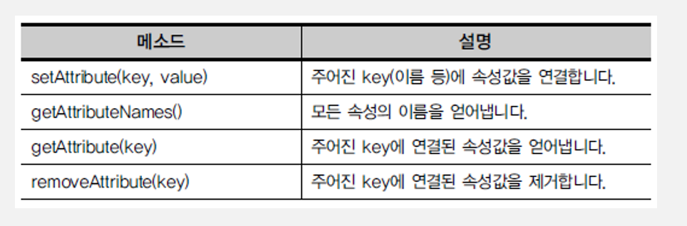

# JSP 수업 23.09.15

## setAttribute, getAttribute

getAttribute의 반환형은 object이다. 따라서 사용할 때 다운캐스팅이 필요하다.



구조를 만드는 jsp

```html
<%@ page language="java" contentType="text/html; charset=UTF-8"
    pageEncoding="UTF-8"%>
<!DOCTYPE html>
<html>
<head>
<meta charset="UTF-8">
<title>Insert title here</title>
</head>
<body>
	<form action="movie.jsp">
		<input type="text" name="age">
		<input type="submit" value="관람가능">
	</form>
</body>
</html>
```

나이가 15세 이상인지 아닌지 판단하고 조건에 맞는 실행문을 실행하는 jsp

여기서 setAttribute가 사용되어서 속성 값을 연결하고 forward로 페이지를 이동하면서 객체를 유지하고 url을 그대로 유지했다.

```html
<%@ page language="java" contentType="text/html; charset=UTF-8"
    pageEncoding="UTF-8"%>
<!DOCTYPE html>
<html>
<head>
<meta charset="UTF-8">
<title>Insert title here</title>
</head>
<body>
<%
	String age = request.getParameter("age");
	int n = Integer.parseInt(age);	
	if(n>=15){
		request.setAttribute("name", "길동");
		// forward는 RequestDispatcher 객체로 접근해야 한다.
		RequestDispatcher dis =
				request.getRequestDispatcher("Movie2.jsp");
		
		// forward는 객체 유지가 된다.
		// 페이지를 이동할 때 객체 값을 가지고 간다.
		dis.forward(request, response);
	}
	
	else{
%>
		<script>
			alert("관람 불가능")
			history.go(-1);
		</script>
		
<%
	}
%>
</body>
</html>
```

setAttribute로 연결된 속성 값을 getAttribute로 가져와서 출력하는 jsp

```html
<%@ page language="java" contentType="text/html; charset=UTF-8"
    pageEncoding="UTF-8"%>
<!DOCTYPE html>
<html>
<head>
<meta charset="UTF-8">
<title>Insert title here</title>
</head>
<body>
<%
	String name = (String)request.getAttribute("name");
	String age = request.getParameter("age");
%>
	<%= name %><br>
	<%= age %><br>
	
</body>
</html>
```

## session

session 내부객체는 클라이언트 요청에 대한 context 정보의 세션과 관련된 정보(데이터)를 저장하고 관리하는 객체이다.

session을 활용하면 로그인 유지 시간 등을 만들 수 있다.


구조를 만드는 jsp

```html
<%@ page language="java" contentType="text/html; charset=UTF-8"
    pageEncoding="UTF-8"%>
<!DOCTYPE html>
<html>
<head>
<meta charset="UTF-8">
<title>Insert title here</title>
</head>
<body>
	<form action="Food2.jsp">
		id: <input type="text" name = "id"><br>
		password: <input type="password" name = "pw"><br>
		<input type="submit" value="로그인">
	</form>
</body>
</html>
```

연결된 jsp로 라디오 버튼 구조를 만들고 id, pw 값을 가져오는 jsp

```html
<%@ page language="java" contentType="text/html; charset=UTF-8"
    pageEncoding="UTF-8"%>
<!DOCTYPE html>
<html>
<head>
<meta charset="UTF-8">
<title>Insert title here</title>
</head>
<body>
<%
	request.setCharacterEncoding("UTF-8");
	
	String id = request.getParameter("id");
	String pw = request.getParameter("pw");
	
	session.setAttribute("ii", id);
	session.setMaxInactiveInterval(100);
%>
	<form action="Food3.jsp" method="post">
	가장 좋아하는 음식은?
	<input type="radio" name="food" value="피자">피자
	<input type="radio" name="food" value="파스타">파스타
	<input type="radio" name="food" value="탕수육">탕수육
	
	<input type="submit" value="결과">
	</form>

</body>
</html>
```

연결된 jsp로 값을 가져와서 출력하는 jsp

```html
<%@ page language="java" contentType="text/html; charset=UTF-8"
    pageEncoding="UTF-8"%>
<!DOCTYPE html>
<html>
<head>
<meta charset="UTF-8">
<title>Insert title here</title>
</head>
<body>
<%
	request.setCharacterEncoding("UTF-8");
	
	String food = request.getParameter("food");
	String id = (String)session.getAttribute("ii");
	if(id!=null){
%>
	<%= id %>는 <%= food %>를 가장 좋아한다.
<%	}
%>
</body>
</html>
```

## 문제 풀이

### 1번 문제

아이디, 암호 입력받는

로그인 폼(Log.jsp)

로그인에 성공을 햇을 때

(suc.jsp로) 실패했을 때

다시 로그인 폼으로 돌아가는

로그인 인증 처리 페이지를

(fru.jsp)에 작성해라.

sendRedirect사용

성공했을 때 suc.jsp파일에

길동님~ 환영합니다.

### 1번 문제 풀이

request 객체를 이용해서 setAttribute를 사용하면 sendRedirect를 사용했을 때 request와 response 객체가 유지되지 않기 때문에 값을 getAttribute로 불러올 수 없다.

따라서 session 객체를 이용해서 setAttribute와 getAttribute를 사용해야 하며, session으로 사용했을 때 반드시 setMaxInactiveInterval을 사용해서 세션 유지 시간을 설정해 주어야 한다.

또한 request 객체는 forward로 접근했을 때는 한 번의 페이지 이동까지는 값을 유지하지만 두 번 이상의 페이지 이동에서는 값이 유지되지 않는다.

Log.jsp 파일

```html
<%@ page language="java" contentType="text/html; charset=UTF-8"
    pageEncoding="UTF-8"%>
<!DOCTYPE html>
<html>
<head>
<meta charset="UTF-8">
<title>Insert title here</title>
</head>
<body>
	<form action="fru.jsp" method="POST">
	id: <input type="text" name="id"> <br>
	pass: <input type="password" name="pw"> <br>
	<input type="submit" value="로그인">
</form>
</body>
</html>
```

fru.jsp 파일

```html
<%@ page language="java" contentType="text/html; charset=UTF-8"
    pageEncoding="UTF-8"%>
<!DOCTYPE html>
<html>
<head>
<meta charset="UTF-8">
<title>Insert title here</title>
</head>
<body>
<%	
	request.setCharacterEncoding("UTF-8");
	String id = request.getParameter("id");
	String pw = request.getParameter("pw");
	session.setAttribute("name", "길동");
	session.setMaxInactiveInterval(100);
	
	if(id.equals("id1") && pw.equals("1234")){
		response.sendRedirect("suc.jsp");
	}
	else{
%>
		<script type="text/javascript">
			alert("아이디 또는 비밀번호가 일치하지 않습니다");
			history.go(-1);
		</script>
<%
	}
	
%>
</body>
</html>
```

suc.jsp 파일

```html
<%@ page language="java" contentType="text/html; charset=UTF-8"
    pageEncoding="UTF-8"%>
<!DOCTYPE html>
<html>
<head>
<meta charset="UTF-8">
<title>Insert title here</title>
</head>
<body>
<%
	request.setCharacterEncoding("UTF-8");
	String name = (String)session.getAttribute("name");
%>
	<%= name %>님 환영합니다.
</body>
</html>
```

## request와 session의 차이

request는 sendRedirect를 했을 때 객체가 유지되지 않고, session은 유지된다.
request로 sendRedirect를 했을 때 값을 전달하려면 “suc.jsp?id=”+id 처럼 쿼리 스트링을 사용해서 url에 값을 넣어서 페이지를 이동해야 한다.

request는 forward를 했을 때 객체가 한 번의 페이지 이동에서만 유지되지만, session은 웹 브라우저를 최초로 열고난 후 닫을 때까지 요청되는 모든 페이지에서 영역을 공유하기 때문에 웹 브라우저를 닫을 때까지 계속 객체가 유지된다.

request는 쿠키를 읽어오는 기능도 할 수 있다.

쿠키는 클라이언트의 하드디스크에 저장되고, 세션은 웹 서버에 저장된다.

## JSP 내장 객체의 영역 정리

JSP의 내장 객체는 웹 컨테이너에서 객체 생성없이 바로 사용할 수 있도록 제공하는 객체이다.

내장 객체의 영역은 각 객체가 저장되는 메모리의 유효 기간으로 4가지의 영역으로 구성된다.

영역 크기는 application > session > request > page 순이다.

각 영역의 접근 범위는 다르지만, 제공하는 메소드는 모두 동일하며 “영역명.메소드명()”과 같은 형태로 사용할 수 있다.

내장 객체 기본 메소드로는 void setAtrribute(String key, Object value), object getAttribute(String key), void removeAttribute(String key)가 있다.

setAtrribute는 각 영역에 속성을 저장하는 것으로, 첫번째 인수는 속성명, 두번째 인수는 속성값이다. 값의 타입은 Object이므로 모든 타입의 객체를 저장할 수 있다.

getAttribute는 속성명으로 접근해서 각 영역에 저장된 속성값을 리턴한다. 리턴값이 Object이므로 다운캐스팅을 해서 사용한다.

removeAttribute는 속성명으로 접근해서 각 영역에 저장된 속성을 삭제한다. 삭제할 속성명이 존재하지 않더라도 에러는 발생하지 않는다.

### page 영역


### request 영역


### session 영역


### application 영역


## 로그인 후 로그아웃까지 완료하는 예제

로그인 시 유효성 검사를 하고, 로그아웃 시 session을 종료하고 알림창을 띄운다. 그리고 로그인 페이지로 다시 연결한다.

로그인 페이지를 구성한 파일

```html
<%@ page language="java" contentType="text/html; charset=UTF-8"
    pageEncoding="UTF-8"%>
<!DOCTYPE html>
<html>
<head>
<meta charset="UTF-8">
<title>Insert title here</title>
</head>
<body>
	<form action="Se2.jsp" method="post">

		<label for="user">아이디 : </label> 
		<input type="text" name="id" id="user"><br> 
      
		<label for="userpw">비번 : </label> 
		<input type="password" name="pwd" id="userpw"><br> 
		<input type="submit" value="로그인">
	</form>
</body>
</html>
```

아이디와 비밀번호 유효성 검사를 하고 이름을 세션에 설정하는 파일

```html
<%@ page language="java" contentType="text/html; charset=UTF-8"
    pageEncoding="UTF-8"%>
<!DOCTYPE html>
<html>
<head>
<meta charset="UTF-8">
<title>Insert title here</title>
</head>
<body>
<%
	String id = "gildong";
	String pw = "1234";
	String name = "길동";
	
	if(id.equals(request.getParameter("id"))&& pw.equals(request.getParameter("pwd"))){
		
		session.setAttribute("user", name);
		response.sendRedirect("Se3.jsp");
	
	}
	else{
		response.sendRedirect("Se.jsp");
	}
%>
</body>
</html>
```

세션에서 이름을 불러오고 로그아웃 페이지를 구현하는 파일

```html
<%@ page language="java" contentType="text/html; charset=UTF-8"
    pageEncoding="UTF-8"%>
<!DOCTYPE html>
<html>
<head>
<meta charset="UTF-8">
<title>Insert title here</title>
</head>
<body>
	<%
		if(session.getAttribute("user")==null){
			response.sendRedirect("Se.jsp");
		}
		else{
	%>
			<%= session.getAttribute("user") %>님 안녕하십니까
			<form method="post" action="Se4.jsp">
				<input type="submit" value="로그아웃">
			</form>
	<%
		}
	%>
</body>
</html>
```

로그아웃 되면 알림창을 띄우고 다시 로그인 페이지로 이동하는 파일

여기서 location은 BOM 객체이다.
그리고 session.invalidate()로 세션을 종료시키면 setAttribute 한 것만 날라간다.

```html
<%@ page language="java" contentType="text/html; charset=UTF-8"
    pageEncoding="UTF-8"%>
<!DOCTYPE html>
<html>
<head>
<meta charset="UTF-8">
<title>Insert title here</title>
</head>
<body>
	<%
		// 세션을 종료 시키는 메소드
		// 세션이 종료되면 setAttribute한 것만 날라간다.
		session.invalidate();
	%>
	<script type="text/javascript">
		alert("로그아웃 되었습니다.");
		location.href="Se.jsp";
	</script>
</body>
</html>
```

## Servlet에서 session을 사용하는 방법

서블릿에서 세션을 사용하기 위해서는 다음과 같이 리턴형이 HttpSession인 request.getSession() 메소드를 사용해야 한다.

```java
HttpSession session = request.getSession();
session.setAttribute("id1", id);

```

다음은 로그인과 로그아웃을 Servlet과 session을 이용해서 구현한 예제이다.

로그인 페이지

```html
<%@ page language="java" contentType="text/html; charset=UTF-8"
	pageEncoding="UTF-8"%>
<!DOCTYPE html>
<html>
<head>
<meta charset="UTF-8">
<title>Insert title here</title>
<%
	String id = (String)session.getAttribute("id1");
%>

</head>
<body>
	<%= id %>
	<a href="Logout.jsp">로그아웃</a>
	<center>

		<h2>회원 가입</h2>

		<form action="Member" method="get">

			<table width="500" border="1">

				<tr height="50">

					<td width="150" align="center">아이디</td>

					<td width="350" align="center"><input type="text" name="id"
						size="40" placeholder="id넣으세요"></td>

				</tr>

				<tr height="50">

					<td width="150" align="center">패스워드</td>

					<td width="350" align="center"><input type="password"
						name="pass1" size="40" placeholder="비밀번호는 영문자만 넣어주세요"></td>
				</tr>
				<tr height="50">
					<td align="center" colspan="2"><input type="submit"
						value="회원가입"></td>
				</tr>
			</table>

		</form>
</body>
</html>
```

아이디와 비밀번호 유효성 검사

```java
import java.io.IOException;

import javax.servlet.ServletException;
import javax.servlet.annotation.WebServlet;
import javax.servlet.http.HttpServlet;
import javax.servlet.http.HttpServletRequest;
import javax.servlet.http.HttpServletResponse;
import javax.servlet.http.HttpSession;

/**
 * Servlet implementation class Member
 */
@WebServlet("/Member")
public class Member extends HttpServlet {
	private static final long serialVersionUID = 1L;
       
    /**
     * @see HttpServlet#HttpServlet()
     */
    public Member() {
        super();
        // TODO Auto-generated constructor stub
    }

	/**
	 * @see HttpServlet#doGet(HttpServletRequest request, HttpServletResponse response)
	 */
	protected void doGet(HttpServletRequest request, HttpServletResponse response) throws ServletException, IOException {
		request.setCharacterEncoding("UTF-8");
		String id = request.getParameter("id");
		String pw = request.getParameter("pass1");
		
		if(id!=null && pw!=null) {
			HttpSession session = request.getSession();
			session.setAttribute("id1", id);
		}
		response.sendRedirect("Session.jsp"); // id1 값을 가지고 Session.jsp로 이동
	}

	/**
	 * @see HttpServlet#doPost(HttpServletRequest request, HttpServletResponse response)
	 */
	protected void doPost(HttpServletRequest request, HttpServletResponse response) throws ServletException, IOException {
		// TODO Auto-generated method stub
		doGet(request, response);
	}

}
```

로그아웃 기능 및 로그아웃 후 이동할 페이지 연결

```html
<%@ page language="java" contentType="text/html; charset=UTF-8"
    pageEncoding="UTF-8"%>
<!DOCTYPE html>
<html>
<head>
<meta charset="UTF-8">
<title>Insert title here</title>
</head>
<body>
<%
	session.invalidate();
	response.sendRedirect("Session.jsp");
%>
</body>
</html>
```

## onsubmit

onsubmit은 form 태그 안에서 form 전송을 하기 전에 입력된 데이터의 유효성을 체크하기 위한 이벤트이다.

사용 예제는 다음과 같다.

form 구조를 만든 jsp

```html
<%@ page language="java" contentType="text/html; charset=UTF-8"
    pageEncoding="UTF-8"%>
<!DOCTYPE html>
<html>
<head>
<meta charset="UTF-8">
<title>Insert title here</title>
</head>
<body>
	<!-- onsubmit : form태그 안에서 form 전송을 하기 전에
	 입력된 데이터의 유효성을 체크하기 위한 이벤트 -->
	<form action="two.jsp" name="aa" onsubmit="return on()">
		숫자 : <input name="num">
		<input type="submit" value="입력완료">
	</form>
	
	<script type="text/javascript">
		function on(){
			if(isNaN(document.aa.num.value)){ // 숫자가 아닐때
				alert("문자열 입력함");
				return false;
			}
			else{ // 숫자일 때
				return true;
			}
		}
	</script>
</body>
</html>
```

값을 받아서 출력하는 jsp

```html
<%@ page language="java" contentType="text/html; charset=UTF-8"
    pageEncoding="UTF-8"%>
<!DOCTYPE html>
<html>
<head>
<meta charset="UTF-8">
<title>Insert title here</title>
</head>
<body>
	<%
		int n = Integer.parseInt(request.getParameter("num"));
		// 1부터 입력한 수까지 출력
		for(int i=1; i<=n; i++){
	%>
			<%= i %><br>
	<%
		
		}
	%>
</body>
</html>
```

## 문제 풀이

### 2번 문제

가고싶은 여행지를

select~option으로

만들어 신청하면 이렇게

출력된다.

다시 조회라는 하이퍼링크를

누르면 이전 페이지로 이동한다.

국내 여행: 울산

해외 여행: 홍콩

### 2번 문제 풀이

구조를 작성한 trip.jsp 파일

여러 개 선택할 수 있도록 select 태그에 multiple 속성을 설정하였다.

```html
<%@ page language="java" contentType="text/html; charset=UTF-8"
    pageEncoding="UTF-8"%>
<!DOCTYPE html>
<html>
<head>
<meta charset="UTF-8">
<title>Insert title here</title>
</head>
<body>
	<form action="trip1.jsp" method="post">
		<select name="k_loc" multiple>
			<option value="강릉">강릉</option>
			<option value="제주">제주</option>
			<option value="단양">단양</option>
		</select>
		<select name="f_loc" multiple>
			<option value="미국">미국</option>
			<option value="대만">대만</option>
			<option value="스위스">스위스</option>
		</select>
		<input type="submit" value="신청">
	</form>
</body>
</html>
```

출력하는 trip1.jsp 파일

여러 개가 선택되었을 때 선택된 모든 값들을 출력하기 위해 배열로 값을 받았다.

```html
<%@ page language="java" contentType="text/html; charset=UTF-8"
    pageEncoding="UTF-8"%>
<!DOCTYPE html>
<html>
<head>
<meta charset="UTF-8">
<title>Insert title here</title>
</head>
<body>
	<%
		request.setCharacterEncoding("UTF-8");
		String[] k_loc = request.getParameterValues("k_loc");
		String[] f_loc = request.getParameterValues("f_loc");
		
	%>
		국내 여행 :
	<%
		for(String k : k_loc){
	%>			
			<%= k %>	
	<%
		}		
	%>
	<br>
		해외 여행 :
	<%
		for(String f : f_loc){
	%>
			<%= f %>	
	<%
		}
	%>
	<br>
	<a href="trip.jsp">다시 신청</a>
	
</body>
</html>
```

### 3번 문제

다음과 같은 웹 페이지를 작성해라.

자바스크립트 언어로 숫자 부분에 아무것도 입력 안하고 입력완료버튼을 누르면 “데이터 입력” 이라는 경고창을 출력하고 문자를 입력하면 “문자열은 안된다”라고 경고창에 출력해라. 숫자를 입력하면 1부터 그 숫자까지 출력된다. (isNaN함수 사용 , request 객체 사용)


### 3번 문제 풀이

구조와 조건을 작성한 number.jsp 파일

아무것도 입력하지 않았을 때 null이 아닌 “”(공백)을 비교 조건으로 주어야 에러가 발생하지 않는다.

```html
<%@ page language="java" contentType="text/html; charset=UTF-8"
    pageEncoding="UTF-8"%>
<!DOCTYPE html>
<html>
<head>
<meta charset="UTF-8">
<title>Insert title here</title>
</head>
<body>
	<form action="number2.jsp" method="post" name = "n" onsubmit="return on()">
		숫자 : <input name="num">
		<input type="submit" value="입력완료">
	</form>
	
	<script type="text/javascript">
		function on(){
			let m = document.n.num.value;
			
			if(m==""){
				alert("데이터 입력");
				return false;
			}
			else if(isNaN(m)){
				alert("문자열은 안된다");
				return false;
			}
			else{
				return true;
			}
			
		}
	</script>
</body>
</html>
```

출력하는 number2.jsp 파일

```html
<%@ page language="java" contentType="text/html; charset=UTF-8"
    pageEncoding="UTF-8"%>
<!DOCTYPE html>
<html>
<head>
<meta charset="UTF-8">
<title>Insert title here</title>
</head>
<body>
	<%
		request.setCharacterEncoding("UTF-8");
		int n = Integer.parseInt(request.getParameter("num"));
		
		for(int i=1; i<=n; i++){
	%>
			<%=i %><br>
	
	<%			
		}
		
	%>
			
</body>
</html>
```