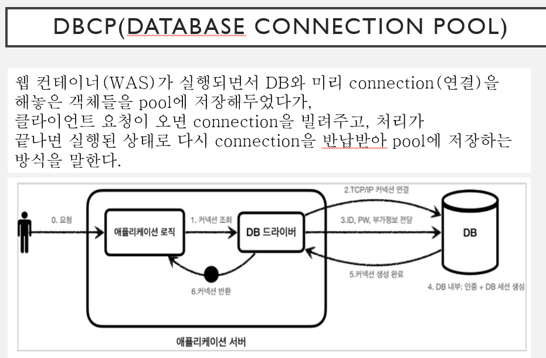

# JSP 수업 23.09.20

## execute와 executeQuery()와 executeUpdate() 차이

execute는 모든 구문에 수행할 수 있고, 수행 결과로 Boolean 타입의 값을 반환한다. 리턴값이 ResultSet일 경우에는 true를 반환하고, 이외의 경우에는 false를 반환한다. 리턴값이 ResultSet이라고 해도 최종적으로 리턴되는 값은 Boolean 타입이므로 ResultSet 객체에 결과값을 담을 수 없다.

executeQuery()는 select 구문에 사용하고, executeUpdate는 select를 제외한 다른 구문을 수행할 때 사용되는 함수이다. 보통 executeUpdate는 DML 구문인 insert, delete, update에 사용된다.

executeQuery()는 수행 결과로 ResultSet 객체의 값을 반환한다.

executeUpdate() 수행 결과로 int 타입의 값을 반환한다. insert, delete, update 관련 구문에서는 반영된 레코드의 건수를 반환하고, create, drop 관련 구문에서는 -1을 반환한다.

## DBCP(DataBase Connection Pool)

웹 컨테이너(WAS)가 실행되면서 DB와 미리 connection을 해놓은 객체들을 pool에 저장해두었다가 클라이언트 요청이 오면 connection을 빌려주고, 처리가 끝나면 실행된 상태로 다시 connection을 반납받아 pool에 저장하는 방식을 말한다.



이클립스에서 Servers 프로젝트 폴더에 server.xml 파일을 Source 모드로 열고 맨 밑에서 Context와 /Engine 사이에 <Resource auth="Container" driverClassName="oracle.jdbc.driver.OracleDriver" name="jdbc/pool" password="1234" type="javax.sql.DataSource" url="jdbc:oracle:this:@localhost/xe" username="sys as sysdba" /> 처럼 DB 연결을 위한 내용을 추가해준다.

## 게시판 만들기

### 테이블 칼럼 요소

num 게시글 번호

writer 작성자

email 이메일

subject 글 제목

password 비밀번호

Reg_date 날짜

Ref 댓글

Re_step 글 단계

Re_level 글 단계

Readcount 조회수

Content 내용

시퀀스와 테이블 생성 코드는 다음과 같다

```sql
CREATE SEQUENCE BO_SEQ
INCREMENT BY 1
START WITH 1
MINVALUE 1
MAXVALUE 1000;

create table board(

num number primary key,

writer varchar2(20),

email varchar2(20),

subject varchar2(50),

password varchar2(10),

reg_date date,

ref number,

re_step number,

re_level number,

readcount number,

content varchar2(500));
```

### 자바빈 만들기(BoardBean.java파일)

DB의 number 타입은 int, varchar2 타입은 String, date 타입도 String으로 필드를 설정한다.

이후에 getter, setter 메소드도 생성한다.

```java
package bean;

public class BoardBean {
	
	private int num;
	private String writer;
	private String email;
	private String subject;
	private String password;
	private String reg_date;
	private int ref;
	private int re_step;
	private int re_level;
	private int readcount;
	private String content;
	
	public int getNum() {
		return num;
	}
	public void setNum(int num) {
		this.num = num;
	}
	public String getWriter() {
		return writer;
	}
	public void setWriter(String writer) {
		this.writer = writer;
	}
	public String getEmail() {
		return email;
	}
	public void setEmail(String email) {
		this.email = email;
	}
	public String getSubject() {
		return subject;
	}
	public void setSubject(String subject) {
		this.subject = subject;
	}
	public String getPassword() {
		return password;
	}
	public void setPassword(String password) {
		this.password = password;
	}
	public String getReg_date() {
		return reg_date;
	}
	public void setReg_date(String reg_date) {
		this.reg_date = reg_date;
	}
	public int getRef() {
		return ref;
	}
	public void setRef(int ref) {
		this.ref = ref;
	}
	public int getRe_step() {
		return re_step;
	}
	public void setRe_step(int re_step) {
		this.re_step = re_step;
	}
	public int getRe_level() {
		return re_level;
	}
	public void setRe_level(int re_level) {
		this.re_level = re_level;
	}
	public int getReadcount() {
		return readcount;
	}
	public void setReadcount(int readcount) {
		this.readcount = readcount;
	}
	public String getContent() {
		return content;
	}
	public void setContent(String content) {
		this.content = content;
	}
	
	
	
}
```

### BoardDAO.java파일 만들기

DB 연결을 위한 Connection, PreparedStatement, ResultSet을 선언한다

DBCP를 활용하기 위한 메소드를 선언한다.

```java
package bean;

import java.sql.Connection;
import java.sql.PreparedStatement;
import java.sql.ResultSet;

import javax.naming.Context;
import javax.naming.InitialContext;
import javax.sql.DataSource;

public class BoardDAO {
	
	Connection con;
	PreparedStatement pstmt;
	ResultSet rs;
	
	public void getCon() {
		try {
			Context ctx = new InitialContext();
			Context env= (Context)ctx.lookup("java:comp/env");
			DataSource ds = (DataSource)env.lookup("jdbc/pool");
			
			con = ds.getConnection();
		}
		catch(Exception e) {
			e.printStackTrace();
		}
	}
}
```

### 게시판의 ref, re_step, re_level의 개념

다음과 같이 댓글이 없는 게시글을 가장 먼저 표시하고, 가장 최신 댓글부터 표시하게 되면 게시판 번호 2-1-4-3 순서로 표시된다.

다음 사진의 [re]나도 배고파, [re]뭐 먹지는 “배고파”에 대한 댓글이다.

이때 기준은 ref가 가장 높은 것부터 표시하고 이후에 re_level이 가장 낮은것부터 표시한다.


다음 사진과 같이 댓글에 대한 대댓글이 달리면 re_step이 1 증가한다.

댓글보다는 게시글이, 대댓글보다는 댓글이 먼저 표시되어야 하므로 1-4-2-3 순서로 표시된다.


### 게시글 작성 폼인 BoardForm.jsp 만들기

```html
<%@ page language="java" contentType="text/html; charset=UTF-8"
    pageEncoding="UTF-8"%>
<!DOCTYPE html>
<html>
<head>
<meta charset="UTF-8">
<title>Insert title here</title>
</head>
<body>
	<form action="BoardWriteForm.jsp" method="post">
		<table border="1" width="600">
			<tr height="40">
				<td align="center" width="120">작성자</td>
				<td width="450"><input type="text" name="writer"></td>
			</tr>
			<tr height="40">
				<td align="center" width="120">이메일</td>
				<td width="450"><input type="text" name="email"></td>
			</tr>
			<tr height="40">
				<td align="center" width="120">제목</td>
				<td width="450"><input type="text" name="subject"></td>
			</tr>
			<tr height="40">
				<td align="center" width="120">비밀번호</td>
				<td width="450"><input type="password" name="password"></td>
			</tr>
			<tr height="40">
				<td align="center" width="120">글 내용</td>
				<td width="450"><textarea rows="5" cols="40"></textarea></td>
			</tr>
			<tr height="40">
	            <td align="center" colspan="2">
	            	<input type="submit" value="글쓰기">
	            	<input type="reset" value="재작성">
	            	<button onclick="location.href=BoardList.jsp">전체글보기</button>
	            </td>
        	</tr>
		</table>
	</form>
</body>
</html>
```

### DB에 insert를 수행하고 BoardList.jsp 파일의 페이지로 이동하는 BoardWriteForm.jsp 파일 만들기

```html
<%@page import="bean.BoardDAO"%>
<%@ page language="java" contentType="text/html; charset=UTF-8"
    pageEncoding="UTF-8"%>
<!DOCTYPE html>
<html>
<head>
<meta charset="UTF-8">
<title>Insert title here</title>
</head>
<body>
	<% request.setCharacterEncoding("UTF-8"); %>
	<jsp:useBean id="boardbean" class="bean.BoardBean">
		<jsp:setProperty property="*" name="boardbean"/>
	</jsp:useBean>
	<%
		BoardDAO bdao = new BoardDAO();
		bdao.insertBoard(boardbean);
		response.sendRedirect("BoardList.jsp");
	%>
</body>
</html>
```

### 게시글 목록이 나타나는 BoardList.jsp 파일 만들기

```html
<%@page import="bean.BoardBean"%>
<%@page import="java.util.Vector"%>
<%@page import="bean.BoardDAO"%>
<%@ page language="java" contentType="text/html; charset=UTF-8"
    pageEncoding="UTF-8"%>
<!DOCTYPE html>
<html>
<head>
<meta charset="UTF-8">
<title>Insert title here</title>
</head>
<body>
	<%
		request.setCharacterEncoding("UTF-8");
		BoardDAO bdao = new BoardDAO();
		
		Vector<BoardBean> vec = bdao.allBoard();
	%>
	<h2>전체 게시글</h2>
	<table width="600" border="1">
		<tr height="40">
			<td width="120" align="center">번호</td>
			<td width="120" align="center">제목</td>
			<td width="120" align="center">작성자</td>
			<td width="120" align="center">작성날짜</td>
			<td width="120" align="center">조회수</td>
		</tr>
		<%
			for(int i=0; i<vec.size(); i++){
				BoardBean bean = vec.get(i);
		%>
		<tr height="40">
			<td width="120" align="center"><%= i+1 %></td>
			<td width="120" align="center"><a href="BoardIn.jsp?num=<%= bean.getNum() %>"><%= bean.getSubject() %></a></td>
			<td width="120" align="center"><%= bean.getWriter() %></td>
			<td width="120" align="center"><%= bean.getReg_date() %></td>
			<td width="120" align="center"><%= bean.getReadcount() %></td>
		</tr>
		<%
			}
		%>
		<tr height="40">
			<td colspan="5" align="center">
			<input type="button" value="글작성" onclick="location.href='BoardForm.jsp'"></td>
			
		</tr>
	</table>
</body>
</html>
```

### 하나의 게시글을 띄우는 BoardIn.jsp파일

```html
<%@page import="bean.BoardBean"%>
<%@page import="bean.BoardDAO"%>
<%@ page language="java" contentType="text/html; charset=UTF-8"
	pageEncoding="UTF-8"%>
<!DOCTYPE html>
<html>
<head>
<meta charset="UTF-8">
<title>Insert title here</title>
</head>
<body>
	<%
		request.setCharacterEncoding("UTF-8");
		
		int num = Integer.parseInt(request.getParameter("num").trim());
		BoardDAO bdao = new BoardDAO();
		
		BoardBean boardbean = bdao.oneBoard(num);
		
	%>
	<table border="1" width="600">
		<tr height="40">
			<td align="center" width="120">작성자</td>
			<td width="450"><%= boardbean.getWriter() %></td>
		</tr>
		<tr height="40">
			<td align="center" width="120">제목</td>
			<td width="450"><%= boardbean.getSubject() %></td>
		</tr>
		<tr height="40">
			<td align="center" width="120">글 내용</td>
			<td width="450"><textarea rows="5" cols="40"><%= boardbean.getContent() %></textarea></td>
		</tr>
</body>
</html>
```