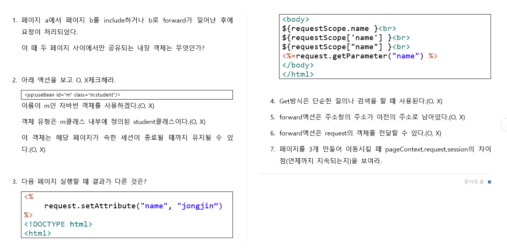

# JSP 수업 23.09.25

## 복습 중에 내가 헷갈렸던 내용 다시 정리해보기

### Servlet으로 출력해보기 1

jsp로는 값을 가지고 이동해서 출력하는 것을 할 수 있었는데 Servlet으로는 헷갈렸다.

form을 작성한 jsp 파일

```html
<%@ page language="java" contentType="text/html; charset=UTF-8"
	pageEncoding="UTF-8"%>
<!DOCTYPE html>
<html>
<head>
<meta charset="UTF-8">
<title>Insert title here</title>
</head>
<body>
	<form action="Action1" method="get">
		<input type="radio" name="gender" value="man">남 <input
			type="radio" name="gender" value="woman">여 <input
			type="submit" value="제출">
	</form>
</body>
</html>
```

Servlet 파일의 doGet 부분

PrintWriter의 객체를 response 객체로 호출하는 getWriter를 사용해서 생성하고, 출력에 활용한다.

```java
protected void doGet(HttpServletRequest request, HttpServletResponse response) throws ServletException, IOException {
		response.setContentType("text/html;charset=utf-8");
		String gender = request.getParameter("gender");
		PrintWriter out = response.getWriter();
		out.print(gender);
		out.close();
	}
```

### Servlet으로 출력해보기 2

form을 만든 param.jsp 파일

```html
<%@ page language="java" contentType="text/html; charset=UTF-8"
    pageEncoding="UTF-8"%>
<!DOCTYPE html>
<html>
<head>
<meta charset="UTF-8">
<title>Insert title here</title>
	<script type="text/javascript" src="param.js"></script>
</head>
<body>
	<form action="param" method="post">
		아이디 <input type="text" name="id"><br>
		비밀번호 <input type="password" name="pw"><br>
		나이 <input type="text" name="age"><br>
		<input type="submit" value="제출" onclick="check()"><br>
	</form>
</body>
</html>
```

함수를 설정한 param.js 파일

```jsx
function check(){
	let id = document.getElementsByName("id")[0];
	let pw = document.getElementsByName("pw")[0];
	let age = document.getElementsByName("age")[0];
	if(id.value.equals("")){
		alert("아이디를 입력하세요");
		return false;
	}
	else if(isNaN(id.value)){
		alert("숫자만 입력하세요");
		return false;
	}
	else{
		return true;
	}
}
```

출력을 수행하는 Servlet 파일 param.java 파일의 doPost 부분

```java
protected void doPost(HttpServletRequest request, HttpServletResponse response) throws ServletException, IOException {
		response.setContentType("text/html;charset-utf-8");
		String id = request.getParameter("id");
		int age = Integer.parseInt(request.getParameter("age"));
		PrintWriter out = response.getWriter();
		out.print(id);
		out.print(age);
		out.close();
	}
```

### forward와 param으로 값을 가지고 페이지 이동하기

변수에 값을 저장하고 그 값을 param에 저장하여 forward로 페이지를 이동하는 one.jsp 파일

```html
<%@ page language="java" contentType="text/html; charset=UTF-8"
    pageEncoding="UTF-8"%>
<!DOCTYPE html>
<html>
<head>
<meta charset="UTF-8">
<title>Insert title here</title>
</head>
<body>
	
	<%
		String name = "tom";
		String hobby = "tennis";
	%>

	<jsp:forward page="two.jsp">
		<jsp:param name="name" value="<%= name %>" />
		<jsp:param name="hobby" value="<%= hobby %>" />
	</jsp:forward>
</body>
</html>
```

forward로 이동된 페이지에서 param에 저장된 값을 불러와서 출력하는 two.jsp 파일

```html
<%@ page language="java" contentType="text/html; charset=UTF-8"
    pageEncoding="UTF-8"%>
<!DOCTYPE html>
<html>
<head>
<meta charset="UTF-8">
<title>Insert title here</title>
</head>
<body>
	<%
		request.setCharacterEncoding("UTF-8");
		String name = request.getParameter("name");
		String hobby = request.getParameter("hobby");
	%>
	<%= name + "의 취미는 " + hobby + "이다." %>
</body>
</html>
```

## EL(표현언어)과 JSTL

EL로 출력, 연산하는 방법은 다음과 같다.

참고로 EL로는 문자열의 연산이 불가능하다.(에러 발생)

```html
<%@ page language="java" contentType="text/html; charset=UTF-8"
    pageEncoding="UTF-8"%>
<!DOCTYPE html>
<html>
<head>
<meta charset="UTF-8">
<title>Insert title here</title>
</head>
<body>
	jsp 표현식으로 출력 : <%= "hi" %><br>
	el(표현 언어) 방식으로 출력 : ${"hi"}<br>
	<br>
	
	el로 출력<br>
	정수출력 : ${100}<br>
	실수출력 : ${3.4}<br>
	문자열 출력 : ${"홍길동"}<br>
	논리형 출력 : ${true}<br>
	null 출력 : ${null}<br>
	null은 비어있어서 아무것도 보이지 않을 것이다.<br>
	<br>
	
	el로 산술 연산<br>
	${10+10}<br>
	${10*10}<br>
	${10%5}<br>
	${10 mod 5}<br>
	<br>
	
	el로 비교 연산<br>
	${10==5}<br>
	${10 eq 5}<br>
	${10 < 5}<br>
	<br>
</body>
</html>
```

pageContext, request, session, application의 객체를 사용해서 출력

```html
<%@ page language="java" contentType="text/html; charset=UTF-8"
    pageEncoding="UTF-8"%>
<!DOCTYPE html>
<html>
<head>
<meta charset="UTF-8">
<title>Insert title here</title>
</head>
<body>
	<%
		pageContext.setAttribute("name", "영재");
		request.setAttribute("name", "재용");
		session.setAttribute("name", "규도");
		application.setAttribute("name", "창표");
	%>
		${name}<br>
		${pageScope.name}<br>
		
		${requestScope.name}<br>
		
		${sessionScope.name}<br>
		
		${applicationScope.name}<br>
</body>
</html>
```

### JSTL의 Core 태그 사용

Core 태그를 사용하기 위해서는 taglib 지시자를 선언해야 한다.

form을 작성한 jsp파일

```html
<%@ page language="java" contentType="text/html; charset=UTF-8"
    pageEncoding="UTF-8"%>
<!DOCTYPE html>
<html>
<head>
<meta charset="UTF-8">
<title>Insert title here</title>
</head>
<body>
	<form action="c.jsp">
   <select id="color" name="color">
      <option value="1">red</option>
      <option value="2">orange</option>
      <option value="3">yellow</option>
   </select>
   <input type="submit" value="전송">

</form>
</body>
</html>
```

Core 태그를 사용한 jsp파일

```html
<%@ page language="java" contentType="text/html; charset=UTF-8"
    pageEncoding="UTF-8"%>
<%@ taglib prefix="c" uri="http://java.sun.com/jsp/jstl/core" %>
<body>

<c:if test="${param.color==1}">
   <span style="color:red;">red</span>
</c:if>

<c:if test="${param.color==2}">
   <span style="color:orange;">orange</span>
</c:if>

<c:if test="${param.color==3}">
   <span style="color:yellow;">yellow</span>
</c:if>

</body>
</html>
```

Core 태그를 사용하기 위해 taglib 지시자를 선언하고 다양한 방법으로 문자열을 출력하는 jsp파일

```html
<%@ page language="java" contentType="text/html; charset=UTF-8"
    pageEncoding="UTF-8"%>
<%@ taglib prefix="c" uri="http://java.sun.com/jsp/jstl/core" %>
<!DOCTYPE html>
<html>
<head>
<meta charset="UTF-8">
<title>Insert title here</title>
</head>
<body>
<c:out value="aa"></c:out><br>
<%= "aa" %><br>
${"aa"}<br><br>

<c:set var="msg" value="Hi"></c:set>
${msg}<br>

<c:set var="age">30</c:set>
${age}<br>

<!-- 1부터 10까지 i값을 1씩 증가시켜서 반복해서 출력 -->
<c:forEach var="i" begin="1" end="10" step="1">
	${i}
</c:forEach>
</body>
</html>
```

### pageContext, request, session 객체의 값을 EL 언어로 출력하기

pageContext는 하나의 페이지 내에서만 값이 유효하고, 다른 페이지로 넘어가면 값을 유지할 수 없다.

request는 다른 페이지로 넘어갈 때 딱 한 번만 값이 유효하고, 또 다시 다른 페이지로 넘어가면 값을 유지할 수 없다.

session은 설정한 부분까지 값을 유지한다. 설정이 딱히 없으면 웹 페이지를 닫을 때까지 값을 유지한다.

application은 어플리캐이션을 종료할 때까지 값을 유지한다.

```html
<%@ page language="java" contentType="text/html; charset=UTF-8"
    pageEncoding="UTF-8"%>
<!DOCTYPE html>
<html>
<head>
<meta charset="UTF-8">
<title>Insert title here</title>
</head>
<body>
	<!-- 출력하는 방법이 2가지 방법이 있다. -->
	${pageScope.name}<br>
	${requestScope.name}<br>
	${sessionScope.name}<br>
	
	<!-- 현재 jsp 페이지 안에서만 값이 유지되고,
	다른 jsp 파일로 이동하면 유지되지 않는다. -->
	${pageScope["name"]}<br>
	
	<!-- 웹 요청부터 응답할 때까지 값이 유지된다. -->
	${requestScope['name']}<br>
	
	<!-- 사용자 세션이 유지될 때까지 값을 유지한다. -->
	${sessionScope['name']}<br>
	
	<a href="b.jsp">이동</a>
</body>
</html>
```

```html
<%@ page language="java" contentType="text/html; charset=UTF-8"
    pageEncoding="UTF-8"%>
<!DOCTYPE html>
<html>
<head>
<meta charset="UTF-8">
<title>Insert title here</title>
</head>
<body>
	${pageScope.name}<br>
	${requestScope.name}<br>
	${sessionScope.name}<br>
</body>
</html>
```

## 문제 풀이



### 1번

request

### 2번

O, X, O

### 3번

request.setAttribute()는 request.getAttibute()로 출력할 수 있다.

request.getParameter()로는 값을 받아올 수 없다.

따라서 request.getParameter()만 결과가 다르다.

### 4번

O

### 5번

O

### 6번

O

### 7번

위에서 pageContext, request, session 객체의 값을 EL 언어로 출력하기에서 했었다.

pageContext는 현재 페이지에서만 값이 유효하다.

request는 웹 요청부터 응답할 때까지 값이 유효하고, 두 페이지 이상 이동하면 값이 유효하지 않다.

session은 사용자 세션이 유지될 때까지 값을 유지한다.