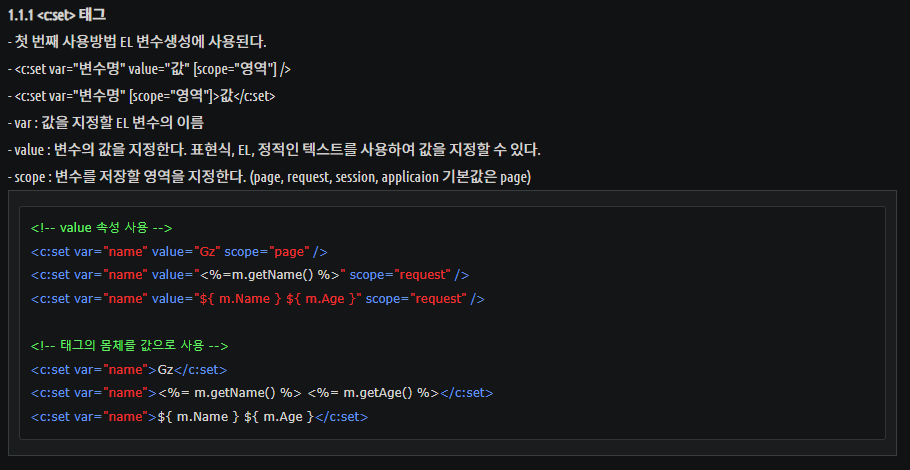

# JSP 수업 23.09.26

## el 방식으로 출력하기 예제

출력할 때 param 객체를 이용해서 값을 불러온다.

### 예제1

form 작성

```html
<%@ page language="java" contentType="text/html; charset=UTF-8"
	pageEncoding="UTF-8"%>
<!DOCTYPE html>
<html>
<head>
<meta charset="UTF-8">
<title>Insert title here</title>
</head>
<body>
	<form method="get" action="testLogin.jsp">
		<label for="userid"> 아이디 : </label> <input type="text" name="id"
			id="userid"><br> <label for="userpwd"> 암 &nbsp;
			호 : </label> <input type="password" name="pwd" id="userpwd"><br>
		<input type="submit" value="로그인">
	</form>
</body>
</html>
```

출력

```html
<%@ page language="java" contentType="text/html; charset=UTF-8"
    pageEncoding="UTF-8"%>
<!DOCTYPE html>
<html>
<head>
<meta charset="UTF-8">
<title>Insert title here</title>
</head>
<body>
	el 방식으로 출력<br>
	id : ${param.id}<br>
	pw : ${param.pwd}<br>
	
	<!-- 맞으면 true, 틀리면 false를 출력 -->
	${param.id=="yeongmae"}<br>
</body>
</html>
```

### 예제2(사칙연산)

form

```html
<%@ page language="java" contentType="text/html; charset=UTF-8"
	pageEncoding="UTF-8"%>
<!DOCTYPE html>
<html>
<head>
<meta charset="UTF-8">
<title>Insert title here</title>
</head>
<body>
	<form action="add.jsp">
		숫자 1 : <input type="text" name="num1"><br>
		숫자 2 : <input type="text" name="num2"><br>
		<input type="submit" value="전송">
	</form>
</body>
</html>
```

출력

```html
<%@ page language="java" contentType="text/html; charset=UTF-8"
    pageEncoding="UTF-8"%>
<!DOCTYPE html>
<html>
<head>
<meta charset="UTF-8">
<title>Insert title here</title>
</head>
<body>
	${param.num1 } + ${param.num2 } = ${param.num1 + param.num2 }
</body>
</html>
```

## Core 태그 활용하기

Core 태그를 사용하기 위해서는 taglib 지시자를 선언해야 한다.

<%@ taglib uri="http://java.sun.com/jsp/jstl/core" prefix="c" %>라고 선언하면 지시자를 c로 설정한 것이다.

### <c:out>

<%= %> 표현식과 동일하게 jsp 페이지에 출력을 하는 태그이다.

<c:out> 태그의 value 속성의 값을 EL 출력문으로 하여 값을 출력한다.

활용 예제는 다음과 같다.

```html
<%@ page language="java" contentType="text/html; charset=UTF-8"
    pageEncoding="UTF-8"%>
<%@ taglib uri="http://java.sun.com/jsp/jstl/core" prefix="c" %>    
<!DOCTYPE html>
<html>
<head>
<meta charset="UTF-8">
<title>Insert title here</title>
</head>
<body>
<c:set var="num" value="20" scope="page"></c:set>
숫자 : <c:out value="${num }"/>

</body>
</html>
```

### <c:set>

4개 영역의 JSP 저장소에 변수를 선언하는 태그이다.

이때 4개 영역은 page, request, session, application이고 설정하지 않으면 기본값은 page이다.

scope를 사용해서 변수를 저장할 영역을 지정할 수 있다.

다양한 타입의 값, 계산식, 객체 등 많은 것들을 선언할 수 있다.




활용 예제는 다음과 같다.

변수 선언 및 활용

```html
<%@page import="test.MemberBean"%>
<%@ page language="java" contentType="text/html; charset=UTF-8"
    pageEncoding="UTF-8"%>
    <%@ taglib uri="http://java.sun.com/jsp/jstl/core" prefix="c" %>
<!DOCTYPE html>
<html>
<head>
<meta charset="UTF-8">
<title>Insert title here</title>
</head>
<body>
	<c:out value="hello"/>
	
	<c:set var="msg" value="hello"/>
	${msg }<br>
	
	<c:set var="num">40</c:set>
	${num }<br>
	
	<c:set var="add" value="${100+100 }"></c:set>
	${add }<br>
	
	<!-- MemberBean 클래스의 객체를 생성해서 객체의 필드를 속성으로 접근해서 필드에 값을 저장한다. -->
	<!-- 저장할 값은 태그 사이에 넣어도 되고, value값으로 설정해주어도 된다. -->
	<c:set var="mem" value="<%= new MemberBean() %>"></c:set>
	<c:set target="${mem }" property="id">gildong</c:set>
	<c:set target="${mem }" property="name" value="홍길동"></c:set>
	
	
</body>
</html>
```

위에서 활용된 클래스 선언

```java
package test;

public class MemberBean {
	private String id;
	private String name;
	
	public MemberBean(String id, String name) {
		super();
		this.id=id;
		this.name=name;
	}
	
	public MemberBean() {
		super();
	}
	
	@Override
	public String toString() {
		return id + " " + name;
	}

	public String getId() {
		return id;
	}

	public void setId(String id) {
		this.id = id;
	}

	public String getName() {
		return name;
	}

	public void setName(String name) {
		this.name = name;
	}
	
	
}
```

### <c:remove>

4개 영역의 JSP 저장소에 선언된 변수를 제거하는 태그이다.

<c:remove var=”변수이름” scope=”4개 영역 중 하나” /> 형태로 작성하며 scope 부분은 생략 가능하다.

활용 예제는 다음과 같다.

```html
<%@ page language="java" contentType="text/html; charset=UTF-8"
    pageEncoding="UTF-8"%>
<%@ taglib uri="http://java.sun.com/jsp/jstl/core" prefix="c" %>    
<!DOCTYPE html>
<html>
<head>
<meta charset="UTF-8">
<title>Insert title here</title>
</head>
<body>
<c:set var="num" value="20" scope="page"></c:set>
숫자 : <c:out value="${num }"/>

<c:remove var="num" scope="page"/>
숫자 : <c:out value="${num }"/>

</body>
</html>
```

### <c:if>

<c:if> 태그는 test 속성 내의 EL 비교식의 결과가 참이면 실행되며, else 구문은 없다.

<c:if> 태그에 사용될 수 있는 속성은 test, var, scope로 3가지이다.

test는 필수 속성으로 속성값으로 EL 비교식을 가진다.

var는 조건 결과를 저장할 변수를 지정한다.

scope는 조건 결과를 저장할 변수의 저장 영역을 지정한다.

test 속성에 사용되는 비교 연산자는 다음과 같다.


test 속성에 사용되는 논리연산자는 다음과 같다.


활용 예제는 다음과 같다.

select 선택

```html
<%@ page language="java" contentType="text/html; charset=UTF-8"
    pageEncoding="UTF-8"%>
<!DOCTYPE html>
<html>
<head>
<meta charset="UTF-8">
<title>Insert title here</title>
</head>
<body>
	<form action="fruit.jsp">
      <label for="fruit">과일</label><br> <select id="fruit"
         name="fruit">
         <option value="1">사과</option>
         <option value="2">메론</option>
         <option value="3">바나나</option>
      </select> <input type="submit" value="전송">
   </form>
</body>
</html>
```

<c:if> 태그로 조건을 만족하면 EL로 출력

```html
<%@ page language="java" contentType="text/html; charset=UTF-8"
    pageEncoding="UTF-8"%>
<%@ taglib uri="http://java.sun.com/jsp/jstl/core" prefix="c" %>
<!DOCTYPE html>
<html>
<head>
<meta charset="UTF-8">
<title>Insert title here</title>
</head>
<body>
<c:if test="${param.fruit == 1 }">
	${"사과"}
</c:if>

<c:if test="${param.fruit == 2 }">
	${"메론" }
</c:if>

<c:if test="${param.fruit == 3 }">
	${"바나나" }
</c:if>
</body>
</html>
```

### <c:choose>와 <c:when>

<c:choose> 태그는 <c:when> 태그를 사용해서 조건에 따른 여러 곳으로 분기 가능하고, 조건이 맞은 것이 없을 경우 <c:otherwise>를 사용해서 기본 분기를 제공할 수 있다.

활용 예제는 다음과 같다.

select 선택

```html
<%@ page language="java" contentType="text/html; charset=UTF-8"
    pageEncoding="UTF-8"%>
<!DOCTYPE html>
<html>
<head>
<meta charset="UTF-8">
<title>Insert title here</title>
</head>
<body>
	<form action="fruit.jsp">
      <label for="fruit">과일</label><br> <select id="fruit"
         name="fruit">
         <option value="1">사과</option>
         <option value="2">메론</option>
         <option value="3">바나나</option>
      </select> <input type="submit" value="전송">
   </form>
</body>
</html>
```

<c:when>조건을 만족하면 EL로 출력

```html
<%@ page language="java" contentType="text/html; charset=UTF-8"
    pageEncoding="UTF-8"%>
<%@ taglib uri="http://java.sun.com/jsp/jstl/core" prefix="c" %>
<!DOCTYPE html>
<html>
<head>
<meta charset="UTF-8">
<title>Insert title here</title>
</head>
<body>
<c:choose>
	<c:when test="${param.fruit == 1 }">
		${"사과"}
	</c:when>
	
	<c:when test="${param.fruit == 2 }">
		${"메론" }
	</c:when>
	
	<c:when test="${param.fruit == 3 }">
		${"바나나" }
	</c:when>
</c:choose>
</body>
</html>
```

### <c:forEach>

배열이나 Collection 객체의 요소를 사용하기 위해 제공되는 태그이다.

속성은 다음과 같다.


varStatus 값은 다음과 같다.


활용 예제는 다음과 같다.

배열을 선언하고 배열의 인덱스, count 수, 배열의 요소를 출력하는 예제

```html
<%@ page language="java" contentType="text/html; charset=UTF-8"
    pageEncoding="UTF-8"%>
<%@ taglib uri="http://java.sun.com/jsp/jstl/core" prefix="c" %>    
<!DOCTYPE html>
<html>
<head>
<meta charset="UTF-8">
<title>Insert title here</title>
</head>
<body>
<%
	String [] ary = {"aa", "bb", "cc", "dd"};
	pageContext.setAttribute("ary", ary);
%>

<c:forEach var="a" items="${ary }" varStatus="status">
	${status.index }<br>
	${status.count }<br>
	${a }<br>
</c:forEach>

</body>
</html>
```

체크박스에서 선택된 것들을 출력하는 예제

체크박스 form

```html
<%@ page language="java" contentType="text/html; charset=UTF-8"
    pageEncoding="UTF-8"%>
<!DOCTYPE html>
<html>
<head>
<meta charset="UTF-8">
<title>Insert title here</title>
</head>
<body>
	<form method="get" action="items.jsp">
      <input type="checkbox" name="item" value="신발"> 신발 <input
         type="checkbox" name="item" value="가방"> 가방 <input
         type="checkbox" name="item" value="시계"> 시계  <input
         type="submit" value="전송">
   </form>
</body>
</html>
```

출력

불러올 값이 여러 개일 때는 paramValues.name값으로 가져온다. 따라서 paramValues.item으로 가져온다.

출력할 때는 var로 설정한 변수를 출력하면 된다.

```html
<%@ page language="java" contentType="text/html; charset=UTF-8"
    pageEncoding="UTF-8"%>
<%@ taglib uri="http://java.sun.com/jsp/jstl/core" prefix="c" %>
<!DOCTYPE html>
<html>
<head>
<meta charset="UTF-8">
<title>Insert title here</title>
</head>
<body>
내가 선택한 아이템 <br>
<c:forEach var="item" items="${paramValues.item}">
	${item }
</c:forEach>
</body>
</html>
```

배열의 첫번째 요소이면 글자색을 빨간색으로, 마지막 요소이면 보라색으로, 그 외는 그대로 출력하는 예제

```html
<%@ page language="java" contentType="text/html; charset=UTF-8"
    pageEncoding="UTF-8"%>
<%@ taglib uri="http://java.sun.com/jsp/jstl/core" prefix="c" %>
<!DOCTYPE html>
<html>
<head>
<meta charset="UTF-8">
<title>Insert title here</title>
</head>
<body>
	<%
		String [] movie = {"스파이더맨", "해리포터", "오펜하이머", "인터스텔라"};
		pageContext.setAttribute("movie", movie);
	%>
	
	<c:forEach var="movie" items="${movie }" varStatus="st">
		<c:choose>
			<c:when test="${st.first }">
				<div style="color:red;">${movie }</div>
			</c:when>
			<c:when test="${st.last }">
				<div style="color:purple;">${movie }</div>
			</c:when>
			<c:otherwise>
				${movie }
			</c:otherwise>
		</c:choose>
		
	</c:forEach>
</body>
</html>
```

begin과 end로 시작값과 끝 값을 지정하여 반복문을 사용하는 예제

```html
<%@ page language="java" contentType="text/html; charset=UTF-8"
    pageEncoding="UTF-8"%>
<%@ taglib uri="http://java.sun.com/jsp/jstl/core" prefix="c" %>
<!DOCTYPE html>
<html>
<head>
<meta charset="UTF-8">
<title>Insert title here</title>
</head>
<body>
<c:forEach var="cnt" begin="1" end="10" varStatus="st">
	${cnt }
</c:forEach>

<br>

<c:forEach var="cnt" begin="1" end="10" varStatus="st">
	<c:if test="${not st.last }">
		${cnt }
	</c:if>
</c:forEach>

<br>

<c:forEach var="cnt" begin="5" end="10" varStatus="st">
	<table border="1">
		<tr>
			<td>인덱스</td>
			<td>반복 횟수</td>
			<td>cnt 값</td>
		</tr>
		<tr>
			<td>${st.index }</td>
			<td>${st.count }</td>
			<td>${cnt }</td>
		</tr>
	</table>
</c:forEach>
</body>
</html>
```

### <c:forTokens>

StringTokenizer 클래스의 기능처럼 문자열에 구분자를 제거하고 요소를 사용하기 위해 제공되는 태그이다.

문자열을 특정 기호로 잘라내어 반복하는 반복문이다.

delims는 문자열을 분리하기 위한 특정 기호로 필수 속성이다.

items에는 문자열을 넣고, delims에는 분리할 기호를 넣는다. 각 토큰 별로 분리된 문자열은 var로 지정된 변수로 얻어올 수 있다.

활용 예제는 다음과 같다.

```html
<%@ page language="java" contentType="text/html; charset=UTF-8"
    pageEncoding="UTF-8"%>
<%@ taglib uri="http://java.sun.com/jsp/jstl/core" prefix="c" %>    
<!DOCTYPE html>
<html>
<head>
<meta charset="UTF-8">
<title>Insert title here</title>
</head>
<body>
<c:forTokens items="자바. 디비, 스프링. jsp" delims="," var="subject">
	${subject }
</c:forTokens>
<!-- 결과는 자바. 디비 스프링.jsp 처럼
delims에서 지정한 콤마가 사라진 문자열이 출력된다. -->
</body>
</html>
```

### <c:redirect>

query를 포함한 지정한 url로 웹페이지가 전환되는 태그이다.

sendRedirect와 같은 기능으로 페이지를 강제 이동시킨다.

활용 예제는 다음과 같다.

```html
<%@ page language="java" contentType="text/html; charset=UTF-8"
    pageEncoding="UTF-8"%>
<%@ taglib uri="http://java.sun.com/jsp/jstl/core" prefix="c" %>    
<!DOCTYPE html>
<html>
<head>
<meta charset="UTF-8">
<title>Insert title here</title>
</head>
<body>
<c:redirect url="NewFile.jsp"></c:redirect>
</body>
</html>
```

### <c:catch>

try, catch와 같이 예외처리를 위한 태그이다.

활용 예제는 다음과 같다.

```html
<%@ page language="java" contentType="text/html; charset=UTF-8"
    pageEncoding="UTF-8"%>
<%@ taglib uri="http://java.sun.com/jsp/jstl/core" prefix="c" %>    
<!DOCTYPE html>
<html>
<head>
<meta charset="UTF-8">
<title>Insert title here</title>
</head>
<body>

<c:catch var="msg">
예외 처리 전 : <%= 10/0 %><br>
예외 처리 후 :
</c:catch>
<c:out value="${msg }"/>
</body>
</html>
```

## Formatting 태그 사용하기

Formatting 태그를 사용하기 위해서는 taglib 지시자를 선언해야 한다.

<%@ taglib uri="http://java.sun.com/jsp/jstl/fmt" prefix="fmt" %>라고 선언하면 지시자를 fmt로 설정한 것이다.

### <fmt:formatDate>

날짜 및 시간을 원하는 형식으로 출력하는 태그이다.

문자열을 원하는 날짜 및 시간 형식으로 출력한다.

type을 date로 설정하면 현재 날짜가 출력된다.

type을 time으로 설정하면 현재 시간이 출력된다.

type을 both로 설정하면 현재 날짜와 시간이 같이 출력된다.

type 대신 pattern을 사용해서 값으로 형식을 제공하면 해당 형식에 맞게 현재 날짜와 시간을 출력할 수 있다.

활용 예제는 다음과 같다

```html
<%@ page language="java" contentType="text/html; charset=UTF-8"
    pageEncoding="UTF-8"%>
<%@ taglib uri="http://java.sun.com/jsp/jstl/core" prefix="c" %>
<%@ taglib uri="http://java.sun.com/jsp/jstl/fmt" prefix="fmt" %>
<!DOCTYPE html>
<html>
<head>
<meta charset="UTF-8">
<title>Insert title here</title>
</head>
<body>

<c:set var="now" value="<%=new java.util.Date() %>"></c:set>
${now }

<fmt:formatDate value="${now }"/><br>
date : <fmt:formatDate value="${now }" type="date"/><br>
time : <fmt:formatDate value="${now }" type="time"/><br>
both : <fmt:formatDate value="${now }" type="both"/><br>
pattern : <fmt:formatDate value="${now }" pattern="yyyy년 MM월 dd일 hh시 mm분"/><br>
</body>
</html>
```

다음과 같은 결과를 얻을 수 있다.


### <fmt:requestEncoding>

요청된 문자 인코딩을 설정하는 태그이다.

출력하기 전에 문자를 인코딩하기 위해 사용한다.

활용 예제는 다음과 같다.

입력 form

```html
<%@ page language="java" contentType="text/html; charset=UTF-8"
    pageEncoding="UTF-8"%>
    
<!DOCTYPE html>
<html>
<head>
<meta charset="UTF-8">
<title>Insert title here</title>
</head>
<body>
	<form method="post" action="aa.jsp">
		이름 : <input type="text" name="name">
		<input type="submit" value="전송">
	</form>
</body>
</html>
```

문자 인코딩 및 출력

```html
<%@ page language="java" contentType="text/html; charset=UTF-8"
    pageEncoding="UTF-8"%>
<%@ taglib uri="http://java.sun.com/jsp/jstl/core" prefix="c" %>
<%@ taglib uri="http://java.sun.com/jsp/jstl/fmt" prefix="fmt" %>
<!DOCTYPE html>
<html>
<head>
<meta charset="UTF-8">
<title>Insert title here</title>
</head>
<body>
	<fmt:requestEncoding value="UTF-8"></fmt:requestEncoding>
	이름 : <c:out value="${param.name }"></c:out>
</body>
</html>
```