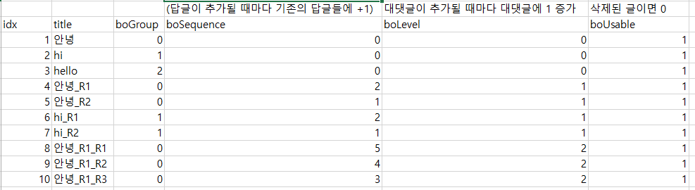

# 두번째 게시판 만들기 23.11.02~23.11.13

## 전자정부와 MySql을 활용한 스프링 mvc 프로젝트 세팅

Spring Legacy Project에서 MVC 프로젝트를 만들고 pom.xml에서 원하는 버전으로 수정하고 maven repository에서 mysql connector java의 원하는 버전의 maven 코드를 추가한다.

spring jdbc의 버전을 선택하고 maven 코드를 추가한다.

hikari cp의 버전을 선택하고 maven 코드를 추가한다. hikari cp의 cp가 connection pool이다.

mybatis의 버전을 선택하고 maven 코드를 추가한다.

mybatis spring의 버전을 선택하고 maven 코드를 추가한다.

pom.xml의 servlet부분을 artifactId를 javax.servlet-api로 바꾸고 버전을 3.1.0으로 바꾼다.

project lombok의 버전을 선택하고 maven 코드를 추가한다.

### web.xml

```xml
<?xml version="1.0" encoding="UTF-8"?>
<web-app version="2.5" xmlns="http://java.sun.com/xml/ns/javaee"
	xmlns:xsi="http://www.w3.org/2001/XMLSchema-instance"
	xsi:schemaLocation="http://java.sun.com/xml/ns/javaee https://java.sun.com/xml/ns/javaee/web-app_2_5.xsd">
	
	<filter>
		<filter-name>CharacterEncodingFilter</filter-name>
		<filter-class>org.springframework.web.filter.CharacterEncodingFilter</filter-class>
		<init-param>
			<param-name>encoding</param-name>
			<param-value>UTF-8</param-value>
		</init-param>
		
		<init-param>
			<param-name>forceEncoding</param-name>
			<param-value>true</param-value>
		</init-param>
	</filter>
	
	<filter-mapping>
		<filter-name>CharacterEncodingFilter</filter-name>
		<url-pattern>/*</url-pattern>
	</filter-mapping>
	

	<!-- The definition of the Root Spring Container shared by all Servlets and Filters -->
	<context-param>
		<param-name>contextConfigLocation</param-name>
		<param-value>/WEB-INF/spring/root-context.xml</param-value>
	</context-param>
	
	<!-- Creates the Spring Container shared by all Servlets and Filters -->
	<listener>
		<listener-class>org.springframework.web.context.ContextLoaderListener</listener-class>
	</listener>

	<!-- Processes application requests -->
	<servlet>
		<servlet-name>appServlet</servlet-name>
		<servlet-class>org.springframework.web.servlet.DispatcherServlet</servlet-class>
		<init-param>
			<param-name>contextConfigLocation</param-name>
			<param-value>/WEB-INF/spring/appServlet/servlet-context.xml</param-value>
		</init-param>
		<load-on-startup>1</load-on-startup>
	</servlet>
		
	<servlet-mapping>
		<servlet-name>appServlet</servlet-name>
		<url-pattern>/</url-pattern>
	</servlet-mapping>

</web-app>
```

### pom.xml

```xml
<?xml version="1.0" encoding="UTF-8"?>
<project xmlns="http://maven.apache.org/POM/4.0.0" xmlns:xsi="http://www.w3.org/2001/XMLSchema-instance"
	xsi:schemaLocation="http://maven.apache.org/POM/4.0.0 https://maven.apache.org/maven-v4_0_0.xsd">
	<modelVersion>4.0.0</modelVersion>
	<groupId>kr.co</groupId>
	<artifactId>ezen</artifactId>
	<name>AWS1102</name>
	<packaging>war</packaging>
	<version>1.0.0-BUILD-SNAPSHOT</version>
	<properties>
		<java-version>1.8</java-version>
		<org.springframework-version>5.0.7.RELEASE</org.springframework-version>
		<org.aspectj-version>1.6.10</org.aspectj-version>
		<org.slf4j-version>1.6.6</org.slf4j-version>
	</properties>
	<dependencies>
		<!-- Spring -->
		<dependency>
			<groupId>org.springframework</groupId>
			<artifactId>spring-context</artifactId>
			<version>${org.springframework-version}</version>
			<exclusions>
				<!-- Exclude Commons Logging in favor of SLF4j -->
				<exclusion>
					<groupId>commons-logging</groupId>
					<artifactId>commons-logging</artifactId>
				 </exclusion>
			</exclusions>
		</dependency>
		<dependency>
			<groupId>org.springframework</groupId>
			<artifactId>spring-webmvc</artifactId>
			<version>${org.springframework-version}</version>
		</dependency>
		
		<dependency>
			<groupId>org.springframework</groupId>
			<artifactId>spring-test</artifactId>
			<version>${org.springframework-version}</version>
		</dependency>
				
		<!-- AspectJ -->
		<dependency>
			<groupId>org.aspectj</groupId>
			<artifactId>aspectjrt</artifactId>
			<version>${org.aspectj-version}</version>
		</dependency>	
		
		<!-- Logging -->
		<dependency>
			<groupId>org.slf4j</groupId>
			<artifactId>slf4j-api</artifactId>
			<version>${org.slf4j-version}</version>
		</dependency>
		<dependency>
			<groupId>org.slf4j</groupId>
			<artifactId>jcl-over-slf4j</artifactId>
			<version>${org.slf4j-version}</version>
			<scope>runtime</scope>
		</dependency>
		<dependency>
			<groupId>org.slf4j</groupId>
			<artifactId>slf4j-log4j12</artifactId>
			<version>${org.slf4j-version}</version>
			<scope>runtime</scope>
		</dependency>
		<dependency>
			<groupId>log4j</groupId>
			<artifactId>log4j</artifactId>
			<version>1.2.17</version>
			<exclusions>
				<exclusion>
					<groupId>javax.mail</groupId>
					<artifactId>mail</artifactId>
				</exclusion>
				<exclusion>
					<groupId>javax.jms</groupId>
					<artifactId>jms</artifactId>
				</exclusion>
				<exclusion>
					<groupId>com.sun.jdmk</groupId>
					<artifactId>jmxtools</artifactId>
				</exclusion>
				<exclusion>
					<groupId>com.sun.jmx</groupId>
					<artifactId>jmxri</artifactId>
				</exclusion>
			</exclusions>
			<scope>runtime</scope>
		</dependency>

		<!-- @Inject -->
		<dependency>
			<groupId>javax.inject</groupId>
			<artifactId>javax.inject</artifactId>
			<version>1</version>
		</dependency>
				
		<!-- Servlet -->
		<dependency>
			<groupId>javax.servlet</groupId>
			<artifactId>javax.servlet-api</artifactId>
			<version>3.1.0</version>
			<scope>provided</scope>
		</dependency>
		<dependency>
			<groupId>javax.servlet.jsp</groupId>
			<artifactId>jsp-api</artifactId>
			<version>2.1</version>
			<scope>provided</scope>
		</dependency>
		<dependency>
			<groupId>javax.servlet</groupId>
			<artifactId>jstl</artifactId>
			<version>1.2</version>
		</dependency>
		<!-- https://mvnrepository.com/artifact/mysql/mysql-connector-java -->
		<dependency>
			<groupId>mysql</groupId>
			<artifactId>mysql-connector-java</artifactId>
			<version>5.1.49</version>
		</dependency>
		<!-- https://mvnrepository.com/artifact/org.springframework/spring-jdbc -->
		<dependency>
			<groupId>org.springframework</groupId>
			<artifactId>spring-jdbc</artifactId>
			<version>5.0.7.RELEASE</version>
		</dependency>
		<!-- https://mvnrepository.com/artifact/com.zaxxer/HikariCP -->
		<dependency>
			<groupId>com.zaxxer</groupId>
			<artifactId>HikariCP</artifactId>
			<version>3.3.1</version>
		</dependency>

		<!-- https://mvnrepository.com/artifact/org.mybatis/mybatis -->
		<dependency>
			<groupId>org.mybatis</groupId>
			<artifactId>mybatis</artifactId>
			<version>3.4.6</version>
		</dependency>
		<!-- https://mvnrepository.com/artifact/org.mybatis/mybatis-spring -->
		<dependency>
			<groupId>org.mybatis</groupId>
			<artifactId>mybatis-spring</artifactId>
			<version>1.3.2</version>
		</dependency>
		<!-- https://mvnrepository.com/artifact/org.projectlombok/lombok -->
		<dependency>
			<groupId>org.projectlombok</groupId>
			<artifactId>lombok</artifactId>
			<version>1.18.12</version>
			<scope>provided</scope>
		</dependency>
		
		
		
		
		
	
		<!-- Test -->
		<dependency>
			<groupId>junit</groupId>
			<artifactId>junit</artifactId>
			<version>4.12</version>
			<scope>test</scope>
		</dependency>        
	</dependencies>
    <build>
        <plugins>
            <plugin>
                <artifactId>maven-eclipse-plugin</artifactId>
                <version>2.9</version>
                <configuration>
                    <additionalProjectnatures>
                        <projectnature>org.springframework.ide.eclipse.core.springnature</projectnature>
                    </additionalProjectnatures>
                    <additionalBuildcommands>
                        <buildcommand>org.springframework.ide.eclipse.core.springbuilder</buildcommand>
                    </additionalBuildcommands>
                    <downloadSources>true</downloadSources>
                    <downloadJavadocs>true</downloadJavadocs>
                </configuration>
            </plugin>
            <plugin>
                <groupId>org.apache.maven.plugins</groupId>
                <artifactId>maven-compiler-plugin</artifactId>
                <version>2.5.1</version>
                <configuration>
                    <source>1.8</source>
                    <target>1.8</target>
                    <compilerArgument>-Xlint:all</compilerArgument>
                    <showWarnings>true</showWarnings>
                    <showDeprecation>true</showDeprecation>
                </configuration>
            </plugin>
            <plugin>
                <groupId>org.codehaus.mojo</groupId>
                <artifactId>exec-maven-plugin</artifactId>
                <version>1.2.1</version>
                <configuration>
                    <mainClass>org.test.int1.Main</mainClass>
                </configuration>
            </plugin>
        </plugins>
    </build>
</project>
```

### root-context.xml

```xml
<?xml version="1.0" encoding="UTF-8"?>
<beans xmlns="http://www.springframework.org/schema/beans"
	xmlns:xsi="http://www.w3.org/2001/XMLSchema-instance"
	xmlns:mybatis-spring="http://mybatis.org/schema/mybatis-spring"
	xmlns:context="http://www.springframework.org/schema/context"
	xsi:schemaLocation="http://mybatis.org/schema/mybatis-spring http://mybatis.org/schema/mybatis-spring-1.2.xsd
		http://www.springframework.org/schema/beans https://www.springframework.org/schema/beans/spring-beans.xsd
		http://www.springframework.org/schema/context http://www.springframework.org/schema/context/spring-context-4.3.xsd">
	
	<!-- service는 mapper보다 상단에 올려줘야 함 -->
	<context:component-scan base-package="kr.co.ezen.service" />
	
	<!-- Root Context: defines shared resources visible to all other web components -->
	<bean class="com.zaxxer.hikari.HikariConfig" id="hikariConfig">
		<property name="driverClassName" value="com.mysql.jdbc.Driver"/>
		<property name="jdbcUrl" value="jdbc:mysql://localhost:3306/com?useSSL=false"/>
		<property name="username" value="com"/>
		<property name="password" value="com01"/>	
	</bean>
	
	<bean class="com.zaxxer.hikari.HikariDataSource" id="dataSource" destroy-method="close">
		<constructor-arg ref="hikariConfig"/>	
	</bean>
	
	<bean class="org.mybatis.spring.SqlSessionFactoryBean">
		<property name="dataSource" ref="dataSource"/>
	</bean>
	
	<mybatis-spring:scan base-package="kr.co.ezen.mapper"/>
	
	
</beans>
```

### servlet-context.xml

```xml
<?xml version="1.0" encoding="UTF-8"?>
<beans:beans xmlns="http://www.springframework.org/schema/mvc"
	xmlns:xsi="http://www.w3.org/2001/XMLSchema-instance"
	xmlns:beans="http://www.springframework.org/schema/beans"
	xmlns:context="http://www.springframework.org/schema/context"
	xsi:schemaLocation="http://www.springframework.org/schema/mvc https://www.springframework.org/schema/mvc/spring-mvc.xsd
		http://www.springframework.org/schema/beans https://www.springframework.org/schema/beans/spring-beans.xsd
		http://www.springframework.org/schema/context https://www.springframework.org/schema/context/spring-context.xsd">

	<!-- DispatcherServlet Context: defines this servlet's request-processing infrastructure -->
	
	<!-- Enables the Spring MVC @Controller programming model -->
	<annotation-driven />

	<!-- Handles HTTP GET requests for /resources/** by efficiently serving up static resources in the ${webappRoot}/resources directory -->
	<resources mapping="/resources/**" location="/resources/" />

	<!-- Resolves views selected for rendering by @Controllers to .jsp resources in the /WEB-INF/views directory -->
	<beans:bean class="org.springframework.web.servlet.view.InternalResourceViewResolver">
		<beans:property name="prefix" value="/WEB-INF/views/" />
		<beans:property name="suffix" value=".jsp" />
	</beans:bean>
	
	<context:component-scan base-package="kr.co.ezen.controller" />
	
	
	
</beans:beans>
```

## lombok(롬복)

코드를 자동 완성해주는 라이브러리이다.

어노테이션 기반으로 코드 자동 생성을 통한 생산성을 향상시킨다.

반복되는 코드를 줄임으로써 가독성과 유지보수성을 향상시킨다.

주로 사용되는 @Getter, @Setter, @ToString, @AllArgsConstructor, @Data, @Builder 등이 있다.

@Data에는 @ToString, @Getter, @Setter, @EqualsAndHashCode, @RequiredArgsConstructor가 모두 포함되어 있기 때문에 @Data 하나만 써도 이 모든 것을 쓸 수 있다. 하지만 실무에서는 각각을 따로 쓰고 @Data는 잘 안쓴다.

## JUnit

자바용 단위 테스트 작성을 위한 표준 프레임워크

WAS(Web Application Server)를 구동하지 않고 단위 코드 테스트를 할 수 있게 해주는 라이브러리

@Test : 테스트를 수행하는 메소드를 지정한다.

@RunWith(SpringJUint4ClassRunner.class) : 컨테이너 객체를 생성해 테스트에 사용할 수 있도록 해준다.

@ContextConfiguration(location=” ”) : 스프링 빈 설정 파일의 위치를 지정한다.

@Log4j : log를 띄울 때 필요한 어노테이션

## 답글 구분 방식



## XSS(Cross Site Scripting)

웹 해킹 중 하나이다.

공격자가 상대방 브라우저에 스크립트가 실행되도록 하여 사용자의 세션을 가로채거나 웹 사이트 변조, 악의적 데이터 삽입 등의 공격을 진행하는 것이다.

즉, 웹 사이트에 악성 스크립트를 주입하는 행위이다.

방지 방법은 게시글의 제목의 경우에는 core 태그 c:out으로 출력해야 방지할 수 있다. c:out의 value에 출력값을 주면 script태그가 문자열로 인식되어 무효화 시킬 수 있다.

## JQuery에서 var btn=$(this).data('btn');

여기서 this는 내가 현재 클릭한 버튼을 의미한다.

JQuery에는 ‘data-이름’ 속성이 있다. data-btn으로 설정했다.

이름을 이렇게 설정하면 JQuery에서 data 함수를 사용할 수 있다. data(’이름’)으로 data 함수를 사용한다. 이름으로 ‘data-이름’ 속성에 해당하는 내용을 받아와서 변수에 저장할 수 있다.

attr 함수는 원하는 속성을 집어넣을 수 있다.

attr(”action”, “/root/board/reply”);라고 하면 왼쪽은 속성, 오른쪽은 속성 값으로 action=”/root/board/reply”와 같은 의미이다.

attr(”css”, “color:red”); 처럼 css에서도 사용된다.

## MySQL의 limit

limit은 테이블 조회 시 한계(한도)를 지정할 수 있다.

테이블에서 20개의 데이터만 가져오는 select문은

select title, content from ezenBoard limit 20; 처럼 작성한다.

테이블의 11행부터 20행의 데이터를 가져오는 select문은

select title, content from ezenBoard limit(10, 10); 처럼 작성한다. offset값이 0부터 시작하므로 10은 11행을 가리킨다.

## MySQL의 concat

MySQL은 오라클과는 다르게 concat이 여러 개의 문자열을 합칠 수 있다.

## MyBatis

mybatis : 유연성, 간결성, 효율성
동적 쿼리 => 실행 시점에 조건에 따라 sql 쿼리를 동적으로 생성할 수 있다.
검색 결과, 결과값 등 동적으로 변화할 때 유용하게 사용한다.
sql태그는 다른 구문에서 sql문을 재사용할 때 작성하는 태그이다.
<sql id="id값"></sql> 형태로 작성한다.
재사용하고 싶다면 재사용할 쿼리의 윗부분에 선언해야한다.

<include>태그는 같은 파일에서 정의해둔 <sql>태그 내의 쿼리를 불러올 수 있게 해준다. 사용하는 방법은 refid속성을 추가해준 뒤 불러오고자 하는 sql태그의 id명을 삽입해준다.

## 각 파일들 코드 정리

### src/main/java 폴더

### kr.co.ezen.controller 패키지

BoardController.java파일

```java
package kr.co.ezen.controller;

import java.util.List;

import org.springframework.beans.factory.annotation.Autowired;
import org.springframework.stereotype.Controller;
import org.springframework.ui.Model;

import org.springframework.web.bind.annotation.GetMapping;
import org.springframework.web.bind.annotation.ModelAttribute;
import org.springframework.web.bind.annotation.PostMapping;
import org.springframework.web.bind.annotation.RequestMapping;
import org.springframework.web.bind.annotation.RequestParam;
import org.springframework.web.servlet.mvc.support.RedirectAttributes;

import kr.co.ezen.entity.Board;
import kr.co.ezen.entity.Criteria;
import kr.co.ezen.entity.PageCre;
import kr.co.ezen.service.BoardService;

@Controller
@RequestMapping("/board/*")
public class BoardController {
	
	@Autowired
	private BoardService boardService;
	
	// RequestMapping은 get, post 둘다 적용된다.
	@RequestMapping("/list")
	public String list(Model mo, Criteria cri) {
		List<Board> list = boardService.getList(cri);
		mo.addAttribute("list", list);
		
		PageCre pageCre = new PageCre();
		pageCre.setCriteria(cri);
		pageCre.setTotalCount(boardService.totalCount(cri));
		mo.addAttribute("pageCre", pageCre); // 페이징 처리하기 위해 list.jsp로 넘겨야 한다.
		
		return "board/list";
	}
	
	
	@GetMapping("/register")
	public String register() {
		return "board/register";
	}
	
	@PostMapping("/register")
	public String register(Board vo, RedirectAttributes rttr, @RequestParam("title") String title, @RequestParam("content") String content) {
		
		if (title.equals("") || content.equals("")) {
			
			return "board/registerFail";
		}
		
		// insertSelectKey 방식으로 글 등록
		boardService.register(vo);
		
		// RedirectAttributes는 1회성 세션을 사용할 수 있다.
		// 1회성 세션은 addFlashAttribute 메소드를 사용한다.
		rttr.addFlashAttribute("result", vo.getIdx());
		
		// 글 등록 후 list 화면으로 강제 이동
		return "redirect:/board/list";
	}
	
	@RequestMapping("/get")
	public String read(Model mo, @RequestParam("idx") int idx, @ModelAttribute("cri") Criteria cri) {
		
		// 글 번호를 기준으로 게시글의 정보들을 모두 가져와서
		// Model 객체에 담는다.
		boardService.countPlus(idx);
		Board vo = boardService.get(idx);
		mo.addAttribute("vo", vo);
		
		PageCre pageCre = new PageCre();
		pageCre.setCriteria(cri);
		pageCre.setTotalCount(boardService.totalCount(cri));
		mo.addAttribute("pageCre", pageCre);
		
		return "board/get";
	}
	
	@GetMapping("/modify")
	public String modify(Model mo, @RequestParam("idx") int idx, @ModelAttribute("cri") Criteria cri) {
		Board vo = boardService.get(idx);
		mo.addAttribute("vo", vo);
		
		/*
		PageCre pageCre = new PageCre();
		pageCre.setCriteria(cri);
		pageCre.setTotalCount(boardService.totalCount(cri));
		mo.addAttribute("pageCre", pageCre);
		*/
		
		return "board/modify";
	}
	
	@PostMapping("/modify")
	public String modify(Board vo, Criteria cri, RedirectAttributes rttr) {
		
		boardService.modify(vo);
		rttr.addAttribute("page", cri.getPage());
		rttr.addAttribute("perPageNum", cri.getPerPageNum());
		rttr.addAttribute("keyword", cri.getKeyword());
		rttr.addAttribute("type", cri.getType());
		/*
		rttr.addAttribute("type", cri.getType());
		rttr.addAttribute("keyword", cri.getKeyword());
		
		PageCre pageCre = new PageCre();
		pageCre.setCriteria(cri);
		pageCre.setTotalCount(boardService.totalCount(cri));
		rttr.addAttribute("pageCre", pageCre);
		*/
		
		return "redirect:/board/list";
	}
	
	@GetMapping("/remove")
	public String remove(int idx, Criteria cri, RedirectAttributes rttr) {
		boardService.remove(idx);
		
		rttr.addAttribute("page", cri.getPage());
		rttr.addAttribute("perPageNum", cri.getPerPageNum());
		rttr.addAttribute("type", cri.getType());
		rttr.addAttribute("keyword", cri.getKeyword());
		
		return "redirect:/board/list";
	}
	
	@GetMapping("/reply")
	public String reply(int idx, Model mo, @ModelAttribute("cri") Criteria cri) {
		Board vo = boardService.get(idx);
		mo.addAttribute("vo", vo);
		return "board/reply";
	}
	
	@PostMapping("/reply")
	public String reply(Board vo, Criteria cri, RedirectAttributes rttr) {
		// 기존의 답글들의 DB정보를 수정하고 새로운 답글을 저장
		boardService.replyPro(vo);
		rttr.addAttribute("page", cri.getPage());
		rttr.addAttribute("perPageNum", cri.getPerPageNum());
		rttr.addAttribute("keyword", cri.getKeyword());
		rttr.addAttribute("type", cri.getType());
		return "redirect:/board/list";
	}

}
```

LoginController.java파일

```java
package kr.co.ezen.controller;

import javax.servlet.http.HttpSession;

import org.springframework.beans.factory.annotation.Autowired;
import org.springframework.stereotype.Controller;

import org.springframework.web.bind.annotation.RequestMapping;

import kr.co.ezen.entity.Member;
import kr.co.ezen.service.BoardService;

@Controller
@RequestMapping("/login/*")
public class LoginController {
	
	@Autowired
	private BoardService boardService;
	
	@RequestMapping("loginPro")
	public String loginPro(Member vo, HttpSession session) {
		
		// id, pw가 같으면 회원정보를 다 불러온다.
		Member mem = boardService.login(vo);
		
		if(mem!=null) { // 회원정보가 있으면(로그인이 되었으면)
			
			session.setAttribute("mem", mem);
			
		}
		// 회원정보가 없으면(로그인이 실패하면) 강제 이동
		return "redirect:/board/list";
	}
	
	@RequestMapping("logoutPro")
	public String logoutPro(HttpSession session) {
		// 세션을 끊는 메소드 호출
		session.invalidate();
		return "redirect:/board/list";
	}
	

}
```

### kr.co.ezen.entity 패키지

Board.java파일

```java
package kr.co.ezen.entity;

import java.util.Date;

import javax.validation.constraints.NotBlank;

import lombok.Data;

@Data
public class Board {
	
	private int idx; // 게시글 번호
	private String memberID; // 회원 아이디
	
	@NotBlank
	private String title; // 글 제목
	@NotBlank
	private String content; // 글 내용
	
	private String writer; // 작성자
	private Date indate; // 작성일자
	private int count; // 조회수
	private int boGroup; // 부모글과 답글을 묶는 변수
	private int boSequence; // 답글 순서
	private int boLevel; // 답글 레벨
	private int boUsable; // 삭제된 글인지 아닌지 여부(글이 있으면 1, 없으면 0)

}
```

Criteria.java파일

```java
package kr.co.ezen.entity;

import lombok.Data;

@Data
public class Criteria {
	
	private int page; // 현재 페이지 번호
	private int perPageNum; // 한 페이지에 보여줄 게시글 개수
	
	// 검색 기능 변수
	private String type;
	private String keyword;
	
	public Criteria() {
		this.page=1;
		this.perPageNum=4;
	}
	
	// 현재 페이지 게시글 시작 번호
	public int getPageStart() {
		return (page-1)*perPageNum;
	}
	
	

}
```

Member.java파일

```java
package kr.co.ezen.entity;

import lombok.Data;

@Data
public class Member {
	
	private String memberID; // 회원 아이디
	private String memberPwd; // 회원 비밀번호
	private String memberName; // 회원 이름
	private String memberPhone; // 회원 전화번호
	private String memberAddr; // 회원 주소
	private double latitude; // 위도(?)
	private double longitude; // 경도(?)

}
```

PageCre.java파일

```java
package kr.co.ezen.entity;

import lombok.Data;

// 페이징 처리 생성하는 클래스
@Data
public class PageCre {
	
	private Criteria criteria;
	private int totalCount; // 총 게시글 수
	private int startPage; // 시작 페이지 번호
	private int endPage; // 끝 페이지 번호
	private boolean prev; // 이전 버튼
	private boolean next; // 다음 버튼
	private int showPageNum=10; // 하단에 보여질 페이지 개수
	
	// 총 게시글 수 메소드
	public void setTotalCount(int totalCount) {
		this.totalCount=totalCount;
		createPage();
	}
	
	public void createPage() {
		
		// 1. 화면에 보여질 마지막 페이지 번호
		endPage=(int)(Math.ceil(criteria.getPage()/(double) showPageNum)*showPageNum);
		
		// 2. 시작 페이지 번호
		startPage=(endPage-showPageNum)+1;
		
		if(startPage<=0) {
			startPage=1;
		}
		
		// 3. 전체 마지막 페이지 계산
		int tmpPage=(int)(Math.ceil((totalCount)/(double)criteria.getPerPageNum()));
		
		// 4. 화면에 보여질 마지막 페이지 체크
		if(tmpPage<endPage) {
			endPage=tmpPage;
		}
		
		// 5. 이전 페이지 버튼이 존재해야 하는지
		// 시작 페이지 번호가 1이면 false, 아니면 true
		prev = (startPage==1) ? false : true;
		
		// 6. 다음 페이지 버튼이 존재해야 하는지
		// 화면에 보여질 마지막 페이지가 전체 마지막 페이지보다 작을 때만 존재
		
		next = (endPage<tmpPage) ? true : false;
	}
	
}
```

db.sql파일

```sql
--ezenBoard--
create table ezenBoard(
	idx int not null,
	memberID varchar(20) not null,
	title varchar(20) not null,
	content varchar(100) not null,
	writer varchar(20) not null,
	indate datetime default now(),
	count int default 0,
	boGroup int,
	boSequence int,
	boLevel int,
	boUsable int,
	primary key(idx)
);

create table ezenMember(
	memberID varchar(50) not null,
	memberPwd varchar(50) not null,
	memberName varchar(50) not null,
	memberPhone varchar(50) not null,
	memberAddr varchar(100),
	latitude decimal(13,10),
	longitude decimal(13,10),
	primary key(memberID)
);

insert into ezenMember(memberID, memberPwd, memberName, memberPhone) values('ezen01', 'ezen01', '이창표', '010-1111-2222');

insert into ezenMember(memberID, memberPwd, memberName, memberPhone) values('ezen02', 'ezen02', '허창범', '010-2222-3333');

insert into ezenMember(memberID, memberPwd, memberName, memberPhone) values('ezen03', 'ezen03', '김영재', '010-3333-4444');

select * from ezenMember;

select max(idx) from ezenBoard;

select IFNULL(max(idx)+1, 1) from ezenBoard; -- null이면 1로 null이 아니면 max(idx)+1 반환
select IFNULL(max(boGroup)+1, 0) from ezenBoard; -- null이면 0, 아니면 max(boGroup)+1 반환

insert into ezenBoard
select IFNULL(max(idx)+1, 1), 'ezen01', '스프링1', '스프링1', '이창표', now(), 0, IFNULL(max(boGroup)+1, 0), 0, 0, 1 from ezenBoard;

insert into ezenBoard
select IFNULL(max(idx)+1, 1), 'ezen02', '스프링2', '스프링2', '허창범', now(), 0, IFNULL(max(boGroup)+1, 0), 0, 0, 1 from ezenBoard;

insert into ezenBoard
select IFNULL(max(idx)+1, 1), 'ezen03', '스프링3', '스프링3', '김영재', now(), 0, IFNULL(max(boGroup)+1, 0), 0, 0, 1 from ezenBoard;

select * from ezenBoard;

delete from ezenBoard where idx>0;
commit;
```

### kr.co.ezen.mapper 패키지

BoardMapper.java파일

```java
package kr.co.ezen.mapper;

import java.util.List;

import kr.co.ezen.entity.Board;
import kr.co.ezen.entity.Criteria;
import kr.co.ezen.entity.Member;

public interface BoardMapper {
	
	public List<Board> getList(Criteria cri);
	
	// vo는 value object의 약자
	public void insert(Board vo);
	
	public void insertSelectKey(Board vo);
	
	public Member login(Member vo);
	
	public Board read(int idx);
	
	public void update(Board vo);
	
	public void delete(int idx);
	
	public void replyUpdate(Board pa);
	
	public void replyInsert(Board vo);
	
	public int totalCount(Criteria cri);
	
	public void countPlus(int idx);

}
```

### kr.co.ezen.service 패키지

BoardService.java파일

```java
package kr.co.ezen.service;

import java.util.List;

import kr.co.ezen.entity.Board;
import kr.co.ezen.entity.Criteria;
import kr.co.ezen.entity.Member;

public interface BoardService {
	
	public List<Board> getList(Criteria cri);

	public Member login(Member vo);
	
	public void register(Board vo);
	
	public Board get(int idx);
	
	public void modify(Board vo);
	
	public void remove(int idx);
	
	public void replyPro(Board vo);
	
	public int totalCount(Criteria cri); // 전체 페이지 수
	
	public void countPlus(int idx);

}
```

BoardServiceImpl.java파일

```java
package kr.co.ezen.service;

import java.util.List;

import org.springframework.beans.factory.annotation.Autowired;
import org.springframework.stereotype.Service;

import kr.co.ezen.entity.Board;
import kr.co.ezen.entity.Criteria;
import kr.co.ezen.entity.Member;
import kr.co.ezen.mapper.BoardMapper;

@Service
public class BoardServiceImpl implements BoardService{
	
	@Autowired
	private BoardMapper boardMapper;
	
	@Override
	public List<Board> getList(Criteria cri){
		List<Board> li = boardMapper.getList(cri); // xml 쿼리문이 실행된다.
		return li;
	}

	@Override
	public Member login(Member vo) {
		Member mem = boardMapper.login(vo);
		return mem;
	}

	@Override
	public void register(Board vo) {		
		boardMapper.insertSelectKey(vo);	
	}

	@Override
	public Board get(int idx) {
		Board vo = boardMapper.read(idx);
		return vo;
	}

	@Override
	public void modify(Board vo) {
		boardMapper.update(vo);		
	}

	@Override
	public void remove(int idx) {
		boardMapper.delete(idx);		
	}

	@Override
	public void replyPro(Board vo) {
		// 답글 만들기
		// 부모글의 정보를 가져온다
		Board pa = boardMapper.read(vo.getIdx());
		
		// 부모글의 boGroup값을 답글 정보에 저장
		vo.setBoGroup(pa.getBoGroup());
		
		// 부모글의 boSequence값에 1을 더해서 답글 정보에 저장
		vo.setBoSequence(pa.getBoSequence()+1);
		
		// 부모글의 boLevel값에 1을 더해서 답글 정보에 저장
		vo.setBoLevel(pa.getBoLevel()+1);
		
		boardMapper.replyUpdate(pa);
		boardMapper.replyInsert(vo);
	}

	@Override
	public int totalCount(Criteria cri) {
		return boardMapper.totalCount(cri);
	}

	@Override
	public void countPlus(int idx) {
		boardMapper.countPlus(idx);		
	}
	
	
}
```

### src/main/resources 폴더

/kr/co/ezen/mapper 경로에 있는 BoardMapper.xml파일

```xml
<?xml version="1.0" encoding="UTF-8"?>
<!DOCTYPE mapper PUBLIC "-//mybatis.org//DTD Mapper 3.0//EN" "http://mybatis.org/dtd/mybatis-3-mapper.dtd">

<mapper namespace="kr.co.ezen.mapper.BoardMapper">

	<!-- MySQL은 concat이 여러 개의 문자열을 합칠 수 있다. -->
	<!-- mybatis : 유연성, 간결성, 효율성 -->
	<!-- 동적 쿼리 => 실행 시점에 조건에 따라 sql 쿼리를 동적으로 생성할 수 있다. -->
	<!-- 검색 결과, 결과값 등 동적으로 변화할 때 유용하게 사용한다. -->
	<!-- sql태그는 다른 구문에서 sql문을 재사용할 때 작성하는 태그이다. -->
	<!-- <sql id="id값"></sql> 형태로 작성한다. -->
	<!-- 재사용하고 싶다면 재사용할 쿼리의 윗부분에 선언해야한다. -->
	<sql id="search">
		<if test="type=='writer'">
			where writer like concat('%', #{keyword}, '%') and boUsable=1
		</if>
		<if test="type=='title'">
			where title like concat('%', #{keyword}, '%') and boUsable=1
		</if>
		<if test="type=='content'">
			where content like concat('%', #{keyword}, '%') and boUsable=1
		</if>
	</sql>
	
	<!-- resultType은 패키지 이름.클래스 이름, id는 BoardMapper의 메소드명 -->
	<select resultType="kr.co.ezen.entity.Board" id="getList" parameterType="kr.co.ezen.entity.Criteria">
		select * from ezenBoard <include refid="search"/> order by boGroup desc, boSequence asc limit #{pageStart}, #{perPageNum}
	</select>
	
	<insert id="insert" parameterType="kr.co.ezen.entity.Board">
		insert into ezenBoard(idx, memberID, title, content, writer, boGroup, boSequence, boLevel, boUsable)
		select IFNULL(max(idx)+1, 1), #{memberID}, #{title}, #{content}, #{writer}, IFNULL(max(boGroup)+1, 0), 0, 0, 1 from ezenBoard
	</insert>
	
	<!-- DB에 저장하기 전에 쿼리문에서 삽입될 idx와 boGroup을 확인하기 -->
	<!-- 확인 후 alert 창으로 띄우고 DB에 게시글 정보 저장 -->
	<!-- keyProperty에 값을 여러 개 넣을 때는 콤마 뒤에 띄어쓰기를 하면 안된다!!! -->
	<insert id="insertSelectKey" parameterType="kr.co.ezen.entity.Board">
		<selectKey resultType="kr.co.ezen.entity.Board" order="BEFORE" keyProperty="idx,boGroup">
			select IFNULL(max(idx)+1, 1) as idx, IFNULL(max(boGroup)+1, 0) as boGroup from ezenBoard 
		</selectKey>
		insert into	ezenBoard(idx, memberID, title, content, writer, boGroup, boSequence, boLevel, boUsable) values(#{idx}, #{memberID}, #{title}, #{content}, #{writer}, #{boGroup}, 0, 0, 1)
	</insert>
	
	<!-- 로그인 id, pw 확인해서 둘 다 일치하는 member 정보 모두 가져오기 -->
	<select resultType="kr.co.ezen.entity.Member" id="login" parameterType="kr.co.ezen.entity.Member">
		select * from ezenMember where memberID=#{memberID} and memberPwd=#{memberPwd}
	</select>
	
	<!-- idx 기준으로 하나의 게시글 정보를 가져오기 -->
	<select resultType="kr.co.ezen.entity.Board" id="read">
		select * from ezenBoard where idx=#{idx}
	</select>
	
	<update id="update" parameterType="kr.co.ezen.entity.Board">
		update ezenBoard set title=#{title}, content=#{content} where idx=#{idx}
	</update>
	
	<delete id="delete">
		update ezenBoard set boUsable=0 where idx=#{idx}
	</delete>
	
	<update id="replyUpdate" parameterType="kr.co.ezen.entity.Board">
		update ezenBoard set boSequence=boSequence+1 where boGroup=#{boGroup} and boSequence > #{boSequence}
	</update>
	
	<insert id="replyInsert" parameterType="kr.co.ezen.entity.Board">
		<selectKey resultType="kr.co.ezen.entity.Board" order="BEFORE" keyProperty="idx">
			select IFNULL(max(idx)+1, 1) as idx from ezenBoard 
		</selectKey>
		insert into	ezenBoard(idx, memberID, title, content, writer, boGroup, boSequence, boLevel, boUsable) values(#{idx}, #{memberID}, #{title}, #{content}, #{writer}, #{boGroup}, #{boSequence}, #{boLevel}, 1)
	</insert>
	
	<select id="totalCount" resultType="int" parameterType="kr.co.ezen.entity.Criteria">
		select count(*) from ezenBoard <include refid="search"/>
	</select>
	
	<update id="countPlus">
		update ezenBoard set count=count+1 where idx=#{idx}
	</update>
</mapper>
```

log4j.xml파일

```xml
<?xml version="1.0" encoding="UTF-8"?>
<!DOCTYPE log4j:configuration PUBLIC "-//APACHE//DTD LOG4J 1.2//EN" "log4j.dtd">
<log4j:configuration xmlns:log4j="http://jakarta.apache.org/log4j/">

	<!-- Appenders -->
	<appender name="console" class="org.apache.log4j.ConsoleAppender">
		<param name="Target" value="System.out" />
		<layout class="org.apache.log4j.PatternLayout">
			<param name="ConversionPattern" value="%-5p: %c - %m%n" />
		</layout>
	</appender>
	
	<!-- Application Loggers -->
	<logger name="kr.co.ezen">
		<level value="info" />
	</logger>
	
	<!-- 3rdparty Loggers -->
	<logger name="org.springframework.core">
		<level value="info" />
	</logger>
	
	<logger name="org.springframework.beans">
		<level value="info" />
	</logger>
	
	<logger name="org.springframework.context">
		<level value="info" />
	</logger>

	<logger name="org.springframework.web">
		<level value="info" />
	</logger>

	<!-- Root Logger -->
	<root>
		<priority value="warn" />
		<appender-ref ref="console" />
	</root>
	
</log4j:configuration>
```

### src/test/java 폴더

### kr.co.ezen.controller 패키지

BoardControllerTest.java파일

```java
package kr.co.ezen.controller;

import org.junit.Before;
import org.junit.Test;
import org.junit.runner.RunWith;
import org.springframework.beans.factory.annotation.Autowired;
import org.springframework.test.context.ContextConfiguration;
import org.springframework.test.context.junit4.SpringJUnit4ClassRunner;
import org.springframework.test.context.web.WebAppConfiguration;
import org.springframework.test.web.servlet.MockMvc;
import org.springframework.test.web.servlet.request.MockMvcRequestBuilders;
import org.springframework.test.web.servlet.setup.MockMvcBuilders;
import org.springframework.web.context.WebApplicationContext;

import kr.co.ezen.mapper.BoardMapperTest;
import lombok.extern.log4j.Log4j;

@Log4j
@RunWith(SpringJUnit4ClassRunner.class)
@WebAppConfiguration // Controller에는 필요함
@ContextConfiguration({"file:src/main/webapp/WEB-INF/spring/root-context.xml", "file:src/main/webapp/WEB-INF/spring/appServlet/servlet-context.xml"})
public class BoardControllerTest {
	
	// 스프링 컨테이너 객체를 자동 주입 받기
	@Autowired
	private WebApplicationContext ctx;
	
	// jsp를 만들고 톰캣 구동하며 서버를 구동하지 않고 테스트를 하기 때문에
	// 가상의 mvc 환경을 만들어야 한다.
	// 이때 필요한 것이 MockMvc이다.
	// 가상으로 서버를 만들어서 톰캣을 구동하지 않고도 Controller 테스트가 가능하다.
	private MockMvc mockMvc;
	
	// 반복되는 준비작업을 세팅해놓음(테스트 메소드를 실행하기 전에 먼저 자동으로 실행해준다)
	@Before
	public void setup() {
		this.mockMvc=MockMvcBuilders.webAppContextSetup(ctx).build();
	}
	
	@Test
	public void testList() throws Exception {
		log.info(mockMvc.perform(MockMvcRequestBuilders.get("/board/list")).andReturn().getModelAndView().getView());
	}
}
```

### kr.co.ezen.mapper 패키지

BoardMapperTest.java파일

```java
package kr.co.ezen.mapper;

import java.util.List;

import org.junit.Test;
import org.junit.runner.RunWith;
import org.springframework.beans.factory.annotation.Autowired;
import org.springframework.test.context.ContextConfiguration;
import org.springframework.test.context.junit4.SpringJUnit4ClassRunner;

import kr.co.ezen.entity.Board;
import lombok.extern.log4j.Log4j;

@Log4j
@RunWith(SpringJUnit4ClassRunner.class)
@ContextConfiguration("file:src/main/webapp/WEB-INF/spring/root-context.xml")
public class BoardMapperTest {
	
	@Autowired
	private BoardMapper boardMapper;
	
	// Test할 때는 한 번에 하나씩만 할 수 있다.
	// 그래서 주석 처리하고 하나씩 Test 하면 된다.
	
	/*
	@Test
	public void testGetList() {
		List<Board> li = boardMapper.getList();
		for(Board board : li) {
			log.info(board);
		}
	}
	*/
	
	/*
	@Test
	public void testInsert() {
		Board vo = new Board();
		vo.setMemberID("ezen01");
		vo.setTitle("스프링1");
		vo.setContent("스프링1글");
		vo.setWriter("관리자");
		
		boardMapper.insert(vo);
		log.info(vo);
	}
	*/
	
	@Test
	public void testInsertSelectKey() {
		Board b = new Board();
		b.setMemberID("ezen05");
		b.setTitle("스프링5");
		b.setContent("스프링5글");
		b.setWriter("관리자5");
		boardMapper.insertSelectKey(b);
		log.info(b);
	}

}
```

DataSourceTest.java파일

```java
package kr.co.ezen.mapper;

import java.sql.Connection;

import javax.sql.DataSource;

import org.junit.Test;
import org.junit.runner.RunWith;
import org.springframework.beans.factory.annotation.Autowired;
import org.springframework.test.context.ContextConfiguration;
import org.springframework.test.context.junit4.SpringJUnit4ClassRunner;

import lombok.extern.log4j.Log4j;

@Log4j
@RunWith(SpringJUnit4ClassRunner.class)
@ContextConfiguration("file:src/main/webapp/WEB-INF/spring/root-context.xml")
public class DataSourceTest {
	
	@Autowired
	private DataSource dataSource;
	
	@Test
	public void testConnection() {
		try(Connection conn = dataSource.getConnection()){
			
			log.info(conn);
			
		}
		catch(Exception e) {
			e.printStackTrace();
		}
	}
	
}
```

### kr.co.ezen.service 패키지

BoardServiceTest.java파일

```java
package kr.co.ezen.service;

import org.junit.Test;
import org.junit.runner.RunWith;
import org.springframework.beans.factory.annotation.Autowired;
import org.springframework.test.context.ContextConfiguration;
import org.springframework.test.context.junit4.SpringJUnit4ClassRunner;

import kr.co.ezen.entity.Board;
import kr.co.ezen.entity.Criteria;
import lombok.extern.log4j.Log4j;

@Log4j
@RunWith(SpringJUnit4ClassRunner.class)
@ContextConfiguration("file:src/main/webapp/WEB-INF/spring/root-context.xml")
public class BoardServiceTest {

	@Autowired
	private BoardService boardService;
	
	
	
	@Test
	public void testGetList() {
		Criteria cri = new Criteria();
		cri.setPage(1);
		cri.setPerPageNum(10);
		boardService.getList(cri).forEach(board->log.info(board));
		
	}
	
	
	
}
```

### src/test/resources 폴더

log4j.xml파일

```xml
<?xml version="1.0" encoding="UTF-8"?>
<!DOCTYPE log4j:configuration PUBLIC "-//APACHE//DTD LOG4J 1.2//EN" "log4j.dtd">
<log4j:configuration xmlns:log4j="http://jakarta.apache.org/log4j/">

	<!-- Appenders -->
	<appender name="console" class="org.apache.log4j.ConsoleAppender">
		<param name="Target" value="System.out" />
		<layout class="org.apache.log4j.PatternLayout">
			<param name="ConversionPattern" value="%-5p: %c - %m%n" />
		</layout>
	</appender>
	
	<!-- Application Loggers -->
	<logger name="kr.co.ezen">
		<level value="info" />
	</logger>
	
	<!-- 3rdparty Loggers -->
	<logger name="org.springframework.core">
		<level value="info" />
	</logger>	
	
	<logger name="org.springframework.beans">
		<level value="info" />
	</logger>
	
	<logger name="org.springframework.context">
		<level value="info" />
	</logger>

	<logger name="org.springframework.web">
		<level value="info" />
	</logger>

	<!-- Root Logger -->
	<root>
		<priority value="info" />
		<appender-ref ref="console" />
	</root>
	
</log4j:configuration>
```

### src/main/webapp/WEB-INF 폴더

### spring 폴더

root-context.xml 파일

```xml
<?xml version="1.0" encoding="UTF-8"?>
<beans xmlns="http://www.springframework.org/schema/beans"
	xmlns:xsi="http://www.w3.org/2001/XMLSchema-instance"
	xmlns:mybatis-spring="http://mybatis.org/schema/mybatis-spring"
	xmlns:context="http://www.springframework.org/schema/context"
	xsi:schemaLocation="http://mybatis.org/schema/mybatis-spring http://mybatis.org/schema/mybatis-spring-1.2.xsd
		http://www.springframework.org/schema/beans https://www.springframework.org/schema/beans/spring-beans.xsd
		http://www.springframework.org/schema/context http://www.springframework.org/schema/context/spring-context-4.3.xsd">
	
	<!-- service는 mapper보다 상단에 올려줘야 함 -->
	<context:component-scan base-package="kr.co.ezen.service" />
	
	<!-- Root Context: defines shared resources visible to all other web components -->
	<bean class="com.zaxxer.hikari.HikariConfig" id="hikariConfig">
		<property name="driverClassName" value="com.mysql.jdbc.Driver"/>
		<property name="jdbcUrl" value="jdbc:mysql://localhost:3306/com?useSSL=false"/>
		<property name="username" value="com"/>
		<property name="password" value="com01"/>	
	</bean>
	
	<bean class="com.zaxxer.hikari.HikariDataSource" id="dataSource" destroy-method="close">
		<constructor-arg ref="hikariConfig"/>	
	</bean>
	
	<bean class="org.mybatis.spring.SqlSessionFactoryBean">
		<property name="dataSource" ref="dataSource"/>
	</bean>
	
	<mybatis-spring:scan base-package="kr.co.ezen.mapper"/>
	
	
</beans>
```

### spring 폴더의 appServlet 폴더

servlet-context.xml 파일

```xml
<?xml version="1.0" encoding="UTF-8"?>
<beans:beans xmlns="http://www.springframework.org/schema/mvc"
	xmlns:xsi="http://www.w3.org/2001/XMLSchema-instance"
	xmlns:beans="http://www.springframework.org/schema/beans"
	xmlns:context="http://www.springframework.org/schema/context"
	xsi:schemaLocation="http://www.springframework.org/schema/mvc https://www.springframework.org/schema/mvc/spring-mvc.xsd
		http://www.springframework.org/schema/beans https://www.springframework.org/schema/beans/spring-beans.xsd
		http://www.springframework.org/schema/context https://www.springframework.org/schema/context/spring-context.xsd">

	<!-- DispatcherServlet Context: defines this servlet's request-processing infrastructure -->
	
	<!-- Enables the Spring MVC @Controller programming model -->
	<annotation-driven />

	<!-- Handles HTTP GET requests for /resources/** by efficiently serving up static resources in the ${webappRoot}/resources directory -->
	<resources mapping="/resources/**" location="/resources/" />

	<!-- Resolves views selected for rendering by @Controllers to .jsp resources in the /WEB-INF/views directory -->
	<beans:bean class="org.springframework.web.servlet.view.InternalResourceViewResolver">
		<beans:property name="prefix" value="/WEB-INF/views/" />
		<beans:property name="suffix" value=".jsp" />
	</beans:bean>
	
	<context:component-scan base-package="kr.co.ezen.controller" />
	
	
	
</beans:beans>
```

### views 폴더의 board 폴더

get.jsp파일

```html
<%@ page language="java" contentType="text/html; charset=UTF-8"
	pageEncoding="UTF-8"%>
<%@ taglib prefix="c" uri="http://java.sun.com/jsp/jstl/core"%>
<%@ taglib prefix="fn" uri="http://java.sun.com/jsp/jstl/functions"%>
<%@ taglib prefix="fmt" uri="http://java.sun.com/jsp/jstl/fmt"%>
<c:set var="root" value="${pageContext.request.contextPath }" />
<!DOCTYPE html>
<html lang="en">
<head>
<title>우리반 화이팅</title>
<meta charset="utf-8">
<meta name="viewport" content="width=device-width, initial-scale=1">
<link rel="stylesheet" href="https://maxcdn.bootstrapcdn.com/bootstrap/3.4.1/css/bootstrap.min.css">
<script	src="https://ajax.googleapis.com/ajax/libs/jquery/3.7.1/jquery.min.js"></script>
<script	src="https://maxcdn.bootstrapcdn.com/bootstrap/3.4.1/js/bootstrap.min.js"></script>

<script type="text/javascript">
	$(document).ready(function(){
		$('button').on('click', function(e){
			var fData = $("#fr"); // form 구역을 알아내서 변수에 대입
			var btn=$(this).data('btn'); // 내가 현재 클릭한 버튼
			
			if(btn=='reply'){
				// 속성과 속성값을 form에 추가
				fData.attr("action", "${root}/board/reply");
			}
			else if(btn=='modify'){
				// 속성과 속성값을 form에 추가
				fData.attr("action", "${root}/board/modify");
			}
			else if(btn=='list'){
				// list는 idx값이 없어야 하므로 찾아서 제거
				fData.find("#idx").remove();
				
				// 속성과 속성값을 form에 추가
				fData.attr("action", "${root}/board/list");
			}
			fData.submit();
		});
		
	});

</script>

</head>
<body>
	<div class="container">
		<h2>Re-Plates</h2>
		<div class="panel-body">
			<table class="table table-bordered">
				<tr>
					<td>번호</td>
					<td><input type="text" name="idx" class="form-control" readonly="readonly" value="${vo.idx }"></td>
				</tr>
				<tr>
					<td>제목</td>
					<td><input type="text" name="title" class="form-control" readonly="readonly" value="<c:out value='${vo.title }'/>"/></td>
				</tr>
				<tr>
					<td>내용</td>
					<td><textarea rows="10" class="form-control" name="content" readonly="readonly"><c:out value='${vo.content }'/></textarea></td>
				</tr>
				<tr>
					<td>작성자</td>
					<td><input type="text" name="writer" class="form-control" readonly="readonly" value="${vo.writer }"></td>
				</tr>
				<tr>
					<td colspan="2" style="text-align: center;">
					<c:if test="${!empty mem }">
						<button data-btn="reply" class="btn btn-md btn-primary">답글</button>						
						<button data-btn="modify" class="btn btn-md btn-success">수정</button>
					</c:if>
					<c:if test="${empty mem }">
						<button class="btn btn-md btn-primary" disabled="disabled">답글</button>						
						<button class="btn btn-md btn-success" disabled="disabled" onclick="location.href='${root}/board/modify?idx=${vo.idx }'">수정</button>
					</c:if>
						<button data-btn="list" class="btn btn-md btn-info" id="list_btn">목록</button>
					</td>
				</tr>
			</table>
			
			<!-- JQuery로 넘기기 위해 action을 적지 않았다. -->
			<form id="fr" method="get">
				<input type="hidden" id="idx" name="idx" value="<c:out value='${vo.idx }'/>"/>
				<input type="hidden" id="page" name="page" value="<c:out value='${cri.page }'/>"/>
				<input type="hidden" id="perPageNum" name="perPageNum" value="<c:out value='${cri.perPageNum }'/>"/>
				<input type="hidden" id="type" name="type" value="<c:out value='${pageCre.criteria.type }'/>"/>
    			<input type="hidden" id="keyword" name="keyword" value="<c:out value='${pageCre.criteria.keyword }'/>"/>
			</form>
			
		</div>
	</div>

</body>
</html>
```

list.jsp 파일

```html
<%@ page language="java" contentType="text/html; charset=UTF-8"
    pageEncoding="UTF-8"%>
<%@ taglib prefix="c" uri="http://java.sun.com/jsp/jstl/core" %>
<%@ taglib prefix="fn" uri="http://java.sun.com/jsp/jstl/functions" %>
<%@ taglib prefix="fmt" uri="http://java.sun.com/jsp/jstl/fmt" %>    
<c:set var="root" value="${pageContext.request.contextPath }"/>
    
<!DOCTYPE html>
<html lang="en">
<head>
  <title>웹페이지 제목란</title>
  <meta charset="utf-8">
  <meta name="viewport" content="width=device-width, initial-scale=1">
  <link rel="stylesheet" href="https://maxcdn.bootstrapcdn.com/bootstrap/3.4.1/css/bootstrap.min.css">
  <script src="https://ajax.googleapis.com/ajax/libs/jquery/3.7.1/jquery.min.js"></script>
  <script src="https://maxcdn.bootstrapcdn.com/bootstrap/3.4.1/js/bootstrap.min.js"></script>
  
  <script type="text/javascript">
  // JQuery로 페이지 이동
  // 웹 문서 로딩이 완료 됐을 때 익명함수가 실행되고
  // 익명 함수의 실행문에서 registerBtn이라는 id값을 가진
  // 요소가 클릭되었을 때 익명 함수가 실행되어
  // location으로 페이지가 이동된다.
  	$(document).ready(function(){
  		// idx값이 저장된 result를 불러옴
  		var result='${result}';
  		check(result); // result = vo.getIdx();
  		
  		
  		$("#registerBtn").click(function(){
  			location.href="${root}/board/register"
  		});
  		
  		// 페이지 번호 클릭할 때 이동하기
  		var pageFrm=$("#pageFrm");
  		$(".paginate_button a").on('click', function(e){
  			// 현재 a태그를 클릭하면 이벤트가 e로 넘어온다.
  			
  			// 기본 작업을 막는다 => a태그 기능을 막는다. => url이 서버에 전송되지 않는다.
  			e.preventDefault();
  			
  			// this는 누른 a태그
  			// a태그의 href 속성을 읽어와서 페이지 번호를 가져온다.
  			var page=$(this).attr("href");
  			
  			// form에서 id가 page인 것을 찾아서 page값을 넣어준다.
  			pageFrm.find("#page").val(page);
  			
  			// form을 서버에 전송한다.
  			pageFrm.submit();
  			
  			
  		});
  		
  		// 상세보기 get
  		$(".moving").on('click', function(e){
  			e.preventDefault();
  			
  			// a태그의 href 속성을 읽어와서 idx값을 가져온다.
  			var idx=$(this).attr("href");
  			// 가져온 idx값을 hidden으로 넘긴다.
  			var tag="<input type='hidden' name='idx' value='"+idx+"'/>";
  			// hidden으로 넘기는 태그를 form에 추가한다.
  			pageFrm.append(tag);
  			
  			// 해당 클래스만 이동하는 url을 바꿔주었다.
  			pageFrm.attr("action", "${root}/board/get");
  			pageFrm.attr("method", "get");
  			pageFrm.submit();
  			
  		})
  		
  		
  	});
  
  	function check(result){
  		if(result==''){ // idx값을 가져오지 못했다면
  			return;
  		}
  		if(parseInt(result) > 0){ // 유효한 idx값이 있다면
  			$(".modal-body").html(parseInt(result)+"번 게시글이 등록되었습니다.");
  		}
  		$("#myModal").modal("show");
  	}
  	
  	function del(){
  		alert('삭제된 글은 불러올 수 없습니다');
  	}
  	
  </script>
</head>
<body>
 
<div class="container">
  <h2>Re-Plates</h2>
  <c:if test="${empty mem }">
		<form class="form-inline" action="${root }/login/loginPro" method="post">
			<div class="form-group">
				<label for="memberID">ID:</label>
				<input type="text" class="form-control" id="memberID" name="memberID">
			</div>
			<div class="form-group">
				<label for="memberPwd">Password:</label>
				<input type="password" class="form-control" id="memberPwd" name="memberPwd">				
			</div>
			<button type="submit" class="btn btn-default">Login</button>
		</form>
	</c:if>
	<c:if test="${!empty mem }"> <!-- 로그인이 되어 있는 상태라면 -->
		<form class="form-inline" action="${root }/login/logoutPro" method="post">
			<div class="form-group">
				<label>${mem.memberName }님 환영합니다.</label>
			</div>
			<button type="submit" class="btn btn-default">LogOut</button>
		</form>
	</c:if>
		<div class="panel-body">
    	<table class="table table-bordered table-hover">
    		<thead>
    			<tr>
    				<th>번호</th>
    				<th>제목</th>
    				<th>작성자</th>
    				<th>작성일</th>
    				<th>조회수</th>
    			</tr>    		
    		</thead>
    		<c:forEach var="board" items="${list }">
    			<tr>
    				<td>${board.idx }</td>
    				<td>
    				<c:if test="${board.boLevel > 0 }">
    					<c:forEach begin="1" end="${board.boLevel }">
    						<span style="padding-left:15px"></span>
    					</c:forEach>
    				</c:if>
    				<c:if test="${board.boLevel > 0 }">
    					<c:if test="${board.boUsable==1 }">
    						<a class="moving" href="${board.idx}"><c:out value='[RE]${board.title }'/></a>
    					</c:if>
    					<c:if test="${board.boUsable==0 }">
    						<a href="javascript:del()">[RE]삭제된 답글입니다.</a>
    					</c:if>
    				</c:if>
    				<c:if test="${board.boLevel == 0 }">
    					<c:if test="${board.boUsable==1 }">
    						<a class="moving" href="${board.idx}"><c:out value='${board.title }'/></a>
    					</c:if>
    					<c:if test="${board.boUsable==0 }">
    						<a href="javascript:del()">삭제된 게시물입니다.</a>
    					</c:if>
    				</c:if>
    				
    				</td>
    				<td>${board.writer }</td>
    				<td><fmt:formatDate value="${board.indate }" pattern="yyyy-MM-dd"/></td>
    				<td>${board.count }</td>
    			</tr>
    		
    		</c:forEach>
    		<c:if test="${!empty mem }">
	    		<tr>
	    			<td colspan="5"><button id="registerBtn" class="btn btn-md pull-right">글쓰기</button></td>
	    		</tr>
    		</c:if>    	
    	</table>
		<!-- 검색 -->
		<div style="text-align:center">
		<form class="form-inline" action="${root }/board/list" method="post">
			<div class="form-group">
				<select name="type" class="form-control">
					<option value="writer" ${pageCre.criteria.type=='writer' ? 'selected' : '' }>작성자</option>
					<option value="title" ${pageCre.criteria.type=='title' ? 'selected' : '' }>제목</option>
					<option value="content" ${pageCre.criteria.type=='content' ? 'selected' : '' }>내용</option>
				</select>
			</div>
			
			<div class="form-group">
				<input type="text" class="form-control" name="keyword" id="keyword" value=${pageCre.criteria.keyword }>
				
			</div>
			
			<button type="submit" class="btn btn-default">검색</button>
		</form>
		</div>

			<!-- 페이지 시작 -->
    	<div style="text-align:center">
			<ul class="pagination">
			<!-- 이전버튼 처리 -->
				<c:if test="${pageCre.prev }">
    				<li class="paginate_button previous">
    					<a href="${pageCre.startPage-1 }">◀이전</a>
    				</li>
    			</c:if>
    	<!-- 페이지번호 처리 -->
    			<c:forEach var="pageNum" begin="${pageCre.startPage }" end="${pageCre.endPage }">
    					<li class="paginate_button ${pageCre.criteria.page==pageNum ? 'active':'' }">
    						<a href="${pageNum }">${pageNum }</a>
    					</li>
    			</c:forEach>    	
    	<!-- 다음버튼 처리 -->
    		<c:if test="${pageCre.next }">
    			<li class="paginate_button next">
    				<a href="${pageCre.endPage+1}">다음▶</a>
    			</li>
    		</c:if>
    	</ul>
    </div>
    	<!-- 마지막 -->
    	<!-- 페이지 이동이 a태그로 이동하므로 get방식으로 form 작성 -->
    	<form id="pageFrm" action="${root }/board/list" method="post">
    	<!-- 게시물 번호는 JQuery로 이곳에 추가된다. -->
    		<input type="hidden" id="page" name="page" value="${pageCre.criteria.page }"/>
    		<input type="hidden" id="perPageNum" name="perPageNum" value="${pageCre.criteria.perPageNum }"/>
    		<input type="hidden" id="type" name="type" value="<c:out value='${pageCre.criteria.type }'/>"/>
    		<input type="hidden" id="keyword" name="keyword" value="<c:out value='${pageCre.criteria.keyword }'/>"/>
    	</form>
    	
    	
    	<!-- Modal -->
		<div id="myModal" class="modal fade" role="dialog">
			<div class="modal-dialog">

				<!-- Modal content-->
				<div class="modal-content">
					<div class="modal-header">
						<button type="button" class="close" data-dismiss="modal">&times;</button>
						<h4 class="modal-title">게시글 등록 알림이</h4>
					</div>
					<div class="modal-body">
						
					</div>
					<div class="modal-footer">
						<button type="button" class="btn btn-default" data-dismiss="modal">확인</button>
					</div>
				</div>

			</div>
		</div>
		</div>
</div>

</body>
</html>
```

modify.jsp 파일

```html
<%@ page language="java" contentType="text/html; charset=UTF-8"
	pageEncoding="UTF-8"%>
<%@ taglib prefix="c" uri="http://java.sun.com/jsp/jstl/core"%>
<%@ taglib prefix="fn" uri="http://java.sun.com/jsp/jstl/functions"%>
<%@ taglib prefix="fmt" uri="http://java.sun.com/jsp/jstl/fmt"%>
<c:set var="root" value="${pageContext.request.contextPath }" />
<!DOCTYPE html>
<html lang="en">
<head>
<title>우리반 화이팅</title>
<meta charset="utf-8">
<meta name="viewport" content="width=device-width, initial-scale=1">
<link rel="stylesheet" href="https://maxcdn.bootstrapcdn.com/bootstrap/3.4.1/css/bootstrap.min.css">
<script	src="https://ajax.googleapis.com/ajax/libs/jquery/3.7.1/jquery.min.js"></script>
<script	src="https://maxcdn.bootstrapcdn.com/bootstrap/3.4.1/js/bootstrap.min.js"></script>

<script type="text/javascript">
$(document).ready(function(){
	$("button").on('click', function(e){
		var fData=$("#frm");
		var btn = $(this).data("btn");
		
		if(btn=="modify"){
			fData.attr("action", "${root}/board/modify")
			// 이 부분의 val()값에 검색 안했을 때의 게시글 페이지를 넣어줘야 되는데 어떻게 넣지?
			fData.find("#page").val(${cri.page});
		}
		else if(btn=="remove"){
			fData.find("#title").remove();
			fData.find("#content").remove();
			fData.find("#writer").remove();
			
			fData.attr("action", "${root}/board/remove");
			fData.attr("method", "get");
			
		}
		else if(btn=="list"){
			fData.attr("action", "${root}/board/list");
			fData.attr("method", "get");
		}
		
		fData.submit();
		
	});
});

</script>

</head>
<body>
	<div class="container">
		<h2>Re-Plates</h2>
		<div class="panel-body">
		<form id="frm" method="post">
			<table class="table table-bordered">
				<tr>
					<td>번호</td>
					<td><input type="text" name="idx" id="idx" class="form-control" readonly="readonly" value="${vo.idx }"></td>
				</tr>
				<tr>
					<td>제목</td>
					<td><input type="text" name="title" id="title" class="form-control" value="<c:out value='${vo.title }'/>"/></td>
				</tr>
				<tr>
					<td>내용</td>
					<td><textarea rows="10" class="form-control" name="content" id="content"><c:out value='${vo.content }'/></textarea></td>
				</tr>
				<tr>
					<td>작성자</td>
					<td><input type="text" name="writer" id="writer" class="form-control" readonly="readonly" value="${vo.writer }"></td>
				</tr>
				<tr>
					<td colspan="2" style="text-align: center;">
					<c:if test="${!empty mem && mem.memberID eq vo.memberID }">
						<button type="button" data-btn="modify" class="btn btn-md btn-primary">수정</button>
						<button type="button" data-btn="remove" class="btn btn-md btn-success">삭제</button>
					</c:if>
					<c:if test="${empty mem || mem.memberID ne vo.memberID }">
						<button type="button" class="btn btn-md btn-primary" disabled="disabled">수정</button>
						<button type="button" class="btn btn-md btn-success" disabled="disabled">삭제</button>
					</c:if>						
						<button type="button" data-btn="list" class="btn btn-md btn-info">목록</button>
					</td>
				</tr>
			</table>
			
			<input type="hidden" id="page" name="page" value="<c:out value='${cri.page }'/>"/>
			<input type="hidden" id="perPageNum" name="perPageNum" value="<c:out value='${cri.perPageNum }'/>"/>
			<input type="hidden" id="type" name="type" value="<c:out value='${pageCre.criteria.type }'/>"/>
    			<input type="hidden" id="keyword" name="keyword" value="<c:out value='${pageCre.criteria.keyword }'/>"/>
			
			</form>
		</div>
	</div>
</body>
</html>
```

register.jsp 파일

```html
<%@ page language="java" contentType="text/html; charset=UTF-8"
    pageEncoding="UTF-8"%>
<%@ taglib prefix="c" uri="http://java.sun.com/jsp/jstl/core" %>
<%@ taglib prefix="fn" uri="http://java.sun.com/jsp/jstl/functions" %>
<%@ taglib prefix="fmt" uri="http://java.sun.com/jsp/jstl/fmt" %>    
<c:set var="root" value="${pageContext.request.contextPath }"/>
    
<!DOCTYPE html>
<html lang="en">
<head>
  <title>제목이다제목이야제목이라구</title>
  <meta charset="utf-8">
  <meta name="viewport" content="width=device-width, initial-scale=1">
  <link rel="stylesheet" href="https://maxcdn.bootstrapcdn.com/bootstrap/3.4.1/css/bootstrap.min.css">
  <script src="https://ajax.googleapis.com/ajax/libs/jquery/3.7.1/jquery.min.js"></script>
  <script src="https://maxcdn.bootstrapcdn.com/bootstrap/3.4.1/js/bootstrap.min.js"></script>
</head>  
<body>
<script type="text/javascript">
$(document).ready(function(){
	if(${vo.title}.equals("")||${vo.content}.equals("")){
		alert("제목과 내용은 반드시 작성해야 합니다");		
	}
});
</script>

<div class="container">
  <h2>Re-Plates</h2>
  <div class="panel panel-default">
    <div class="panel-heading">우리팀 게시판</div>
    <div class="panel-body">
    	<form action="${root }/board/register" method="post">
    	<input type="hidden" name="memberID" value="${mem.memberID }"/>
    		<div class="form-group">
    			<label>제목</label>
    			<input type="text" name="title" class="form-control"/>
    		</div>
    		
    		<div class="form-group">
    			<label>내용</label>
    			<textarea rows="10" name="content" class="form-control"></textarea>
    		</div>
    		
    		<div class="form-group">
    			<label>작성자</label>
    			<input type="text" readonly="readonly" name="writer" class="form-control" value="${mem.memberName }"/>
    		</div>
    		
    		<button type="submit" class="btn btn-default btn-md">등록</button>
    		<button type="reset" class="btn btn-default btn-md">취소</button>
    	</form>
    </div>
  </div>
</div>

</body>
</html>
```

registerFail.jsp파일

```html
<%@ page language="java" contentType="text/html; charset=UTF-8"
    pageEncoding="UTF-8"%>
<%@ taglib prefix="c" uri="http://java.sun.com/jsp/jstl/core" %>
<%@ taglib prefix="fn" uri="http://java.sun.com/jsp/jstl/functions" %>
<%@ taglib prefix="fmt" uri="http://java.sun.com/jsp/jstl/fmt" %>    
<c:set var="root" value="${pageContext.request.contextPath }"/>

<!DOCTYPE html>
<html>
<head>
<meta charset="UTF-8">
<title>Insert title here</title>
</head>
<body>
<script>
	alert("제목과 내용은 반드시 작성해야 합니다.")
	location.href="${root}/board/register";
</script>
</body>
</html>
```

reply.jsp파일

```html
<%@ page language="java" contentType="text/html; charset=UTF-8"
    pageEncoding="UTF-8"%>
<%@ taglib prefix="c" uri="http://java.sun.com/jsp/jstl/core" %>
<%@ taglib prefix="fn" uri="http://java.sun.com/jsp/jstl/functions" %>
<%@ taglib prefix="fmt" uri="http://java.sun.com/jsp/jstl/fmt" %>    
<c:set var="root" value="${pageContext.request.contextPath }"/>
    
<!DOCTYPE html>
<html lang="en">
<head>
  <title>제목이다제목이야제목이라구</title>
  <meta charset="utf-8">
  <meta name="viewport" content="width=device-width, initial-scale=1">
  <link rel="stylesheet" href="https://maxcdn.bootstrapcdn.com/bootstrap/3.4.1/css/bootstrap.min.css">
  <script src="https://ajax.googleapis.com/ajax/libs/jquery/3.7.1/jquery.min.js"></script>
  <script src="https://maxcdn.bootstrapcdn.com/bootstrap/3.4.1/js/bootstrap.min.js"></script>
  
  <script type="text/javascript">
  	$(document).ready(function(){
  		$('button').on('click', function(e){
  			var fData = $("#frm");
  			var btn = $(this).data("btn");
  			
  			if(btn=="reply"){
  				fData.attr("action", "${root}/board/reply");
  				
  			}
  			else if(btn=="list"){
  				var fData1 = $("#fr1");
  				fData1.attr("action", "${root}/board/list");
  				fData1.submit();
  				return;
  			}
  			else if(btn=="reset"){
  				// reset을 걸 때는 id값이 여러개 있는 것으로 판단해서
  				// 반드시 인덱스를 지정해 주어야 한다.
  				fData[0].reset();
  				return;
  			}
  			fData.submit();
  			
  			
  		});
  		
  	});
  </script>
</head>  
<body>
<div class="container">
  <h2>Re-Plates</h2>
  <div class="panel panel-default">
    <div class="panel-heading">우리팀 게시판</div>
    <div class="panel-body">
    	<form id="frm" method="post">
    	<input type="hidden" name="page" value="<c:out value='${cri.page }'/>"/>
		<input type="hidden" name="perPageNum" value="<c:out value='${cri.perPageNum }'/>"/>
    	
    	<input type="hidden" name="idx" value="${vo.idx }"/>
    	<input type="hidden" name="memberID" value="${mem.memberID }"/>
    		<div class="form-group">
    			<label>제목</label>
    			<input type="text" name="title" class="form-control" value="<c:out value='${vo.title }'/>"/>
    		</div>
    		
    		<div class="form-group">
    			<label>답글</label>
    			<textarea rows="10" name="content" class="form-control"></textarea>
    		</div>
    		
    		<div class="form-group">
    			<label>작성자</label>
    			<input type="text" readonly="readonly" name="writer" class="form-control" value="${mem.memberName }"/>
    		</div>
    		
    		<button type="button" data-btn="reply" class="btn btn-default btn-md">답글</button>
    		<button type="button" data-btn="reset" class="btn btn-default btn-md">취소</button>
    		<button type="button" data-btn="list" class="btn btn-default btn-md">목록</button>
    	
    	</form>
    	
    	<form id="fr1" method="get">
    		<input type="hidden" id="page" name="page" value="<c:out value='${cri.page }'/>"/>
			<input type="hidden" id="perPageNum" name="perPageNum" value="<c:out value='${cri.perPageNum }'/>"/>
			<input type="hidden" id="type" name="type" value="<c:out value='${cri.type }'/>"/>
    		<input type="hidden" id="keyword" name="keyword" value="<c:out value='${cri.keyword }'/>"/>
		</form>
    </div>
  </div>
</div>

</body>
</html>
```