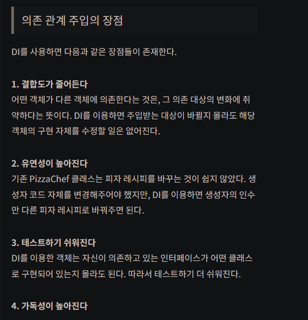

# 스프링 수업 23.10.05

## 자바 프로젝트의 단점 및 스프링의 탄생 배경

자바 프로젝트는 유지보수가 용이하지 않다.

유지보수가 용이하도록 개선하기 위해 스프링을 활용한다.

개발이 좀 더 간편해지면서 봄이 왔다는 의미로 스프링이라고 한다.

## 스프링의 목표

약한 결합(DI, 의존성 주입, 의존 관계 주입)을 만드는 것을 목표로 한다. 유지보수의 용이성 때문이다.

## 스프링의 객체 활용

스프링은 외부에서 객체를 생성하고 사용자는 그 객체를 가져다 쓰기만 하면 된다.

## 의존 관계 주입(DI, Dependency Injection)

의존 관계는 의존 대상 B가 변하면, 그것이 A에 영향을 미칠 때 A는 B와 의존 관계라고 한다. 즉, B가 변경되었을 때 그 영향이 A에 미치는 관계를 의미한다.

의존 관계 주입(DI)은 결합성이 높은 강한 결합으로 인해 발생하는 유지보수의 어려움을 해결하고, 인터페이스에 의존하는 문제를 해결할 수 있게 해준다.

DI는 의존 관계를 외부에서 결정(주입)해주는 것을 말한다. 스프링에서는 이런 DI를 담당하는 DI 컨테이너가 존재한다. 이 DI 컨테이너가 객체들 간의 의존 관계를 주입한다.

DI의 주요 방법은 생성자 주입 방법(Constructor-based Dependency Injection)과 수정자 주입 방법(Setter-based Dependency Injection)으로 2가지 방법이 있다.

생성자 주입 방법은 생성자를 이용해 의존 관계를 주입한 것이다. 생성자 주입은 생성자의 호출 시점에 1회 호출되는 것이 보장된다. 따라서 주입 받은 객체가 변하지 않거나, 반드시 객체의 주입이 필요한 경우에 사용할 수 있다.

수정자 주입 방법은 객체의 Setter를 이용해 의존 관계를 주입하는 것이다. 수정자 주입 방법은 생성자 주입과는 다르게 주입받는 객체가 변경될 가능성이 있는 경우에 사용한다.

이외에도 필드 주입, 일반 메소드 주입 등의 방법이 있지만, 스프링은 생성자 주입을 사용하기를 권장한다. 의존 관계 주입의 변경이 필요한 상황은 거의 없다. 하지만 수정자 주입이나 일반 메소드 주입을 이용하면 불필요하게 수정의 가능성을 열어두게 된다. 생성자 주입을 통해 변경의 가능성을 배제하고, 불변성을 보장하는 것이 좋다.

### 의존 관계 주입의 장점



## 프로젝트 생성 방법

### 1번째 방법

dynamic web project 생성 → 프로젝트에서 우클릭 → configure → convert to maven project → create new POM이라는 창이 뜨면 finish 클릭

이 과정을 거치면 pom.xml 파일이 생성된다. 이것은 자동 빌드 도구이다.

pom.xml 파일에서 <version>태그 밑에 다음과 같이 작성한다.

초기에 자동 생성된 pom.xml 파일의 내용

```xml
<project xmlns="http://maven.apache.org/POM/4.0.0" xmlns:xsi="http://www.w3.org/2001/XMLSchema-instance" xsi:schemaLocation="http://maven.apache.org/POM/4.0.0 https://maven.apache.org/xsd/maven-4.0.0.xsd">
  <modelVersion>4.0.0</modelVersion>
  <groupId>AWS1005_2</groupId>
  <artifactId>AWS1005_2</artifactId>
  <version>0.0.1-SNAPSHOT</version>
   
  <packaging>war</packaging>
  <build>
    <plugins>
      <plugin>
        <artifactId>maven-compiler-plugin</artifactId>
        <version>3.8.1</version>
        <configuration>
          <release>16</release>
        </configuration>
      </plugin>
      <plugin>
        <artifactId>maven-war-plugin</artifactId>
        <version>3.2.3</version>
      </plugin>
    </plugins>
  </build>
</project>
```

작성해야 할 내용을 추가하고 삭제할 것은 삭제한 뒤의 pom.xml 파일의 내용

```xml
<project xmlns="http://maven.apache.org/POM/4.0.0" xmlns:xsi="http://www.w3.org/2001/XMLSchema-instance" xsi:schemaLocation="http://maven.apache.org/POM/4.0.0 https://maven.apache.org/xsd/maven-4.0.0.xsd">
  <modelVersion>4.0.0</modelVersion>
  <groupId>AWS1005_2</groupId>
  <artifactId>AWS1005_2</artifactId>
  <version>0.0.1-SNAPSHOT</version>
  <properties>
  	<java-version>1.8</java-version>
  	<org.springframework-version>5.2.9.RELEASE</org.springframework-version>
  	<org.slf4j-version>1.7.29</org.slf4j-version>
  	<ch.qos.logback-version>1.2.3</ch.qos.logback-version>
  </properties>
  
  <dependencies>
  	<!-- https://mvnrepository.com/artifact/org.springframework/spring-context -->
	<dependency>
	    <groupId>org.springframework</groupId>
	    <artifactId>spring-context</artifactId>
	    <version>${org.springframework-version}</version>
	</dependency>
	
	<!-- https://mvnrepository.com/artifact/org.slf4j/slf4j-api -->
	<dependency>
    	<groupId>org.slf4j</groupId>
    	<artifactId>slf4j-api</artifactId>
    	<version>${org.slf4j-version}</version>
	</dependency>
	
	<dependency>

		<groupId>ch.qos.logback</groupId>
		
		<artifactId>logback-classic</artifactId>
		
		<version>${ch.qos.logback-version}</version>
		
		
		<exclusions>
		
		
			<exclusion>
			
				<groupId>org.slf4j</groupId>
				
				<artifactId>slf4j-api</artifactId>
			
			</exclusion>
		
		</exclusions>
		
		<scope>runtime</scope>
		
	</dependency>
  	
  </dependencies>
  
</project>
```

springframework-version에는 maven repository 사이트에서 springframework를 검색했을 때 나오는 spring core에서 사용할 버전을 골라서 작성해주면 된다. 이번에는 5.2.9.RELEASE 버전을 활용했다.

logging 작업을 하는 SLF4J를 활용하기 위해 maven repository 사이트에서 버전을 확인하고 1.7.29 버전을 활용하기 위해 위와 같이 작성했다.

logback은 로깅 프레임워크 중 하나로, SLF4J의 구현체이다.

maven repository 사이트에서 Spring Context를 검색하고 Spring Context에서 spring core에서 사용한 버전과 같은 버전을 찾는다. 이후 그 버전에서 Maven이라고 되어 있는 것의 xml 형태의 코드를 복사한다. 복사한 내용을 pom.xml 파일에 <dependencies> 태그를 작성하고 그 안에 붙여넣는다.

붙여넣기 한 내용은 version이 <properties>태그의 내용과 같기 때문에 EL언어를 활용해서 태그명으로 접근해서 작성한다.

SLF4J API Module도 같은 방식으로 Maven이라고 되어 있는 xml 형태의 코드를 복사해서 붙여넣는다.

logback classic Module도 같은 방식으로 붙여넣는다.

<exclusion>태그는 배제할 내용이라고 하는데 자세한 설명은 다음에 더 다룬다고 하였다.

이후 사용하지 않는 부분은 모두 지워도 된다.(packaging~/build)

하지만 나는 지웠을 때 프로젝트 파일에서 빨간색 X가 쳐지는 오류가 발생해서 지우지 않았다. 선생님 말로는 지우지 않아도 괜찮다고 한다.

프로젝트 파일을 우클릭해서 properties → Java Build Path → JRE System Library 더블 클릭 → 설정한 java 버전에 맞춰서 Execution enviroment를 JavaSE-1.8(jre)로 변경

이후 프로젝트 파일 우클릭 → maven → update project → Force Update of Snapshots/Releases 체크

이후 프로젝트 파일 우클릭 → properties → Project Facets → Java 버전을 1.8로 변경

이래도 안되면 JRE System Library를 우클릭 → properties → Execution environment를 JavaSE-1.8(jre)로 변경

모든 과정이 끝났을 때 Maven Dependencies에 9개의 파일이 들어가 있을 것이다.

### 2번째 방법

sts를 설치하는 방법이다. 차후에 배운다고 함.

## 스프링 프레임워크

전자정부 표준 프레임워크 포털(egovfram.go.kr)에서 다운로드 받아서 사용할 수 있다.

오늘날 가장 많이 사용하는 자바 기반 응용 프로그램 개발 프레임워크(전자정부 표준 프레임워크)이다.

### 스프링을 왜 사용하는가?

경량인 스프링 컨테이너에 객체를 스프링 빈(Bean)으로 등록하면 객체가 컨테이너에 들어가면서 스프링 빈으로 찾아서 사용할 수 있다. 이러면 약한 결합이 되어 결합도를 낮출 수 있다.

추상화, 상속, 다형성, 캡슐화라는 객체 지향 언어의 특징을 살린 프레임워크이기 때문이다.

자바 플랫폼을 위한 오픈 소스 애플리케이션 프레임워크이다.

소프트웨어 개발의 뼈대 역할을 한다.

자바 코드를 줄일 수 있다.(반복되는 작업을 줄인다.)

프로젝트 관리가 용이하다.(개발자들과 동시에 프로젝트 하기가 용이)

### IoC컨테이너란?(**Inversion of Control Container)**

객체를 생성해서 담을 수 있는 그릇이다.

객체를 생성하고 의존 관계를 연결해주는 것이다.

코드를 구현할 때 Annotation 또는 xml을 활용해서 bean으로 등록해야 한다.

Annotation은 @Bean으로 작성하고, xml은 <bean>으로 작성한다.

## IoC(Inversion of Control) : 제어 역전, 제어 반전

스프링 프레임워크의 특징 중 하나이다.

프로그램을 개발할 때, 프로그램 흐름, 객체에 대한 제어권을 원래는 개발자가 갖고 있었으나 스프링에서는 제어권을 프레임워크가 갖는다.

객체의 생성, 생명주기의 관리까지 모든 객체에 대한 제어권이 바뀌었다는 것을 의미한다.

컴포넌트 의존관계 설정(Component dependency resoulution), 설정(Configuration) 및 생명주기(LifeCycle)을 해결하기 위한 디자인 패턴(Design Pattern)이다.

객체를 생성하고 연결, 실행하는 것은 결합도가 높아지고 유지보수가 힘들어진다. 따라서 제어 흐름을 외부에서 관리하고 각각의 객체들은 본인의 로직에서만 실행하도록 하는 것이 IoC이다.

## IoC 컨테이너의 종류

스프링 프레임워크는 IoC 컨테이너를 이용해 Bean 객체들을 관리한다.

스프링 컨테이너를 만드는 방법은 Annotation 또는 xml을 활용한다.

### BeanFactory

스프링 컨테이너의 최상위 인터페이스이다.

스프링 빈을 관리하고 조회한다.(빈을 등록하면 개발자가 관리하는 것이 아니라 컨테이너 내부에서 관리한다.)

### ApplicationContext

BeanFactory를 상속받아서 제공한다.

스프링 빈을 관리하고 조회하는 것 외에 부가적인 기능도 제공한다.