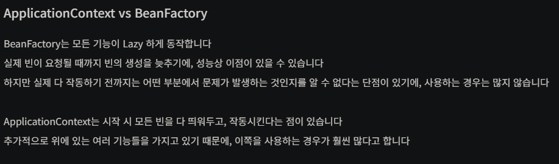

# 스프링 수업 23.10.06

## IoC 컨테이너에서 객체를 가져와서 사용하기

### ApplicationContext를 사용하는 방법

beans.xml 파일에서 beans 패키지에 있는 Test 클래스를 bean으로 등록하기 위해 다음과 같이 작성한다.

```xml
<?xml version="1.0" encoding="UTF-8"?>
<beans
	xsi:schemaLocation="http://www.springframework.org/schema/beans http://www.springframework.org/schema/beans/spring-beans.xsd"
	xmlns:xsi="http://www.w3.org/2001/XMLSchema-instance"
	xmlns="http://www.springframework.org/schema/beans">
	
	<bean class="beans.Test" id="test1"/>
	
</beans>
```

<bean class=”beans.Test” id=”test1”/>에서 class 속성은 패키지.클래스 형태로 작성하고, id는 객체명이라고 생각하면 된다.

Test test1 = new Test(); 와 같은 표현이다.

beans.xml 파일에 등록한 bean을 사용하기 위해 ApplicationContext 중에서 가장 많이 쓰이는 ClassPathXmlApplicationContext를 사용해서 beans.xml을 읽어와서 그 객체를 통해 Test 클래스의 test1 객체를 getBean으로 가져오고 Test 클래스의 객체를 출력한다. 이 과정은 다음과 같이 작성한다.

```java
package main;

import org.springframework.context.support.ClassPathXmlApplicationContext;

import beans.Test;

public class AA {

	public static void main(String[] args) {
		
		ClassPathXmlApplicationContext ct =
				new ClassPathXmlApplicationContext("config/beans.xml");
		
		Test t = ct.getBean("test1", Test.class);
		System.out.println(t);

	}

}
```

출력 결과는 다음과 같다

Test 생성자이다.
beans.Test@31e5415e

Test 클래스가 기본 생성자 호출 시 “Test 생성자이다.”를 출력하도록 되어 있기 때문에 출력된 것이고, Test 클래스 타입인 t를 출력하면 객체의 주소가 출력되는 것이다. 이유는 xml 파일에서 등록한 bean의 id과 동일한 이름으로 getBean() 메소드를 호출했기 때문에 객체의 주소값을 받아오기 때문이다.

### BeanFactory를 사용하는 방법

beans.xml 파일은 ApplicationContext 때와 동일하게 작성한다.

BeanFactyory는 ClassPathResource를 사용해서 beans.xml 파일을 읽어와서 그 객체를 매개변수로 사용해서 XmlBeanFactory의 객체를 생성한다.

XmlBeanFactory의 객체를 통해 getBean()메소드를 호출하여 Test 클래스의 객체를 가져오고 객체를 출력한다.

```java
package main;

import org.springframework.beans.factory.xml.XmlBeanFactory;
import org.springframework.context.support.ClassPathXmlApplicationContext;
import org.springframework.core.io.ClassPathResource;

import beans.Test;

public class AA {

	public static void main(String[] args) {
		
		ClassPathResource r = new ClassPathResource("config/beans.xml");
		XmlBeanFactory fac = new XmlBeanFactory(r);
		
		
		Test tt = fac.getBean("test1", Test.class);
		System.out.println(tt);
		
		Test tt2 = fac.getBean("test2", Test.class);
		System.out.println(tt2);

	}

}
```

이때 출력 결과는 같은 bean 등록할 때 id 이름을 같게 맞췄더라도 ApplicationContext로 로딩한 객체와 주소값이 다르게 나온다.

이러한 이유는 사용한 방법이 다르면 같은 id 이름이더라도 객체가 달라지기 때문이다. 만약 방법을 같게 한다면 id 이름이 같으면 객체가 같은 주소를 갖는 같은 객체이다.

이러한 것을 실험해본 코드는 다음과 같다.

```java
package main;

import org.springframework.beans.factory.xml.XmlBeanFactory;
import org.springframework.context.support.ClassPathXmlApplicationContext;
import org.springframework.core.io.ClassPathResource;

import beans.Test;

public class AA {

	public static void main(String[] args) {
		
		ClassPathXmlApplicationContext ct =
				new ClassPathXmlApplicationContext("config/beans.xml");
		
		ClassPathXmlApplicationContext ct2 =
				new ClassPathXmlApplicationContext("config/beans.xml");
		
		ClassPathResource r = new ClassPathResource("config/beans.xml");
		XmlBeanFactory fac = new XmlBeanFactory(r);
		
		
		Test tt = fac.getBean("test1", Test.class);
		System.out.println(tt.a);
		
		Test tt2 = fac.getBean("test2", Test.class);
		System.out.println(tt2.a);
		System.out.println(tt2);
		/*
		Test t = ct.getBean("test1", Test.class);
		System.out.println(t);
		*/
		
		
		Test t2 = ct.getBean("test2", Test.class);
		
		t2.a +=1;
		System.out.println(t2.a);
		System.out.println(t2);
		
		
		Test t3 = ct.getBean("test2", Test.class);
		System.out.println(t3.a);
		System.out.println(t3);
		
		/*
		
		Test t4 = ct2.getBean("test2", Test.class);
		System.out.println(t4.a);
		
		*/

	}

}
```

### ApplicationContext와 BeanFactory의 대표적인 차이점



BeanFactory는 lazy-init의 기본값이 true인 것처럼 동작하고, ApplicationContext는 lazy-init의 기본값이 false로 동작한다.

## IoC 컨테이너의 getBean()

getBean()은 메소드를 호출할 때 객체 생성이 된다.

같은 id인 객체를 가지고 오면 이미 생성된 객체의 주소값을 받아와서 사용할 수 있다. 즉, 싱글톤 방식처럼 작동한다.

BeanFactory와 ApplicationContext로 2가지 방식을 모두 사용하면 다른 방식일 경우에는 같은 id이더라도 다른 객체가 되어 주소값이 다르다.

같은 방식을 사용할 경우에는 같은 id이면 객체의 주소값이 같다. 즉, 이 경우에는 이미 생성된 객체는 주소값을 받아올 뿐 새로 생성되지는 않는다.

```java
package main;

import org.springframework.context.support.ClassPathXmlApplicationContext;

import beans.Test;

public class AA {

	public static void main(String[] args) {
		
		ClassPathXmlApplicationContext ct =
				new ClassPathXmlApplicationContext("config/beans.xml");
		
		/*
		Test t = ct.getBean("t1", Test.class);
		System.out.println(t);
		
		Test t2 = ct.getBean("t1", Test.class);
		System.out.println(t2);
		*/
		

	}

}
```

위 코드처럼 getBean 메소드 부분을 주석 처리하고 코드를 실행하면 객체는 xml을 로딩할 때 생성되므로 Test 클래스의 객체가 생성되어 기본 생성자의 실행문이 실행되는 것을 확인할 수 있다.

## xml 로딩 시 객체가 생성되지 않게 하면서 getBean 메소드를 호출할 때 객체 생성하기

lazy-init을 true로 설정하면 된다.

lazy-init을 안적으면 기본값은 false이다.

lazy-init이 true이면 xml 로딩할 때 객체 생성이 안되고 getBean()을 호출할 때 객체 생성 된다.

다음과 같이 작성한다.

```xml
<?xml version="1.0" encoding="UTF-8"?>
<beans
	xsi:schemaLocation="http://www.springframework.org/schema/beans http://www.springframework.org/schema/beans/spring-beans.xsd"
	xmlns:xsi="http://www.w3.org/2001/XMLSchema-instance"
	xmlns="http://www.springframework.org/schema/beans">
	
	<!-- 객체는 xml 로딩할 때 생성된다. -->
	<!-- getBean을 이용해서 객체의 주소값을 받아올 수 있다. -->
	<bean class="beans.Test" id="t1"/>
	
	<!-- lazy-init을 안적으면 기본값은 false이다. -->
	<!-- lazy-init이 true이면 xml 로딩할 때 객체 생성이 안된다. -->
	<!-- getBean()을 호출할 때 객체 생성 된다. -->
	<bean class="beans.Test" id="t2" lazy-init="true"/>
	
</beans>
```

```java
package main;

import org.springframework.context.support.ClassPathXmlApplicationContext;

import beans.Test;

public class AA {

	public static void main(String[] args) {
		
		ClassPathXmlApplicationContext ct =
				new ClassPathXmlApplicationContext("config/beans.xml");
		
		/*
		Test t = ct.getBean("t1", Test.class);
		System.out.println(t);
		
		Test t2 = ct.getBean("t2", Test.class);
		System.out.println(t2);
		*/
		

	}

}
```

위 코드처럼 getBean 부분을 주석으로 처리하고 실행하면 t1에서는 xml을 로딩할 때 객체를 생성하고 t2에서는 생성하지 않으므로 Test 클래스의 생성자의 실행문이 1번만 실행되는 것을 확인할 수 있다.

## xml 로딩할 때 객체 생성되지 않게 하면서 getBean 메소드를 호출할 때마다 새로운 객체 생성하기

scope를 설정하면 된다. 보통은 scope 속성의 값을 prototype으로 한다.

```xml
<?xml version="1.0" encoding="UTF-8"?>
<beans
	xsi:schemaLocation="http://www.springframework.org/schema/beans http://www.springframework.org/schema/beans/spring-beans.xsd"
	xmlns:xsi="http://www.w3.org/2001/XMLSchema-instance"
	xmlns="http://www.springframework.org/schema/beans">
	
	<!-- 객체는 xml 로딩할 때 생성된다. -->
	<!-- getBean을 이용해서 객체의 주소값을 받아올 수 있다. -->
	<bean class="beans.Test" id="t1"/>
	
	<!-- lazy-init을 안적으면 기본값은 false이다. -->
	<!-- lazy-init이 true이면 xml 로딩할 때 객체 생성이 안된다. -->
	<!-- getBean()을 호출할 때 객체 생성 된다. -->
	<bean class="beans.Test" id="t2" lazy-init="true"/>
	
	<!-- xml 로딩할 때 객체 생성이 안된다. -->
	<!-- getBean()을 호출할 때마다 새로운 객체를 생성한다. -->
	<bean class="beans.Test" id="t3" scope="prototype"/>
	
</beans>
```

다음과 같이 같은 ApplicationContext의 객체로 호출한 getBean 메소드로 scope를 설정한 객체를 호출하면 객체의 주소값이 다르고, xml을 호출할 때 객체 생성이 되지 않고 getBean 메소드를 호출할 때 객체 생성이 되는 것을 확인할 수 있다.

```java
package main;

import org.springframework.context.support.ClassPathXmlApplicationContext;

import beans.Test;

public class AA {

	public static void main(String[] args) {
		
		ClassPathXmlApplicationContext ct =
				new ClassPathXmlApplicationContext("config/beans.xml");
		
		/*
		Test t = ct.getBean("t1", Test.class);
		System.out.println(t);
		
		Test t2 = ct.getBean("t2", Test.class);
		System.out.println(t2);
		*/
		Test t3 = ct.getBean("t3", Test.class);
		System.out.println(t3);
		
		Test t4 = ct.getBean("t3", Test.class);
		System.out.println(t4);
		

	}

}
```


### 만약 scope 속성의 값을 singleton으로 설정했다면?

beans.xml을 다음과 같이 작성한다.

```xml
<?xml version="1.0" encoding="UTF-8"?>
<beans
	xsi:schemaLocation="http://www.springframework.org/schema/beans http://www.springframework.org/schema/beans/spring-beans.xsd"
	xmlns:xsi="http://www.w3.org/2001/XMLSchema-instance"
	xmlns="http://www.springframework.org/schema/beans">
	
	<!-- 객체는 xml 로딩할 때 생성된다. -->
	<!-- getBean을 이용해서 객체의 주소값을 받아올 수 있다. -->
	<bean class="beans.Test" id="t1"/>
	
	<!-- lazy-init을 안적으면 기본값은 false이다. -->
	<!-- lazy-init이 true이면 xml 로딩할 때 객체 생성이 안된다. -->
	<!-- getBean()을 호출할 때 객체 생성 된다. -->
	<bean class="beans.Test" id="t2" lazy-init="true"/>
	
	<!-- xml 로딩할 때 객체 생성이 안된다. -->
	<!-- getBean()을 호출할 때마다 새로운 객체를 생성한다. -->
	<bean class="beans.Test" id="t3" scope="prototype"/>
	
	<bean class="beans.Test" id="t4" scope="singleton"/>
	
	
</beans>
```

메인함수에서 getBean을 사용해서 scope가 prototype인 객체와 singleton인 객체의 결과값을 비교한다.

```java
package main;

import org.springframework.context.support.ClassPathXmlApplicationContext;

import beans.Test;

public class AA {

	public static void main(String[] args) {
		
		ClassPathXmlApplicationContext ct =
				new ClassPathXmlApplicationContext("config/beans.xml");
		
		/*
		Test t = ct.getBean("t1", Test.class);
		System.out.println(t);
		
		Test t2 = ct.getBean("t2", Test.class);
		System.out.println(t2);
		*/
		
		Test t3 = ct.getBean("t3", Test.class);
		System.out.println("t3 : " + t3);
		
		Test t4 = ct.getBean("t3", Test.class);
		System.out.println("t4 : " + t4);
		
		Test t5 = ct.getBean("t4", Test.class);
		System.out.println("t5 : " + t5);
		
		Test t6 = ct.getBean("t4", Test.class);
		System.out.println("t6 : " + t6);
				

	}

}
```


결과를 통해 알 수 있는 것은 singleton으로 설정한 객체는 prototype과는 다르게 새로운 객체가 생성되지 않는다는 것과 xml을 로딩할 때 객체 생성이 된다는 것이다.

## init-method와 destroy-method

### bean 객체의 생명주기

객체를 IoC 컨테이너에 넣을 때 bean 객체는 생명주기가 있다.

생명주기는 언제 bean 객체가 생성되고 소멸되는지를 나타내는 것이다.

xml을 로딩할 때 객체는 생성되고, IoC 컨테이너가 닫힐 때(종료될 때) 객체는 소멸한다.

IoC 컨테이너를 닫을 때는 ClassPathXmlApplicationContext 클래스의 객체를 통해 close() 메소드를 사용한다.

### init-method

bean 객체를 등록할 때 init-method 속성을 설정할 수 있다.

init-method의 속성값으로 설정한 메소드는 객체가 생성될 때(생성자 호출 이후) 자동으로 호출된다.

### destroy-method

bean 객체를 등록할 때 destroy-method 속성을 설정할 수 있다.

destroy-method의 속성값으로 설정한 메소드는 bean 객체가 소멸될 때 자동으로 호출된다.

### init-method와 destoy-method 예제

beans.xml 파일

```xml
<?xml version="1.0" encoding="UTF-8"?>
<beans
	xsi:schemaLocation="http://www.springframework.org/schema/beans http://www.springframework.org/schema/beans/spring-beans.xsd"
	xmlns:xsi="http://www.w3.org/2001/XMLSchema-instance"
	xmlns="http://www.springframework.org/schema/beans">
	
	<bean init-method="Test_init" destroy-method="Test_destroy" id="s1"
	class="beans.Test"/>
	
	<bean id="s2" class="beans.Test2" lazy-init="true"/>
	
	<bean id="s3" class="beans.Test3" lazy-init="true"
	init-method="Test3_init" destroy-method="Test3_destroy"/>
	
</beans>
```

Test.java 파일

```java
package beans;

public class Test {
	
	public Test(){
		System.out.println("Test 생성자이다.");
	}
	
	public void Test_init() {
		System.out.println("Test_init");
	}
	
	public void Test_destroy() {
		System.out.println("Test_destroy");
	}
}
```

Test2.java 파일

```java
package beans;

public class Test2 {
	
	public Test2(){
		System.out.println("Test2 생성자이다.");
	}
	
	public void Test2_init() {
		System.out.println("Test2_init");
	}
	
	public void Test2_destroy() {
		System.out.println("Test2_destroy");
	}

}
```

Test3.java 파일

```java
package beans;

public class Test3 {
	
	public Test3(){
		System.out.println("Test3 생성자이다.");
	}
	
	public void Test3_init() {
		System.out.println("Test3_init");
	}
	
	public void Test3_destroy() {
		System.out.println("Test3_destroy");
	}

}
```

main함수가 있는 AA.java 파일

```java
package main;

import org.springframework.context.support.ClassPathXmlApplicationContext;

import beans.Test;
import beans.Test2;
import beans.Test3;

public class AA {

	public static void main(String[] args) {
		
		ClassPathXmlApplicationContext ct =
				new ClassPathXmlApplicationContext("config/beans.xml");
		
		Test t = ct.getBean("s1", Test.class);
		System.out.println(t);
		
		System.out.println("============================");
		
		Test2 t2 = ct.getBean("s2", Test2.class);
		System.out.println(t2);
		
		System.out.println("============================");
		
		Test3 t3 = ct.getBean("s3", Test3.class);
		System.out.println(t3);
		
		ct.close();

	}

}
```

실행해보면 결과는 다음과 같이 나온다.


결과를 통해 알 수 있는 것은 lazy-init=”true”로 설정함에 따라 getBean 메소드를 호출할 때 객체 생성이 되도록 만들어졌다는 것과 IoC 컨테이너가 닫힐 때 객체가 소멸하면서 destroy-method를 호출하는 순서는 가장 마지막에 생성한 객체부터 시작해서 가장 처음에 생성한 객체에서 끝난다는 것이다.

### 만약 예제에서 Test3 클래스의 bean 객체의 lazy-init을 false로 바꾸면?

이렇게 바꾸면 xml이 로딩될 때 객체가 생성되므로 기본 생성자의 실행문이 실행되고 객체가 생성되면서 init-method로 설정한 메소드도 실행된다. 객체의 주소값을 출력하는 것과 destroy-method를 호출하는 것은 나중에 진행된다.

다음과 같은 결과를 얻을 수 있다.


## DI(의존 관계 주입, 의존성 주입, Dependency Injection)

Bean 객체를 생성할 때 Bean 객체가 관리할 값이나 객체를 주입하는 것을 의미한다.

의존 관계가 내부가 아닌 외부에서 설정을 통해 정의되는 방식으로 모듈간의 결합도를 낮출 수 있다.

DI 방식은 4가지가 있다. 생성자를 통한 주입, setter를 사용한 주입, 자동 주입(@AutoWired), 컬렉션 주입이 있다. 보통 자동 주입을 가장 많이 볼 수 있으며, 생성자를 통한 주입도 많이 사용한다.

### 생성자를 통한 주입

beans.xml 파일에서 bean 객체 생성할 때 <bean>태그 사이에 <constructor-arg type=”타입” value=”값”/>을 넣어준다.

다음과 같이 작성한다.

```xml
<?xml version="1.0" encoding="UTF-8"?>
<beans
	xsi:schemaLocation="http://www.springframework.org/schema/beans http://www.springframework.org/schema/beans/spring-beans.xsd"
	xmlns:xsi="http://www.w3.org/2001/XMLSchema-instance"
	xmlns="http://www.springframework.org/schema/beans">
	
	<bean class="beans.Test" id="t1" lazy-init="true"/>
	<bean class="beans.Test" id="t2" lazy-init="true">
		<constructor-arg type="int" value="30"/>
	</bean>
	
	<bean class="beans.Test" id="t3" lazy-init="true">
		<constructor-arg type="double" value="30.5"/>
	</bean>
	
	<bean class="beans.Test" id="t4" lazy-init="true">
		<constructor-arg type="String" value="bean!! t4!!"/>
	</bean>
	
	<bean class="beans.Test" id="t5" lazy-init="true">
		<constructor-arg type="String" index="2" value="spring"/>
		<constructor-arg type="int" index="0" value="30"/>
		<constructor-arg type="double" index="1" value="30.5"/>
	</bean>
	
	<bean id="t6" class="beans.Test2" lazy-init="true">
		<constructor-arg><bean class="beans.Sp"/></constructor-arg>
		<constructor-arg><bean class="beans.Sp"/></constructor-arg>
	</bean>
	
	<bean id="dd" class="beans.Sp" scope="prototype"/>
	<bean lazy-init="true" id="t7" class="beans.Test2">
		<constructor-arg ref="dd"/>
		<constructor-arg ref="dd"/>
	</bean>
	
</beans>
```

Test.java 파일은 다음과 같이 생성자가 호출되면 실행문에서 필드값을 조작하도록 만들고, 필드 값을 출력하는 pr 메소드를 선언한다.

```java
package beans;

public class Test {
	
	private int s1;
	private double s2;
	private String s3;
	
	public Test() {
		System.out.println("Test");
		this.s1=0;
		this.s2=0.0;
		this.s3=null;
	}
	
	public Test(int s1) {
		System.out.println("int");
		this.s1=s1;
		this.s2=0.0;
		this.s3=null;
	}
	
	public Test(double s2) {
		System.out.println("double");
		this.s1=0;
		this.s2=s2;
		this.s3=null;
	}
	
	public Test(String s3) {
		System.out.println("String");
		this.s1=0;
		this.s2=0.0;
		this.s3=s3;
	}
	
	public Test(int s1, double s2, String s3) {
		System.out.println("int, double, String 모두 사용");
		this.s1=s1;
		this.s2=s2;
		this.s3=s3;
	}
	
	public void pr() {
		System.out.println(s1);
		System.out.println(s2);
		System.out.println(s3);
	}
	
	
}
```

Test2.java 파일은 다음과 같이 작성한다.

```java
package beans;

public class Test2 {
	
	private Sp sp1;
	private Sp sp2;
	
	public Test2() {
		super();
	}
	
	public Test2(Sp sp1, Sp sp2) {
		this.sp1=sp1;
		this.sp2=sp2;
	}
	
	public void pr() {
		System.out.println(sp1);
		System.out.println(sp2);
	}
}
```

Sp.java 파일은 다음과 같이 작성한다.

```java
package beans;

public class Sp {

}
```

main 함수가 있는 AA.java 파일에서 동일한 방법으로 xml을 로딩해서 getBean으로 constructor가 포함된 bean 객체를 불러오면 객체가 생성될 때 설정한 생성자가 호출되며 객체가 생성되고, 생성자에 따라 설정한 필드 값이 반영된다.

constructor의 type과 value가 여러개이면 <constructor-arg> 태그를 여러 개 생성해서 각각에 type과 value를 설정해야 하고, 이때 필드를 선언한 순서에 따라 index를 지정해주어야 한다. 만약 필드 순서에 맞게 작성했다면 index를 지정하지 않아도 된다.

### setter를 사용한 주입

Test.java 파일에서 클래스의 필드와 함께 getter, setter 메소드를 선언한다.

```java
package beans;

public class Test {
	
	private int s1;
	private double s2;
	private boolean s3;
	private String s4;
	private Sp s5;
	private Sp s6;
	
	public int getS1() {
		return s1;
	}
	public void setS1(int s1) {
		this.s1 = s1;
	}
	public double getS2() {
		return s2;
	}
	public void setS2(double s2) {
		this.s2 = s2;
	}
	public boolean isS3() {
		return s3;
	}
	public void setS3(boolean s3) {
		this.s3 = s3;
	}
	public String getS4() {
		return s4;
	}
	public void setS4(String s4) {
		this.s4 = s4;
	}
	public Sp getS5() {
		return s5;
	}
	public void setS5(Sp s5) {
		this.s5 = s5;
	}
	public Sp getS6() {
		return s6;
	}
	public void setS6(Sp s6) {
		this.s6 = s6;
	}
	
	
	
}
```

Sp.java 파일은 앞에서 한 것과 마찬가지로 클래스만 만들고 비워놓는다.

```java
package beans;

public class Sp {

}
```

beans.xml 파일에서는 <bean>태그 내부에 <property> 태그를 사용해서 name 속성의 값으로는 bean 객체에 해당하는 클래스의 필드 이름을 넣고, value 속성의 값으로는 필드의 값을 넣는다.

```xml
<?xml version="1.0" encoding="UTF-8"?>
<beans
	xsi:schemaLocation="http://www.springframework.org/schema/beans http://www.springframework.org/schema/beans/spring-beans.xsd"
	xmlns:xsi="http://www.w3.org/2001/XMLSchema-instance"
	xmlns="http://www.springframework.org/schema/beans">
	
	<bean id="t1" class="beans.Test">
		<property name="s1" value="4"/>
		<property name="s2" value="44.4"/>
		<property name="s3" value="true"/>
		<property name="s4" value="hi"/>
		<property name="s5">
			<bean class="beans.Sp"/>
		</property>
		
		<property name="s6" ref="dd"/>
	</bean>
	<bean id="dd" class="beans.Sp"/>
	
</beans>
```

main 함수가 있는 AA.java에서 실행했을 때 객체의 필드값을 출력하려면 다음과 같이 getter 메소드를 통해 필드의 값을 받아와서 출력한다.

```xml
package main;

import org.springframework.context.support.ClassPathXmlApplicationContext;

import beans.Test;

public class AA {

	public static void main(String[] args) {
		
		ClassPathXmlApplicationContext ct =
				new ClassPathXmlApplicationContext("config/beans.xml");
		
		Test t1 = ct.getBean("t1", Test.class);
		System.out.println(t1.getS1());
		System.out.println(t1.getS2());
		System.out.println(t1.isS3());
		System.out.println(t1.getS4());
		System.out.println(t1.getS5());
		System.out.println(t1.getS6());
		
		ct.close();

	}

}
```