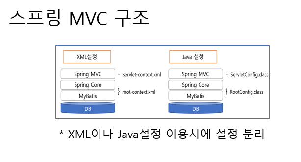

# 스프링 수업 23.10.13

## AOP(Aspect Oriented Programming)

관점 지향 프로그래밍이다.

관심사 메소드를 두면서 코드를 어디에 넣을 것인지를 설정할 수 있다. 즉, 공통된 메소드를 선언하고 그 메소드를 어느 시점에 사용할 것인지를 설정한다.

관점 지향 프로그래밍은 OOP로 독립적으로 분리하기 어려운 부가 기능을 모듈화하는 방식이다.

Spring의 핵심 개념 중 하나인 DI가 애플리케이션 모듈들 간의 결합도를 낮춰준다면, AOP는 애플리케이션 전체에 걸쳐 사용되는 기능을 재사용하도록 지원하는 것이다.

OOP에선 공통된 기능을 재사용하는 방법으로 상속이나 위임을 사용한다. 하지만 전체 어플리케이션에서 여기저기에서 사용되는 부가기능들을 상속이나 위임으로 처리하기에는 깔끔하게 모듈화가 어렵다.

Aspect : 흩어진 관심사를 모듈화 한 것.

Target : Aspect를 적용하는 곳. 클래스, 메서드

Advice : 실질적으로 어떤 일을 해야 할 지에 대한 것, 실질적인 부가기능을 담은 구현체

Join Point : Advice가 적용될 위치 혹은 끼어들 수 있는 시점. 메서드 진입 시점, 생성자 호줄 시점, 필드에서 꺼내올 시점 등 끼어들 시점을 의미. 참고로 스프링에서 Join Point는 언제나 메서드 실행 시점을 의미

before : 비지니스 메소드 실행 전에 Advice 메소드 실행

after-returning : 비지니스 메소드가 성공적으로 리턴되면 Advice 메소드 동작. 즉 비지니스 메소드가 성공적으로 실행되었을 경우에만 Advice 메소드 동작

after-throwing: 비지니스 메소드 실행중 예외가 발생할 경우 Advice 메소드 실행. 즉 비지니스 메소드가 실행에 실패했을 경우에만 Advice 메소드 실행

after : 비지니스 메소드의 성공 실패와 상관없이 비지니스 메소드 실행 후 무조건 Advice 메소드 동작

around : 비지니스 메소드 실행 전과 실행 후 Advice 메소드 동작하는 형태

## Maven Repository에서 AOP 설정하고 시점 확인하는 예제

Maven Repository에서 aspectj를 검색해서 많이 쓰는 버전을 찾고 maven 코드를 복사해서 pom.xml 파일에 <dependencies>태그 사이에 붙여넣는다. 이후 <properties>태그 사이에 org.aspectj-version>태그를 열어서 버전을 입력한다.

그리고 beans.xml 파일에는 <beans>태그 사이에xmlns:aop="http://www.springframework.org/schema/aop"를 추가한다.

### XML을 이용할 경우

pom.xml 파일

```xml
<project xmlns="http://maven.apache.org/POM/4.0.0" xmlns:xsi="http://www.w3.org/2001/XMLSchema-instance" xsi:schemaLocation="http://maven.apache.org/POM/4.0.0 https://maven.apache.org/xsd/maven-4.0.0.xsd">
  <modelVersion>4.0.0</modelVersion>
  <groupId>AWS1005_2</groupId>
  <artifactId>AWS1005_2</artifactId>
  <version>0.0.1-SNAPSHOT</version>
  <properties>
  	<java-version>1.8</java-version>
  	<org.springframework-version>5.2.9.RELEASE</org.springframework-version>
  	<org.slf4j-version>1.7.29</org.slf4j-version>
  	<ch.qos.logback-version>1.2.3</ch.qos.logback-version>
  	<org.aspectj-version>1.9.6</org.aspectj-version>
  </properties>
  
  <dependencies>
  	<!-- https://mvnrepository.com/artifact/org.springframework/spring-context -->
	<dependency>
	    <groupId>org.springframework</groupId>
	    <artifactId>spring-context</artifactId>
	    <version>${org.springframework-version}</version>
	</dependency>
	
	<!-- https://mvnrepository.com/artifact/org.slf4j/slf4j-api -->
	<dependency>
    	<groupId>org.slf4j</groupId>
    	<artifactId>slf4j-api</artifactId>
    	<version>${org.slf4j-version}</version>
	</dependency>
	
	<!-- https://mvnrepository.com/artifact/org.aspectj/aspectjweaver -->
	<dependency>
    	<groupId>org.aspectj</groupId>
    	<artifactId>aspectjweaver</artifactId>
    	<version>${org.aspectj-version}</version>
	</dependency>
	
	
	<dependency>

		<groupId>ch.qos.logback</groupId>
		
		<artifactId>logback-classic</artifactId>
		
		<version>${ch.qos.logback-version}</version>
		
		
		<exclusions>
		
		
			<exclusion>
			
				<groupId>org.slf4j</groupId>
				
				<artifactId>slf4j-api</artifactId>
			
			</exclusion>
		
		</exclusions>
		
		<scope>runtime</scope>
		
	</dependency>
  	
  </dependencies>
  
  
  
  <packaging>war</packaging>
  <build>
    <plugins>
      <plugin>
        <artifactId>maven-compiler-plugin</artifactId>
        <version>3.8.1</version>
        <configuration>
          <release>16</release>
        </configuration>
      </plugin>
      <plugin>
        <artifactId>maven-war-plugin</artifactId>
        <version>3.2.3</version>
      </plugin>
    </plugins>
  </build>
</project>
```

beans.xml 파일

```xml
<?xml version="1.0" encoding="UTF-8"?>

<beans
	xsi:schemaLocation="http://www.springframework.org/schema/beans http://www.springframework.org/schema/beans/spring-beans.xsd http://www.springframework.org/schema/context http://www.springframework.org/schema/context/spring-context.xsd http://www.springframework.org/schema/aop http://www.springframework.org/schema/aop/spring-aop.xsd"
	xmlns:aop="http://www.springframework.org/schema/aop"
	xmlns:context="http://www.springframework.org/schema/context"
	xmlns:xsi="http://www.w3.org/2001/XMLSchema-instance"
	xmlns="http://www.springframework.org/schema/beans">

	<bean id="a1" class="advisor.Ad"/>
	<bean id="advisor1" class="beans.Test"/>
	
	<aop:config>
		<aop:aspect ref="a1">
			<aop:pointcut expression="execution(* m1())" id="p1"/>
			<aop:before method="beforeMethod" pointcut-ref="p1"/>
			<aop:after method="afterMethod" pointcut-ref="p1"/>
			<aop:around method="aroundMethod" pointcut-ref="p1"/>
			<aop:after-returning method="afterReturningMethod" pointcut-ref="p1"/>
			<aop:after-throwing method="afterThrowingMethod" pointcut-ref="p1" throwing="e"/>
			
		</aop:aspect>
	</aop:config>
</beans>
```

Test.java파일

```java
package beans;

public class Test {
	
	// 관심사 함수(aspect method)
	public int m1() {
		System.out.println("메소드");
		return 300;
	}

	
}
```

Ad.java파일

```java
package advisor;

import org.aspectj.lang.ProceedingJoinPoint;

public class Ad {
	
	public void beforeMethod() {
		System.out.println("before");
	}
	
	public void afterMethod() {
		System.out.println("after");
	}
	
	public Object aroundMethod(ProceedingJoinPoint p) throws Throwable{
		System.out.println("around1");
		
		Object obj = p.proceed();
		
		System.out.println("around2");
		return obj;
	}
	
	public void afterReturningMethod() {
		System.out.println("afterReturn");
	}
	
	public void afterThrowingMethod(Throwable e) {
		System.out.println("throw");
		System.out.println(e);
	}
}
```

AA.java파일

```java
package main;

import org.springframework.context.support.ClassPathXmlApplicationContext;

import beans.Test;

import config.BeanConfig;

public class AA {

	public static void main(String[] args) {
		
		ClassPathXmlApplicationContext ct =
				new ClassPathXmlApplicationContext("config/beans.xml");
			
			
		Test t = ct.getBean("advisor1", Test.class);
		int n = t.m1();
		System.out.println(n);
			
		
	}

}
```

### 어노테이션을 이용할 경우

Ad.java파일

```java
package advisor;

import org.aspectj.lang.ProceedingJoinPoint;
import org.aspectj.lang.annotation.After;
import org.aspectj.lang.annotation.AfterReturning;
import org.aspectj.lang.annotation.AfterThrowing;
import org.aspectj.lang.annotation.Around;
import org.aspectj.lang.annotation.Aspect;
import org.aspectj.lang.annotation.Before;
import org.springframework.stereotype.Component;

@Aspect
@Component
public class Ad {
	
	@Before("execution(* m1())")
	public void beforeMethod() {
		System.out.println("before");
	}
	
	@After("execution(* m1())")
	public void afterMethod() {
		System.out.println("after");
	}
	
	@Around("execution(* m1())")
	public Object aroundMethod(ProceedingJoinPoint p) throws Throwable{
		System.out.println("around1");
		
		Object obj = p.proceed();
		
		System.out.println("around2");
		return obj;
	}
	
	@AfterReturning("execution(* m1())")
	public void afterReturningMethod() {
		System.out.println("afterReturn");
	}
	
	@AfterThrowing("execution(* m1())")
	public void afterThrowingMethod() {
		System.out.println("throw");
	}
}
```

Test.java파일

```java
package beans;

import org.springframework.stereotype.Component;

@Component
public class Test {
	
	// 관심사 함수(aspect method)
	public void m1() throws Exception {
		System.out.println("메소드");
		

	}

	
}
```

BeanConfig.java파일

```java
package config;

import org.springframework.context.annotation.ComponentScan;
import org.springframework.context.annotation.Configuration;
import org.springframework.context.annotation.EnableAspectJAutoProxy;

@Configuration
@ComponentScan(basePackages = {"advisor", "beans"})
@EnableAspectJAutoProxy
public class BeanConfig {
	
	
}
```

AA.java파일

```java
package main;

import org.springframework.context.annotation.AnnotationConfigApplicationContext;
import org.springframework.context.support.ClassPathXmlApplicationContext;

import beans.Test;

import config.BeanConfig;

public class AA {

	public static void main(String[] args) throws Exception{
		
			//ClassPathXmlApplicationContext ct =
				//	new ClassPathXmlApplicationContext("config/beans.xml");
				
			AnnotationConfigApplicationContext ctx=
					new AnnotationConfigApplicationContext(BeanConfig.class);
				
			Test t=ctx.getBean(Test.class);
				
			t.m1();
			
	}

}
```

## Spring JDBC(스프링과 DB 연동)

Spring JDBC는 스프링 프레임워크에서 JDBC를 쓰기 위한 JdbcTemplate 클래스를 제공한다. 이를 활용하여 sql문을 좀 더 쉽게 구현할 수 있다.

sysDB로 table 생성

```sql
CREATE TABLE SPR(
D1 NUMBER NOT NULL,
D2 VARCHAR2(20) NOT NULL);
```

pom.xml파일

```xml
<?xml version="1.0"?>
<project
   xsi:schemaLocation="http://maven.apache.org/POM/4.0.0 http://maven.apache.org/xsd/maven-4.0.0.xsd"
   xmlns:xsi="http://www.w3.org/2001/XMLSchema-instance"
   xmlns="http://maven.apache.org/POM/4.0.0">
   <modelVersion>4.0.0</modelVersion>
   <groupId>co.jw.ezen</groupId>
   <artifactId>AOP</artifactId>

   <version>0.0.1-SNAPSHOT</version>

   <properties>
      <java-version>1.8</java-version>
      <org.springframework-version>5.1.9.RELEASE</org.springframework-version>

      <!--<org.springframework-version>4.3.25.RELEASE</org.springframework-version> -->

      <org.slf4j-version>1.7.26</org.slf4j-version>

      <ch.qos.logback-version>1.2.3</ch.qos.logback-version>

      <javax.annotation-version>1.3.2</javax.annotation-version>

      <org.aspectj-version>1.9.6</org.aspectj-version>

      <com.oracle-version>11.2.0.3</com.oracle-version>

      <org.apache.commons-version>2.7.0</org.apache.commons-version>

   </properties>

   <!-- Repository 정보 -->

   <repositories>

      <repository>

         <id>oracle</id>

         <name>ORACLE JDBC Repository</name>

         <url>http://maven.jahia.org/maven2</url>

      </repository>

   </repositories>

   <!-- 프로젝트에서 사용할 라이브러리 정보 -->

   <dependencies>

      <!-- spring context -->

      <dependency>

         <groupId>org.springframework</groupId>

         <artifactId>spring-context</artifactId>

         <version>${org.springframework-version}</version>

      </dependency>

      <!-- slf4j -->

      <dependency>

         <groupId>org.slf4j</groupId>

         <artifactId>slf4j-api</artifactId>

         <version>${org.slf4j-version}</version>

      </dependency>

      <!-- logback -->

      <dependency>

         <groupId>ch.qos.logback</groupId>

         <artifactId>logback-classic</artifactId>

         <version>${ch.qos.logback-version}</version>

         <exclusions>

            <exclusion>

               <groupId>org.slf4j</groupId>

               <artifactId>slf4j-api</artifactId>

            </exclusion>

         </exclusions>

         <scope>runtime</scope>

      </dependency>

      <!-- https://mvnrepository.com/artifact/javax.annotation/javax.annotation-api -->
      <dependency>
         <groupId>javax.annotation</groupId>
         <artifactId>javax.annotation-api</artifactId>
         <version>${javax.annotation-version}</version>
      </dependency>

      <!-- https://mvnrepository.com/artifact/org.aspectj/aspectjweaver -->
      <dependency>
         <groupId>org.aspectj</groupId>
         <artifactId>aspectjweaver</artifactId>
         <version>${org.aspectj-version}</version>
      </dependency>

      <!-- https://mvnrepository.com/artifact/org.springframework/spring-jdbc -->
      <dependency>
         <groupId>org.springframework</groupId>
         <artifactId>spring-jdbc</artifactId>
         <version>${org.springframework-version}</version>
      </dependency>

      <dependency>
         <groupId>com.oracle</groupId>
         <artifactId>ojdbc7</artifactId>
         <version>12.1.0.2</version>
      </dependency>

      <!-- https://mvnrepository.com/artifact/org.apache.commons/commons-dbcp2 -->
      <dependency>
         <groupId>org.apache.commons</groupId>
         <artifactId>commons-dbcp2</artifactId>
         <version>${org.apache.commons-version}</version>
      </dependency>

   </dependencies>

</project>
```

BeanConfig.java파일

```java
package config;

import org.apache.commons.dbcp2.BasicDataSource;
import org.springframework.context.annotation.Bean;
import org.springframework.context.annotation.ComponentScan;
import org.springframework.context.annotation.Configuration;
import org.springframework.jdbc.core.JdbcTemplate;

@Configuration
@ComponentScan(basePackages = "beans")
public class BeanConfig {
	
	// DB 정보를 세팅하기 위해 BasicDataSource가 필요하다.
	@Bean
	public BasicDataSource source() {
		BasicDataSource so = new BasicDataSource();
		
		so.setDriverClassName("oracle.jdbc.OracleDriver");
		so.setUrl("jdbc:oracle:thin:@localhost:1521/xe");
		so.setUsername("sys as sysdba");
		so.setPassword("1234");
		
		return so;
	}
	
	// DB에 접속해서 쿼리문을 전달하는 빈을 등록한다.
	@Bean
	public JdbcTemplate db(BasicDataSource so) {
		JdbcTemplate d = new JdbcTemplate(so);
		
		return d;
	}
	
	
	
}
```

Test.java파일

```java
package beans;

import org.springframework.context.annotation.Scope;
import org.springframework.stereotype.Component;

@Component
@Scope("prototype")
public class Test {
	
	private int d1;
	private String d2;
	
	public int getD1() {
		return d1;
	}
	public void setD1(int d1) {
		this.d1 = d1;
	}
	public String getD2() {
		return d2;
	}
	public void setD2(String d2) {
		this.d2 = d2;
	}
	
	

	
}
```

JdbcD.java파일

update, delete, insert는 db.update처럼 update 메소드 사용

select만 db.query처럼 query 메소드 사용

```java
package db;

import java.util.List;

import org.springframework.beans.factory.annotation.Autowired;
import org.springframework.jdbc.core.JdbcTemplate;
import org.springframework.stereotype.Component;

import beans.Test;

@Component
public class JdbcD {
	
	// JDBC 관리를 해주는 객체를 주입받고 있다.
	// BeanConfig.java에서 돌려받은 객체의 주소값을 DB에 넣고 있다.
	// 타입 기준으로 자동 주입한다.
	@Autowired
	private JdbcTemplate db;

	
	@Autowired
	private MapperClass map;
	
	public void in_sert(Test t) {
		String sql = "insert into spr(d1, d2) values(?,?)";
		
		db.update(sql, t.getD1(), t.getD2());
		
	}
	
	public List<Test> sel() {
		String sql = "select d1, d2 from spr";
		List<Test> li = db.query(sql, map);
		// 테이블로부터 값을 꺼내서 Test 클래스의 객체 t에 저장한 것을 반환받는다.
		return li;
	}
	
	public void up(Test t) {
		String sql = "update spr set d2=? where d1=?";
		db.update(sql, t.getD2(), t.getD1());
	}
	
	public void del(int d1) {
		String sql = "delete from spr where d1=?";
		db.update(sql, d1);
	}
}
```

MapperClass.java파일

```java
package db;

import java.sql.ResultSet;
import java.sql.SQLException;

import org.springframework.jdbc.core.RowMapper;
import org.springframework.stereotype.Component;

import beans.Test;

@Component
public class MapperClass implements RowMapper<Test> {

	@Override
	public Test mapRow(ResultSet rs, int rowNum) throws SQLException {
		
		Test t = new Test();
		t.setD1(rs.getInt("d1"));
		t.setD2(rs.getString("d2"));
		
		return t;
	}
	

}
```

main 함수가 있는 AA.java파일

```java
package main;

import java.util.List;

import org.springframework.context.annotation.AnnotationConfigApplicationContext;

import beans.Test;
import config.BeanConfig;
import db.JdbcD;

public class AA {

	public static void main(String[] args) {
	
		AnnotationConfigApplicationContext ctx =
				new AnnotationConfigApplicationContext(BeanConfig.class);
		
			JdbcD d = ctx.getBean(JdbcD.class);
			
			// 삽입
			Test t1 = new Test();
			t1.setD1(3);
			t1.setD2("길동");
			d.in_sert(t1);
			
			// 수정
			Test t2 = new Test();
			t2.setD1(3);
			t2.setD2("둘리");
			d.up(t2);
			
			// 조회
			List<Test> li = d.sel();
			for(Test t:li) {
				System.out.println(t.getD1());
				System.out.println(t.getD2());
			}
			
			// 삭제
			d.del(3);
			
		
	}
}
```

## MyBatis

pom.xml 파일

```xml
<?xml version="1.0"?>
<project
   xsi:schemaLocation="http://maven.apache.org/POM/4.0.0 http://maven.apache.org/xsd/maven-4.0.0.xsd"
   xmlns:xsi="http://www.w3.org/2001/XMLSchema-instance"
   xmlns="http://maven.apache.org/POM/4.0.0">
   <modelVersion>4.0.0</modelVersion>
   <groupId>co.jw.ezen</groupId>
   <artifactId>AOP</artifactId>

   <version>0.0.1-SNAPSHOT</version>

   <properties>
      <java-version>1.8</java-version>
      <org.springframework-version>5.1.9.RELEASE</org.springframework-version>

      <!--<org.springframework-version>4.3.25.RELEASE</org.springframework-version> -->

      <org.slf4j-version>1.7.26</org.slf4j-version>

      <ch.qos.logback-version>1.2.3</ch.qos.logback-version>

      <javax.annotation-version>1.3.2</javax.annotation-version>

      <org.aspectj-version>1.9.6</org.aspectj-version>

      <com.oracle-version>11.2.0.3</com.oracle-version>

      <org.apache.commons-version>2.7.0</org.apache.commons-version>
      
      <org.mybatis-version>3.5.6</org.mybatis-version>

   </properties>

   <!-- Repository 정보 -->

   <repositories>

      <repository>

         <id>oracle</id>

         <name>ORACLE JDBC Repository</name>

         <url>http://maven.jahia.org/maven2</url>

      </repository>

   </repositories>

   <!-- 프로젝트에서 사용할 라이브러리 정보 -->

   <dependencies>

      <!-- spring context -->

      <dependency>

         <groupId>org.springframework</groupId>

         <artifactId>spring-context</artifactId>

         <version>${org.springframework-version}</version>

      </dependency>

      <!-- slf4j -->

      <dependency>

         <groupId>org.slf4j</groupId>

         <artifactId>slf4j-api</artifactId>

         <version>${org.slf4j-version}</version>

      </dependency>

      <!-- logback -->

      <dependency>

         <groupId>ch.qos.logback</groupId>

         <artifactId>logback-classic</artifactId>

         <version>${ch.qos.logback-version}</version>

         <exclusions>

            <exclusion>

               <groupId>org.slf4j</groupId>

               <artifactId>slf4j-api</artifactId>

            </exclusion>

         </exclusions>

         <scope>runtime</scope>

      </dependency>

      <!-- https://mvnrepository.com/artifact/javax.annotation/javax.annotation-api -->
      <dependency>
         <groupId>javax.annotation</groupId>
         <artifactId>javax.annotation-api</artifactId>
         <version>${javax.annotation-version}</version>
      </dependency>

      <!-- https://mvnrepository.com/artifact/org.aspectj/aspectjweaver -->
      <dependency>
         <groupId>org.aspectj</groupId>
         <artifactId>aspectjweaver</artifactId>
         <version>${org.aspectj-version}</version>
      </dependency>

      <!-- https://mvnrepository.com/artifact/org.springframework/spring-jdbc -->
      <dependency>
         <groupId>org.springframework</groupId>
         <artifactId>spring-jdbc</artifactId>
         <version>${org.springframework-version}</version>
      </dependency>

      <dependency>
         <groupId>com.oracle</groupId>
         <artifactId>ojdbc7</artifactId>
         <version>12.1.0.2</version>
      </dependency>

      <!-- https://mvnrepository.com/artifact/org.apache.commons/commons-dbcp2 -->
      <dependency>
         <groupId>org.apache.commons</groupId>
         <artifactId>commons-dbcp2</artifactId>
         <version>${org.apache.commons-version}</version>
      </dependency>
      
      <dependency>
         <groupId>org.mybatis</groupId>
         <artifactId>mybatis</artifactId>
         <version>${org.mybatis-version}</version>
      </dependency>

      <!-- https://mvnrepository.com/artifact/org.mybatis/mybatis-spring -->
      <dependency>
         <groupId>org.mybatis</groupId>
         <artifactId>mybatis-spring</artifactId>
         <version>2.0.6</version>
      </dependency>

   </dependencies>

</project>
```

MapInterface.java 인터페이스 파일

MyBatis를 사용할 때는 바인드변수 ‘?’ 대신 #{변수명} 을 사용한다.

```java
package db;

import java.util.List;

import org.apache.ibatis.annotations.Delete;
import org.apache.ibatis.annotations.Insert;
import org.apache.ibatis.annotations.Select;
import org.apache.ibatis.annotations.Update;

import beans.Test;

public interface MapInterface {
	
	@Select("select d1, d2 from spr")
	List<Test> sel();
	
	@Insert("insert into spr(d1, d2) values (#{d1}, #{d2})")
	void in(Test t);
	
	@Update("update spr set d2=#{d2} where d1=#{d1}")
	void up(Test t);
	
	@Delete("delete from spr where d1=#{d1}")
	void del(int d1);
}
```

Test.java파일

```java
package beans;

import org.springframework.context.annotation.Scope;
import org.springframework.stereotype.Component;

@Component
@Scope("prototype")
public class Test {
	
	private int d1;
	private String d2;
	
	public int getD1() {
		return d1;
	}
	public void setD1(int d1) {
		this.d1 = d1;
	}
	public String getD2() {
		return d2;
	}
	public void setD2(String d2) {
		this.d2 = d2;
	}
	
	

	
}
```

BeanConfig.java파일

```java
package config;

import org.apache.commons.dbcp2.BasicDataSource;
import org.apache.ibatis.session.SqlSessionFactory;
import org.mybatis.spring.SqlSessionFactoryBean;
import org.mybatis.spring.mapper.MapperFactoryBean;
import org.springframework.context.annotation.Bean;
import org.springframework.context.annotation.ComponentScan;
import org.springframework.context.annotation.Configuration;
import org.springframework.jdbc.core.JdbcTemplate;

import db.MapInterface;

@Configuration
@ComponentScan(basePackages = {"beans", "db"})
public class BeanConfig {
	
	// DB 정보를 세팅하기 위해 BasicDataSource가 필요하다.
	@Bean
	public BasicDataSource source() {
		BasicDataSource so = new BasicDataSource();
		
		so.setDriverClassName("oracle.jdbc.OracleDriver");
		so.setUrl("jdbc:oracle:thin:@localhost:1521/xe");
		so.setUsername("sys as sysdba");
		so.setPassword("1234");
		
		return so;
	}
	
	@Bean
	public SqlSessionFactory fac(BasicDataSource source) throws Exception {
	
		SqlSessionFactoryBean f = new SqlSessionFactoryBean();
		
		f.setDataSource(source);
		SqlSessionFactory fa = f.getObject();
		
		return fa;
	}
	
	@Bean
	public MapperFactoryBean<MapInterface> mm(SqlSessionFactory factory){
		
		MapperFactoryBean<MapInterface> f =
				new MapperFactoryBean<MapInterface>(MapInterface.class);
		f.setSqlSessionFactory(factory);
		return f;
	}
	
	
}
```

AA.java파일

```java
package main;

import java.util.List;

import org.springframework.context.annotation.AnnotationConfigApplicationContext;

import beans.Test;
import config.BeanConfig;
import db.MapInterface;

public class AA {

	public static void main(String[] args) {
	
		AnnotationConfigApplicationContext ctx =
				new AnnotationConfigApplicationContext(BeanConfig.class);
		
		MapInterface m = ctx.getBean("mm", MapInterface.class);
		
		Test t = new Test();
		t.setD1(3);
		t.setD2("길동");
		m.in(t);
		
		Test t2 = new Test();
		t2.setD1(3);
		t2.setD2("둘리");
		m.up(t2);
		
		List<Test> li = m.sel();
		for(Test t3:li) {
			System.out.println(t3.getD1());
			System.out.println(t3.getD2());
		}
		m.del(3);
			
			
		
	}
}
```

## Spring Web MVC

서블릿 API를 기반으로 만들어진 웹 프레임워크

Spring MVC 에는 웹 애플리케이션 개발을 위한 다양한 라이브러리가 포함되어 있으며 이를 통해 반복적인 작업을 상당히 줄일 수 있어 프로젝트 수행의 생산성 및 유지 보수성을 높임

스프링의 서브 프로젝트

### MVC(Model-View-Controller)

대부분의 서블릿 기반 프레임워크들이 사용하는 방식

데이터와 처리, 화면을 분리하는 방식

웹에서는 Model 2 방식으로 표현

Model은 애플리케이션의 비즈니스 계층을 정의하고 Controller는 애플리케이션의 흐름을 관리하며 View는 애플리케이션의 프리젠테이션 계층을 정의

Java 컨텍스트에서 Model은 간단한 Java 클래스로 구성되고 Controller는 서블릿으로 구성되며 View는 JSP 페이지로 구성됨

### 스프링 MVC 구조



### 웹 프로젝트의 구조


위 사진에서 s는 root-context.xml이 아니라 servlet-context.xml에서 정의된 Bean들이다.

### Model

시스템의 비즈니스 로직을 포함하고 애플리케이션의 상태를 나타내는 데이터 계층

프리젠테이션 레이어와 무관하며 컨트롤러는 모델 레이어에서 데이터를 가져 와서 뷰 레이어로 보낸다.

### Controller

Controller 계층은 View와 Model 간의 인터페이스 역할을 한다. View 계층에서 요청을 받고 필요한 유효성 검사를 포함하여 요청을 처리한다.

요청은 데이터 처리를 위해 모델 계층으로 추가 전송되고, 일단 처리되면 데이터는 컨트롤러로 다시 전송 된 다음 View에 표시된다.

### View

일반적으로 UI 형식의 응용 프로그램 출력

### 스프링 MVC의 흐름 및 동작방식


## XML 파일, JSP 파일, 자바 빈 파일 만들기

### xml 파일과 자바빈 파일은 이름이 정해져 있다.

root-context.xml

```xml
<?xml version="1.0" encoding="UTF-8"?>
<beans xsi:schemaLocation="http://www.springframework.org/schema/beans http://www.springframework.org/schema/beans/spring-beans.xsd" xmlns:xsi="http://www.w3.org/2001/XMLSchema-instance" xmlns="http://www.springframework.org/schema/beans"> 

</beans>
```

servlet-context.xml

```xml
<?xml version="1.0" encoding="UTF-8"?>
<beans:beans xsi:schemaLocation="http://www.springframework.org/schema/mvc http://www.springframework.org/schema/mvc/spring-mvc.xsd http://www.springframework.org/schema/beans http://www.springframework.org/schema/beans/spring-beans.xsd http://www.springframework.org/schema/context http://www.springframework.org/schema/context/spring-context.xsd" xmlns:context="http://www.springframework.org/schema/context" xmlns:beans="http://www.springframework.org/schema/beans" xmlns:xsi="http://www.w3.org/2001/XMLSchema-instance" xmlns="http://www.springframework.org/schema/mvc">

</beans:beans>
```

web.xml

ServletConfig.java

RootConfig.java

이 5개는 이름을 다르게 하면 안된다.

root-context.xml과 servlet-context.xml은 webapp의 WEB-INF에 config 폴더를 만들어서 그 안에 생성한다.

web.xml은 WEB-INF 안에 생성한다.

### JSP 파일은 views 폴더 안에 생성한다.

WEB-INF에 views 폴더를 만들어서 jsp파일을 그 안에 생성한다.