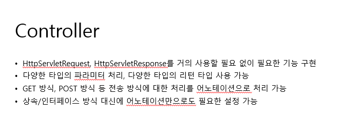

# 스프링 수업 23.10.16

# Spring Web MVC

## Spring MVC(스프링 프레임워크, 스프링 레거시)

### URL

url은 프로토콜: //도메인주소:포트번호/경로1/경로2/경로3 의 형태로 구성되어 있다.

웹을 구분하기 위해서 첫 경로(경로1)는 프로젝트명을 사용한다.

### @Controller, @RequestMapping




## 이클립스 설정하기

Window → preference → General → workspace → text file encoding을 UTF-8로 설정

preference에서 Web에 있는 것들 다 UTF-8로 설정

## 스프링 프로젝트 파일 설정

다음 각 방법 중에 하나를 사용하면 된다.

1번. Dynamic Web Project → convert to maven

2번. STS3을 다운로드 받기 → spring legacy project

3번. 전자정부 프레임워크 사이트 → 개발자 교육 → 교육자료 → 버전 선택해서 다운로드 받기(여기에는 mysql, apache tomcat 등이 다 들어가 있음)

전자정부 프레임워크에서 버전이 4.0.0에는 레거시가 들어가있다. 최근 버전은 스프링 부트일 확률이 높다.

## xml, 폴더, jsp 등 설정하기(xml로 세팅하기)

Spring MVC 설정은 servlet-context.xml에서 하고, Bean 정의는 root-context.xml에서 한다.

### webapp의 web-inf 폴더에서 config 폴더 생성 후 config 폴더 내에 xml 파일 생성

root-context.xml 파일

```xml
<?xml version="1.0" encoding="UTF-8"?>
<beans xsi:schemaLocation="http://www.springframework.org/schema/beans http://www.springframework.org/schema/beans/spring-beans.xsd" xmlns:xsi="http://www.w3.org/2001/XMLSchema-instance" xmlns="http://www.springframework.org/schema/beans"> 

</beans>
```

servlet-context.xml 파일

```xml
<?xml version="1.0" encoding="UTF-8"?>
<beans:beans xsi:schemaLocation="http://www.springframework.org/schema/mvc http://www.springframework.org/schema/mvc/spring-mvc.xsd http://www.springframework.org/schema/beans http://www.springframework.org/schema/beans/spring-beans.xsd http://www.springframework.org/schema/context http://www.springframework.org/schema/context/spring-context.xsd" xmlns:context="http://www.springframework.org/schema/context" xmlns:beans="http://www.springframework.org/schema/beans" xmlns:xsi="http://www.w3.org/2001/XMLSchema-instance" xmlns="http://www.springframework.org/schema/mvc">

<!-- 어노테이션을 사용하기 위한 코드 -->
<annotation-driven/>

<context:component-scan base-package="kr.co.ezen.controller"/>

<beans:bean class="org.springframework.web.servlet.view.InternalResourceViewResolver">

<beans:property value="/WEB-INF/views/" name="prefix"/>

<beans:property value=".jsp" name="suffix"/>

</beans:bean>

<!-- 정적파일(이미지, 사운드, 동영상, JS, CSS 등등) 경로 셋팅 -->

<resources location="/resources/" mapping="/**"/>

</beans:beans>
```

### WEB-INF 폴더에 web.xml 파일 생성

web.xml 파일

```xml
<?xml version="1.0" encoding="UTF-8"?>
<web-app
   xsi:schemaLocation="http://xmlns.jcp.org/xml/ns/javaee http://xmlns.jcp.org/xml/ns/javaee/web-app_4_0.xsd"
   xmlns:xsi="http://www.w3.org/2001/XMLSchema-instance"
   xmlns="http://xmlns.jcp.org/xml/ns/javaee" version="4.0">

   <!-- 현재 웹 애플리케이션에서 받아들이는 모든 요청에 대해 JwServlet이라는 이름으로 정의되어 있는 서블릿을 사용하겠다. -->

   <servlet-mapping>
      <servlet-name>JwServlet</servlet-name>
      <url-pattern>/</url-pattern>
   </servlet-mapping>

   <!-- 요청 정보를 분석해서 컨트롤러를 선택하는 서블릿을 지정한다. -->

   <servlet>
      <servlet-name>JwServlet</servlet-name>

      <!-- Spring MVC에서 제공하고 있는 기본 서블릿을 지정한다. -->
      <servlet-class>org.springframework.web.servlet.DispatcherServlet</servlet-class>

      <!-- Spring MVC 설정을 위한 xml 파일을 지정한다. -->

      <init-param>
         <param-name>contextConfigLocation</param-name>
         <param-value>/WEB-INF/config/servlet-context.xml</param-value>
      </init-param>

      <load-on-startup>1</load-on-startup>

   </servlet>

   <!-- Bean을 정의할 xml 파일을 지정한다. -->

   <context-param>

      <param-name>contextConfigLocation</param-name>

      <param-value>/WEB-INF/config/root-context.xml</param-value>

   </context-param>

   <!-- 리스너설정 -->

   <listener>

      <listener-class>org.springframework.web.context.ContextLoaderListener</listener-class>

   </listener>

   <!-- 파라미터 인코딩 필터 설정 -->

   <filter>

      <filter-name>encodingFilter</filter-name>

      <filter-class>org.springframework.web.filter.CharacterEncodingFilter</filter-class>

      <init-param>

         <param-name>encoding</param-name>

         <param-value>UTF-8</param-value>

      </init-param>

      <init-param>

         <param-name>forceEncoding</param-name>

         <param-value>true</param-value>

      </init-param>

   </filter>

   <filter-mapping>

      <filter-name>encodingFilter</filter-name>

      <url-pattern>/*</url-pattern>

   </filter-mapping>

</web-app>
```

### WEB-INF 폴더에 views 폴더 생성 후 index.jsp 파일 생성

index.jsp 파일

```html
<%@ page language="java" contentType="text/html; charset=UTF-8"
    pageEncoding="UTF-8"%>
<!DOCTYPE html>
<html>
<head>
<meta charset="UTF-8">
<title>Insert title here</title>
</head>
<body>
	<h1>Spring</h1>
</body>
</html>
```

### src/main/java 폴더에 kr.co.ezen.controller 패키지 생성 후 HomeController.java파일 생성

HomeController.java파일

```java
package kr.co.ezen.controller;

import org.springframework.stereotype.Controller;
import org.springframework.web.bind.annotation.RequestMapping;
import org.springframework.web.bind.annotation.RequestMethod;

@Controller
public class HomeController {
	
	// 모든 경로에 매핑하겠다.	
	@RequestMapping(value="/", method=RequestMethod.GET)
	public String home() {
		System.out.println("home");
		return "index";
	}
}
```

### pom.xml파일 내용

```xml
<?xml version="1.0"?>

<project
   xsi:schemaLocation="http://maven.apache.org/POM/4.0.0 http://maven.apache.org/xsd/maven-4.0.0.xsd"
   xmlns:xsi="http://www.w3.org/2001/XMLSchema-instance"
   xmlns="http://maven.apache.org/POM/4.0.0">

   <modelVersion>4.0.0</modelVersion>

   <groupId>Spring</groupId>

   <artifactId>Spring</artifactId>

   <version>0.0.1-SNAPSHOT</version>

   <packaging>war</packaging>

   <build>

      <sourceDirectory>src</sourceDirectory>

      <plugins>

         <plugin>

            <artifactId>maven-compiler-plugin</artifactId>

            <version>3.8.0</version>

            <configuration>

               <source>1.8</source>

               <target>1.8</target>

            </configuration>

         </plugin>

         <plugin>

            <artifactId>maven-war-plugin</artifactId>

            <version>3.2.1</version>

            <configuration>

               <warSourceDirectory>WebContent</warSourceDirectory>

            </configuration>

         </plugin>

      </plugins>

   </build>

   <properties>

      <javax.servlet-version>4.0.1</javax.servlet-version>

      <javax.servlet.jsp-version>2.3.3</javax.servlet.jsp-version>

      <javax.servlet.jsp.jstl-version>1.2</javax.servlet.jsp.jstl-version>

      <org.springframework-version>5.2.2.RELEASE</org.springframework-version>

      <!-- <org.springframework-version>4.3.25.RELEASE</org.springframework-version> -->

   </properties>

   <dependencies>

      <!-- https://mvnrepository.com/artifact/javax.servlet/javax.servlet-api -->

      <dependency>

         <groupId>javax.servlet</groupId>

         <artifactId>javax.servlet-api</artifactId>

         <version>${javax.servlet-version}</version>

         <scope>provided</scope>

      </dependency>

      <!-- https://mvnrepository.com/artifact/javax.servlet.jsp/javax.servlet.jsp-api -->

      <dependency>

         <groupId>javax.servlet.jsp</groupId>

         <artifactId>javax.servlet.jsp-api</artifactId>

         <version>${javax.servlet.jsp-version}</version>

         <scope>provided</scope>

      </dependency>

      <!-- https://mvnrepository.com/artifact/javax.servlet.jsp.jstl/jstl -->

      <dependency>

         <groupId>javax.servlet</groupId>

         <artifactId>jstl</artifactId>

         <version>${javax.servlet.jsp.jstl-version}</version>

      </dependency>

      <!-- https://mvnrepository.com/artifact/org.springframework/spring-webmvc -->

      <dependency>

         <groupId>org.springframework</groupId>

         <artifactId>spring-webmvc</artifactId>

         <version>${org.springframework-version}</version>

      </dependency>

   </dependencies>

</project>
```

### 실행할 때는 jsp를 실행하는 것이 아니라 프로젝트 파일을 우클릭해서 실행해야 한다.

프로젝트 파일 우클릭 → Run As → Run On Server

## java로 세팅하기

dynamic web project 생성 후 convert to maven 으로 설정한다.

이후에 properties 자바 버전을 javaSE-1.8로 맞춘다.

프로젝트 우클릭 후 maven에서 update project → Force Update of Snapshots/Releases를 체크한다.

src/main/java 폴더에 kr.co.ezen.config라는 패키지를 만들고 그 안에 RootContext 클래스와 ServletContext 클래스와 SpringConfig 클래스를 생성한다.

xml에서 빈 등록을 했던 것을 대신하여 RootContext 클래스에 @Component 어노테이션을 적어준다.

xml에서 MVC 설정을 하는 것을 대신하여 ServletContext 클래스에 @Configuration, @EnableWebMvc, @ComponentScan(”kr.co.ezen.controller”) 어노테이션들을 적어준다. 그리고 WebMvcConfigurer 인터페이스를 상속받는다.

web.xml에서 설정하는 것을 대신하여 SpringConfig 클래스에 AbstractAnnotationConfigDispatcherServletInitializer를 상속받아서 메소드들을 오버라이딩한다. 

src/main/java 폴더에 kr.co.ezen.controller라는 패키지를 만들고 그 안에 HomeController 클래스를 생성한다.

RootContext.java파일

```java
package kr.co.ezen.config;

import org.springframework.stereotype.Component;

@Configuration
public class RootContext {

}
```

ServletContext.java파일

```java
package kr.co.ezen.config;

import org.springframework.context.annotation.ComponentScan;
import org.springframework.context.annotation.Configuration;
import org.springframework.web.servlet.config.annotation.EnableWebMvc;
import org.springframework.web.servlet.config.annotation.ResourceHandlerRegistry;
import org.springframework.web.servlet.config.annotation.ViewResolverRegistry;
import org.springframework.web.servlet.config.annotation.WebMvcConfigurer;

// Spring MVC 프로젝트에 관련된 설정하는 클래스
@Configuration
@EnableWebMvc
@ComponentScan("kr.co.ezen.controller")
public class ServletContext implements WebMvcConfigurer{
	@Override
	   public void configureViewResolvers(ViewResolverRegistry registry) {
	      // TODO Auto-generated method stub
	      WebMvcConfigurer.super.configureViewResolvers(registry);
	      registry.jsp("/WEB-INF/views/", ".jsp");
	   }
	   
	   // 정적 파일의 경로를 매핑한다.
	   @Override
	   public void addResourceHandlers(ResourceHandlerRegistry registry) {
	      // TODO Auto-generated method stub
	      WebMvcConfigurer.super.addResourceHandlers(registry);
	      registry.addResourceHandler("/**").addResourceLocations("/resources/");
	   }
	
}
```

SpringConfig.java파일

```java
package kr.co.ezen.config;

import javax.servlet.Filter;

import org.springframework.web.filter.CharacterEncodingFilter;
import org.springframework.web.servlet.support.AbstractAnnotationConfigDispatcherServletInitializer;

public class SpringConfig extends AbstractAnnotationConfigDispatcherServletInitializer {
   
   // 웹에서 사용할 Bean들을 정의하기 위한 클래스를 지정해야함
      @Override
      protected Class<?>[] getRootConfigClasses() {
         return new Class[] { RootContext.class };
      }

      // MVC설정위한 클래스 지정
      @Override
      protected Class<?>[] getServletConfigClasses() {
         return new Class[] { ServletContext.class };
      }

      // DispatcherServlet에 매핑할 요청주소를 세팅
      @Override
      protected String[] getServletMappings() {
         return new String[] { "/" };

      }
      // 파라미터 인코딩 필터 설정

      protected Filter[] getServletFilters() {

         CharacterEncodingFilter encodingFilter = new CharacterEncodingFilter();
         encodingFilter.setEncoding("UTF-8");
         return new Filter[] { encodingFilter };
      }
   

}
```

HomeController.java파일

```java
package kr.co.ezen.controller;

import org.springframework.stereotype.Controller;
import org.springframework.web.bind.annotation.RequestMapping;
import org.springframework.web.bind.annotation.RequestMethod;

@Controller
public class HomeController {
	
	// 모든 경로에 매핑하겠다.
	@RequestMapping(value="/", method=RequestMethod.GET)
	public String home() {
		System.out.println("home");
		return "index";
	}
}
```

pom.xml파일

```xml
<?xml version="1.0"?>

<project
   xsi:schemaLocation="http://maven.apache.org/POM/4.0.0 http://maven.apache.org/xsd/maven-4.0.0.xsd"
   xmlns:xsi="http://www.w3.org/2001/XMLSchema-instance"
   xmlns="http://maven.apache.org/POM/4.0.0">

   <modelVersion>4.0.0</modelVersion>

   <groupId>Spring</groupId>

   <artifactId>Spring</artifactId>

   <version>0.0.1-SNAPSHOT</version>

   <packaging>war</packaging>

   <build>

      <sourceDirectory>src</sourceDirectory>

      <plugins>

         <plugin>

            <artifactId>maven-compiler-plugin</artifactId>

            <version>3.8.0</version>

            <configuration>

               <source>1.8</source>

               <target>1.8</target>

            </configuration>

         </plugin>

         <plugin>

            <artifactId>maven-war-plugin</artifactId>

            <version>3.2.1</version>

            <configuration>

               <warSourceDirectory>WebContent</warSourceDirectory>

            </configuration>

         </plugin>

      </plugins>

   </build>

   <properties>

      <javax.servlet-version>4.0.1</javax.servlet-version>

      <javax.servlet.jsp-version>2.3.3</javax.servlet.jsp-version>

      <javax.servlet.jsp.jstl-version>1.2</javax.servlet.jsp.jstl-version>

      <org.springframework-version>5.2.2.RELEASE</org.springframework-version>

      <!-- <org.springframework-version>4.3.25.RELEASE</org.springframework-version> -->

   </properties>

   <dependencies>

      <!-- https://mvnrepository.com/artifact/javax.servlet/javax.servlet-api -->

      <dependency>

         <groupId>javax.servlet</groupId>

         <artifactId>javax.servlet-api</artifactId>

         <version>${javax.servlet-version}</version>

         <scope>provided</scope>

      </dependency>

      <!-- https://mvnrepository.com/artifact/javax.servlet.jsp/javax.servlet.jsp-api -->

      <dependency>

         <groupId>javax.servlet.jsp</groupId>

         <artifactId>javax.servlet.jsp-api</artifactId>

         <version>${javax.servlet.jsp-version}</version>

         <scope>provided</scope>

      </dependency>

      <!-- https://mvnrepository.com/artifact/javax.servlet.jsp.jstl/jstl -->

      <dependency>

         <groupId>javax.servlet</groupId>

         <artifactId>jstl</artifactId>

         <version>${javax.servlet.jsp.jstl-version}</version>

      </dependency>

      <!-- https://mvnrepository.com/artifact/org.springframework/spring-webmvc -->

      <dependency>

         <groupId>org.springframework</groupId>

         <artifactId>spring-webmvc</artifactId>

         <version>${org.springframework-version}</version>

      </dependency>

   </dependencies>

</project>
```

## 매핑 예제


위 사진처럼 디렉토리를 설정한다.

RootContext.java파일

```java
package kr.co.ezen.config;

import org.springframework.stereotype.Component;

@Component
public class RootContext {

}
```

ServletContext.java파일

```java
package kr.co.ezen.config;

import org.springframework.context.annotation.ComponentScan;
import org.springframework.context.annotation.Configuration;
import org.springframework.web.servlet.config.annotation.EnableWebMvc;
import org.springframework.web.servlet.config.annotation.ResourceHandlerRegistry;
import org.springframework.web.servlet.config.annotation.ViewResolverRegistry;
import org.springframework.web.servlet.config.annotation.WebMvcConfigurer;

// Spring MVC 프로젝트에 관련된 설정하는 클래스
@Configuration
@EnableWebMvc
@ComponentScan("kr.co.ezen.controller")
public class ServletContext implements WebMvcConfigurer{
	@Override
	   public void configureViewResolvers(ViewResolverRegistry registry) {
	      // TODO Auto-generated method stub
	      WebMvcConfigurer.super.configureViewResolvers(registry);
	      registry.jsp("/WEB-INF/views/", ".jsp");
	   }
	   
	   // 정적 파일의 경로를 매핑한다.
	   @Override
	   public void addResourceHandlers(ResourceHandlerRegistry registry) {
	      // TODO Auto-generated method stub
	      WebMvcConfigurer.super.addResourceHandlers(registry);
	      registry.addResourceHandler("/**").addResourceLocations("/resources/");
	   }
	
}
```

SpringConfig.java파일

```java
package kr.co.ezen.config;

import javax.servlet.Filter;

import org.springframework.web.filter.CharacterEncodingFilter;
import org.springframework.web.servlet.support.AbstractAnnotationConfigDispatcherServletInitializer;

public class SpringConfig extends AbstractAnnotationConfigDispatcherServletInitializer {
   
   // 웹에서 사용할 Bean들을 정의하기 위한 클래스를 지정해야함
      @Override
      protected Class<?>[] getRootConfigClasses() {
         return new Class[] { RootContext.class };
      }

      // MVC설정위한 클래스 지정
      @Override
      protected Class<?>[] getServletConfigClasses() {
         return new Class[] { ServletContext.class };
      }

      // DispatcherServlet에 매핑할 요청주소를 세팅
      @Override
      protected String[] getServletMappings() {
         return new String[] { "/" };

      }
      // 파라미터 인코딩 필터 설정

      protected Filter[] getServletFilters() {

         CharacterEncodingFilter encodingFilter = new CharacterEncodingFilter();
         encodingFilter.setEncoding("UTF-8");
         return new Filter[] { encodingFilter };
      }
   

}
```

HomeController.java파일

```java
package kr.co.ezen.controller;

import org.springframework.stereotype.Controller;
import org.springframework.web.bind.annotation.RequestMapping;
import org.springframework.web.bind.annotation.RequestMethod;

@Controller
public class HomeController {
	
	// 모든 경로에 매핑하겠다.
	@RequestMapping(value="/", method=RequestMethod.GET)
	public String home() {
		System.out.println("home");
		return "index";
	}
}
```

SpController.java파일

```java
package kr.co.ezen.controller;

import org.springframework.stereotype.Controller;
import org.springframework.web.bind.annotation.RequestMapping;
import org.springframework.web.bind.annotation.RequestMethod;

@Controller
public class SpController {
	
	@RequestMapping(value="/sp1/t3", method=RequestMethod.GET)
	public String t3() {
		return "sp1/t3";
	}
	
	@RequestMapping(value="/sp1/t4", method=RequestMethod.GET)
	public String t4() {
		return "sp1/t4";
	}
	
}
```

SpController2.java파일

```java
package kr.co.ezen.controller;

import org.springframework.stereotype.Controller;
import org.springframework.web.bind.annotation.RequestMapping;
import org.springframework.web.bind.annotation.RequestMethod;

@Controller
@RequestMapping("/sp2")
public class SpController2 {
	
	@RequestMapping(value="/t5", method=RequestMethod.GET)
	public String t5() {
		return "sp2/t5";
	}
	
	@RequestMapping(value="/t6", method=RequestMethod.GET)
	public String t6() {
		return "sp2/t6";
	}

}
```

TestController.java파일

```java
package kr.co.ezen.controller;

import org.springframework.stereotype.Controller;
import org.springframework.web.bind.annotation.RequestMapping;
import org.springframework.web.bind.annotation.RequestMethod;

@Controller
public class TestController {
	// 경로 매핑(url 매핑)
	@RequestMapping(value="/t1", method=RequestMethod.GET)
	public String t1() {
		return "t1";
	}
	
	@RequestMapping(value="/t2", method=RequestMethod.GET)
	public String t2() {
		return "t2";
	}
	

}
```

index.jsp파일

```html
<%@ page language="java" contentType="text/html; charset=UTF-8"
    pageEncoding="UTF-8"%>
<!DOCTYPE html>
<html>
<head>
<meta charset="UTF-8">
<title>Insert title here</title>
</head>
<body>
	<h1>Spring...</h1>
</body>
</html>
```

pom.xml파일

```xml
<?xml version="1.0"?>

<project
   xsi:schemaLocation="http://maven.apache.org/POM/4.0.0 http://maven.apache.org/xsd/maven-4.0.0.xsd"
   xmlns:xsi="http://www.w3.org/2001/XMLSchema-instance"
   xmlns="http://maven.apache.org/POM/4.0.0">

   <modelVersion>4.0.0</modelVersion>

   <groupId>Spring</groupId>

   <artifactId>Spring</artifactId>

   <version>0.0.1-SNAPSHOT</version>

   <packaging>war</packaging>

   <build>

      <sourceDirectory>src</sourceDirectory>

      <plugins>

         <plugin>

            <artifactId>maven-compiler-plugin</artifactId>

            <version>3.8.0</version>

            <configuration>

               <source>1.8</source>

               <target>1.8</target>

            </configuration>

         </plugin>

         <plugin>

            <artifactId>maven-war-plugin</artifactId>

            <version>3.2.1</version>

            <configuration>

               <warSourceDirectory>WebContent</warSourceDirectory>

            </configuration>

         </plugin>

      </plugins>

   </build>

   <properties>

      <javax.servlet-version>4.0.1</javax.servlet-version>

      <javax.servlet.jsp-version>2.3.3</javax.servlet.jsp-version>

      <javax.servlet.jsp.jstl-version>1.2</javax.servlet.jsp.jstl-version>

      <org.springframework-version>5.2.2.RELEASE</org.springframework-version>

      <!-- <org.springframework-version>4.3.25.RELEASE</org.springframework-version> -->

   </properties>

   <dependencies>

      <!-- https://mvnrepository.com/artifact/javax.servlet/javax.servlet-api -->

      <dependency>

         <groupId>javax.servlet</groupId>

         <artifactId>javax.servlet-api</artifactId>

         <version>${javax.servlet-version}</version>

         <scope>provided</scope>

      </dependency>

      <!-- https://mvnrepository.com/artifact/javax.servlet.jsp/javax.servlet.jsp-api -->

      <dependency>

         <groupId>javax.servlet.jsp</groupId>

         <artifactId>javax.servlet.jsp-api</artifactId>

         <version>${javax.servlet.jsp-version}</version>

         <scope>provided</scope>

      </dependency>

      <!-- https://mvnrepository.com/artifact/javax.servlet.jsp.jstl/jstl -->

      <dependency>

         <groupId>javax.servlet</groupId>

         <artifactId>jstl</artifactId>

         <version>${javax.servlet.jsp.jstl-version}</version>

      </dependency>

      <!-- https://mvnrepository.com/artifact/org.springframework/spring-webmvc -->

      <dependency>

         <groupId>org.springframework</groupId>

         <artifactId>spring-webmvc</artifactId>

         <version>${org.springframework-version}</version>

      </dependency>

   </dependencies>

</project>
```

t1.jsp, t2.jsp, t3.jsp, t4.jsp, t5.jsp, t6.jsp는 <h1>태그로 t1~t6을 각각 출력하도록 만든다.

이후에 프로젝트 파일을 우클릭해서 Run As → Run On Server로 실행하고 url에 t1, t2, sp1/t3, sp1/t4, sp2/t5, sp2/t6을 각각 입력하면 각 jsp파일의 화면이 출력되는 것을 확인할 수 있다.

### @RequestMapping 대신 @GetMapping과 @PostMapping 사용하기

```java
package kr.co.ezen.controller;

import org.springframework.stereotype.Controller;
import org.springframework.web.bind.annotation.GetMapping;
import org.springframework.web.bind.annotation.PostMapping;
import org.springframework.web.bind.annotation.RequestMapping;
import org.springframework.web.bind.annotation.RequestMethod;

@Controller
public class TestController {
	// 경로 매핑(url 매핑)
	@RequestMapping(value="/test1", method=RequestMethod.GET)
	public String test1Get() {
		return "test1";
	}
	
	@RequestMapping(value="/test1", method=RequestMethod.POST)
	public String test1Post() {
		return "test2";
	}
	
	@GetMapping("/test2")
	public String test2Get() {
		return "test3";
	}
	
	@PostMapping("/test2")
	public String test2Post() {
		return "test4";
	}
	
	@RequestMapping(value="/test3", method = {RequestMethod.GET, RequestMethod.POST})
	public String test3() {
		return "test5";
	}
	

}
```

위와 같이 작성하면 @GetMapping은 method=RequestMethod.GET과 같고, @PostMapping은 method=RequestMethod.POST와 같다.

@RequestMapping의 method의 값을 중괄호로 묶어서 @GetMapping과 @PostMapping을 한번에 처리할 수도 있다.