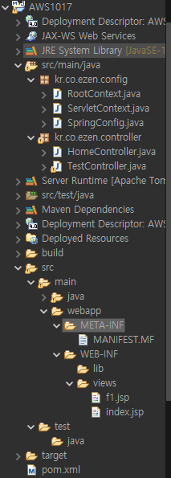

# 스프링 수업 23.10.17

## 파라미터 추출

파라미터 추출할 때 HttpServletRequest 객체를 사용해서 주입 받을 수 있다.

WebRequest를 사용하면 주입 받을 수 있다. HttpServletRequest보다 더 확장되어 있는 클래스이다.

@PathVariable 어노테이션을 이용하면 데이터가 요청 주소에 있을 경우 값을 주입 받을 수 있다.

@RequestParam 어노테이션이 가장 많이 쓰인다. 파라미터 데이터를 직접 주입 받을 수 있다. 지정된 변수 이름과 파라미터 이름이 같을 경우에 값을 주입 받는다.

value 속성은 @RequestParam을 사용할 때 파라미터 이름과 변수의 이름이 다를 경우에 value에 파라미터 이름을 지정해서 주입받는다.

### 객체로 파라미터 주입 받기

클라이언트가 전달하는 파라미터를 한번에 Map으로 받을 수 있다. 이때 파라미터의 이름이 달라야 한다. 만약 이름이 같은 파라미터가 2개 이상이면 LIst로 주입받아야 한다.

@ModelAttribute 어노테이션을 사용해서 파라미터를 객체로 주입받을 수 있다. 파라미터 이름과 동일한 프로퍼티에 자동 주입된다. 이 어노테이션은 생략이 가능하다.

### 파라미터 추출 방법들 사용 예제

자바로 세팅이 완료된 상태에서 진행



TestController.java파일

```java
package kr.co.ezen.controller;

import javax.servlet.RequestDispatcher;
import javax.servlet.http.HttpServletRequest;

import org.springframework.stereotype.Controller;
import org.springframework.web.bind.annotation.GetMapping;
import org.springframework.web.bind.annotation.PathVariable;
import org.springframework.web.bind.annotation.PostMapping;
import org.springframework.web.bind.annotation.RequestMapping;
import org.springframework.web.bind.annotation.RequestMethod;
import org.springframework.web.bind.annotation.RequestParam;
import org.springframework.web.context.request.WebRequest;

@Controller
public class TestController {
   // HttpServletRequest로 파라미터 주입
   @GetMapping("/t1")
   public String t1(HttpServletRequest request) {
      
      String d1=request.getParameter("d1");
      String d2=request.getParameter("d2");
      String []d3=request.getParameterValues("d3");
      
      System.out.println(d1);
      System.out.println(d2);
      for(String str:d3) {
         System.out.println(str);
      }
      return "f1";
   }
   
   // 더 확장된 WebRequest 클래스 활용해서 파라미터 주입
   @GetMapping("/t2")
   public String t2(WebRequest request) {
	   String d1=request.getParameter("d1");
	      String d2=request.getParameter("d2");
	      String []d3=request.getParameterValues("d3");
	      
	      System.out.println(d1);
	      System.out.println(d2);
	      for(String str:d3) {
	         System.out.println(str);
	      }
	      return "f1";
   }
   
   // @PathVariable 어노테이션을 활용해서 파라미터 주입
   // 주소 형태로 작성된 파라미터를 가져올 때 사용한다.(URL로 작성된 파라미터)
   @GetMapping("/t3/{d1}/{d2}/{d3}")
   public String t3(@PathVariable int d1, @PathVariable int d2, @PathVariable int d3) {
	   System.out.println(d1);
	   System.out.println(d2);
	   System.out.println(d3);
	   
	   return "f1";
   }
   
   // @RequestParam을 사용해서 파라미터 주입
   // 지정된 변수 이름과 파라미터 이름이 같을 경우에 값을 주입 받는다.
   @GetMapping("/t4")
   public String t4(@RequestParam int d1, @RequestParam int d2, @RequestParam int[] d3) {
	   System.out.println(d1);
	   System.out.println(d2);
	   for(int r : d3) {
		   System.out.println(r);
	   }
	   
	   return "f1";
   }
   
   
   // RequestParam을 쓸 때 지정된 변수 이름과 파라미터 이름이 다를 경우
   // value 속성에 파라미터 이름을 지정해서 주입 받는다.
   @GetMapping("/t5")
   public String t5(@RequestParam(value="d1") int s1, @RequestParam(value="d2") int s2, @RequestParam(value="d3") int[] s3) {
	   System.out.println(s1);
	   System.out.println(s2);
	   
	   for(int r : s3) {
		   System.out.println(r);
	   }
	   
	   return "f1";
   }
   
   // RequestParam을 사용하여 form에 작성된 값을 주입받기
   @PostMapping("/t6")
   public String t6(@RequestParam String d1, @RequestParam String d2, @RequestParam String[] d3) {
	   System.out.println(d1);
	   System.out.println(d2);
	   for(String str : d3) {
		   System.out.println(str);
	   }
	   return "f1";
   }
   
   

}
```

f1.jsp

```html
<%@ page language="java" contentType="text/html; charset=UTF-8"
    pageEncoding="UTF-8"%>
<!DOCTYPE html>
<html>
<head>
<meta charset="UTF-8">
<title>Insert title here</title>
</head>
<body>
	<h1>f1</h1>
</body>
</html>
```

index.jsp

```html
<%@ page language="java" contentType="text/html; charset=UTF-8"
    pageEncoding="UTF-8"%>
<body>

<!-- 쿼리 스트링 형태 -->
<a href="t1?d1=100&d2=200&d3=300&d3=400">t1</a><br>

<a href="t2?d1=100&d2=200&d3=300&d3=400">t2</a><br>

<!-- 주소 형태 -->
<a href="t3/100/200/300">t3</a><br>

<!-- 쿼리 스트링 형태 -->
<a href="t4?d1=100&d2=200&d3=300&d3=400">t4</a><br>

<a href="t5?d1=100&d2=200&d3=300&d3=400">t4</a><br>

<form action='t6' method='post'>
    d1 : <input type='text' name='d1'/><br/>
    d2 : <input type='text' name='d2'/><br/>
    d3 : <input type='checkbox' name='d3' value='100'/>da
         <input type='checkbox' name='d3' value='200'/>db<br/>
    <button type='submit'>check</button>
</form>

</body>
</html>
```

## 객체로 파라미터 주입받기 예제

### @RequestParam을 사용해서 Map으로 파라미터 주입 받기

TestController.java파일

```java
package kr.co.ezen.controller;

import java.util.List;
import java.util.Map;

import org.springframework.stereotype.Controller;
import org.springframework.web.bind.annotation.GetMapping;
import org.springframework.web.bind.annotation.RequestParam;

@Controller
public class TestController {
   
	@GetMapping("/t1")
	public String t1(@RequestParam Map<String, String> map, @RequestParam List<String> d3) {
		
		String d1 = map.get("d1");
		String d2 = map.get("d2");
		
		System.out.println(d1);
		System.out.println(d2);
		
		for(String a : d3) {
			System.out.println(a);
		}
		
		return "f1";
	}
   

}
```

index.jsp파일

```html
<%@ page language="java" contentType="text/html; charset=UTF-8"
    pageEncoding="UTF-8"%>
<body>

<!-- 쿼리 스트링 형태 -->
<a href="t1?d1=100&d2=200&d3=300&d3=400">t1</a><br>

</body>
</html>
```

### @ModelAttribute를 사용해서 클래스의 객체로 파라미터 주입 받기

TestController.java파일

```java
package kr.co.ezen.controller;

import java.util.List;
import java.util.Map;

import org.springframework.stereotype.Controller;
import org.springframework.web.bind.annotation.GetMapping;
import org.springframework.web.bind.annotation.ModelAttribute;
import org.springframework.web.bind.annotation.RequestParam;

import kr.co.ezen.bean.Data;

@Controller
public class TestController {
	
	// @ModelAttribute는 이름이 같으면 객체값을 자동 주입한다.
	// Data 클래스의 필드 이름과 주입받을 파라미터의 이름을 일치시켜야 자동 주입된다.
	@GetMapping("/t2")
	public String t2(@ModelAttribute Data b1) {
		System.out.println(b1.getD1());
		System.out.println(b1.getD2());
		for(int a:b1.getD3()){
			System.out.println(a);
		}
		return "f1";
	}
 

}
```

index.jsp파일

```html
<%@ page language="java" contentType="text/html; charset=UTF-8"
    pageEncoding="UTF-8"%>
<body>

<!-- 쿼리 스트링 형태 -->
<a href="t2?d1=100&d2=200&d3=300&d3=400">t2</a><br>

</body>
</html>
```

## 클라이언트가 전달해주는 파라미터 주입받기

HttpServletRequest 객체를 사용하여 주입받을 수 있다.

@ModelAttribute 어노테이션을 사용하여 주입받을 수도 있다. @ModelAttribute를 사용할 때는 빈 객체의 필드에 값을 저장하여 불러오는 것도 가능하고, 입력받은 값을 주입하는 것도 가능하다. 이때 자바 빈의 객체명 대신 다른 이름을 지정해서 사용할 수도 있다.

Model 객체를 사용하여 주입 받을 수 있다.

모델 객체를 주입받으면 HttpServletRequest 객체에 담겨서 jsp로 전달할 수 있다. 모델 객체는 jsp에서 requestScope 객체로 값을 불러온다. 가장 많이 사용하는 방법이다.

ModelAndView 객체를 사용하여 주입 받을 수 있다. ModelAndView는 model값 저장 기능(데이터 처리 기능)과 view 이름 지정 기능을 모두 가진다.

### 예제

TestController.java파일

```java
package kr.co.ezen.controller;

import java.util.List;
import java.util.Map;

import javax.servlet.http.HttpServletRequest;

import org.springframework.stereotype.Controller;
import org.springframework.ui.Model;
import org.springframework.web.bind.annotation.GetMapping;
import org.springframework.web.bind.annotation.ModelAttribute;
import org.springframework.web.bind.annotation.RequestParam;
import org.springframework.web.servlet.ModelAndView;

@Controller
public class TestController {
   
	@GetMapping("/t1")
	public String t1(@RequestParam int d1, @RequestParam int d2) {
		return "t1";
	}
   
	
	@GetMapping("/t2")
	public String t2(HttpServletRequest request) {
		request.setAttribute("d1", 10);
		request.setAttribute("d2", 20);
		
		return "t2";
		
	}
	
	@GetMapping("/t3")
	public String t3(Model model) {
		// 모델 객체를 주입받으면
		// HttpServletRequest 객체에 담겨서 jsp로 전달할 수 있다.
		// 모델 객체는 jsp에서 requestScope 객체로 값을 불러온다.
		// 가장 많이 사용하는 방법이다.
		model.addAttribute("d1", 30);
		model.addAttribute("d2", 40);
		
		return "t3";
	}
	
	@GetMapping("/t4")
	public ModelAndView t4(ModelAndView mav){
		// model값 저장 기능(데이터 처리 기능)과 view 이름 지정 기능을 모두 가짐
		mav.addObject("d1", 50);
		mav.addObject("d2", 60);
		
		mav.setViewName("t4");
		
		return mav;
	}
	
	

}
```

t1.jsp파일

```html
<%@ page language="java" contentType="text/html; charset=UTF-8"
    pageEncoding="UTF-8"%>
<!DOCTYPE html>
<html>
<head>
<meta charset="UTF-8">
<title>Insert title here</title>
</head>
<body>
d1 : ${param.d1}<br>
d2 : ${param.d2}
</body>
</html>
```

t2.jsp파일

```html
<%@ page language="java" contentType="text/html; charset=UTF-8"
    pageEncoding="UTF-8"%>
<!DOCTYPE html>
<html>
<head>
<meta charset="UTF-8">
<title>Insert title here</title>
</head>
<body>
	<!-- requestScope는 생략 가능하지만 적는 것이 좋다. -->
	d1 : ${requestScope.d1 }<br>
	d2 : ${requestScope.d2 }<br>
	d2 : ${d2 }
	
</body>
</html>
```

t3.jsp파일

```html
<%@ page language="java" contentType="text/html; charset=UTF-8"
    pageEncoding="UTF-8"%>
<!DOCTYPE html>
<html>
<head>
<meta charset="UTF-8">
<title>Insert title here</title>
</head>
<body>
	d1 : ${requestScope.d1 }<br>
	d2 : ${requestScope.d2 }
		
</body>
</html>
```

t4.jsp파일

```html
<%@ page language="java" contentType="text/html; charset=UTF-8"
    pageEncoding="UTF-8"%>
<!DOCTYPE html>
<html>
<head>
<meta charset="UTF-8">
<title>Insert title here</title>
</head>
<body>
	d1 : ${requestScope.d1 }<br>
	d2 : ${requestScope.d2 }
</body>
</html>
```

index.jsp파일

```html
<%@ page language="java" contentType="text/html; charset=UTF-8"
    pageEncoding="UTF-8"%>
<body>

<!-- 쿼리 스트링 형태 -->
<a href="t1?d1=10&d2=20">t1</a><br>
<a href="t2">t2</a><br>
<a href="t3">t3</a><br>
<a href="t4">t4</a><br>

</body>
</html>
```

## Spring Web MVC 커리큘럼

1. 파라미터 추출, 객체로 파라미터 주입받기
2. Form 요소 , ViewResolver
3. Form 요소 2
4. Redirect / Forward
5. Request, Session,Application 빈 주입
6. 쿠키 , Properties , 유효성검사
7. 에러 메시지 커스터마이징
8. JSR어노테이션들
9. Validator
10. 인터셉터
11. MyBatis 설정 방법
12. RestController

## 자바 빈을 사용해서 파라미터 주입받기

@ModelAttribute를 사용해서 자바 빈 클래스 객체의 필드에 파라미터를 주입 받는다.

TestController.java파일

```java
package kr.co.ezen.controller;

import org.springframework.stereotype.Controller;
import org.springframework.web.bind.annotation.ModelAttribute;
import org.springframework.web.bind.annotation.PostMapping;

import kr.co.ezen.bean.SpringBean;

@Controller
public class TestController {
	
	// @ModelAttribute는 생략 가능하다.
	@PostMapping("/t1")
	public String t1(@ModelAttribute SpringBean b) {
		
		// input 태그의 text 창에 쓴 값이 SpringBean필드에 주입된다.
		System.out.println(b.getD1());
		System.out.println(b.getD2());
		
		return "t1";
		
	}
	
	@PostMapping("/t2")
	public String t2(@ModelAttribute("tt") SpringBean b) {
		return "t2";
	}
	

}
```

SpringBean.java파일

```java
package kr.co.ezen.bean;

public class SpringBean {
	// 필드의 이름과 값을 가져올 매개변수의 이름을 맞춰줘야 한다.
	private String d1;
	private String d2;
	
	public String getD1() {
		return d1;
	}
	public void setD1(String d1) {
		this.d1 = d1;
	}
	public String getD2() {
		return d2;
	}
	public void setD2(String d2) {
		this.d2 = d2;
	}
	

}
```

index.jsp파일

```html
<%@ page language="java" contentType="text/html; charset=UTF-8"
    pageEncoding="UTF-8"%>
<body>

	<form action="t1" method="post">
		d1 : <input type="text" name="d1"><br>
		d2 : <input type="text" name="d2"><br>
		<button type="submit">check</button>
	</form>
	
	<form action="t2" method="post">
		d1 : <input type="text" name="d1"><br>
		d2 : <input type="text" name="d2"><br>
		<button type="submit">check</button>
	</form>

</body>
</html>
```

t1.jsp파일

```html
<%@ page language="java" contentType="text/html; charset=UTF-8"
    pageEncoding="UTF-8"%>
<!DOCTYPE html>
<html>
<head>
<meta charset="UTF-8">
<title>Insert title here</title>
</head>
<body>
	<!-- 점 연산자 뒤에 클래스를 적을 때는
	첫 글자를 소문자로 한다는 규칙이 있다. -->
	d1 : ${requestScope.springBean.d1 }<br>
	d2 : ${requestScope.springBean.d2 }
	
</body>
</html>
```

t2.jsp파일

```html
<%@ page language="java" contentType="text/html; charset=UTF-8"
    pageEncoding="UTF-8"%>
<!DOCTYPE html>
<html>
<head>
<meta charset="UTF-8">
<title>Insert title here</title>
</head>
<body>
	d1 : ${requestScope.tt.d1 }<br>
	d2 : ${requestScope.tt.d2 }
</body>
</html>
```

## 스프링에서 제공하는 Form 커스텀 태그/요소

스프링에서 제공하고 있는 form:태그명

Model 객체에 들어있는 값을 form 요소에 주입 시킬 수 있다. 예를 들어 수정 페이지 등에 유용하게 사용된다.

Model 객체와 함께 많이 쓰인다.

modelAttribute로 클래스를 가져올 때 첫 글자는 반드시 소문자로 하는 것이 관행이다.

form 커스텀 태그를 사용하기 위해서 다음과 같이 taglib을 설정해 주어야 한다.

```html
<%@ taglib prefix="form" uri="http://www.springframework.org/tags/form" %>
```

### 예제

SpringBean.java파일

```java
package kr.co.ezen.bean;

public class SpringBean {
	
	private String name;
	private String id;
	private String pw;
	private String addr;
	
	public String getName() {
		return name;
	}
	public void setName(String name) {
		this.name = name;
	}
	public String getId() {
		return id;
	}
	public void setId(String id) {
		this.id = id;
	}
	public String getPw() {
		return pw;
	}
	public void setPw(String pw) {
		this.pw = pw;
	}
	public String getAddr() {
		return addr;
	}
	public void setAddr(String addr) {
		this.addr = addr;
	}
	
	

}
```

TestController.java파일

```java
package kr.co.ezen.controller;

import org.springframework.stereotype.Controller;
import org.springframework.ui.Model;
import org.springframework.web.bind.annotation.GetMapping;
import org.springframework.web.bind.annotation.ModelAttribute;
import org.springframework.web.bind.annotation.PostMapping;

import kr.co.ezen.bean.SpringBean;

@Controller
public class TestController {
	
	@GetMapping("/t1")
	public String t1(@ModelAttribute SpringBean b) {
		b.setId("yeongmae");
		b.setPw("1234");
		b.setName("영마에");
		b.setAddr("서울");
		
		return "t1";
	}
	
	@GetMapping("/t2")
	public String t2(@ModelAttribute SpringBean b) {
		b.setName("영마에2");
		b.setId("yeongmae2");
		b.setPw("1234");
		b.setAddr("서울2");
		return "t2";
	}
	
	@GetMapping("/t3")
	public String t3(@ModelAttribute("tt") SpringBean b) {
		b.setName("영마에3");
		b.setId("yeongmae3");
		b.setPw("1234");
		b.setAddr("서울3");
		return "t3";
	}
	
	@GetMapping("/t4")
	public String t4(Model m) {
		SpringBean b = new SpringBean();
		b.setName("영마에4");
		b.setId("yeongmae4");
		b.setPw("1234");
		b.setAddr("서울4");
		
		m.addAttribute("springbean", b);
		return "t4";
	}
	

}
```

index.jsp파일

```html
<%@ page language="java" contentType="text/html; charset=UTF-8"
    pageEncoding="UTF-8"%>
<body>

	<a href="t1">t1</a>
	<a href="t2">t2</a>
	<a href="t3">t3</a>
	<a href="t4">t4</a>

</body>
</html>
```

t1.jsp파일

```html
<%@ page language="java" contentType="text/html; charset=UTF-8"
    pageEncoding="UTF-8"%>
<!DOCTYPE html>
<html>
<head>
<meta charset="UTF-8">
<title>Insert title here</title>
</head>
<body>
	name : <input type="text" name="name" value="${requestScope.springBean.name }"><br>
	id : <input type="text" name="name" value="${requestScope.springBean.id }"><br>
	pw : <input type="text" name="name" value="${requestScope.springBean.pw}"><br>
	addr : <input type="text" name="name" value="${requestScope.springBean.addr }"><br>	
</body>
</html>
```

t2.jsp파일

```html
<%@ page language="java" contentType="text/html; charset=UTF-8"
    pageEncoding="UTF-8"%>
<%@ taglib prefix="form" uri="http://www.springframework.org/tags/form" %>
<!DOCTYPE html>
<html>
<head>
<meta charset="UTF-8">
<title>Insert title here</title>
</head>
<body>
	<!-- form 커스텀 태그를 사용했을 때도 관행상
	modelAttribute 뒤에 클래스명을 적을 때 맨 앞은 소문자로 적는다. -->
	<form:form modelAttribute="springBean" action="t3">
		name : <form:input path="name"/><br>
		id : <form:input path="id"/><br>
		pw : <form:input path="pw"/><br>
		addr : <form:input path="addr"/><br>
		
		<button type="submit">체크</button>
	</form:form>
</body>
</html>
```

t3.jsp파일

```html
<%@ page language="java" contentType="text/html; charset=UTF-8"
    pageEncoding="UTF-8"%>
<%@ taglib prefix="form" uri="http://www.springframework.org/tags/form" %>
<!DOCTYPE html>
<html>
<head>
<meta charset="UTF-8">
<title>Insert title here</title>
</head>
<body>

<form:form modelAttribute="tt">
	name : <form:input path="name"/><br>
	id : <form:input path="id"/><br>
	pw : <form:input path="pw"/><br>
	addr : <form:input path="addr"/><br>
		
	<button type="submit">체크</button>
</form:form>

<!-- 실험해본 코드
	<script type="text/javascript">
		alert("체크 완료");
		history.go(-1);
	</script>
	
 -->
	
</body>
</html>
```

t4.jsp파일

```html
<%@ page language="java" contentType="text/html; charset=UTF-8"
    pageEncoding="UTF-8"%>
<%@ taglib prefix="form" uri="http://www.springframework.org/tags/form" %>    
<!DOCTYPE html>
<html>
<head>
<meta charset="UTF-8">
<title>Insert title here</title>
</head>
<body>

<form:form modelAttribute="springbean">
	name : <form:input path="name"/><br>
	id : <form:input path="id"/><br>
	pw : <form:input path="pw"/><br>
	addr : <form:input path="addr"/><br>
		
	<button type="submit">체크</button>
</form:form>

</body>
</html>
```

### 예제 2

SpringBean.java파일

```java
package kr.co.ezen.bean;

public class SpringBean {
	
	private String s1;
	private String s2;
	private String s3;
	private String s4;
	
	public String getS1() {
		return s1;
	}
	public void setS1(String s1) {
		this.s1 = s1;
	}
	public String getS2() {
		return s2;
	}
	public void setS2(String s2) {
		this.s2 = s2;
	}
	public String getS3() {
		return s3;
	}
	public void setS3(String s3) {
		this.s3 = s3;
	}
	public String getS4() {
		return s4;
	}
	public void setS4(String s4) {
		this.s4 = s4;
	}
	
	
	

}
```

TestController.java파일

```java
package kr.co.ezen.controller;

import org.springframework.stereotype.Controller;
import org.springframework.ui.Model;
import org.springframework.web.bind.annotation.GetMapping;
import org.springframework.web.bind.annotation.ModelAttribute;
import org.springframework.web.bind.annotation.PostMapping;

import kr.co.ezen.bean.SpringBean;

@Controller
public class TestController {
	
	@GetMapping("/t1")
	public String t1(@ModelAttribute SpringBean b) {
		b.setS1("동훈");
		b.setS2("재용");
		b.setS3("혜관");
		b.setS4("준영");
		
		return "t1";
	}
	

}
```

index.jsp파일

```html
<%@ page language="java" contentType="text/html; charset=UTF-8"
    pageEncoding="UTF-8"%>
<body>

	<a href="t1">t1</a>
	
</body>
</html>
```

t1.jsp파일

```html
<%@ page language="java" contentType="text/html; charset=UTF-8"
    pageEncoding="UTF-8"%>
<%@ taglib prefix="form" uri="http://www.springframework.org/tags/form" %>    
<!DOCTYPE html>
<html>
<head>
<meta charset="UTF-8">
<title>Insert title here</title>
</head>
<body>
	<form:form modelAttribute="springBean">
		<!-- 출력되지 않아서 눈에 보이지는 않지만 값을 넘기는 hidden -->
		<form:hidden path="s1"/><br>
		<form:input path="s2"/><br>
		<!-- 비밀번호 몇자리 입력했는지 보이게 하는 showPassword -->
		<form:password path="s3" showPassword="true"/><br>
		<form:textarea path="s4"/><br>
		<!-- 비활성화 할 것인지 여부를 나타내는 disabled -->
		<form:button disabled="true">체크</form:button>
	</form:form>
</body>
</html>
```

### 예제 3

SpringBean.java파일

```java
package kr.co.ezen.bean;

public class SpringBean {
	
	private String s1;
	private String s2;
	private String s3;
	private String s4;
	
	private String[] s5;
	private String[] s6;
	private String[] s7;
	private String[] s8;
	
	private String s9;
	private String s10;
	private String s11;
	private String s12;
	
	public String getS1() {
		return s1;
	}
	public void setS1(String s1) {
		this.s1 = s1;
	}
	public String getS2() {
		return s2;
	}
	public void setS2(String s2) {
		this.s2 = s2;
	}
	public String getS3() {
		return s3;
	}
	public void setS3(String s3) {
		this.s3 = s3;
	}
	public String getS4() {
		return s4;
	}
	public void setS4(String s4) {
		this.s4 = s4;
	}
	public String[] getS5() {
		return s5;
	}
	public void setS5(String[] s5) {
		this.s5 = s5;
	}
	public String[] getS6() {
		return s6;
	}
	public void setS6(String[] s6) {
		this.s6 = s6;
	}
	public String[] getS7() {
		return s7;
	}
	public void setS7(String[] s7) {
		this.s7 = s7;
	}
	public String[] getS8() {
		return s8;
	}
	public void setS8(String[] s8) {
		this.s8 = s8;
	}
	public String getS9() {
		return s9;
	}
	public void setS9(String s9) {
		this.s9 = s9;
	}
	public String getS10() {
		return s10;
	}
	public void setS10(String s10) {
		this.s10 = s10;
	}
	public String getS11() {
		return s11;
	}
	public void setS11(String s11) {
		this.s11 = s11;
	}
	public String getS12() {
		return s12;
	}
	public void setS12(String s12) {
		this.s12 = s12;
	}
	
	
}
```

SpringBean2.java파일

```java
package kr.co.ezen.bean;

public class SpringBean2 {
	
	private String a1;
	private String a2;
	
	public String getA1() {
		return a1;
	}
	public void setA1(String a1) {
		this.a1 = a1;
	}
	public String getA2() {
		return a2;
	}
	public void setA2(String a2) {
		this.a2 = a2;
	}
	
	

}
```

TestController.java파일

```java
package kr.co.ezen.controller;

import java.util.ArrayList;

import org.springframework.stereotype.Controller;
import org.springframework.ui.Model;
import org.springframework.web.bind.annotation.GetMapping;
import org.springframework.web.bind.annotation.ModelAttribute;
import org.springframework.web.bind.annotation.PostMapping;

import kr.co.ezen.bean.SpringBean;
import kr.co.ezen.bean.SpringBean2;

@Controller
public class TestController {
	
	@GetMapping("/t1")
	public String t1(@ModelAttribute SpringBean b, Model m) {
		// SpringBean 객체의 필드에 값을 담는다.
		b.setS1("d2");
		b.setS2("d2");
		b.setS3("d2");
		b.setS4("d2");
		
		String [] str = {"d1", "d3"};
		b.setS5(str);
		b.setS6(str);
		b.setS7(str);
		b.setS8(str);
		
		b.setS9("d2");
		b.setS10("d2");
		b.setS11("d2");
		b.setS12("d2");
		
		String [] str2 = {"d1", "d2", "d3"};
		// 모델 객체에 배열을 담는다.(다른 곳에서 requestScope로 받으면 됨)
		m.addAttribute("li1", str2);
		
		// 컬렉션 프레임워크를 이용해서 값을 저장하고
		// 그 컬렉션을 모델 객체에 담는다.(requestScope로 받을 수 있음)
		ArrayList<String> li2 = new ArrayList<String>();
		li2.add("d1");
		li2.add("d2");
		li2.add("d3");
		m.addAttribute("li2", li2);
		
		// SpringBean2 객체를 3개 만들어서 각각의 필드에 값을 저장한다.
		SpringBean2 b1 = new SpringBean2();
		SpringBean2 b2 = new SpringBean2();
		SpringBean2 b3 = new SpringBean2();
		
		b1.setA1("one");
		b1.setA2("d1");
		
		b2.setA1("two");
		b2.setA2("d2");
		
		b3.setA1("three");
		b3.setA2("d3");
		
		// ArrayList에 SpringBean2 객체를 담는다.
		ArrayList<SpringBean2> li3 = new ArrayList<SpringBean2>();
		li3.add(b1);
		li3.add(b2);
		li3.add(b3);
		// 모델 객체에 ArrayList를 담는다.(requestScope로 받을 수 있음)
		m.addAttribute("li3", li3);
		
		return "t1";
	}
	

}
```

index.jsp파일

```html
<%@ page language="java" contentType="text/html; charset=UTF-8"
    pageEncoding="UTF-8"%>
<body>

	<a href="t1">t1</a>
	
</body>
</html>
```

t1.jsp파일

```html
<%@ page language="java" contentType="text/html; charset=UTF-8"
    pageEncoding="UTF-8"%>
<%@ taglib prefix="form" uri="http://www.springframework.org/tags/form" %>    
<!DOCTYPE html>
<html>
<head>
<meta charset="UTF-8">
<title>Insert title here</title>
</head>
<body>
	<form:form modelAttribute="springBean">
		<!-- 이름이 s1과 같으면 s1의 값과 value를 비교해서
		value와 같은 것에 해당되는 내용이 표시됨 -->
		<form:select path="s1">
			<form:option value="d1">one</form:option>
			<form:option value="d2">two</form:option>
			<form:option value="d3">three</form:option>
		</form:select>
		
		<!-- s2, s3에 저장한 값이 d2이기 때문에 처음 표시되는 것이 모두 d2이다. -->
		<form:select path="s2">
			<form:options items="${requestScope.li1 }"/><br>
		</form:select>
		
		<form:select path="s3">
			<form:options items="${requestScope.li2 }"/><br>
		</form:select>
		<!-- items가 li3이므로 SpringBean2 객체가 담겨있고
		그 객체의 a1인 one, two, three를 itemLabel로 하여 라디오버튼의 이름이 나온다.
		객체의 a2인 d1, d2, d3를 itemValue로 하여 객체의 a2값에 따라 a1이 나타나게 한다
		객체의 a2는 path가 s4이고, s4에 저장된 값은 d2이므로 two가 선택되어 있게 된다. -->
		<form:select path="s4">
			<form:options items="${requestScope.li3 }" itemLabel="a2" itemValue="a2"/><br>
		</form:select>
		
		<!-- s5에 배열로 d1, d3만 저장되어 있기 때문에 처음 체크되어 있는 것이
		d1, d3에 해당하는 one, three이다. -->
		<form:checkbox path="s5" value="d1"/>one
		<form:checkbox path="s5" value="d2"/>two
		<form:checkbox path="s5" value="d3"/>three<br>
		
		<!-- s6, s7에 배열로 d1, d3만 저장되어 있기 때문에 처음 체크되어 있는 것이 d1, d3이다. -->
		<form:checkboxes items="${requestScope.li1 }" path="s6"/><br>
		<form:checkboxes items="${requestScope.li2 }" path="s7"/><br>
		<!-- items가 li3이므로 SpringBean2 객체가 담겨있고
		그 객체의 a1인 one, two, three를 itemLabel로 하여 라디오버튼의 이름이 나온다.
		객체의 a2인 d1, d2, d3를 itemValue로 하여 객체의 a2값에 따라 a1이 나타나게 한다
		객체의 a2는 path가 s8이고, s8에 저장된 값은 d1, d3이므로 one, three가 체크되어 있게 된다. -->
		<form:checkboxes items="${requestScope.li3 }" path="s8" itemLabel="a1" itemValue="a2"/><br>
		
		<!-- 라디오 버튼 -->
		<!-- s9에는 d2가 저장되어 있기 때문에 d2에 해당되는 two만 체크되어 있다. -->
		<form:radiobutton path="s9" value="d1"/>one
		<form:radiobutton path="s9" value="d2"/>two
		<form:radiobutton path="s9" value="d3"/>three
		
		<!-- s10, s11에는 모두 d2가 저장되어 있기 때문에 d2만 체크되어 있다. -->
		<form:radiobuttons path="s10" items="${requestScope.li1 }"/><br>
		<form:radiobuttons path="s11" items="${requestScope.li2 }"/><br>
		<!-- s12에는 d2가 저장되어 있기 때문에 d2에 해당되는 two만 체크되어 있다. -->
		<!-- items가 li3이므로 SpringBean2 객체가 담겨있고
		그 객체의 a1인 one, two, three를 itemLabel로 하여 라디오버튼의 이름이 나온다.
		객체의 a2인 d1, d2, d3를 itemValue로 하여 객체의 a2값에 따라 a1이 나타나게 한다
		객체의 a2는 path가 s12이고, s12에 저장된 값은 d2이므로 two가 체크되어 있게 된다. -->
		<form:radiobuttons path="s12" items="${requestScope.li3 }" itemLabel="a1" itemValue="a2"/><br>
	</form:form>
</body>
</html>
```