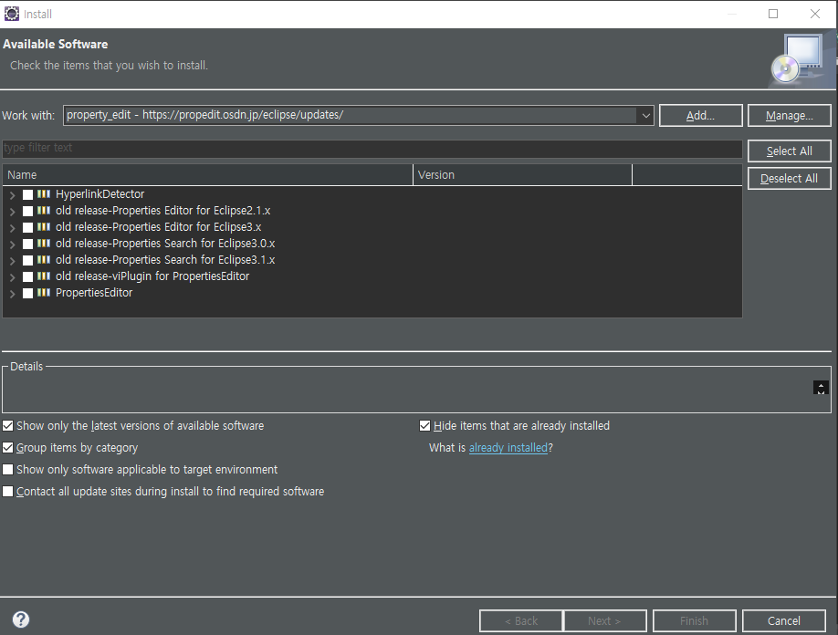

# 스프링 수업 23.10.19

## Application Scope

서버가 가동될 때부터 서버가 종료되는 시점까지의 범위이다.

ServletContext라는 클래스 타입의 객체로 관리된다. ServletContext는 Controller에서 주입받을 수 있다.

유효범위는 RequestScope < SessionScope < ApplicationScope이다.

jsp에서는 page가 있었지만 스프링에서는 PageScope이라는 개념은 없다.

### ApplicationScope 예제

SpringBean.java파일

```java
package kr.co.ezen.bean;

public class SpringBean {
	
	private String s1;
	private String s2;
	
	public String getS1() {
		return s1;
	}
	public void setS1(String s1) {
		this.s1 = s1;
	}
	public String getS2() {
		return s2;
	}
	public void setS2(String s2) {
		this.s2 = s2;
	}
	
	

}
```

TestController.java파일

```java
package kr.co.ezen.controller;

import javax.servlet.ServletContext;
import javax.servlet.http.HttpServletRequest;

import org.springframework.beans.factory.annotation.Autowired;
import org.springframework.stereotype.Controller;
import org.springframework.web.bind.annotation.GetMapping;

import kr.co.ezen.bean.SpringBean;

@Controller
public class TestController {
	
	// ApplicationScope은 ServletContext 클래스에서 관리한다.
	//@Autowired
	//ServletContext app; // Controller에서 주입 받을 수 있다.
	
	@GetMapping("/t1")
	public String t1(HttpServletRequest request) {
		
		ServletContext app = request.getServletContext();
		app.setAttribute("d1", "spring");
		
		SpringBean sb = new SpringBean();
		sb.setS1("d1");
		sb.setS2("d2");
		
		app.setAttribute("sb", sb);
		
		return "t1";	
		
	}
	
	// ApplicationScope의 값이 유지되는지 확인하기 위해
	// 값을 받아와서 콘솔에 출력해보고 s1.jsp로 이동
	// 객체의 값이 유지되는 것을 확인할 수 있다.
	@GetMapping("/s1")
	public String s1(HttpServletRequest request) {
		
		ServletContext app = request.getServletContext();
		
		String str = (String) app.getAttribute("d1");
		System.out.println(str); // 주입했던 spring이라는 문자열을 출력
		
		SpringBean s = (SpringBean) app.getAttribute("sb");
		return "s1"; // s1.jsp로 가서 화면에 값들을 출력한다.
	}
	
   

}
```

index.jsp파일

```html
<%@ page language="java" contentType="text/html; charset=UTF-8"
    pageEncoding="UTF-8"%>
<body>
   
   <a href="t1">t1</a>
   <a href="s1">s1</a>
   
</body>
</html>
```

s1.jsp파일

```html
<%@ page language="java" contentType="text/html; charset=UTF-8"
    pageEncoding="UTF-8"%>
<!DOCTYPE html>
<html>
<head>
<meta charset="UTF-8">
<title>Insert title here</title>
</head>
<body>
d1 : ${applicationScope.d1 }
s1 : ${applicationScope.sb.s1 }
s2 : ${applicationScope.sb.s2 }
</body>
</html>
```

t1.jsp파일

```html
<%@ page language="java" contentType="text/html; charset=UTF-8"
    pageEncoding="UTF-8"%>
<!DOCTYPE html>
<html>
<head>
<meta charset="UTF-8">
<title>Insert title here</title>
</head>
<body>
	t1
</body>
</html>
```

## 유효성 검사를 위해 필요한 소프트웨어 설치

이클립스의 Help 메뉴 → install new software → add 클릭 → 이름은 Property Editor으로 설정하고 Location에는 http://propedit.sourceforge.jp/eclipse/updates를 입력하고 add를 클릭한다. 만약 오류가 발생하면 http://osdn.net/projects/propedit/storage/eclipse/updates를 입력하고 add를 클릭한다.

안깔리면 https://propedit.osdn.jp/eclipse/updates/를 입력하고 add를 클릭한다.



이 상태가 되면 설치에 성공한 것이다.

PropertiesEditor만 체크하고 next를 누르고 동의사항 동의하고 완료하면 된다.

이렇게 사용해도 되고 전자정부 egovframe을 사용해도 된다. 전자정부 egovframe 4.0.0에는 이미 설치가 되어있기 때문이다.

## 전자정부 egovframe 4.0.0 세팅 방법

File → new → project → Spring Legacy Project 선택 후 next 클릭 → project name 설정하고 Templates에서 Spring MVC Project 선택 후 next 클릭 → 패키지 이름(나는 kr.co.ezen.controller 로 했음)을 입력하고 finish 클릭

이렇게 하면 xml로 세팅이 완료된 프로젝트 파일이 생성된다. 잘 세팅되었는지 확인을 위해 run을 돌려보면 다음과 같은 화면이 나오면 성공한 것이다. 이클립스에서는 Tomcat9.0을 사용했지만 전자정부 프로그램에서는 Tomcat8.5였다.

Test라는 이름으로 프로젝트파일명을 설정하고 패키지명을 kr.co.ezen으로 설정했더니 HomeController.java와 kr.co.ezen 패키지에서 에러가 발생한다.

## Properties

애플리케이션을 개발할 때 프로그램 실행 중 절대 변하지 않는 값(일종의 상수값) ⇒ Spring MVC에서는 이러한 값들을 properties 파일에 작성하고 사용할 수 있도록 함 ⇒ 프로퍼티파일을 jsp에서 사용하려 할 때 (화면에 출력) 설정해야 함 (프로퍼티 파일을 message로 등록해야 함)

@PropertySource, @PropertySources, @Value 어노테이션이 사용된다.

jsp에서 출력할 때 message 커스텀 태그를 사용한다. 사용하기 위해서 taglib을 설정해야 한다.

```html
<!-- 커스텀 태그 등록 (프로퍼티값을 사용해서 jsp에서 출력할 때 필요하다. -->
<%@ taglib prefix="spring" uri="http://www.springframework.org/tags" %>
```

WEB-INF 폴더에 properties라는 이름의 폴더를 생성하고 그 폴더 안에 new→file에서 d1.properties와 d2.properties 생성

properties파일의 주석은 #을 사용한다.

d1.properties파일(확장자명이 properties)

```
aaa.a1=1
aaa.a2=spring1

bbb.b1=2
bbb.b2=spring2
```

d2.properties파일(확장자명이 properties)

```
ccc.c1=3
ccc.c2=spring3

ddd.d1=4
ddd.d2=spring4
```

확장자명이 properties인 파일에서 선언한 것들은 상수가 된다.

HomeController.java파일

```java
package kr.co.ezen.controller;

import java.text.DateFormat;
import java.util.Date;
import java.util.Locale;

import org.springframework.stereotype.Controller;
import org.springframework.ui.Model;
import org.springframework.web.bind.annotation.RequestMapping;
import org.springframework.web.bind.annotation.RequestMethod;

/**
 * Handles requests for the application home page.
 */
@Controller
public class HomeController {
	
	@RequestMapping(value="/", method=RequestMethod.GET)
	public String home() {
		return "index";
	}
	
}
```

SpController.java파일

@PropertySource 어노테이션과 value 속성으로 중괄호로 묶은 경로들에서 값을 가져온다.

@Value 어노테이션과 EL언어로 해당 변수의 값을 가져와서 필드에 주입시킨다.(properties 파일에 있는 값들을 다 필드에 주입)

```java
package kr.co.ezen.controller;

import org.springframework.beans.factory.annotation.Value;
import org.springframework.context.annotation.PropertySource;
import org.springframework.stereotype.Controller;
import org.springframework.web.bind.annotation.GetMapping;

@Controller
//@PropertySource("WEB-INF/properties/d1.properties")
//@PropertySource("WEB-INF/properties/d2.properties")
@PropertySource(value = {"WEB-INF/properties/d1.properties", "WEB-INF/properties/d2.properties"})
public class SpController {

	@Value("${aaa.a1}")
	private int a1; // aaa.a1 값을 가져와서 a1에 주입
	
	@Value("${aaa.a2}")
	private String a2; // aaa.a2 값을 가져와서 a2에 주입
	
	@Value("${bbb.b1}")
	private int b1; // bbb.b1 값을 가져와서 b1에 주입
	
	@Value("${bbb.b2}")
	private String b2; // bbb.b2 값을 가져와서 b2에 주입
	
	@Value("${ccc.c1}")
	private int c1; // ccc.c1 값을 가져와서 c1에 주입
	
	@Value("${ccc.c2}")
	private String c2; // ccc.c2 값을 가져와서 c2에 주입
	
	@Value("${ddd.d1}")
	private int d1; // ddd.d1 값을 가져와서 d1에 주입
	
	@Value("${ddd.d2}")
	private String d2; // ddd.d2 값을 가져와서 d2에 주입

	// 프로퍼티 파일에 있는 값들을 다 필드에 주입 시킨다.
	@GetMapping("/t1")
	public String t1() {
		System.out.println(a1);
		System.out.println(a2);
		System.out.println(b1);
		System.out.println(b2);
		System.out.println(c1);
		System.out.println(c2);
		System.out.println(d1);
		System.out.println(d2);
		
		return "t1";
	}
	
	
	
	
	
	
}
```

index.jsp파일

```html
<%@ page language="java" contentType="text/html; charset=UTF-8"
    pageEncoding="UTF-8"%>
<!DOCTYPE html>
<html>
<head>
<meta charset="UTF-8">
<title>Insert title here</title>
</head>
<body>

<a href="t1">t1</a>

</body>
</html>
```

t1.jsp파일

```html
<%@ page language="java" contentType="text/html; charset=UTF-8"
    pageEncoding="UTF-8"%>
<!DOCTYPE html>
<html>
<head>
<meta charset="UTF-8">
<title>Insert title here</title>
</head>
<body>
t1
</body>
</html>
```

## java로 세팅해서 property 사용하기

### kr.co.ezen.config 패키지

ConfigClass.java파일

```java
package kr.co.ezen.config;

import javax.servlet.Filter;

import org.springframework.web.filter.CharacterEncodingFilter;
import org.springframework.web.servlet.support.AbstractAnnotationConfigDispatcherServletInitializer;

public class ConfigClass extends AbstractAnnotationConfigDispatcherServletInitializer {

	// 웹에서 사용할 Bean들을 정의하기 위한 클래스를 지정해야함
	@Override
	protected Class<?>[] getRootConfigClasses() {
		return new Class[] { RootAppContext.class };
	}

	// MVC설정위한 클래스 지정
	@Override
	protected Class<?>[] getServletConfigClasses() {
		return new Class[] { ServletAppContext.class };
	}

	// DispatcherServlet에 매핑할 요청주소를 세팅
	@Override
	protected String[] getServletMappings() {
		return new String[] { "/" };

	}
	// 파라미터 인코딩 필터 설정

	protected Filter[] getServletFilters() {

		CharacterEncodingFilter encodingFilter = new CharacterEncodingFilter();
		encodingFilter.setEncoding("UTF-8");
		return new Filter[] { encodingFilter };
	}

}
```

RootAppContext.java파일

```java
package kr.co.ezen.config;

import org.springframework.context.annotation.Bean;
import org.springframework.context.annotation.Configuration;
import org.springframework.web.context.annotation.ApplicationScope;
import org.springframework.web.context.annotation.SessionScope;

@Configuration
public class RootAppContext {
	
	
}
```

ServletAppContext.java파일

```java
package kr.co.ezen.config;

import org.springframework.context.annotation.Bean;
import org.springframework.context.annotation.ComponentScan;
import org.springframework.context.annotation.Configuration;
import org.springframework.context.support.ReloadableResourceBundleMessageSource;
import org.springframework.web.servlet.config.annotation.EnableWebMvc;
import org.springframework.web.servlet.config.annotation.ResourceHandlerRegistry;
import org.springframework.web.servlet.config.annotation.ViewResolverRegistry;
import org.springframework.web.servlet.config.annotation.WebMvcConfigurer;

@Configuration
@EnableWebMvc
@ComponentScan("kr.co.ezen.controller")
public class ServletAppContext implements WebMvcConfigurer {
	
	@Override
	public void configureViewResolvers(ViewResolverRegistry registry) {
		WebMvcConfigurer.super.configureViewResolvers(registry);
		registry.jsp("/WEB-INF/views/", ".jsp");
	}
	
	public void addResourceHandlers(ResourceHandlerRegistry registry) {

		WebMvcConfigurer.super.addResourceHandlers(registry);
		registry.addResourceHandler("/**").addResourceLocations("/resources/");
	}
	
	// 프로퍼티 파일을 메시지로 등록해야 한다. -> 그래야 jsp에서 띄울 수 있다.
	@Bean
	public ReloadableResourceBundleMessageSource messageSource() {
		
		ReloadableResourceBundleMessageSource re = new ReloadableResourceBundleMessageSource();
		
		re.setBasenames("/WEB-INF/properties/d1", "/WEB-INF/properties/d2");
		
		return re;
		
	}
	
	
	
	
	
	

}
```

### kr.co.ezen.controller 패키지

HomeController.java파일

```java
package kr.co.ezen.controller;

import org.springframework.stereotype.Controller;
import org.springframework.web.bind.annotation.RequestMapping;
import org.springframework.web.bind.annotation.RequestMethod;

@Controller
public class HomeController {
	
	@RequestMapping(value="/",method=RequestMethod.GET)
	public String home() {
		return "index";
	}
	
	
}
```

SpController.java파일

```java
package kr.co.ezen.controller;

import org.springframework.beans.factory.annotation.Autowired;
import org.springframework.beans.factory.annotation.Value;
import org.springframework.context.annotation.PropertySource;
import org.springframework.context.support.ReloadableResourceBundleMessageSource;
import org.springframework.stereotype.Controller;
import org.springframework.ui.Model;
import org.springframework.web.bind.annotation.GetMapping;

@Controller
public class SpController {
	
	// @Bean으로 등록한 것과 타입이 같아서 자동 주입 받는다.
	@Autowired
	ReloadableResourceBundleMessageSource re;
	
	
	@GetMapping("/t1")
	public String t1(Model mo) { // request 객체인 Model 객체에 담아서 값을 가지고 페이지 이동할 것이다.
		
		String s1 = re.getMessage("aaa.a1", null, null);
		String s2 = re.getMessage("bbb.b1", null, null);
		
		System.out.println(s1);
		System.out.println(s2);
		
		Object[]obj = {30, "tom", 7};
		String s3 = re.getMessage("aaa.a2", obj, null);
		
		System.out.println(s3);
		
		mo.addAttribute("obj", obj); // request 객체인 Model 객체에 담는다.
		
		return "t1";
	}
	

}
```

### webapp 폴더의 WEB-INF 폴더

properties 폴더 안의 d1.properties파일

```
aaa.a1=스프링
#formatting 작업
aaa.a2=나이는 {0}이고 이름은 {1} 이다 {2}
```

properties 폴더 안의 d2.properties파일

```
bbb.b1=스프링2
```

views폴더 안의 index.jsp파일

```html
<%@ page language="java" contentType="text/html; charset=UTF-8"
    pageEncoding="UTF-8"%>
<body>

<a href="t1">t1</a>

</body>
</html>
```

views폴더 안의 t1.jsp파일

```html
<%@ page language="java" contentType="text/html; charset=UTF-8"
    pageEncoding="UTF-8"%>
    <!-- 커스텀 태그 등록 (프로퍼티값을 사용해서 jsp에서 출력할 때 필요하다. -->
<%@ taglib prefix="spring" uri="http://www.springframework.org/tags" %>    
<!DOCTYPE html>
<html>
<head>
<meta charset="UTF-8">
<title>Insert title here</title>
</head>
<body>

<spring:message code="aaa.a1"></spring:message>
<spring:message code="bbb.b1"></spring:message>
<spring:message code="aaa.a2" arguments="${obj }"></spring:message>

</body>
</html>
```

## 유효성 검사

@Valid는 Controller의 메소드에서 주입받는 Bean에 @Valid를 설정하면 유효성 검사를 할 수 있다. 이때 반드시 BindingResult 객체를 주입받아야 한다.

BindingResult 객체는 errors라는 이름으로 request 영역에 저장된다.

JSR-303 규격의 어노테이션을 활용한다.

Properties를 이용해서 메시지를 설정할 수 있다.

유효성 검사를 통과하지 못하면 jsp화면에 정보를 출력하기 위해 codes[0]의 값을 가져오면 에러 메시지가 등록된다.

// str[0] : Max.springBean.d1이 그 예이다.

에러 종류.빈이름.프로퍼티이름 순서이고, 순서대로 적어야 한다.

### 세팅 방법

@Valid를 사용하기 위해서는 다음과 같은 방법이 필요하다.

Maven Repository에서 vaildation을 검색해서 Bean Vaildation API를 선택하고 가장 많이 쓰는 2.0.1.Final을 선택해서 Maven 코드를 복사해서 pom.xml에 붙여넣는다.

이후에 hibernate-validator를 검색해서 Hibernate Validator Engine을 선택하고 6.2.0.Final을 선택해서 Maven 코드를 복사해서 pom.xml에 붙여넣는다.

### 알아야 하는 어노테이션들


### 유효성 검사 예제

SpringBean.java파일

```java
package kr.co.ezen.bean;

import javax.validation.constraints.Max;
import javax.validation.constraints.Size;

public class SpringBean {
	
	// 50보다 큰 값이 들어오면 오류 발생
	@Max(50)
	private int d1;
	
	// 지정된 글자수보다 짧거나 길면 오류 발생(3글자 이상 10글자 이하)
	@Size(min=3, max=10)
	private String d2;

	public int getD1() {
		return d1;
	}

	public void setD1(int d1) {
		this.d1 = d1;
	}

	public String getD2() {
		return d2;
	}

	public void setD2(String d2) {
		this.d2 = d2;
	}
	
	
}
```

SpController.java파일

```java
package kr.co.ezen.controller;

import javax.validation.Valid;

import org.springframework.stereotype.Controller;

import org.springframework.validation.BindingResult;
import org.springframework.validation.ObjectError;
import org.springframework.web.bind.annotation.GetMapping;
import org.springframework.web.bind.annotation.PostMapping;

import kr.co.ezen.bean.SpringBean;

@Controller
public class SpController {
	
	@GetMapping("/t1")
	public String t1() {
		return "t1";
	}
	
	
	// 유효성 검사 결과(맞게 작성했는지 아닌지)를 사용하고 싶다면 반드시 BindingResult 객체를 주입 받아야 한다.
	// @Valid를 사용하면 SpringBean에서 주었던 @Max, @Size같은 어노테이션들을 유효성 검사로 사용할 수 있다.
	// BindingResult 객체는 에러를 확인하는 것이라 생각하면 된다.
	// BindingResult 객체는 request 영역에 저장된다.(errors라는 이름으로)
	@PostMapping("/check")
	public String check(@Valid SpringBean sbean, BindingResult result) {
		
		System.out.println(result);
		
		// 만약 유효성 검사가 위배된다면
		if(result.hasFieldErrors()) {
			for(ObjectError obj : result.getAllErrors()) {
				System.out.println("메시지" + obj.getDefaultMessage());
				System.out.println("코드명" + obj.getCode());
				System.out.println("오브젝트명" + obj.getObjectName());
				
				String[] str = obj.getCodes();
				// str[0] : Max.springBean.d1
				// str[1] : Max.d1
				// str[2] : Max.int
				// str[3] : Max
				
				for(String s : str) {
					System.out.println(s);
				}
				
				if(str[0].equals("Max.springBean.d1")) {
					System.out.println("d1은 50이하여야한다!!"); // 에러메시지 띄우기
				}
				else if(str[0].equals("Size.springBean.d2")) {
					System.out.println("d2는 3~10글자여야 한다!!"); // 에러메시지 띄우기
				}
				
				
			}
			return "t1";
		}
		
		// 유효성 검사가 위배되지 않았다면(어노테이션에 맞게 입력되었다면)
		return "t2";
	}
	
	

}
```

index.jsp파일

```html
<%@ page language="java" contentType="text/html; charset=UTF-8"
    pageEncoding="UTF-8"%>
<body>

<a href="t1">t1</a>

</body>
</html>
```

t1.jsp파일

```html
<%@ page language="java" contentType="text/html; charset=UTF-8"
    pageEncoding="UTF-8"%>
<%@ taglib prefix="spring" uri="http://www.springframework.org/tags" %>
<%@ taglib prefix="c" uri="http://java.sun.com/jsp/jstl/core" %>
<body>

<form action="check" method="post">
   d1: <input type="text" name="d1"><br>
   
   <spring:hasBindErrors name="springBean">
      <c:if test="${errors.hasFieldErrors('d1') }">
         ${errors.getFieldError('d1').defaultMessage }<br>
      </c:if>
   </spring:hasBindErrors>
   
   d2: <input type="text" name="d2"><br>
   
   <spring:hasBindErrors name="springBean">
      <c:if test="${errors.hasFieldErrors('d2') }">
         ${errors.getFieldError('d2').defaultMessage }<br>
      </c:if>
   </spring:hasBindErrors>
   
   <button type="submit">check</button>
   
   
</form>

</body>
</html>
```

t2.jsp파일

```html
<%@ page language="java" contentType="text/html; charset=UTF-8"
    pageEncoding="UTF-8"%>
<!DOCTYPE html>
<html>
<head>
<meta charset="UTF-8">
<title>Insert title here</title>
</head>
<body>
	d1 : ${springBean.d1 }
	d2 : ${springBean.d2 }
</body>
</html>
```

결과 화면


### 유효성 검사 예제2(properties 활용)

error.properties파일(에러 메시지를 properties파일에 다 등록한다.)

```
Max.springBean.d1=50이하여야한다!!
Size.springBean.d2=3~10글자여야 한다!!
```

ServletAppContext.java파일(프로퍼티 파일을 메시지로 등록해야 한다.)

```java
package kr.co.ezen.config;

import org.springframework.context.annotation.Bean;
import org.springframework.context.annotation.ComponentScan;
import org.springframework.context.annotation.Configuration;
import org.springframework.context.support.ReloadableResourceBundleMessageSource;
import org.springframework.web.servlet.config.annotation.EnableWebMvc;
import org.springframework.web.servlet.config.annotation.ResourceHandlerRegistry;
import org.springframework.web.servlet.config.annotation.ViewResolverRegistry;
import org.springframework.web.servlet.config.annotation.WebMvcConfigurer;

@Configuration
@EnableWebMvc
@ComponentScan("kr.co.ezen.controller")
public class ServletAppContext implements WebMvcConfigurer {
	
	@Override
	public void configureViewResolvers(ViewResolverRegistry registry) {
		WebMvcConfigurer.super.configureViewResolvers(registry);
		registry.jsp("/WEB-INF/views/", ".jsp");
	}
	
	public void addResourceHandlers(ResourceHandlerRegistry registry) {

		WebMvcConfigurer.super.addResourceHandlers(registry);
		registry.addResourceHandler("/**").addResourceLocations("/resources/");
	}
	
	// 프로퍼티 파일을 메시지로 등록해야 한다. -> 그래야 jsp에서 띄울 수 있다.
	@Bean
	public ReloadableResourceBundleMessageSource messageSource() {
		
		ReloadableResourceBundleMessageSource re = new ReloadableResourceBundleMessageSource();
		
		re.setBasename("WEB-INF/properties/error");
		
		return re;
		
	}
	
}
```

SpringBean.java파일

```java
package kr.co.ezen.bean;

import javax.validation.constraints.Max;
import javax.validation.constraints.Size;

public class SpringBean {
	
	// 50보다 큰 값이 들어오면 오류 발생
	@Max(50)
	private int d1;
	
	// 지정된 글자수보다 짧거나 길면 오류 발생(3글자 이상 10글자 이하)
	@Size(min=3, max=10)
	private String d2;

	public int getD1() {
		return d1;
	}

	public void setD1(int d1) {
		this.d1 = d1;
	}

	public String getD2() {
		return d2;
	}

	public void setD2(String d2) {
		this.d2 = d2;
	}
	
	
}
```

SpController.java파일

```java
package kr.co.ezen.controller;

import javax.validation.Valid;

import org.springframework.stereotype.Controller;

import org.springframework.validation.BindingResult;
import org.springframework.validation.ObjectError;
import org.springframework.web.bind.annotation.GetMapping;
import org.springframework.web.bind.annotation.PostMapping;

import kr.co.ezen.bean.SpringBean;

@Controller
public class SpController {
	
	@GetMapping("/t1")
	public String t1(SpringBean sbean) {
		return "t1";
	}
	
	
	// 유효성 검사 결과(맞게 작성했는지 아닌지)를 사용하고 싶다면 반드시 BindingResult 객체를 주입 받아야 한다.
	// @Valid를 사용하면 SpringBean에서 주었던 @Max, @Size같은 어노테이션들을 유효성 검사로 사용할 수 있다.
	// BindingResult 객체는 에러를 확인하는 것이라 생각하면 된다.
	// BindingResult 객체는 request 영역에 저장된다.(errors라는 이름으로)
	@PostMapping("/check")
	public String check(@Valid SpringBean sbean, BindingResult result) {
		
		// 유효성 검사를 만족하지 못하면(에러가 있다면)
		if(result.hasErrors()) {
			return "t1";
		}
		// 유효성 검사를 만족한다면(에러가 없다면)
		return "t2";
	
	

	}
	
}
```

index.jsp파일

```html
<%@ page language="java" contentType="text/html; charset=UTF-8"
    pageEncoding="UTF-8"%>
<body>

<a href="t1">t1</a>

</body>
</html>
```

t1.jsp파일(form태그 활용)

```html
<%@ page language="java" contentType="text/html; charset=UTF-8"
    pageEncoding="UTF-8"%>
<%@ taglib prefix="spring" uri="http://www.springframework.org/tags" %>
<%@ taglib prefix="c" uri="http://java.sun.com/jsp/jstl/core" %>
<%@ taglib prefix="form" uri="http://www.springframework.org/tags/form" %>
<body>

<!-- @Vaild에 해당하는 springBean을 modelAttribute에 적어야 한다. -->
<!-- 유효성 검사를 만족하지 못할 경우 기존에 입력한 값을 보여주기 위해 form 설정 -->
<form:form action="check" method="post" modelAttribute="springBean">
	d1 : <form:input path="d1" type="text"/>
		<form:errors path="d1"/><br>
	d2 : <form:input path="d2" type="text"/>
		<form:errors path="d2"/><br>
		
		<form:button type="submit">check</form:button>
</form:form>

</body>
</html>
```

t2.jsp파일

```html
<%@ page language="java" contentType="text/html; charset=UTF-8"
    pageEncoding="UTF-8"%>
<!DOCTYPE html>
<html>
<head>
<meta charset="UTF-8">
<title>Insert title here</title>
</head>
<body>
	d1 : ${springBean.d1 }
	d2 : ${springBean.d2 }
</body>
</html>
```

결과 화면

잘못 입력했을 때


정상적으로 입력했을 때

