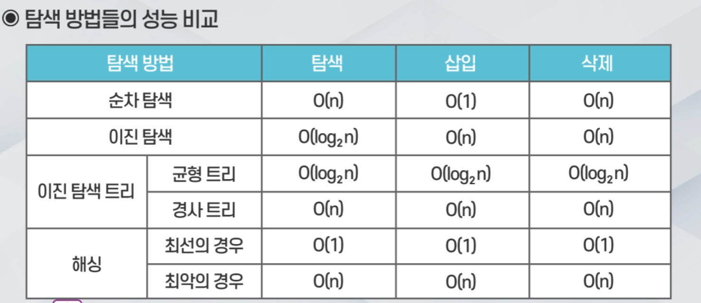

# 자료구조 인강 23.09.09

## 해싱(Hashing)

고급 탐색 구조이다.

탐색 연산의 시간 복잡도가 O(1)이다.

하지만 큰 테이블이 필요하고 이것이 해시 테이블이다.

해싱은 키 값에 대한 산술적 연산을 통해 해시 테이블에서의 엔트리가 있을 위치(주소)를 바로 계산하는 방법이다. 키 값을 비교하는 방식인 순차 탐색, 이진 탐색 등과는 다르며 키 값에 대한 산술적 연산을 사용한다.

키를 저장할 때 키는 해시 함수에 의해서 해시 주소로 변환되고 해시 주소는 해시 테이블에서 키에 해당하는 값이 저장되어 있는 곳을 가리킨다.

## 해시 테이블(Hash Table)

해시 테이블은 키 값의 연산에 의해 계산된 주소를 직접 접근할 수 있어야 한다.

해시 테이블은 어떤 주소의 엔트리를 O(1)에 접근해야 하므로 배열 구조가 적합하다.

## 충돌과 오버플로우

충돌은 서로 다른 키가 해시 함수에 의해 같은 주소로 계산되는 상황이다.

오버플로우는 해시 충돌이 해시 테이블의 하나의 버킷의 슬롯의 수보다 많이 발생하는 것을 말한다.

## 이상적인 해싱과 실제의 해싱

이상적인 해싱은 오버 플로우가 일어나지 않는 경우이다. 충분히 테이블을 크게 하면 이상적인 해싱이 가능하며 탐색의 시간 복잡도는 O(1)이 된다. 하지만 테이블을 크게 만들수록 메모리 문제가 생긴다.

따라서 실제 해싱에서는 테이블을 무한히 늘릴 수는 없어서 적절한 해시 함수를 사용해서 주소를 계산해야 한다.

실제 해싱에서는 충돌과 오버 플로우가 빈번하게 발생하며, 선형 조사법, 체이닝 등의 오버 플로우 처리 방안이 제시되어야 한다.

## 오버 플로우 처리 방법

개방 주소법(Open Addressing), 체이닝(Chaining) 등이 있다.

개방 주소법은 오버 플로우가 일어나면 항목을 해시 테이블의 다른 위치에 저장하는 방식으로 오버 플로우를 처리한다. 개방 주소법의 예로는 선형 조사법, 이차 조사법, 이중 해싱법, 임의 조사법 등이 있다.

체이닝은 해시 테이블의 하나의 위치에 여러 개의 항목을 저장할 수 있도록 하는 방식으로 오버 플로우를 처리한다.

## 해시 함수

해시 함수는 충돌이 적어야 하고, 함수 값이 테이블의 주소 영역 내에서 고르게 분포 되어야 한다. 또한 계산은 빠를 수록 좋다.

해시 함수에는 제산 함수, 폴딩 함수, 중간 제곱 함수, 비트 추출 함수, 숫자 분석 방법 등이 있다.

제산 함수는 h(k) = k mod M이다. 해시 테이블의 크기 M은 보통 소수(Prime Number)를 선택한다.

폴딩 함수는 탐색키, 이동 폴딩, 경계 폴딩을 사용한다.

중간 제곱 함수는 탐색키를 제곱한 다음, 중간의 몇 비트를 취해서 해시 주소를 생성한다.

비트 추출 함수는 키를 이진수로 간주하고, 임의의 위치의 k개의 비트를 사용한다.

숫자 분석 방법은 키에서 편중되지 않는 수들을 테이블의 크기에 적합하게 조합한다.

## 선형 조사법(Linear Probing)

선형 조사법은 충돌이 일어나면 해시 테이블의 다음 위치에서 비어있는 버킷을 찾는 방법이다.

빈 버킷을 찾는 위치는 h(k)+1, h(k)+2, …  이렇게 계속 다음 위치를 찾아가면서 비어있는 위치를 찾는다.

빈 버킷이 나오면 저장한다.

## 이차 조사법(Quadratic Probing)

충돌이 발생하면 바로 다음 위치가 아닌 제곱을 이용한 위치를 찾는다.

충돌한 위치에서 +1, +4, +9, +16, … 이렇게 계속 제곱된 만큼 위치를 찾아가면서 비어있는 위치에 저장한다.

이차 조사법은 군집화를 줄여주는 효과가 있다.

## 이중 해싱법(Double Hashing)

이중 해싱법은 재해싱(Rehashing)하는 방법을 사용한다.

충돌이 발생하면 다른 해시 함수를 이용해서 다음 위치를 계산한다.

이중 해싱법은 군집화를 줄여주는 효과가 있다.

## 체이닝

체이닝은 해시 테이블의 하나의 위치에 여러 개의 항목을 저장할 수 있도록 하는 방법이다.

링크드 리스트나 배열 구조를 사용해서 만들 수 있다.

충돌이 일어나면 새롭게 체인이 생성되어 하나의 버킷에 여러 항목이 저장될 수 있다.

이론상 하나의 위치에 무한한 항목을 저장할 수 있지만, 이렇게 할 경우 해싱의 성능이 저하되는 문제가 있다.

## 해싱의 성능

해싱의 적재 밀도(Loading Density) 또는 적재 비율을 통해 성능을 파악한다.

적재 밀도 또는 적재 비율은 저장되는 항목의 개수 n과 해시 테이블의 크기 M의 비율을 뜻한다.(n/m)

선형 조사법의 경우에는 아무리 많이 넣어도 n개가 들어가기 때문에 적재 밀도는 1이 최대이다. 따라서 선형 조사법은 적재 밀도가 0~1의 값을 가진다.

선형 조사법은 적재 밀도가 0.5 이하를 유지하는 것이 좋고, 이차 조사법과 이중 해싱은 0.7 이하로 유지하는 것이 좋다.

체이닝은 항목의 개수가 무한히 늘어날 수 있기 때문에 적재 밀도는 0~무한대의 값을 가진다.

체이닝은 적재 밀도에 비례하는 성능을 보이고, 항목의 수가 균등하게 분포되는 것이 유리하다.

## 탐색 방법들의 성능 비교, 시간 복잡도

## 트리

트리는 계층적인 관계를 가진 자료의 표현에 적합한 자료구조이다.

트리는 비선형 자료구조의 하나이다. 일렬로 나열하기 어렵기 때문이다.

트리의 예로는 회사의 조직도, 컴퓨터의 폴더 구조 등이 있다.

## 자유 트리

사이클이 없는 연결 그래프이다.

## 루트를 가진 트리

자유 트리의 노드들 중에서 하나를 루트로 선택한 경우이다.

일반적으로 트리는 루트를 가진 트리를 가리킨다.

## 트리의 용어

노드 : 트리에서 하나의 원이다.

노드의 차수(Degree) : 각 노드마다 가지고 있는 자식의 수

루트 노드 : 부모가 없는 최상위 노드

트리의 차수 : 모든 노드의 차수 중에서 가장 큰 값

레벨 : 각 층에 번호를 매기는 것이다. 보통 루트 노드의 레벨을 1로 매긴다.

트리의 높이 : 트리의 최대 레벨

포레스트 : 트리의 집합

경로, 단순 경로 : 길, 간선이 중복되지 않는 길

트리에는 경로가 1개 밖에 없다.

자식 노드 : 어떤 노드 바로 밑의 노드

자손 노드 : 어떤 노트 밑의 모든 노드

단말 노드 : 자식이 하나도 없는(차수가 0인) 노드

비단말 노드 : 자식이 하나라도 있는 노드

## 트리의 성질

트리에서는 노드의 개수가 n이면 간선(노드를 연결하는 선)의 수는 반드시 n-1개이다.

트리의 두 노드 사이에는 단 하나의 단순 경로가 존재한다.

단순 경로는 같은 노드나 간선을 중복해서 가지 않는 경로이다.

## 일반 트리

일반 트리는 트리의 노드들이 임의의 개수의 자식을 가질 수 있는 트리로, 각 노드의 차수의 제한이 없는 트리이다.

일반 트리의 표현 방법은 상당히 복잡하기 때문에 보통은 이진 트리가 주로 사용된다.

## 이진 트리

이진 트리는 모든 노드의 차수가 2 이하이다.(자식 노드의 개수가 2개 이하)

이진 트리는 왼쪽 자식과 오른쪽 자식의 정확한 구분이 필요하다.

이진 트리는 순환적으로 정의된다.

이진 트리는 공집합이거나 루트와 왼쪽 서브 트리, 오른쪽 서브 트리로 구성된 노드들의 집합이다.

이진 트리의 서브 트리들은 모두 이진 트리여야 한다.

## 포화 이진 트리(Full Binary Tree)

트리의 각 레벨에 노드가 꽉 차 있는 이진 트리이다. 이진 트리이므로 루트 노드 1개에서 시작해서 각 레벨마다 노드는 2배씩 늘어나기 때문에 높이가 h이면 2^h -1 개의 노드를 가진다.

## 완전 이진 트리(Complete Binary Tree)

높이가 h일때 레벨 1부터 h-1까지는 노드가 모두 채워진다.

마지막 레벨 h에서는 노드가 순서대로 채워지며 모두 채워질 필요는 없다.

힙(Heap)이 대표적인 완전 이진 트리의 예이다.

## 이진 트리의 성질

이진 트리도 일반 트리와 똑같이 노드의 개수가 n개이면 간선의 개수는 n-1개이다.

루트 노드만 부모가 없고 다른 노드는 모두 부모를 갖는다.

이진 트리는 높이가 h이면 최소 h개 ~ 최대 2^h -1개의 노드를 가진다.

n개 노드의 이진 트리의 높이는 최소 log2 (n+1)개 ~ n개의 높이를 가진다.

## 이진 트리 표현 방법

배열 구조로 표현하는 방법은 트리의 노드를 배열에 저장한다. 트리가 일단 포화 이진 트리라고 가정하고 노드에 위에서 아래로, 각 레벨에서는 왼쪽에서 오른쪽으로 인덱스를 부여한다. 이때 인덱스는 루트 노드를 인덱스 1로 사용하고 1씩 증가한다.

트리의 높이가 h인 경우 높이가 h인 포화 이진 트리의 노드의 수인 2^h -1개만큼 배열을 2^h 개 크기로 준비하고 각 노드에 부여된 인덱스 순서대로 배열에 추가한다.

노드가 없는 배열은 비어있어서 경사 트리에서는 많은 빈 공간이 나타날 수도 있다.

배열 구조로 표현하면 부모 노드와 자식 노드의 인덱스 계산에서 노드 i의 부모 노드 인덱스는 i/2가 되고, 노드 i의 왼쪽 자식 노드 인덱스는 2*i, 노드 i의 오른쪽 자식 노드 인덱스는 2*i+1이다.

연결된 구조로 표현하는 방법은 노드가 데이터와 두 개의 링크를 가진다.

각 링크 중 하나는 왼쪽 자식을 위한 링크이고, 나머지 하나는 오른쪽 자식을 위한 링크이다.

연결된 구조로 표현하는 방법에서는 노드 클래스를 정의해야 한다. 클래스 내에서 왼쪽 자식을 가리키기 위한 left 링크와 오른쪽 자식을 가리키기 위한 right 링크를 정의해야 한다.

## 이진 트리의 표준 순회와 레벨 순회

순회(Traversal)는 트리에 속하는 모든 노드를 한 번씩 방문하는 것이다.

선형 자료구조는 순회가 단순하지만 트리는 순회에 다양한 방법이 있다.

순회는 전위 순회(Preorder Traversal), 중위 순회(Inorder Traversal), 후위 순회(Postorder Traversal), 레벨 순회 등이 있다.

전위 순회, 중위 순회 후위 순회가 표준 순회에 해당한다.

전위 순회의 처리 순서는 루트 노드 → 왼쪽 서브 트리 → 오른쪽 서브 트리 순서이다.

전위 순회는 노드의 레벨 계산에서 부모 노드(루트 노드)의 레벨이 계산되어야 자식 노드의 레벨이 계산될 수 있다.

전위 순회는 책의 목차와 같은 순서로 노드를 방문할 수 있다.

중위 순회의 처리 순서는 왼쪽 서브 트리 → 루트 노드 → 오른쪽 서브 트리 순서이다.

후위 순회의 처리 순서는 왼쪽 서브 트리 → 오른쪽 서브 트리 → 루트 노드 순서이다.

후위 순회는 폴더 용량 계산 등에 응용할 수 있다.

이진 트리이므로 전체 트리나 서브 트리나 구조는 동일하다. 따라서 표준 순회는 순환 구조로 기술되며 순환이 진행될수록 문제의 크기는 줄어든다.

레벨 순회는 노드를 레벨 순으로 검사하는 순회 방법이다.

레벨 순회는 트리의 전체 구조를 이해하기 쉽고, 큐를 사용해서 구현하며, 순환을 사용하지 않는다는 특징이 있다.

레벨 순회는 맨 처음에는 루트 노드만 큐에 있다. 이후에 큐에서 노드를 꺼내고 출력을 하고 꺼낸 노드의 왼쪽과 오른쪽 노드를 순서대로 큐에 삽입한다. 이때 노드가 없으면 삽입하지 않는다. 이 과정을 큐가 공백이 될 때까지 진행하면 큐에서 꺼내진 순서대로 처리하게 된다.

## 이진 트리와 관련된 연산들

### 간단한 연산들

노드 개수 : 트리의 모든 노드의 수를 세는 연산

좌우 서브 트리의 노드 수를 먼저 구하고 1을 더한 값이 노드의 개수라는 아이디어로 접근하면 후위 순회 방식으로 접근하고, 좌우 서브 트리는 원래의 트리보다 작아야 하며 종료 조건은 서브 트리가 공백 트리이면 노드의 수로 0을 반환하면 된다. 순환(재귀)을 적용해서 공백 노드가 아니면 순환 호출을 사용한다.

단말 노드의 수 : 트리의 모든 단말 노드의 수를 세는 연산

노드 개수 연산과 방법이 유사하다. 종료 조건은 노드가 공백이면 0을 반환하고, 노드가 단말이면 1을 반환하면 된다. 공백도 아니고 단말 노드도 아니라면 좌우 서브 트리의 결과를 단순히 더해서 반환하고, 이 과정을 순환(재귀)을 적용한다.

트리의 높이 : 트리의 높이를 계산

좌우 서브 트리의 높이를 먼저 구하면 최종 트리의 높이는 왼쪽과 오른쪽 중에서 더 높은 자식 트리의 높이에 +1을 해주면 트리의 높이가 나온다. 후위 순회 방식을 사용한다.

### 좀 더 복잡한 연산

이진 트리가 완전 이진 트리인가?

임의의 노드의 레벨을 계산하라.

이진 트리가 균형 잡혀 있는가?

루트부터 모든 자식 노드까지의 경로의 길이는?

좌우로 대칭된 트리를 구하라.

## 힙(Heap)

힙은 가장 크거나 가장 작은 값을 빠르게 찾아내도록 만들어진 자료구조이다.

힙은 완전 이진 트리 구조로 되어 있다.

힙은 우선 순위 큐를 구현하는 가장 좋은 방법이다.

힙은 느슨한 정렬 상태만을 유지하여 큰 값이 상위 레벨, 작은 값이 하위 레벨에 있다.

힙은 최대 힙과 최소 힙으로 나눌 수 있다.

최대 힙은 부모의 키 값이 자식 노드의 키 값보다 크거나 같은 완전 이진 트리이다.

최소 힙은 부모의 키 값이 자식 노드의 키 값보다 작거나 같은 완전 이진 트리이다.

## 힙의 연산

연산들은 힙의 특성을 유지하도록 동작하여야 한다.

구조적인 특성은 완전 이진 트리여야 한다.

순서 특성은 최대 힙 또는 최소 힙을 만족해야 한다.

힙의 삽입 연산은 새로운 항목을 힙에 추가하는 연산으로 추가 후 힙의 특성을 반드시 유지해야 한다.

힙의 삭제 연산은 루트 노드를 꺼내 반환하는 연산이다. 마찬가지로 힙의 특성을 유지해야 한다.

삭제 연산에서는 힙의 루트 노드가 최대 또는 최소 우선 순위 노드이기 때문에 루트를 꺼내서 반환한다는 것은 최대/최소 우선 순위 노드를 삭제하는 것으로 우선 순위 큐와 비슷한 개념이라고 볼 수 있다.

## 이진 탐색 트리

효율적인 탐색을 위한 이진 트리 기반의 자료구조

삽입, 삭제, 탐색이 O(log n)의 시간 복잡도이다.

이진 탐색 트리는 트리를 이용하는 것이고, 이진 탐색은 단순히 리스트에 정렬 시킨 데이터를 이용해서 탐색하는 방법이라는 차이가 있다.

## 이진 탐색 트리의 정의

모든 노드는 유일한 키를 가져야 한다.

왼쪽 서브 트리의 키들은 루트의 키보다 작다.

오른쪽 서브 트리의 키들은 루트의 키보다 크다.

왼쪽과 오른쪽 서브 트리도 모두 이진 탐색 트리여야 한다.

단말 노드는 더 이상 검사할 필요는 없다.

이진 탐색 트리는 완전 이진 트리의 구조일 필요는 없다. 이진 탐색 트리의 조건만 만족하면 된다.

## 이진 탐색 트리의 연산

이진 탐색 트리에서 가장 중요한 연산은 탐색 연산이다. 이외에도 삽입, 삭제 등의 연산도 있다.

탐색 연산은 키를 이용한 탐색, 값을 이용한 탐색, 최대 노드와 최소 노드 탐색이 있다.

키를 이용한 탐색은 효율적인 탐색이 이루어지지만 값을 이용한 탐색은 효율이 좋지 않을 수도 있다.

삽입 또는 삭제 연산에서는 새로운 노드가 트리에 추가되거나 기존의 노드가 삭제된다. 삽입, 삭제가 이루어질 때는 이진 탐색 트리의 특성이 그대로 유지되어야 한다.

## 이진 탐색 트리의 구현 방법

이진 탐색 트리를 구현할 때는 연결된 구조가 유리하다. 완전 이진 트리 구조를 보장하지 않기 때문이다.

이젠 탐색 트리를 위한 노드의 구조는 엔트리(탐색키, 키에 대한 값)의 형태와 좌우 자식 노드에 대한 링크 필드로 구성된다.

## 이진 탐색 트리의 탐색 연산

### 키를 이용한 탐색

키를 기준으로 이진 탐색 트리가 구성된다. 이후 루트 노드부터 탐색을 시작한다.

현재 노드가 찾는 키 값이면 탐색이 성공한다.

현재 노드보다 찾는 키 값이 더 작으면 왼쪽 서브 트리를 탐색한다.

현재 노드보다 찾는 키 값이 더 크면 오른쪽 서브 트리를 탐색한다. 이진 탐색 트리는 부모 노드에 비해 왼쪽 노드는 더 작은 값이고, 오른쪽 노드는 더 큰 값이기 때문이다.

만약 탐색을 진행하다가 서브 트리가 공백 노드가 되면 찾는 값이 없다는 것이고, 탐색이 실패한다.

### 값을 이용한 탐색

이진 탐색 트리는 값에 의해 정렬되어 있지 않다. 따라서 효율적인 탐색이 불가능하다.

값을 이용해서 탐색하려면 트리의 순회 알고리즘을 이용해서 모든 노드를 검사해야 한다. 전위, 중위, 후위, 레벨 순회 등을 사용할 수 있다.

값을 이용한 탐색의 시간 복잡도는 키를 이용한 탐색보다 더 높다.

### 최대 노드와 최소 노드 탐색

가장 작은 노드는 트리의 가장 왼쪽 밑에 있는 노드이다.

가장 큰 노드는 트리의 가장 오른쪽 밑에 있는 노드이다.

## 이진 탐색 트리의 삽입 연산

삽입 연산을 위해서는 먼저 키 값을 탐색해야 한다.

탐색에 실패한 위치가 노드를 삽입해야 하는 위치이다.

삽입 연산 알고리즘은 우선 루트에서부터 탐색 연산을 진행한다. 이후 탐색이 성공하면 값이 있는 것이므로 중복을 허용하지 않기 때문에 삽입하지 않는다. 만약 다음 탐색 위치가 None이라서 탐색에 실패하면 해당 위치에 삽입한다.

삽입 연산의 구현 방법은 순환 구조 또는 반복 구조로 구현한다.

## 이진 탐색 트리의 삭제 연산

삭제 연산은 3가지 경우로 나누어 처리한다.

삭제하려는 노드가 단말 노드일 경우, 삭제하려는 노드가 왼쪽이나 오른쪽 서브 트리 중 하나만 가지고 있는 경우, 삭제하려는 노드가 두 개의 서브 트리 모두 가지고 있는 경우로 나누어 처리한다.

먼저 단말 노드를 삭제할 경우에는 삭제하고자 하는 단말 노드의 부모 노드를 찾아서 그 부모 노드의 해당 자식을 None으로 처리한다. 하지만 예외가 있다. 이진 탐색 트리의 노드가 루트 노드만 있어서 노드가 1개일 때는 부모 노드가 없기 때문에 부모 노드가 None이 된다. 이럴 때는 그 루트 노드를 None으로 처리하도록 하면 된다.  이렇게 되면 공백 트리가 된다.

둘째, 삭제하려는 노드가 왼쪽이나 오른쪽 서브 트리 중 하나만 가지고 있는 경우, 즉 자식이 하나인 노드를 삭제하려는 경우에는 자신의 유일한 자식을 부모의 자식으로 연결한다. 하지만 예외가 있다. 루트 노드를 삭제하는 경우에는 예외가 발생한다. 이때는 루트 노드를 삭제하고 루트 노드의 유일한 자식이 루트 노드가 된다.

셋째, 삭제하려는 노드가 왼쪽과 오른쪽 서브 트리 둘다 가지고 있는 경우, 즉 두 개의 자식을 가진 노드를 삭제하려는 경우에는 가장 비슷한 값을 가진 노드를 삭제 위치로 가져온다. 이후 후계 노드를 선택한다. 삭제할 위치에 왼쪽 서브 트리의 가장 큰 노드나 오른쪽 서브 트리의 가장 작은 노드가 들어가면 이진 탐색 트리의 조건을 계속 만족한다.

## 이진 탐색 트리 연산들의 성능

이진 탐색 트리의 연산들에는 키를 이용한 탐색, 값을 이용한 탐색, 최대/최소 노드 탐색, 삽입 연산, 삭제 연산이 있다.

연산들의 성능은 값을 이용한 탐색은 트리의 노드 수에 비례하고, 나머지 연산들은 트리의 높이에 비례한다.

## 이진 탐색 트리의 균형화

### AVL 트리

Adelson-Velskii와 Landis에 의해 1962년에 제안된 트리이다.

평균, 최선, 최악의 시간 복잡도가 모두 O(log n)을 보장한다.

### AVL 트리의 정의

트리의 모든 노드에서 왼쪽 서브 트리와 오른쪽 서브 트리의 높이 차가 1을 넘지 않는 이진 탐색 트리를 만족해야 한다. 즉, 모든 노드의 균형 인수(왼쪽 서브 트리 높이와 오른쪽 서브 트리 높이의 차이)는 0이나 -1 또는 +1 이어야 한다.

### AVL 트리의 연산

탐색 연산은 이진 탐색 트리와 동일하다.

삽입 연산과 삭제 연산에서 균형 상태가 깨질 수 있다.

삽입 연산은 삽입 위치에서 루트까지의 경로에 있는 조상 노드들의 균형 인수에 영향을 미친다. 따라서 삽입 후에 불균형 상태로 변한 가장 가까운 조상 노드(균형 인수가 +2 또는 -2가 된 가장 가까운 조상 노드)의 서브 트리들에 대하여 다시 재균형 상태로 만든다. 이때 회전을 사용한다. 삽입 노드부터 균형 인수가 +2 또는 -2가 된 가장 가까운 조상 노드까지 회전한다.

삽입 연산의 회전 과정의 예시는 다음과 같다.

### 균형이 깨지는 4가지 경우(LL타입, LR타입, RL타입, RR타입)

균형이 깨지는 4가지 경우는 LL타입, LR타입, RL타입, RR타입이 있고, 각각 회전은 LL회전, LR회전, RL회전, RR회전으로 4가지가 있다.

다음은 LL 회전의 방법이다.

다음은 RR 회전의 방법이다. RR회전은 LL회전과 정확히 반대 방향으로 돌면 된다.

다음은 RL 회전의 방법이다. RL 회전은 먼저 LL 회전을 진행하고 이후에 RR 회전을 진행한다.

다음은 LR 회전의 방법이다. LR 회전은 RL 회전과 정확히 반대로 회전한다. 즉, RR회전을 먼저 진행하고 이후에 LL회전을 진행한다.

## 그래프

그래프는 복잡하게 연결되어 있는 객체들 사이의 연결 관계를 표현할 수 있는 자료구조이다.

그래프는 가장 일반적인 형태의 자료구조이다.

트리도 그래프의 일종이기 때문에 그래프에 포함된다고 볼 수 있다.

일상에서 볼 수 있는 그래프의 예로는 역이나 도시의 연결 관계를 표현한 지하철 노선도, 소자들의 연결 관게를 나타내는 전기 회로, 학습과 인식을 위한 데이터 흐름을 나타내는 딥러닝 분야의 그래프 등이 있다.

## 그래프의 정의

그래프 G는 (V, E)로 표시된다.

V는 정점(Vertices) 또는 노드(Node)이다.

E는 간선(Edge) 또는 링크(Link)로 정점들 간의 관계를 의미한다.

위 그래프는 시각적으로 달라보이지만 모든 정점 사이의 관계가 동일하므로 같은 그래프라고 본다.

이처럼 모든 정점 사이의 관계가 동일하면 같은 그래프이다.

## 그래프의 종류

무방향 그래프 : 간선에 방향성이 없는 그래프, 즉 간선에 화살표가 없는 그래프이다.

방향 그래프 : 간선에 방향성이 있는 그래프, 즉 간선에 화살표가 있는 그래프이다.

가중치 그래프 : 네트워크라고도 한다. 간선에 비용이나 가중치가 할당된 그래프이다.

다음은 비용이 할당된 가중치 그래프의 예시이다.

부분 그래프 : 어떤 그래프의 부분 그래프라고 하면 해당 그래프를 구성하는 정점의 집합과 간선의 집합의 부분 집합으로 구성된 그래프를 말하는 것이다.

다음은 부분 그래프의 예시이다.

## 그래프의 용어

정점(Vertices) 또는 노드(Node) : 그래프의 각 요소

간선(Edge) 또는 링크(Link) : 그래프의 요소를 잇는 선

인접 정점 : 간선에 의해 직접 연결된 정점

정점의 차수 : 정점에 연결된 간선의 수를 말한다. 무방향 그래프의 경우에는 모든 정점의 차수의 합이 간선 수의 2배이다. 하나의 간선이 두 개의 정점의 차수에 해당되기 때문이다.

방향 그래프의 정점의 차수는 진입 차수와 진출 차수로 나뉜다.

방향 그래프의 진입 차수 : 각 정점에 들어오는 간선의 수를 말한다.

방향 그래프의 진출 차수 : 각 정점에서 다른 정점을 향해 나가는 간선의 수를 말한다.

모든 진입 차수의 합은 간선의 수이고, 모든 진출 차수의 합도 간선의 수이다.

그래프의 경로에는 무방향 그래프와 방향 그래프 모두 정점의 나열과 경로에 해당되는 간선들이 존재해야 한다.

경로의 길이 : 경로를 구성하는 데 사용된 간선의 수이다.

단순 경로 : 경로 중에서 반복되는 간선이 없는 경로이다.

사이클 : 시작 정점과 종료 정점이 동일한 경로이다.

연결 그래프(Connected Graph) : 모든 정점들 사이에 경로가 존재하는 그래프

트리 또는 자유 트리 : 사이클을 가지지 않는 연결 그래프

완전 그래프(Complete Graph) : 모든 정점들 사이에 간선이 존재하는 그래프

N개의 정점을 가진 무방향 완전 그래프의 간선의 수는 n*(n-1)/2개이다. n개의 모든 정점이 n-1개의 간선을 가지고 있고 2개의 정점마다 1개의 간선을 사용하기 때문에 2로 나눠주는 것이다.

## 그래프의 추상 자료형

그래프의 데이터와 연산은 다음과 같다.

## 그래프의 표현 방법

그래프도 배열 구조나 연결된 구조로 표현할 수 있다.

그래프를 배열 구조로 표현하는 방법을 인접 행렬(Adjacent Matrix)을 이용한 표현이라고 한다. 행렬을 이용해서 정점들의 연결 관계(간선 정보)를 표시한다.

그래프를 연결된 구조로 표현하는 방법을 인접 리스트(Adjacent List)를 이용한 표현이라고 한다. 각 정점과 연결된 인접 정점 리스트를 이용해서 연결 관계를 표시한다. 인접 리스트로 표현할 때 더 이상 인접 정점이 없으면 리스트의 맨 마지막 노드의 링크 필드는 None이 된다.

## 그래프를 표현할 때 인접 행렬과 인접 리스트의 복잡도 비교

그래프를 인접 행렬과 인접 리스트로 표현하는 방법의 복잡도를 비교하면 공간 복잡도(메모리 사용량)는 인접 행렬은 간선의 수에 무관하게 항상 n^2개의 메모리 공간이 필요하다. 따라서 정점에 비해 간선의 수가 매우 많은 조밀 그래프(Dense Graph)에서 효과적이다.

인접 리스트는 n개의 연결 리스트, 2e개의 노드가 필요해서 n+2e개의 메모리 공간이 필요하다. 따라서 정점에 비해 간선의 개수가 매우 적은 희소 그래프(Sparse Graph)에서 효과적이다.

어떤 그래프의 특정 간선에 접근할 때 인접 행렬은 정점 u와 정점 v를 연결하는 간선의 유무는 M[u][v]를 조사하면 바로 알 수 있기 때문에 시간 복잡도가 O(1)이다. 반면 인접 리스트는 정점 u의 연결 리스트 전체를 조사해야 하므로 정점 u의 차수를 d라고 하면 시간 복잡도가 O(d)가 된다. 따라서 정점 u, v 사이의 간선에 접근하는 연산은 인접 행렬이 인접 리스트보다 효율적이다.

정점 v의 차수를 계산할 때 인접 행렬은 정점 v에 해당하는 행을 조사하면 되므로 O(n)의 시간 복잡도를 가진다. 반면 인접 리스트는 정점 v의 차수는 v의 연결 리스트의 길이를 반환하는 것으로 정점 v의 차수가 d라고 하면 시간 복잡도가 O(d)가 된다. 따라서 정점의 차수를 계산하는 연산은 인접 행렬보다 인접 리스트가 효율적이다.

정점 v의 모든 인접 정점을 구할 때 인접 행렬은 정점 v에 해당 행의 모든 요소를 검사하므로 시간 복잡도가 O(n)이 된다. 반면 인접 리스트는 정점 v에 간선으로 직접 연결된 모든 정점을 구하는 연산도 해당 연결 리스트의 모든 요소를 방문해야 하기 때문에 시간 복잡도는 O(d)가 된다. 하지만 이때 d는 항상 n보다 작은 값이 된다. 따라서 모든 인접 정점을 구하는 연산은 인접 행렬보다 인접 리스트가 효율적이다.

그래프의 모든 간선의 수를 계산할 때 인접 행렬은 그래프에 존재하는 모든 간선의 수를 알아내려면 인접 행렬 전체를 조사해야 하므로 n^2번의 조사가 필요하다. 시간 복잡도는 O(n^2)이 된다. 반면 인접 리스트는 전체 간선의 수를 알아내려면 헤더 노드를 포함하여 모든 인접 리스트를 조사해야 하므로 시간 복잡도는 O(n+e)가 된다. 따라서 간선의 개수가 매우 적은 희소 그래프에서는 인접 리스트가 훨씬 더 효율적이다.

## 파이썬을 이용한 그래프의 표현

인접 행렬은 2차원 배열을 사용해서 표현할 수 있고, 인접 리스트는 연결 리스트, 파이썬 리스트, 파이썬 집합 등을 사용해서 표현할 수 있다. (정점, 인접 리스트) 형태의 엔트리를 딕셔너리에 저장할 수도 있다.

이처럼 파이썬을 이용하면 그래프를 다양한 방법으로 표현할 수 있다.

인접 행렬을 이용해서 그래프를 표현하면 간선 (i, j)가 있으면 M[i][j]의 값을 1 또는 true로 설정하고 없으면 0 또는 false로 설정한다. 무방향 그래프는 인접 행렬이 대각선을 기준으로 대칭된다.

반면 방향 그래프는 인접 행렬이 대칭이 아니다.