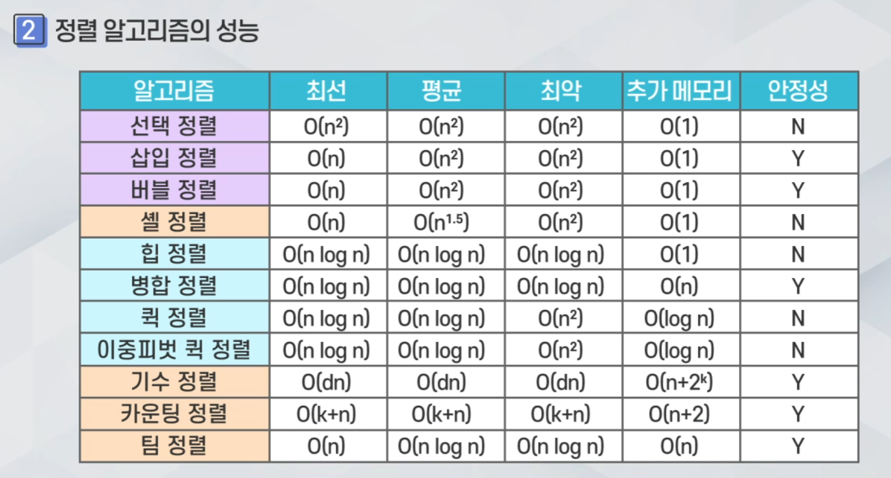

# 자료구조 인강 23.09.10

## 그래프 탐색의 개념

그래프 탐색 전략은 모든 정점을 체계적으로 방문할 수 있어야 한다.(완전 탐색이 가능해야 함)

깊이 우선 탐색, 너비 우선 탐색이 있다.

## 깊이 우선 탐색(DFS, Depth-First-Search)

한 방향으로 끝까지 가다가 더 이상 갈 수 없게 되면 가장 가까운 갈림길로 돌아와서 다른 방향ㅇ로 다시 탐색을 진행한다.

되돌아가기 위한 방법으로는 스택에 갈 수 있는 다른 길을 저장한다.

## 너비 우선 탐색(BFS, Breadth-First-Search)

시작 정점으로부터 가까운 정점을 먼저 방문하고 멀리 떨어져 있는 정점을 나중에 방문하는 순회 방법이다. 큐를 사용해서 구현한다.

## 탐색 알고리즘 성능 비교

깊이 우선 탐색과 너비 우선 탐색을 인접 행렬로 표현하면 O(n^2)의 시간 복잡도, 인접 리스트로 표현하면 O(n+e)의 시간 복잡도를 갖는다.

완전 그래프와 같은 조밀 그래프는 인접 행렬이 탐색에 더 유리하고, 희소 그래프는 인접 리스트가 유리하다.

## 연결 성분 검사

연결 성분(Connected Component)는 원래 그래프의 최대로 연결된 부분 그래프들을 말한다.

연결 성분 검사는 DFS나 BFS를 반복적으로 적용하면서 연결된 정점들을 모두 출력하고, 아직 연결되지 않은 정점을 다시 선택해서 이 과정을 반복한다.

## 신장 트리(Spanning Tree)

신장 트리는 연결 그래프 내의 모든 정점을 포함하는 트리이다.

사이클을 포함해서는 안되고 간선의 수는 n-1개이다.

신장 트리 알고리즘에서는 깊이 우선 탐색이나 너비 우선 탐색 도중에 만나는 간선들을 모은다.

## 위상 정렬(Topological Sort)

위상 정렬은 방향 그래프에 대해 정점들의 선행 순서를 위배하지 않으면서 모든 정점을 나열하는 것이다.

위상 정렬이 가능하려면 방향 그래프에 사이클이 존재하지 않아야 한다.

위상 정렬 전략에는 축소 정복(Decrease-And-Conquer) 전략이 있다. 진입 차수가 0인 정점을 반복적으로 그래프에서 삭제하는 것이다. 이때 관련된 간선들도 삭제하고 이에 따른 나머지 정점들의 진입 차수를 갱신한다.

## 가중치 그래프(Weighted Graph)

가중치 그래프는 간선에 가중치가 할당된 그래프이다.

가중치 그래프를 인접 행렬로 표현하면 행렬의 각 요소에 0이나 1이 아니라 가중치 값을 저장한다. 만약 간선이 없으면 무한대 값의 가중치로 표시한다.

가중치 그래프를 인접 리스트로 표현하면 인접 리스트의 각 노드에 가중치를 추가한다.

보통 가중치 그래프는 인접 행렬로 표현하는 것이 더 간단하다.

## 최소비용 신장 트리(Minimum Spanning Tree, MST)

최소비용 신장 트리는 간선들의 가중치 합이 최소인 신장 트리이다.

최소비용 신장 트리는 도로, 통신, 배관 건설에서 모두 연결하면서 길이/비용을 최소화 하는 경우, 전기 회로에서 단자를 모두 연결하면서 전선의 길이를 최소화 하는 경우 등에 사용할 수 있다.

MST 알고리즘에는 Kruskal 알고리즘과 Prim 알고리즘 등이 있다.

Kruskal 알고리즘은 탐욕적 기법(Greedy Method)을 사용한다. 탐욕적 기법은 그 순간에 최적이라고 생각되는 방법을 반복적으로 선택한다. 각 단계에서 최선의 답을 선택해서 최종 목표에 도달한다. 하지만 항상 최적의 해답을 주지는 않기 때문에 주의해야 한다.

Kruskal 알고리즘에서는 그래프의 모든 간선을 가중치에 따라 오름차순으로 정렬하고, 가장 가중치가 작은 간선 e를 뽑는다. e를 신장 트리에 넣었을 때 사이클이 생기면 넣지 않고 다시 가장치가 가장 작은 간선을 뽑는다. 만약 사이클이 생기지 않으면 최소 신장 트리에 간선 e를 삽입하고 N-1개의 간선이 삽입될 때까지 다시 가장 작은 간선을 뽑는 과정부터 반복한다.

Prim 알고리즘은 하나의 정점에서부터 시작하여 트리를 단계적으로 확장한다. 현재의 신장 트리 집합에 인접한 정점 중 최저 간선으로 연결된 정점을 선택하여 신장 트리 집합에 추가할 때 탐욕적 기법을 사용한다. 이 과정을 n-1개의 간선을 가질 때까지 반복한다.

Prim 알고리즘에서는 그래프에서 시작 정점을 선택하여 초기 트리를 만든다. 이후 현재 트리의 정점들과 인접한 정점들 중에서 간선의 가중치가 가장 작은 정점 v를 선택한다. 정점 v와 이때의 간선을 트리에 추가한다. 이 과정을 모든 정점이 추가될 때까지 정점 v를 선택하는 과정으로 돌아가서 계속 반복한다.

즉, Prim 알고리즘은 현재까지 만들어진 MST의 인접 정점들 중에서 간선 가중치가 최소인 정점을 반복적으로 선택해서 트리를 확장하는 것이다.

Prim 알고리즘의 시간 복잡도는 O(n^2)이다. 이때 n은 그래프의 정점의 개수이다. 주 반복문이 n번 , 내부 반복문이 n번 반복되기 때문에 O(n^2)이 나온다. 완전 그래프와 같이 밀집한 그래프에 유리하다.

Kruskal 알고리즘의 시간 복잡도는 O(e log e)이다. 따라서 희박한 그래프(Sparse Graph)에서는 Kruskal 알고리즘이 더 유리하다.

## union-find 알고리즘

서로소(Disjoint)인 부분 집합을 다루는 알고리즘이다. 서로소는 어떤 집합도 교집합을 했을 때 공통 원소가 없는 것이다.

Union 연산은 두 집합의 합집합을 만드는 연산이고, Find 연산은 어떤 원소 x가 속한 집합을 찾는 연산으로 보통은 그 집합의 대표 원소를 반환한다.

## 최단 경로 문제

가중치 그래프에서 두 정점을 연결하는 여러 경로들 중에서 간선들의 가중치 합이 최소가 되는 경로를 찾는 문제이다. 최단 시간 경로, 최단 거리 경로 등이 있다.

최단 경로 문제는 3가지 정도로 나눌 수 있다. 시작 정점에서 도착 정점까지의 최단 경로 길이, 시작 정점에서 다른 모든 정점까지의 최단 경로 길이, 모든 정점 간의 최단 경로 길이를 구하는 것으로 나누어 진다.

최단 경로 문제에서는 가중치 그래프를 인접 행렬로 표현할 때 간선이 없으면 가중치를 무한대로 처리한다.

보통 최단 경로 문제는 인접 행렬로 표현한다.

## Dijkstra 전략

Dijkstra의 알고리즘은 시작 정점에서 다른 모든 정점까지의 최단 경로를 계산하는 알고리즘이다.

Dijkstra는 탐욕적 기법을 사용한다. 최단 거리가 확정된 정점들과 간선들로 직접 연결된 정점들 중에서 가장 가까운 정점 u를 선택한다. u까지의 거리를 확정 하고 u를 제외한 남은 정점들의 거리를 갱신하는 방식으로 시작 정점에서 다른 모든 정점까지의 최단 겅로 거리를 계산할 수 있다.

Dijkstra의 알고리즘으로 시작 정점에서 다른 정점까지 최단 경로를 계산하는 시간 복잡도는 O(n^2)이 된다. 주 반복문을 n번 반복, 내부 반복문을 2n번 반복한다. 

Dijkstra로 모든 정점 쌍의 최단 경로를 구할 수도 있는데 이때는 다시 n번 반복해야 되기 때문에 시간 복잡도는 O(n^3)이 된다.

## Floyd의 전략

Floyd 알고리즘은 모든 정점 사이의 최단 경로 거리를 찾는 알고리즘이다. Floyd-Warshall 알고리즘 이라고도 한다.

Floyd 알고리즘은 동적 계획(Dynamic Programming) 전략을 이용한다.

Floyd 알고리즘은 모든 정점 사이의 최단 경로 거리를 구하려면 모든 정점을 거치는 상황을 고려해서 어떤 정점을 하나도 거치지 않고 바로 가는 경로에서부터 시작한다. 정점을 하나씩 순차적으로 고려했을 때 경로를 갱신하고, 최종적으로 모든 정점을 고려한 경로 거리를 구한다.

Floyd 알고리즘의 시간 복잡도는 O(n^3)이 된다. 모든 정점 쌍의 최단 경로 거리를 구하기 위해 3중 반복문을 실행하고 매우 간결한 반복 구문을 사용한다.

## 병합 정렬

병합 정렬은 분할 정복 기법을 사용하고, 연속적인 분할과 병합을 이용한다.

리스트를 균등 분할하고 분할된 부분 리스트를 순환적으로 정렬한다.

정렬된 부분 리스트의 병합 과정이 중요하다.

병합 알고리즘은 임시 리스트가 필요하기 때문에 제자리 정렬이 아니다. 따라서 새로운 리스트에 정렬된 결과를 만들고 다시 원래 리스트에 복사해야 하므로 추가적인 메모리가 발생한다는 단점이 있다.

병합 정렬은 크기 n인 리스트를 균등 분할 하므로 log(n)개의 패스가 발생하고 각 패스에서 레코드 n개를 비교할 때 n번 비교 연산이 발생한다.

병합 정렬에서 이동 횟수는 각 패스에서 2n번 이동이 발생하므로 전체 이동 횟수는 2n * log(n)이 된다.

따라서 시간 복잡도는 O(n log n)으로 정렬에서의 최적의 알고리즘이 된다.

병합 정렬은 최적, 평균, 최악의 경우에도 동일한 시간 복잡도를 갖는다.

병합 정렬은 안정성을 만족한다.

## 퀵 정렬, 이중 피벗 퀵 정렬

퀵정렬은 분할 정복 기법을 사용하고, 피벗을 이용하여 분할하고, 정렬한다.

퀵 정렬은 리스트를 2개의 부분 리스트로 비균등 분할을 한다.

분할을 위해서 피벗을 사용한다. 피벗을 이용한 분할은 값을 이용한 분할이 아니다. 즉 위치에 따른 분할이 아니다.

각각의 부분 리스트는 다시 퀵 정렬을 이용해서 정렬한다. 이때 순환 호출(재귀)을 사용한다.

피벗은 리스트의 어떤 항목이 되든 괜찮고, 분할할 때 피벗을 기준으로 피벗보다 작은 값은 왼쪽으로 피벗보다 큰 값은 오른쪽으로 오도록 분할한다.

이 과정을 피벗의 좌우 분할 리스트에 반복하면 모든 분할이 완료될 때 정렬이 완료되어 병합 과정이 필요없다.

피벗은 이미 제 위치를 찾았기 때문에 따로 정렬할 필요가 없다.

퀵 정렬은 최선의 경우가 균등하게 분할되었을 때이고, 이때 패스의 수가 log n개가 되고, 시간 복잡도는 최선의 경우 O(n log n)이 된다. 하지만 최악의 경우는 이미 정렬될 리스트를 정렬하는 것으로 이때 패스 수는 n개가 되고 시간 복잡도는 O(n^2)가 된다.

퀵 정렬의 평균적인 시간 복잡도는 O(n log n)이다.

퀵 정렬은 불필요한 데이터의 이동을 줄이고, 먼 데이터를 교환한다. 분할 후 피벗은 추후 연산에서 제외된다.

퀵 정렬에서는 불균등 완화 방법이 필요하고 이 방법에는 Median of three 등이 있다.

퀵 정렬은 제자리 정렬이며, 안정성은 만족하지 않는다.

## 힙 정렬

힙 정렬은 제자리 정렬로 구현하는 정렬 방법이다.

힙 정렬은 최소 힙이 있다면 입력 리스트의 모든 항목을 최소 힙에 다 넣고 하나씩 꺼내면 우선 순위가 가장 낮은 항목부터 나오므로 정렬이 가능하다.

힙 정렬은 삽입 연산과 삭제 연산이 모두 O(log n)이다. 전체 정렬의 시간 복잡도는 O(n log n)이 된다.

힙 정렬의 문제점으로는 입력 리스트가 필요하기 때문에 추가적인 메모리가 필요하고, 입력 리스트 이외에도 힙(최대 힙 또는 최소 힙)이 필요하다는 것이 있다.

힙 정렬을 추가적인 메모리가 필요하지 않도록 제자리 정렬로 구현하는 방법이 있다. 정렬되지 않은 리스트를 최대 힙으로 만들고, 최대 힙을 다시 정렬된 리스트로 만드는 방법이다.

정렬되지 않은 리스트를 최대 힙으로 만드는 과정을 heapify라고 한다. 이때 리스트의 앞쪽 절반만 처리한다. 뒤 쪽 절반은 트리로 표현했을 때 부모 자식 관계가 아니므로 이미 힙을 이루고 있다고 할 수 있다. 그리고 downHeap을 통해 최대 힙 조건을 유지한다.

heapify 알고리즘은 현재 위치(i)의 왼쪽과 오른쪽 자식 중에 더 큰 자식이 자신보다 크면 자신을 자식과 교환한다. 순환 호출을 통해 이 과정을 자식에서 반복한다.

최대 힙에서 정렬된 배열로 만드는 과정에서는 힙의 루트를 반복적으로 꺼내고, 이렇게 꺼내진 최댓값을 배열의 맨 뒤쪽부터 저장한다. 이후 다시 heapify를 해서 재구성하고 다시 최댓값을 뽑아서 배열에 저장한다. 이러한 과정을 반복하면 최대 힙의 크기가 하나씩 줄어들고, 정렬된 부분의 크기는 하나씩 늘어난다. 모든 값을 뽑으면 정렬된 리스트가 나온다.

## 기수, 카운팅 정렬

기수, 카운팅 정렬은 비교가 아니라 분배를 이용해서 정렬한다.

키 값에 제한이 있다.

기수 정렬은 레코드를 비교하지 않고 분배하여 정렬을 수행한다.

비교 기반 정렬의 하한(더 빠를 수 없는 가장 빠른 속도)인 O(n log n) 보다 좋을 수 있다.

퀵 정렬, 병합 정렬 등은 비교 기반 정렬이다.

기수 정렬의 시간 복잡도는 O(dn)이다. 대부분 d는 10보다 작다. 거의 선형 알고리즘 정도로 정렬을 할 수 있다.

기수 정렬의 단점은 정렬할 수 있는 레코드의 타입이 제한되어 정수나 단순 문자(알파벳 등)만 가능해서 실수나 한글, 한자 등에 적용하기는 어렵다. 비교 기반 정렬은 모든 종류의 키에 적용 가능하지만 기수 정렬은 그렇지 않다.

기수 정렬 알고리즘은 단순히 자릿수에 따라 숫자를 버킷에 넣었다가 꺼내면 정렬된다. 버킷은 큐로 이루어진다.

여러 자릿수의 기수 정렬은 낮은 자릿수로 분류하고 순서대로 읽고 높은 자릿수로 분류하는 과정으로 이루어진다.

기수 정렬에서 버킷(큐)의 개수는 키의 표현 방법과 밀접한 관계가 있다. 예를 들어 32비트 정수에서 이진법을 사용하면 버킷 2개, 32개의 자릿수에 대해 반복하고, 십진법을 사용하면 버킷 10개, 10개의 자릿수에 대해 반복하고, 16진법을 사용하면 버킷 16개, 8개의 자릿수에 대해 반복한다.

기수 정렬의 시간 복잡도는 n개의 레코드, d개의 자릿수 키의 기수 정렬에서 메인 루프는 자릿수 d번 반복하고, 큐에 n개 레코드 입력을 수행하므로 O(dn)이 된다. 이때 d는 대부분 d는 10 이하이고, d가 10 이하이면 거의 선형 시간에 처리할 수 있는 알고리즘이다. 하지만 실수, 한글, 한자로 이루어진 키는 정렬하지 못한다.

## 분할 정복(Divide and Conquer) 전략

문제를 보다 작은 2개의 문제로 분리하고 각 문제를 해결한 다음, 결과를 모아서 원래의 문제를 해결하는 전략이다.

원래의 문제를 분리한 작아진 문제들을 정복하여 해답을 낸 다음에 해답을 병합하고 원래의 문제의 해답을 낸다. 만약 작아진 문제들이 충분히 작지 않다면 다시 분할한다.

분할 정복 전략은 분할 과정, 정복 과정, 병합 과정으로 구분된다.

분할 과정에서는 리스트를 두 개의 부분 리스트로 나누고 균등 분할한다.

정복 과정에서는 리스트의 항목이 하나가 되고, 항목이 하나이면 정복된 것과 같다고 본다.

병합 과정에서는 정복된 부분 리스트를 병합하여 더 큰 부분 리스트로 만든다. 이 때 효율적인 병합 알고리즘이 필요하다.

## 다양한 정렬 알고리즘들

### 셸(Shell) 정렬

리스트를 일정 간격(gap)의 부분 리스트로 나눈다. 나뉘어진 각각의 부분 리스트를 삽입 정렬한다. 이후 간격을 줄이고, 간격이 1이 될 때까지 이 과정을 반복한다.

셸 정렬은 삽입 정렬이 어느 정도 정렬된 리스트에서 빠른 것을 이용한다.

부분 리스트가 점진적으로 정렬된 상태가 되므로 삽입 정렬 속도가 증가한다.

셸 정렬의 시간 복잡도는 최악의 경우에는 O(n^2)이고, 평균적인 경우에는 O(n^1.5)이다.

### 이중 피벗 퀵 정렬

2개의 피벗을 사용하는 퀵 정렬으로, 일반적인 경우 퀵 정렬보다 우수하다.

자바나 안드로이드의 시스템 정렬로 사용된다.

퀵 정렬에서는 보통 가장 왼쪽 항목을 피벗으로 선택하곤 하지만, 이중 피벗 퀵 정렬은 양 끝의 항목을 피벗으로 선택한다. 만약 오른쪽 수가 왼쪽 수보다 작으면 교환해서 정렬하고, 남은 리스트를 3개로 분할한다.(왼쪽 피벗보다 작은 값, 피벗들 사이의 값, 오른쪽 피벗보다 큰 값으로 분할한다.)

한 번의 분류에서 피벗 2개의 위치가 정렬되고, 부분 리스트가 3개로 나눠져 하나의 부분 리스트의 크기가 작아지므로 퀵 정렬보다 우수하다.

### 카운팅 정렬

기수 정렬처럼 분배 기반의 정렬이다.

카운팅 정렬은 일정한 범위를 가진 정수의 정렬에 효과적이다.

모든 수의 범위가 0~9 사이라는 가정처럼 어떤 범위에 대한 가정이 있어야 한다.

어떤 키 값이 나올 때마다 몇 번 나왔는지를 카운팅 한다.

### 하이브리드 정렬

두 가지 이상의 알고리즘을 섞은 정렬 알고리즘이다.

예를 들면 팀 정렬이 있다. 팀 정렬은 파이썬의 기본 정렬 알고리즘으로 사용된다. 삽입 정렬과 병합 정렬에 기반을 둔 알고리즘이며, 여러 가지 최적화 기법을 사용한다.

### 다양한 정렬 알고리즘의 성능 비교

