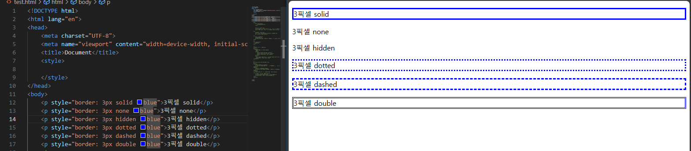

# 프론트엔드 수업 23.09.01

## css 스타일 실습

```html
<!DOCTYPE html>
<html lang="en">
<head>
    <meta charset="UTF-8">
    <meta name="viewport" content="width=device-width, initial-scale=1.0">
    <title>Document</title>
    <style>
        div{
            border: 1px solid black;
        }
        .box1{
            background-color: black;
            width: 100%;
            height: 100%;
        }
        h2{
            text-indent: 20px;
            color:white;
        }
        h3{
            color:red;
            text-align: center;
        }
        p{
            text-align: center;
            font-weight: 700;
        }
        blue{
            color: blue;
        }
    </style>
</head>
<body>
    <div>
        <div class="box1">
            <h2>확인하세요</h2>
        </div>
    
    
        <h3>주문 및 배송</h3>
        <p><blue>오후 2시 이전</blue>주문 건은 당일 발송합니다.</p>
        <p>2시 이후 주문건은 다음날 발송합니다.(주말 제외)</p>
    
    <hr>
        <h3>교환 및 환불</h3>
        <p>불만족시 <blue>100% 환불</blue>해 드립니다.</p>
        <p>고객센터로 전화주세요</p>
    
    <hr>
        <h3>고객센터</h3>
        <p>0000-0000</p>
        <p><small>상담시간 : 오전 9시~ 오후6시(토/일,공휴일 휴무)</small></p>
    </div>
</body>
</html>
```

위 코드는 내가 만든 것이고 같은 것을 선생님은 다르게 만들었다. padding과 margin을 사용하여 만든 선생님의 답은 다음과 같다.

```html
<!DOCTYPE html>
<html lang="ko">
  <head>
    <style>
      h2 {
        background-color: black;
        color: white;
        padding: 20px;
        margin: 0;
      }
      div {
        border: 1px solid black;
      }
      p {
        text-align: center;
        font-weight: bold;
      }
      h3 {
        text-align: center;
        color: red;
      }
      span {
        color: blue;
      }
    </style>
  </head>
  <body>
    <h2>확인하세요</h2>
    <div>
      <h3>주문 및 배송</h3>
      <p>
        <span>오후 2시 이전</span>주문 건은 당일 발송합니다. <br />
        2시 이후 주문건은 다음날 발송합니다.(주말 제외)
      </p>
      <hr />

      <h3>교환 및 환불</h3>
      <p>
        불만족시 <span>100% 환불</span>해 드립니다.<br />
        고객센터로 전화주세요
      </p>
      <hr />

      <h3>고객센터</h3>
      <p>
        0000-0000 <br />
        <small>상담시간 : 오전 9시~ 오후6시(토/일,공휴일 휴무)</small>
      </p>
    </div>
  </body>
</html>
```

### border의 스타일 지정

```html
<body>
    <p style="border: 3px solid blue">3픽셀 solid</p>
    <p style="border: 3px none blue">3픽셀 none</p>
    <p style="border: 3px hidden blue">3픽셀 hidden</p>
    <p style="border: 3px dotted blue">3픽셀 dotted</p>
    <p style="border: 3px dashed blue">3픽셀 dashed</p>
    <p style="border: 3px double blue">3픽셀 double</p>
</body>
```



### border-radius와 border-style

```html
<!DOCTYPE html>
<html lang="en">
<head>
    <meta charset="UTF-8">
    <meta name="viewport" content="width=device-width, initial-scale=1.0">
    <title>Document</title>
    <style>
        p{
            background-color: violet;
            width: 300px;
            padding: 20px;
            text-align: center;
        }
        #r1{
            border-radius: 50px;
        }
        #r2{
            /* 시계방향으로 적용된다
            top left, top right, bottom right, bottom left
            */
            border-radius: 0px 20px 40px 60px;
        }
        #r3{
            /* 2개만 적으면 첫번째가 top left, bottom right
            두번째가 top right, bottom left
            이렇게 대칭을 이룬다. */
            border-radius: 0px 20px;
        }
        #r4{
            border-radius: 50px;
            /* border-style로 테두리의 스타일을 지정 가능 */
            border-style: dotted;
        }
    </style>
</head>
<body>
    <p id="r1">반지름 50픽셀 둥근 모서리</p>
    <p id="r2">반지름 0,20,40,60픽셀 둥근 모서리</p>
    <p id="r3">반지름 0,20,0,20픽셀 둥근 모서리</p>
    <p id="r4">반지름 50픽셀 둥근 점선 모서리</p>
</body>
</html>
```


### 블록요소와 인라인 요소

<블록 요소>

div, ul, ol, li, p, table 등의 태그들이 있다.

크기값을 지정할 수 있다(width, height 지정 가능)

한 줄에 한 개만 배치할 수 있다.

상하좌우에 margin을 모두 설정할 수 있다.

기본 너비값은 100%이다.

<인라인 요소>

span, a, strong, textarea 등의 태그들이 있다.

크기값을 지정할 수 없다(width, height를 지정해도 값이 반영되지 않는다)

한 줄에 여러 개를 배치할 수 있다.

상하에 margin을 설정할 수 없다.(margin을 설정하면 좌우 margin만 반영된다)

기본 너비값은 컨텐츠가 가진 너비값이다. 

다음은 블록요소와 인라인 요소를 비교하기 위한 예제이다.

```html
<!DOCTYPE html>
<html lang="en">
<head>
    <meta charset="UTF-8">
    <meta name="viewport" content="width=device-width, initial-scale=1.0">
    <title>Document</title>
    <style>
        span{
            border: 1px solid black;
            /* 인라인 요소는 width, height 지정 불가능 */
            width: 400px;
            height: 100px;
            /* 인라인 요소는 상하 margin 설정 불가능 */
            margin: 20px;
        }
        
        div{
            border: 5px solid black;
            /* 블록 요소는 width, height 지정 가능 */
            width: 400px;
            height: 100px;
            /* 블록 요소는 상하좌우 margin 설정 가능 */
            margin: 20px;
            padding: 20px;
        }
    </style>
</head>
<body>
    <span>인라인 구성요소..ㅋㅋㅋㅋㅋㅋㅋㅋㅋㅋ</span>
    <span>인라인 구성요소..ㅋㅋㅋㅋㅋㅋㅋㅋㅋㅋ</span>
    <span>인라인 구성요소..ㅋㅋㅋㅋㅋㅋㅋㅋㅋㅋ</span>

    <div>블록 구성요소..ㅎㅎㅎㅎㅎㅎㅎㅎㅎㅎㅎㅎ</div>
    <div>블록 구성요소..ㅎㅎㅎㅎㅎㅎㅎㅎㅎㅎㅎㅎ</div>
    <div>블록 구성요소..ㅎㅎㅎㅎㅎㅎㅎㅎㅎㅎㅎㅎ</div>
</body>
</html>
```


### text-shadow

글자에 그림자를 넣을 수 있다.

그림자에는 blur 값도 설정할 수 있다.

text-shadow의 값은 원본 텍스트와 그림자 텍스트 사이의 수직거리, 수평거리, blur값, 색깔 순서로 적용한다.

```html
<!DOCTYPE html>
<html lang="en">
<head>
    <meta charset="UTF-8">
    <meta name="viewport" content="width=device-width, initial-scale=1.0">
    <title>Document</title>
    <style>
        div.red {
	        text-shadow : 3px 3px red;
        }
        div.blur {
    	    text-shadow : 3px 3px 5px red;
        }

    </style>
</head>
<body>
    <div class="red">Drop Shadow</div>
    <div class="blur">Drop Shadow</div>
```

## 배치 기능


### 박스의 유형 제어 : display 속성

display 속성의 값을 block으로 설정하면 블록요소의 박스가 된다. width, height로 크기 조절이 가능하고, margin, padding, border를 조절할 수 있다.

display 속성의 값을 inline으로 설정하면 인라인 요소의 박스가 된다. width, height로 크기 조절이 불가능하고, 상하 margin을 조절할 수 없다.

display 속성의 값을 inline-block으로 설정하면 인라인 요소처럼 옆으로 나열되게 설정할 수 있고, width, height로 크기 조절이 가능하다. padding, border, margin도 조절할 수 있다. 즉, 인라인 요소와 블록 요소의 특징을 모두 갖는다.

