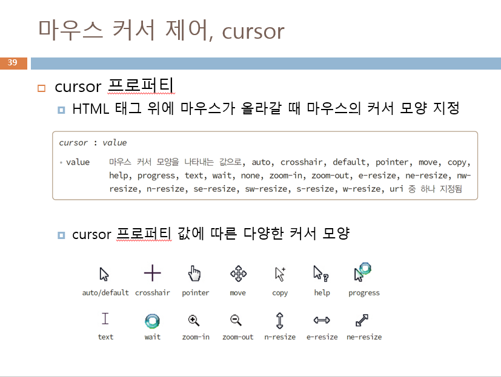

# 프론트엔드 수업 23.09.04

## display 속성

display 속성 값을 none으로 설정하면 화면에 표시되지 않는다.

display 속성 값을 inline으로 설정하면 여러 요소가 한 줄에 표시되게 인라인 요소처럼 만들 수 있다.

display 속성 값을 inline-block으로 설정하면 한 줄에 표시되게 인라인 요소처럼 만들되 블록 요소처럼 크기를 설정할 수 있게 만들 수 있다.

display 속성 값을 block으로 설정하면 각 요소가 너비 100%를 가지는 블록 요소처럼 만들 수 있다.

## hover

마우스 커서를 올려두었을 때 애니메이션 효과가 나오게 하는 가상 셀렉터이다.

콜론(:)과 함께 사용한다.

## position

position 속성은 relative, absolute, fixed 등의 값을 갖는다.

각각 상대 위치, 절대 위치, 고정된 위치를 갖는다.

**relative** : 현재 위치를 기준으로 상대 위치를 지정한다.

**absolute** : 부모 위치를 기준으로 절대 위치를 지정한다. 부모를 찾고 부모가 있으면 부모 안에서만 움직인다.

**fixed** : 브라우저 창을 기준으로 절대 위치를 지정하여 요소를 그 위치에 고정한다. top, bottom, right, left의 값을 직접 설정하여 어느 위치에 고정할지 설정할 수 있다.

## ul 활용

ul은 불릿이 있는데 그 불릿을 제거하고 싶다면 css style에서 ul에 list-style-type 속성의 값을 none으로 설정하면 된다.

각 li마다 간격을 주고 싶다면 li에 line-height 속성의 값을 원하는 간격 크기만큼 설정해주면 된다.

불릿의 위치를 바꾸고 싶다면 list-style-position 속성의 값을 설정해주면 된다.

불릿 대신 이미지를 넣고 싶다면 list-style-image 속성에 url(”url주소”)를 지정해주면 된다.

## 테이블에 색 넣기

```html
<!DOCTYPE html>
<html lang="en">
<head>
    <meta charset="UTF-8">
    <meta name="viewport" content="width=device-width, initial-scale=1.0">
    <title>Document</title>
    <style>
        
    </style>
</head>
<body>
    <h1>색 이름과 코드</h1>
    <hr />
    <table border="1">
        <tbody>
            <tr>
                <th>이름</th>
                <th>코드</th>
                <th>색</th>
                <th>이름</th>
                <th>코드</th>
                <th>색</th>
            </tr>
            <tr>
                <td>Brown</td>
                <td>#A52A2A</td>
                <td bgcolor="#A52A2A"></td>
                <td>DeepSkyBlue</td>
                <td>#00BFFF</td>
                <td bgcolor="#00BFFF"></td>
            </tr>
            <tr>
                <td>Blueviolet</td>
                <td>#8A2BE2</td>
                <td bgcolor="#8A2BE2"></td>
                <td>Gold</td>
                <td>#FFD700</td>
                <td bgcolor="#FFD700"></td>
            </tr>
            <tr>
                <td>DarkOrange</td>
                <td>#FF8C00</td>
                <td bgcolor="#FF8C00"></td>
                <td>OliveDrab</td>
                <td>#6B8E23</td>
                <td bgcolor="#6B8E23"></td>
            </tr>
            <!-- input type="color"를 활용해서 16진수 값을
            10진수로 변환해서 넣어줘도 된다. -->
            <tr>
                <td>DarkOrange</td>
                <td>#FF8C00</td>
                <td><input type="color"></td>
                <td>OliveDrab</td>
                <td>#6B8E23</td>
                <td bgcolor="#6B8E23"></td>
            </tr>
        </tbody>
    </table>
</body>
</html>
```

## 셀렉터 많이 사용해보기

```html
<!DOCTYPE html>
<html lang="en">
<head>
    <meta charset="UTF-8">
    <meta name="viewport" content="width=device-width, initial-scale=1.0">
    <title>Document</title>
    <style>
        body{background-color: darksalmon;}
        h2{text-align: center;}
        p{color: blue;}
        .css{font-size: 2em;}
        #hot{background-color: yellow;}
        h1{color: red;}
    </style>
</head>
<body>
    <h2>셀렉터</h2>
    <hr />
    <p class="css">css</p>
    <h1>경고!!</h1>
    <p id="hot">폭염주의보</p>
</body>
</html>
```

## ul의 불릿 색깔 바꾸기

::marker를 이용해서 ul의 li들의 불릿 색깔을 바꿀 수 있다.

```html
<!DOCTYPE html>
<html lang="en">
<head>
    <meta charset="UTF-8">
    <meta name="viewport" content="width=device-width, initial-scale=1.0">
    <title>Document</title>
    <style>
        ul li a{
            text-decoration: none;
        }
        ul li a:hover{
            color: green;
            text-decoration: underline;
        }
        li::marker{
            color: aqua;
        }
    </style>
</head>
<body>
    <ul>
        <li><a href="https://www.naver.com">네이버</a></li>
        <li><a href="https://www.google.com">구글</a></li>
    </ul>
</body>
</html>
```

## 실습

```html
<!DOCTYPE html>
<html lang="en">
<head>
    <meta charset="UTF-8">
    <meta name="viewport" content="width=device-width, initial-scale=1.0">
    <title>Document</title>
    <style>
        #header{
            background-color: purple;
        }
        #header strong{
            font-size: 25px;
        }

        #div1{
            border: 3px solid black;
            margin : 0 0 20px 0;
            border-radius: 3%;
        }

        #div2{
            border: 3px solid skyblue;
            margin : 0 0 20px 0;
            border-radius: 3%;
        }

        #div3{
            border: 3px solid green;
            margin : 0 0 20px 0;
            border-radius: 3% 0;
        }
        
        dt{
            color: purple;
            font-weight: bold;
            text-indent: 5px;
        }

        #div1 strong{
            margin-left: 5px;
        }
        #div2 strong{
            margin-left: 5px;
        }
        #div3 strong{
            margin-left: 5px;
        }
        

    </style>
</head>
<body>
    <div id="header">
        <strong>애완견 종류</strong> 애완견 종류 입양하기 건강돌보기 더불어살기
    </div>
        
    <div id="div1">
        <br>
        <strong>활달한 강아지</strong>
        
        <dl>
        <dt>요크셔 테리어</dt>
        <dd>생기있고 활달한 성질을 가지고 있으며 자신보다 몸집이 큰 개나 집에 들어온 침입자를 겁내는 일이 없어 좋은 번견이고 우리나라 최고의의 가정견으로 자리 잡고 있다.</dd>
        <dt>말티즈</dt>
        <dd>애정이 많고, 충실하며 활발한 성격을 소유하고있다. 이 종은 1급 가정견으로 요크셔테리어와 함께 우리나라 최고의 가정견으로 자리잡고 있다.</dd>
        <dt>포메 라이언</dt>
        <dd>활기차고 명랑한 개로 유명하고, 걷는 모습이 우아하다.충실하고 우호적인 성격이 가장 먼저 거론된다.</dd>
        <dt>골든 리트리버</dt>
        <dd>이 견종은 충성심이 강하고 성격이 활달하여 어린아이나 여성이 상대하기에 적합한 견종이다.참을성 또한 강하여 현재는실내에서도 많이 길러지고 있다.</dd>
        <dl>
    </div>
        
    <div id="div2">
        <br>
        <strong>활달한 강아지</strong>
        
        <dl>
        <dt>요크셔 테리어</dt>
        <dd>생기있고 활달한 성질을 가지고 있으며 자신보다 몸집이 큰 개나 집에 들어온 침입자를 겁내는 일이 없어 좋은 번견이고 우리나라 최고의의 가정견으로 자리 잡고 있다.</dd>
        <dt>말티즈</dt>
        <dd>애정이 많고, 충실하며 활발한 성격을 소유하고있다. 이 종은 1급 가정견으로 요크셔테리어와 함께 우리나라 최고의 가정견으로 자리잡고 있다.</dd>
        <dt>포메 라이언</dt>
        <dd>활기차고 명랑한 개로 유명하고, 걷는 모습이 우아하다.충실하고 우호적인 성격이 가장 먼저 거론된다.</dd>
        <dt>골든 리트리버</dt>
        <dd>이 견종은 충성심이 강하고 성격이 활달하여 어린아이나 여성이 상대하기에 적합한 견종이다.참을성 또한 강하여 현재는실내에서도 많이 길러지고 있다.</dd>
        <dl>
    </div>
        
    <div id="div3">
        <br>
        <strong>활달한 강아지</strong>
        
        <dl>
        <dt>요크셔 테리어</dt>
        <dd>생기있고 활달한 성질을 가지고 있으며 자신보다 몸집이 큰 개나 집에 들어온 침입자를 겁내는 일이 없어 좋은 번견이고 우리나라 최고의의 가정견으로 자리 잡고 있다.</dd>
        <dt>말티즈</dt>
        <dd>애정이 많고, 충실하며 활발한 성격을 소유하고있다. 이 종은 1급 가정견으로 요크셔테리어와 함께 우리나라 최고의 가정견으로 자리잡고 있다.</dd>
        <dt>포메 라이언</dt>
        <dd>활기차고 명랑한 개로 유명하고, 걷는 모습이 우아하다.충실하고 우호적인 성격이 가장 먼저 거론된다.</dd>
        <dt>골든 리트리버</dt>
        <dd>이 견종은 충성심이 강하고 성격이 활달하여 어린아이나 여성이 상대하기에 적합한 견종이다.참을성 또한 강하여 현재는실내에서도 많이 길러지고 있다.</dd>
        <dl>
    </div>
</body>
</html>
```

## border

border는 표의 테두리 등 경계선을 설정할 때 사용된다.

border-collapse 속성의 값을 collapse로 설정하면 중복된 테두리를 합쳐서 모든 테두리를 한 줄로 표시되게 만든다.

## 셀 크기 제어

css 스타일에서 th와 td 태그의 width, height를 설정하면 각 셀의 크기를 지정할 수 있다.

th와 td 태그에 class나 id를 지정해주면 원하는 셀만 크기를 지정할 수 있다.

## 셀 여백 및 정렬

padding으로 여백을 설정하고 text-align으로 셀에 들어간 글자를 정렬할 수 있다.

## 셀에 배경색과 테두리 효과 넣기

각 th, td, thead, tbody, tfoot 에 따로 css style을 설정해서 효과를 줄 수 있다. background-color 속성과 border 속성을 활용하여 셀에 배경색과 테두리 효과를 넣는다.

## nth-child

:nth-child(odd) 처럼 콜론을 사용해서 작성하고 괄호 안에는 몇번째인지 등 조건을 지정한다.

odd를 조건으로 사용하면 홀수번째인 것들만 선택이 돼서 효과가 적용된다.

## 표 꾸미기 예제

```html
<!DOCTYPE html>
<html lang="en">
  <head>
    <style>
      th {
        height: 40px;
        width: 100px;
      }
      td {
        height: 40px;
        width: 100px;
      }
      table {
        border: 1px solid blue;
        border-collapse: collapse;
      }
      th,
      td {
        border: 1px dotted tomato;
      }
      tfoot th {
        height: 30px;
      }
      tr:hover {
        background-color: pink;
      }
      tbody tr:nth-child(odd) {
        background-color: palegreen;
      }
      tbody tr {
        text-align: center;
      }
    </style>
  </head>
  <body>
    <table>
      <thead>
        <tr>
          <th>이름</th>
          <th>HTML</th>
          <th>CSS</th>
        </tr>
      </thead>

      <tbody>
        <tr>
          <td>김길동</td>
          <td>100</td>
          <td>95</td>
        </tr>
        <tr>
          <td>홍길동</td>
          <td>86</td>
          <td>97</td>
        </tr>
      </tbody>

      <tfoot>
        <tr>
          <th>합</th>
          <th>186</th>
          <th>192</th>
        </tr>
      </tfoot>
    </table>
  </body>
</html>
```

## input type에 css 스타일 적용하는 예제

float 속성은 유동 배치를 시켜준다.

다음 예제에서 전체 label에서 padding 값이 들어가야 각 span에 걸린 float 속성이 유동 배치를 시켜준다.

:focus는 콜론과 함께 작성하며 input type에 마우스 클릭 시 포커스가 주어지며 설정한 스타일이 적용된다.

```html
<!DOCTYPE html>
<html lang="en">
<head>
    <meta charset="UTF-8">
    <meta name="viewport" content="width=device-width, initial-scale=1.0">
    <title>Document</title>
    <style>
        input[type=text]{
            color: red;
        }
        input:hover, textarea:hover{
            background-color: pink;
        }
        label{
            display: block;
            padding: 20px;
        }
        label span{
            float: left;
            width: 80px;
            padding: 10px;
        }
        input[type=text]:focus{
            font-size: 120%;
        }
    </style>
</head>
<body>
    <form>
        <label><span>Name</span><input type="text" placeholder="Sinyo"><br></label>
        <label><span>Email</span><input type="email" placeholder="Sinyo@naver.com"><br></label>
        <label><span>Msg</span><textarea placeholder="메시지를 남겨줘"></textarea>
        <label><span></span><input type="submit" value="제출"></label>
    </form>
</body>
</html>
```

## float 속성

float 속성은 none, left, right, clear 등의 속성값을 갖는다.

float 속성을 사용할 때는 width 값을 설정해주어야 정렬시킬 수 있다.

float 속성은 position을 absolute로 설정하면 적용할 수 없다. absolute는 부모를 기준으로 위치가 결정되기 때문이다.

다음은 예제이다.

```html
<!DOCTYPE html>
<html lang="en">
<head>
    <meta charset="UTF-8">
    <meta name="viewport" content="width=device-width, initial-scale=1.0">
    <title>Document</title>
    <style>
        label{
            float: left;
            width: 120px;
            text-align: right;
            padding-right: 10px;
        }
        input[type="submit"]{
            width:100%;
            margin-top: 10px;
        }
    </style>
</head>
<body>
    <h1>회원 가입</h1>
    <form>
        <fieldset>
            <legend>로그인 정보</legend>
        <div class="d">
            <label for="a">아이디</label>
            <input type="text" id="a"><br>
            <label for="b">비밀번호</label>
            <input type="text" id="a"><br>
            <label for="c">비밀번호 확인</label>
            <input type="text" id="a"></div>
        </fieldset>
            <input type="submit" value="가입하기">
    </form>
</body>
</html>
```

다음과 같이 이미지를 한쪽에 띄워서 정렬할 수도 있다.

```html
<!DOCTYPE html>
<html lang="en">
<head>
    <meta charset="UTF-8">
    <meta name="viewport" content="width=device-width, initial-scale=1.0">
    <title>Document</title>
    <style>
        img{
            float: right;
            width: 200px;
            height: 200px;
        }
    </style>
</head>
<body>
    <div>
        
    </div>
    <p>
        내년 주요 국가 연구개발(R&D) 예산이 8년 만에 감축되는 가운데 2024년 과학기술정보통신부 예산은 317개 사업에서 2조원 규모가 삭감됐다는 분석이 나왔다. 삭감된 사업의 절반 이상은 R&D 사업이다.
    </p>
</body>
</html>
```

## 실습

내가 작성한 코드

```html
<!DOCTYPE html>
<html lang="en">
<head>
    <meta charset="UTF-8">
    <meta name="viewport" content="width=device-width, initial-scale=1.0">
    <title>Document</title>
    <style>
        legend{
            color: purple;
            font-weight: bold;
        }

        label{
            font-weight: bold;
        }

        .a{
            float: left;
            width: 100px;
            text-indent: 20px;
        }

        .b{
            float: left;
            width: 100px;
            text-indent: 20px;
        }

        .c{
            float: left;
            width: 50px;
        }

        #addr{
            width: 300px;
            margin-bottom: 10px;
        }

        #phone{
            width: 200px;
            margin-bottom: 10px;
        }

        #order{
            margin-left: 12em;
            margin-right: 10px;
        }
        
        #g{
            width: 50px;
            margin-left: 5px;
        }

        #i{
            width: 52px;
            margin-left: 5px;
        }

        #t{
            width: 50px;
            margin-left: 5px;
        }
        
        
    </style>
</head>
<body>
    <h1>상품 주문서</h1>
    <form>
        <fieldset>
            <legend>개인 정보</legend>
            <div>
                <label class="a">이름</label>
                <input type="text" placeholder="여백없이 입력"><br />
                <label class="a">연락처</label>
                <input type="text" placeholder="연락가능한 번호">
            </div>
        </fieldset>
        <fieldset>
            <legend>배송지 정보</legend>
            <div>
                <label class="b">주소</label>
                <input type="text" id="addr"><br />
                <label class="b">전화번호</label>
                <input type="text" id="phone"><br />
                <label class="b" id="memo">메모</label>
                <textarea cols="35" rows="3"></textarea>
            </div>
        </fieldset>
        <fieldset>
            <legend>주문 정보</legend>
            <input type="checkbox" class="c">과테말라 안티구아 (100g)<input type="text" id="g">개<br />
            <input type="checkbox" class="c">인도네이사 만델링 (100g)<input type="text" id="i">개<br />
            <input type="checkbox" class="c">탐라는도다(블렌딩) (100g)<input type="text" id="t">개
        </fieldset>
        <input type="button" id="order" value="주문하기">
        <input type="button" id="rewrite" value="다시 작성">

    </form>
</body>
</html>
```

선생님이 작성한 코드

```html
<!DOCTYPE html>
<html lang="en">
  <head>
    <style>
      legend {
        color: purple;
        font-weight: bold;
      }
      .a {
        font-weight: bold;
        float: left;
        width: 90px;
        margin-left: 50px;
      }
      .b {
        margin: 0 auto;
        width: 500px;
      }
      .c {
        text-align: center;
      }
      .d {
        margin-left: 50px;
      }
      div {
        margin-bottom: 10px;
      }
    </style>
  </head>
  <body>
    <div class="b">
      <h1>상품 주문서</h1>
      <fieldset>
        <legend>개인 정보</legend>
        <div>
          <label for="name" class="a">이름</label>
          <input type="text" id="name" placeholder="여백없이 입력" />
        </div>

        <div>
          <label for="tel1" class="a">연락처</label>
          <input type="tel" id="tel1" placeholder="연락가능한 번호" />
        </div>
      </fieldset>

      <fieldset>
        <legend>배송지 정보</legend>
        <div>
          <label for="adr" class="a">주소</label>
          <input type="text" id="adr" size="30" />
        </div>

        <div>
          <label for="tel2" class="a">전화번호</label>
          <input type="tel" id="tel2" />
        </div>

        <div>
          <label for="msg" class="a">메모</label>
          <textarea cols="30" rows="3" id="msg"></textarea>
        </div>
      </fieldset>

      <fieldset>
        <legend>주문 정보</legend>

        <div class="d">
          <label><input type="checkbox" />과테말라 안티구아 (100g)</label>
          <label><input type="number" value="2" min="0" max="5" />개</label>
        </div>

        <div class="d">
          <label><input type="checkbox" />인도네시아 만델링 (100g)</label>
          <label><input type="number" value="3" min="0" max="5" />개</label>
        </div>

        <div class="d">
          <label><input type="checkbox" />탐라는도다(블렌딩) (100g)</label>
          <label><input type="number" value="4" min="0" max="5" />개</label>
        </div>
      </fieldset>

      <div class="c">
        <input type="submit" value="주문하기" />
        <input type="reset" value="다시 작성" />
      </div>
    </div>
  </body>
</html>
```

## 마우스 커서 제어(cursor 속성)

cursor 속성은 HTML 태그 위에 마우스가 올라갈 때 마우스의 커서 모양을 지정할 수 있다.

다음의 속성값들을 사용해서 다양한 커서 모양을 만들 수 있다.



## 애니메이션 효과 넣기

다음은 500% 크기에서 100% 크기로 줄어드는 것을 반복하는 애니메이션 효과를 넣는 예제이다.

한번 실행될 때 3초 동안 애니메이션이 실행되고 무한반복된다.

```html
<!DOCTYPE html>
<html lang="en">
<head>
    <meta charset="UTF-8">
    <meta name="viewport" content="width=device-width, initial-scale=1.0">
    <title>Document</title>
    <style>
        @keyframes success{
            from {font-size: 500%;}
            to{font-size: 100%;}
        }
        p{
            animation-name: success;
            animation-duration: 3s;
            animation-iteration-count: infinite;
        }
        
    </style>
</head>
<body>
    <p>성공!</p>
</body>
</html>
```

다음은 커서를 댔을 때 5초 동안 글자 크기를 서서히 확대하여 최종적으로 500% 크기로 만드는 효과를 넣는 예제이다.

```html
<!DOCTYPE html>
<html lang="en">
<head>
    <meta charset="UTF-8">
    <meta name="viewport" content="width=device-width, initial-scale=1.0">
    <title>Document</title>
    <style>
        p{
            transition: font-size 5s;
        }
        p:hover{
            font-size: 500%;
        }
        
    </style>
</head>
<body>
    <p>성공!</p>
</body>
</html>
```

## 자바 스크립트

script 태그에 자바 스크립트를 작성한다.

자바 스크립트는 head 태그나 body 태그 내 어디든 작성할 수 있고, 웹 페이지 내에 여러 번 삽입 가능하다.

자바 스크립트 코드는 .js확장자로 되어 있는 파일에 저장한다. 이때는 script 태그 없이 자바 스크립트 코드만 저장한다.

웹 페이지 자바 스크립트 코드를 중복 작성할 필요 없이 script 태그의 src 속성으로 파일을 불러서 사용할 수 있다.

## 자바 스크립트로 HTML 콘텐츠 출력

document.write(); 를 사용해서 바로 브라우저 윈도우에 출력할 수 있다.

다음은 그 예제이다.

```html
<!DOCTYPE html>
<html lang="en">
<head>
    <meta charset="UTF-8">
    <meta name="viewport" content="width=device-width, initial-scale=1.0">
    <title>Document</title>
    <style>
        
    </style>
</head>
<body>
    <script>
        document.write("<h3>Welcome!!!!</h3>");
        document.write("환영합니다 <br>");
        document.write("<mark>Welcome!!!!</mark>");
    </script>
</body>
</html>
```

## 자바 스크립트 다이얼로그

prompt(프롬프트 다이얼 로그), confirm(확인 다이얼로그), alert(경고 다이얼로그) 등이 있다.

### 프롬프트 다이얼 로그

prompt(”메시지”, “디폴트 입력값”) 으로 사용하는 함수로, 사용자로부터 문자열을 입력받아서 리턴한다.

다음은 그 예제이다.

```html
<!DOCTYPE html>
<html lang="en">
<head>
    <meta charset="UTF-8">
    <meta name="viewport" content="width=device-width, initial-scale=1.0">
    <title>Document</title>
    <style>
        
    </style>
</head>
<body>
    <script>
        var ret = prompt("이름을 입력하세요", "");
        if(ret==null){
            document.write("이름없다");
        }
        else if(ret==""){
            document.write("취소");
        }
        else{
            document.write(ret);
        }
    </script>
</body>
</html>
```

## 자바 스크립트에서 다루는 데이터 타입들

숫자타입(정수, 실수), 논리 타입(참, 거짓), 문자열 타입, 객체 레퍼런스 타입(객체를 가리킴, C언어의 포인터와 유사), null(값이 없음을 표시하는 특수 키워드로 Null, NULL과는 다르다)

자바 스크립트에는 문자 타입이 없고 문자열로 표현한다.

## 자바 스크립트의 변수 선언

var, let, const를 사용한다.
현재는 let을 많이 쓰는 추세이다.

## 자바 스크립트에서 연산 및 출력

```html
<!DOCTYPE html>
<html lang="en">
<head>
    <meta charset="UTF-8">
    <meta name="viewport" content="width=device-width, initial-scale=1.0">
    <title>Document</title>
    <style>
        
    </style>
</head>
<body>
    <script>
        let x = 35;
        let y = x / 10;
        let z = x % 2;

        x += 3;
        document.write(x + "<br>");
        document.write(y + "<br>");
        document.write(z + "<br>");

        let a = 36;
        let b = 35;
        
        document.write((a!=b) + "<br>");
        document.write((a==b) + "<br>");
        document.write((a<=b) + "<br>");
        document.write((a>=b) + "<br>");

        let c = true;
        let d = false;
        document.write((c&&d) + "<br>");
        document.write((c||d) + "<br>");
        
        let e = 5, f = 10;
        document.write(e > f ? e : f);
    </script>
</body>
</html>
```