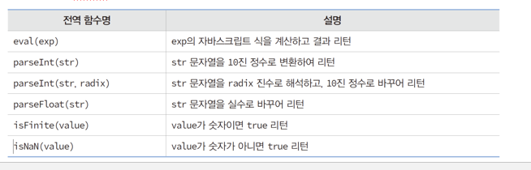

# 프론트엔드 수업 23.09.05

## 원하는 색상 코드 찾는 방법

웹에서 마우스 우클릭 → 검사 → dev tool 창에서 색상코드 나온 것을 찾아서 활용하기

## display : flex

인라인 요소처럼 flex 아이템들은 가로 방향으로 배치되고, 자신이 가진 내용물의 width 만큼만 차지하게 된다.

height는 컨테이너의 높이만큼 늘어나고, 정렬 속성을 통해 height를 어떻게 처리할지 조정할 수 있다.

inline-flex는 inline-block처럼 동작한다.

flex-direction은 아이템들이 배치되는 축의 방향을 결정하는 속성이다. 메인축의 방향을 가로(row)로 할지 세로(column)로 할지 결정하고 요소가 어느방향으로 배치될 것인지 설정할 수 있다.

flex의 메인축 방향을 정렬하는 것은 justify-content이다. 이 속성은 속성값을 center로 두면 가운데 정렬된다.

다음은 flext-direction 설정에 대한 예제이다.

```html
<!DOCTYPE html>
<html lang="en">
<head>
    <meta charset="UTF-8">
    <meta name="viewport" content="width=device-width, initial-scale=1.0">
    <title>Document</title>
    <style>
        .container{
            display: flex;
            width: 500px;
            border: 1px solid #eee;
        }

        .box{
            width: 80px;
            background-color: antiquewhite;
            padding: 5px 45px;
        }

        #opt1{
            flex-direction: row; /*왼쪽부터 오른쪽*/
        }

        #opt2{
            flex-direction: row-reverse; /*오른쪽부터 왼쪽*/
        }

        #opt3{
            flex-direction: column; /*위부터 아래*/
        }

        #opt4{
            flex-direction: column-reverse; /*아래부터 위*/
        }
    </style>
</head>
<body>
    <div class="container" id="opt1">
        <div class="box"><p>1</p></div>
        <div class="box"><p>2</p></div>
        <div class="box"><p>3</p></div>
      </div>
      <div class="container" id="opt2">
        <div class="box"><p>1</p></div>
        <div class="box"><p>2</p></div>
        <div class="box"><p>3</p></div>
      </div>
      <div class="container" id="opt3">
        <div class="box"><p>1</p></div>
        <div class="box"><p>2</p></div>
        <div class="box"><p>3</p></div>
       </div>
      <div class="container" id="opt4">
        <div class="box"><p>1</p></div>
        <div class="box"><p>2</p></div>
        <div class="box"><p>3</p></div>
      </div>
</body>
</html>
```

다음은 justify-content로 메인축 방향을 정렬하는 예제이다.

```html
<!DOCTYPE html>
<html lang="en">
<head>
    <meta charset="UTF-8">
    <meta name="viewport" content="width=device-width, initial-scale=1.0">
    <title>Document</title>
    <style>
        .container{
            display: flex;
            width: 500px;
            border: 1px solid #eee;
        }

        .box{
            width: 80px;
            background-color: antiquewhite;
            padding: 5px 45px;
        }

        #opt1{
            justify-content: flex-start;
        }

        #opt2{
            flex-direction: flex-end;
        }

        #opt3{
            flex-direction: center;
        }
    </style>
</head>
<body>
    <div class="container" id="opt1">
        <div class="box"><p>1</p></div>
        <div class="box"><p>2</p></div>
        <div class="box"><p>3</p></div>
      </div>
      <div class="container" id="opt2">
        <div class="box"><p>1</p></div>
        <div class="box"><p>2</p></div>
        <div class="box"><p>3</p></div>
      </div>
      <div class="container" id="opt3">
        <div class="box"><p>1</p></div>
        <div class="box"><p>2</p></div>
        <div class="box"><p>3</p></div>
       </div>
      <div class="container" id="opt4">
        <div class="box"><p>1</p></div>
        <div class="box"><p>2</p></div>
        <div class="box"><p>3</p></div>
      </div>
</body>
</html>
```

## 실습

```html
<!DOCTYPE html>
<html lang="en">
<head>
    <meta charset="UTF-8">
    <meta name="viewport" content="width=device-width, initial-scale=1.0">
    <title>Document</title>
    <style>
        section{
         width:800px;
         margin: 0 auto;   
      }
      h2{
         font-size:1.5em;
      }
      h3 {
         font-size:1.0em;
      }
      p {
         line-height:20px;
         font-size:12px;
      }
      article{
         float:left;
         width:350px;
         height:200px;   
         margin:10px;
         padding:10px;   
         border:1px solid #ccc;
      }
      footer {
         clear:left;
         width:100%;
         height:50px;
         background-color:#222;
      }
      footer > p {
         color:#fff;
         font-size:0.9em;
         text-align: center;
         line-height:50px;
      }
    </style>
</head>
<body>
    <section>
        <h2>강아지 용품 준비하기</h2>
        <article>  
          <h3>강아지 집 </h3>
           <p>강아지가 편히 쉴 수 있는 포근한 집이 필요합니다. 강아지의 집은 강아지가 다 큰 후에도 계속 쓸 수 있는 집으로 구입하세요.집을 구입하실 때는 박음질이 잘 되어 있는지, 세탁이 간편한 제품인지 꼭 확인하시고 고르시는 것이 좋습니다.</p>
        </article>
        <article> 
          <h3>강아지 먹이 </h3>
          <p>강아지의 먹이는 꼭 어린 강아지용으로 나와있는 사료를 선택하세요. 강아지들은 사람에 비해 성장속도가 8배정도 빠르답니다. 따라서 강아지에게는 성장속도에 맞는 사료를 급여하셔야 합니다. 사람이 먹는 음식을 먹게 되면 양념과 향신료에 입맛이 익숙해지고, 비만이 될 가능성이 매우 높아집니다. 강아지용 사료는 생후 12개월까지 급여하셔야 합니다.</p>
        </article>
        <article> 
          <h3>밥그릇, 물병 </h3>
          <p>밥그릇은 쉽게 넘어지지 않도록 바닥이 넓은 것이 좋습니다.물병은 대롱이 달린 것으로 선택하세요. 밥그릇에 물을 주게 되면 입 주변에 털이 모두 젖기 때문에 비위생적이므로 대롱을 통해서 물을 먹을 수 있는 물병을 마련하시는 것이 좋습니다.</p>
        </article>
        <article> 
          <h3>이름표, 목줄</h3> 
          <p>강아지를 잃어버릴 염려가 있으니 산책할 무렵이 되면 이름표를 꼭 목에 걸어주도록 하세요. 그리고 방울이 달린 목걸이를 하고자 하실 때는 신중하셔야 합니다. 움직일 때마다 방울이 딸랑 거리면 신경이 예민한 강아지들에게는 좋지 않은 영향을 끼칠 수 있기 때문입니다.</p>
         </article>
         <footer>
            <p>boxmodel 연습하기</p>
         </footer>
       </section>
      </div>
</body>
</html>
```

## 자바 스크립트 식별자

식별자는 자바 스크립트 프로그램의 변수, 상수(리터럴), 함수의 이름 등을 나타낸다.

식별자는 숫자로 시작할 수 없고, 첫 글자는 알파벳, 언더바(언더스코어), 달러 문자($)만 사용가능하다.

두번째 이상의 문자에는 첫 글자에 해당되는 것들과 0~9의 숫자를 사용할 수 있다.

식별자의 대소문자는 구분되어 다루어진다

자바 스크립트의 예약어(false, for, if, null 등)은 식별자로 사용할 수 없다.

## 자바 스크립트 실습

점수를 입력해서 학점이 나오게 하는 예제

```html
<!DOCTYPE html>
<html lang="en">
<head>
    <meta charset="UTF-8">
    <meta name="viewport" content="width=device-width, initial-scale=1.0">
    <title>Document</title>
    <style>
        
    </style>
</head>
<body>
    <script>
        let score;
        let num = prompt("길동의 점수를 입력하세요", 100);
        num = parseInt(num); // 문자열을 정수로 바꿔 다시 num에 대입한다.

        if(num > 90) score = "A학점";
        else if (num > 80) score = "B학점";
        else score = "F학점";

        document.write(score);
    </script>
</body>
</html>
```

커피 이름을 입력하면 금액과 함께 메시지가 제시되는 예제

```html
<!DOCTYPE html>
<html lang="en">
<head>
    <meta charset="UTF-8">
    <meta name="viewport" content="width=device-width, initial-scale=1.0">
    <title>Document</title>
    <style>
        
    </style>
</head>
<body>
    <script>
        let money=0;
        let cafe = prompt("무슨 커피 드릴까요?");

        switch(cafe){
            case "아메리카노":
            case "아이스 아메리카노":
                money=4000;
                break;
            case "카페라떼":
                money=5000;
                break;
            default:
                document.write(cafe+"없다");
        }
        if(money!=0){
            document.write(cafe+"는 "+money+"원이다");
        }

    </script>
</body>
</html>
```

반복문 사용 예제

```html
<!DOCTYPE html>
<html lang="en">
<head>
    <meta charset="UTF-8">
    <meta name="viewport" content="width=device-width, initial-scale=1.0">
    <title>Document</title>
    <style>
        
    </style>
</head>
<body>
    <script>
        for(var i=10;i<=50;i+=10){
          document.write("<span>");
          document.write("style='font-size:"+i+"px'>");
          document.write(i+"px");
          document.write("</span>");
        }
    </script>
</body>
</html>
```

0부터 입력한 수까지 1씩 증가하면서 더하는 예제

```html
<!DOCTYPE html>
<html lang="en">
<head>
    <meta charset="UTF-8">
    <meta name="viewport" content="width=device-width, initial-scale=1.0">
    <title>Document</title>
    <style>
        
    </style>
</head>
<body>
    <script>
        let n = prompt("정수입력", 0);
        n = parseInt(n);

        let i = 0, sum = 0;
        while(i<=n){
            sum+=i;
            i++;
        }
        document.write("총합" + sum);
    </script>
</body>
</html>
```

1부터 몇까지 더해야 처음으로 1000을 넘는지 찾는 예제

```html
<!DOCTYPE html>
<html lang="en">
<head>
    <meta charset="UTF-8">
    <meta name="viewport" content="width=device-width, initial-scale=1.0">
    <title>Document</title>
    <style>
        
    </style>
</head>
<body>
    <script>
        // 1에서 몇까지 더해야 처음으로 1000을 넘나?
        // 무한 루프와 break 사용
        let num = 1, sum = 0;
        while(true){
            sum+=num;
            if(sum>1000){
                break;
            }
            num++;
        }
        document.write(num + "까지 더하면 " + sum + "로 1000을 넘기 시작한다");
    </script>
</body>
</html>
```

## 자바 스크립트에서 제공하는 전역 함수

다음과 같이 eval() 함수, parseInt() 함수, isNaN() 함수 등이 있다.



## 자바 스크립트의 함수 선언 및 호출

자바 스크립트의 script 태그는 head 태그 또는 body 태그 내에 들어갈 수 있다.

함수 선언 시에는 보통 head 태그 사이에 script 태그 내에서 작성하고, 함수 호출은 body 태그 사이에 script 태그 내에서 작성한다.

다음은 두 숫자를 더하는 함수 예제이다.

```html
<!DOCTYPE html>
<html lang="en">
<head>
    <meta charset="UTF-8">
    <meta name="viewport" content="width=device-width, initial-scale=1.0">
    <title>Document</title>
    <script>
        function adder(a, b){ // 함수 선언
            var sum;
            sum = a + b;
            return sum;
        }
    </script>
        
    
</head>
<body>
    <script>
        let n = adder(10, 20); // 함수 호출
        document.write(n);
    </script>
</body>
</html>
```

다음은 구구단을 출력하는 함수 예제이다.

매개변수를 1~9가 아닌 다른 값을 입력하면 잘못 입력하였다는 경고 메시지 창이 뜨고 다시 한 번 값을 입력할 프롬프트 창을 띄운다.

값을 맞게 입력하면 구구단이 출력된다.

```html
<!DOCTYPE html>
<html lang="en">
<head>
    <meta charset="UTF-8">
    <meta name="viewport" content="width=device-width, initial-scale=1.0">
    <title>Document</title>
    <script>
        function dan(n){
            let m = parseInt(n);
            if(isNaN(m) || m < 1 || m >9){
                alert("잘못 입력하였다");
								return dan(prompt("몇단?"));
            }
            let num;
            for(let i=1; i<=9; i++){
                num = m*i;
                document.write(m+"*"+i+"="+num+"<br>");
            }

        }
    </script>
        
    
</head>
<body>
    <script>
        let n = prompt("몇단?");
        dan(n);
    </script>
</body>
</html>
```

password라는 문자열이 입력되면 통과, 아니라면 다시 입력하게 만들기

```html
<!DOCTYPE html>
<html lang="en">
<head>
    <meta charset="UTF-8">
    <meta name="viewport" content="width=device-width, initial-scale=1.0">
    <title>Document</title>      
    
</head>
<body>
    <script>

        while(true){
            let str = prompt("문자열 입력");
            if(str == "password"){
                document.write("통과");
                break;
            }
            alert("잘못된 값입니다. 다시 입력하세요.");
        }
    </script>
</body>
</html>
```

문자열로 수식을 입력하면 계산 결과를 출력하는 eval(str)함수 예제

예를 들어 “1+2+9*2”를 입력하면 21이라는 결과를 출력한다.

```html
<!DOCTYPE html>
<html lang="en">
<head>
    <meta charset="UTF-8">
    <meta name="viewport" content="width=device-width, initial-scale=1.0">
    <title>Document</title>
        
    
</head>
<body>
    <script>
        let n = prompt("수식입력");
        document.write(eval(n));
    </script>
</body>
</html>
```

## 자바 스크립트의 객체

자바 스크립트의 객체 구성은 여러 개의 프로퍼티와 메소드로 구성되어 있다.

프로퍼티는 객체의 고유한 속성이고, 메소드는 함수이다.

자바 스크립트는 객체 지향 언어가 아니다. 객체 기반 언어이다.

자바 스크립트 객체의 유형은 코어 객체, HTML DOM 객체, 브라우저 객체가 있다.

각각은 다음과 같다.


코어 객체에는 Array, Date, String, Math 등이 있다.

코어 객체는 new 키워드로 생성하고, 객체가 생성되면 객체 내부에 프로퍼티와 메소드들이 존재하게 된다.

객체에 대한 접근은 객체와 멤버 사이에 점(.) 연산자를 이용한다.

## 자바 스크립트 배열

자바 스크립트에서 배열은 배열의 크기가 고정되지 않고, 마지막 원소 추가 시 늘어나는 가변 길이이다.

Array 객체의 length 프로퍼티를 이용해서 array.length 처럼 사용하면 배열의 크기를 구할 수 있다.

Array 객체로 배열을 만들거나 “[ ]”를 사용해서 원소들의 초기 값을 나열하는 방식으로 배열을 만들 수 있는데 두 경우 모두 Array 객체로 다루어진다.

다음은 배열과 반복문을 함께 활용한 예제이다.

```html
<!DOCTYPE html>
<html lang="en">
<head>
    <meta charset="UTF-8">
    <meta name="viewport" content="width=device-width, initial-scale=1.0">
    <title>Document</title>
        
    
</head>
<body>

    <script>
        let ary = [1,2,3,4,5];
        for(let i=0; i<5; i++){
            let count = ary[i];
            while(count > 0){
                document.write("#");
                count--;
            }
            document.write(ary[i] + "<br>")
        }
    </script>
</body>
</html>
```

자바 스크립트 배열은 요소들이 서로 다른 자료형으로 구성될 수 있다.

실수형과 정수형 요소를 하나의 배열에 넣고 합을 구해보는 예제이다.

```html
<!DOCTYPE html>
<html lang="en">
<head>
    <meta charset="UTF-8">
    <meta name="viewport" content="width=device-width, initial-scale=1.0">
    <title>Document</title>
        
    
</head>
<body>

    <script>
        var ary = new Array();
        ary[0] = 1.1;
        ary[1] = 3.1;
        ary[2] = 10;

        let sum=0;
        for(let i=0; i<ary.length; i++){
            sum+=ary[i];
        }
        document.write(sum / ary.length);
    </script>
</body>
</html>
```

**concat** : 배열을 연결

**join** : 배열의 요소 사이에 문자열을 추가

**slice** : 첫번째 매개변수인 인덱스부터 두번째 매개변수 인덱스 이전까지 자르기

**sort** : 정렬하기

**reverse** : 역순으로 정렬하기

**toString** : 문자열로 변환하기

활용 예제

```html
<!DOCTYPE html>
<html lang="en">
<head>
    <meta charset="UTF-8">
    <meta name="viewport" content="width=device-width, initial-scale=1.0">
    <title>Document</title>
    <script>
        function show(n){
            document.write(n + "<br>");
        }
    </script>    
    
</head>
<body>
    <script>
        let ary = new Array("영재", "혜관", "재용");
        let ary1 = new Array("재일");
        let n;

        n = ary.concat(ary1);
        show(n);
        
        n = ary.join("@@");
        show(n);

        n = ary.slice(1, 2);
        show(n);

        n = ary.sort();
        show(n);

        n = ary.reverse();
        show(n);

        n = ary.toString();
        document.write(n);
    </script>
</body>
</html>
```

## 자바 스크립트 Date 객체

Date 객체는 시간 정보를 담는 객체이다.

현재 시간 값을 뽑는 예제

```html
<!DOCTYPE html>
<html lang="en">
<head>
    <meta charset="UTF-8">
    <meta name="viewport" content="width=device-width, initial-scale=1.0">
    <title>Document</title>
    
</head>
<body>
    <script>
        let now = new Date(); // 현재 시간 값을 가진 Date 객체 생성
        document.write(now.toUTCString() + "<br>");
        document.write(now.getDate() + "<br>");
        document.write(now.getMonth() + 1 + "<br>");
        document.write(now.getHours() + "<br>");
    </script>
</body>
</html>
```

현재 시간이 짝수 분이면 핑크색 배경, 현재 시간이 홀수 분이면 스카이 블루 색 배경으로 설정하는 예제

```html
<!DOCTYPE html>
<html lang="en">
<head>
    <meta charset="UTF-8">
    <meta name="viewport" content="width=device-width, initial-scale=1.0">
    <title>Document</title>
    
</head>
<body>
    <script>
        // 현재 시간이 짝수 분이면 핑크색 배경
        // 현재 시간이 홀수 분이면 스카이 블루 색 배경으로 설정
        let now = new Date();
        let nowMinute = now.getMinutes();
        if(nowMinute % 2 == 0){
            // style 적용할 때는 다음과 같이 점으로 접근
            document.body.style.background="pink";
        }
        else{
            document.body.style.background="skyblue";
        }
        document.write(nowMinute + "분");
    </script>
</body>
</html>
```

현재 시간이 오전이면 배경색을 노란색으로, 오후이면 초록색으로 변경하는 예제

```html
<!DOCTYPE html>
<html lang="en">
<head>
    <meta charset="UTF-8">
    <meta name="viewport" content="width=device-width, initial-scale=1.0">
    <title>Document</title>
    
</head>
<body>
    <script>
        let now = new Date();
        let ampm = now.getHours() < 12 ? "am" : "pm";
        if(ampm == "am"){
            document.body.style.background="yellow";
        }
        else{
            document.body.style.background="green";
        }
    </script>
</body>
</html>
```

## 자바 스크립트 Math 객체

Math 객체는 수학 계산을 위한 프로퍼티와 메소드를 제공한다.

객체 생성하지 않고 Math에 점 연산자를 사용해서 접근해서 사용한다.

Math.random()은 0~1 사이의 랜덤한 실수를 리턴한다.

Math.floor(num)은 num의 소수점을 버리고 정수를 리턴한다.

다음은 1~100 사이의 정수로 난수를 발생시키고 그  난수들과 난수 발생한 수 중 가장 큰 수를 출력하는 예제이다.

```html
<!DOCTYPE html>
<html lang="en">
<head>
    <meta charset="UTF-8">
    <meta name="viewport" content="width=device-width, initial-scale=1.0">
    <title>Document</title>
    
</head>
<body>
    <script>
        let ary = new Array(10); // 배열 객체 생성
        for(let i=0; i<ary.length; i++){
            // 1부터 100까지 정수로 난수 발생
            // Math.floor(num)은 num의 소수점을 버린다.(정수 리턴)
            ary[i] = Math.floor(Math.random()*100)+1;
            document.write(ary[i] + " ");
        }
        document.write("<br>");
        // 난수 발생한 수 중 가장 큰 수 출력
        let big = ary[0];
        for(let i=1; i<ary.length; i++){
            if(ary[i] > big){
                big = ary[i];
            }
        }
        document.write("가장 큰 수 " + big);
    </script>
</body>
</html>
```

## 자바 스크립트 실습

랜덤한 정수 2개를 곱하는 수식의 답을 입력하면 정답이라고 표시되고, 틀리면 재시도 기회를 3번까지 부여하고 다 틀리면 틀렸다는 메시지가 나오는 프로그램을 만들어 보았다.

```html
<!DOCTYPE html>
<html lang="en">
<head>
    <meta charset="UTF-8">
    <meta name="viewport" content="width=device-width, initial-scale=1.0">
    <title>Document</title>
    <script>
        function a(){
            return Math.floor(Math.random()*9)+1;
        }
    </script>
</head>
<body>
    <script>
        let q = a() + "*" + a();
        let tryNum = 3;
        let answer = eval(q); // 수식에 대한 계산 값을 변수에 저장
        for(let i=tryNum; i>=0; i--){
            let q2 = prompt(q + "정답은?");
            if(answer == q2){
                document.write("정답입니다");
                break;
            }
            else{
                if(i>=1){
                    alert("틀렸습니다. 다시 제출하세요.(남은 재시도 기회 " + i +"회)");
                    continue;
                }
                else{
                    document.write("정답 제출 기회 소진!!! 전부 틀렸습니다.")
                }
            }
        }
    </script>
</body>
</html>
```