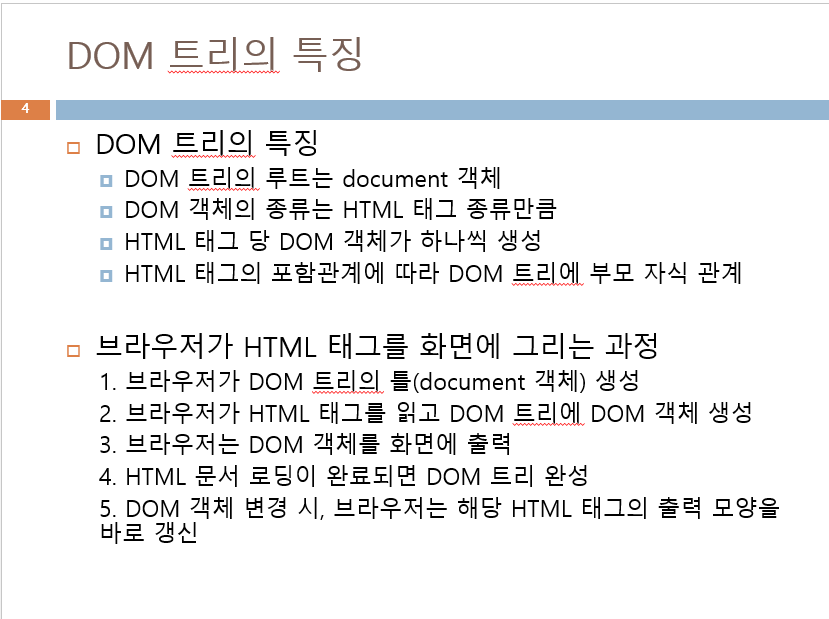

# 프론트엔드 수업 23.09.06

## 자바 스크립트에서 사용자 객체 생성

new Object() 를 사용해서 생성하거나 리터럴을 사용한다. 이외에도 프로토 타입을 이용하기도 한다.

보통은 리터럴을 사용하는 것을 권장한다.

리터럴은 하나의 변수를 선언하고 중괄호 안에서 콜론을 사용해서 필드와 메소드들을 선언하고 각각을 콤마로 구분한다.

자바 스크립트에서는 함수를 선언하고 객체를 생성해서 그 함수를 사용할 때는 반드시 변수와 메소드를 초기화 해주어야 한다.

함수를 선언하고 객체 생성해서 객체를 통해 함수에 접근해서 사용하는 방법은 다음과 같다.

```html
<!DOCTYPE html>
<html lang="en">
<head>
    <meta charset="UTF-8">
    <meta name="viewport" content="width=device-width, initial-scale=1.0">
    <title>Document</title>
    <script>
        function a(){
            return this.num;
        }

        function plus(money){
            this.num += money;
        }

        function minus(money){
            this.num -= money;
            return money;
        }

        let mon = new Object(); // 사용자 객체
        mon.num = 30000; // 초기값
        mon.name = "김길동";
        mon.id = "123";

        mon.a = a; // 메소드 작성(메소드 초기화 작업)
        mon.plus = plus;
        mon.minus = minus;

    </script>
</head>
<body>
    <script>
        document.write(mon.name);
        mon.plus(10000);
        document.write(mon.num + "<br>");
        mon.minus(5000);
        document.write(mon.num);
    </script>
</body>
</html>
```

리터럴을 사용한 예제

```html
<!DOCTYPE html>
<html lang="en">
<head>
    <meta charset="UTF-8">
    <meta name="viewport" content="width=device-width, initial-scale=1.0">
    <title>Document</title>
    <script>
        // 리터럴 표기법
        // 하나의 변수를 선언하고 중괄호 안에서
        // 콜론을 사용해서 정의하고
        // 콤마로 구분한다.
        let n = {
            name : "길동",
            id : "123",
            money : 5000,

            a : function(){
                return this.money;
            },

            plus : function(num){
                this.money+=num;
            },

            minus : function(num){
                this.money-=num;
            }
        }
    </script>
</head>
<body>
    <script>
        n.plus(5000);
        document.write(n.a() + "<br>");
    </script>
</body>
</html>
```

프로토타입 표기법을 사용한 예제

```html
<!DOCTYPE html>
<html lang="en">
<head>
    <meta charset="UTF-8">
    <meta name="viewport" content="width=device-width, initial-scale=1.0">
    <title>Document</title>
    <script>
        // 프로토타입 표기법
        // 사용자가 만든 생성자처럼 생긴 함수가 클래스처럼 쓰인다.
        function mon(name, id, n){
            this.name = name;
            this.id = id;
            this.n = n;

            this.a = function(){
                return this.n;
            }

            this.plus = function(money){
                this.n += money;
            }

            this.minus = function(money){
                this.n -= money;
            }
        }
    </script>
</head>
<body>
    <script>
        let aa = new mon("길동", "123", 30000); // 생성자
        document.write(aa.name);

        aa.plus(30000);
        document.write(aa.a() + "<br>");

        aa.minus(10000);
        document.write(aa.a() + "<br>");
    </script>
</body>
</html>
```

## 웹 페이지의 개발자 도구 콘솔 창에 출력하는 방법

console.log(출력할 내용); 을 활용하면 웹 페이지의 개발자 도구 콘솔 창에 출력되고, 웹 페이지 내에는 출력되지 않는다.

## 자바 스크립트 class 생성 및 사용

예제는 다음과 같다.

언더바를 반드시 사용해야 된다. 그렇지 않으면 재귀 되어 stack이 터지게 된다.

```html
<!DOCTYPE html>
<html lang="en">
<head>
    <meta charset="UTF-8">
    <meta name="viewport" content="width=device-width, initial-scale=1.0">
    <title>Document</title>
    <script>
        
    </script>
</head>
<body>
    <script>
        class Person{
            constructor(name, age){
                this._name = name;
                this._age = age;
            }

            set name(name){
                this.name = name;
            }

            set age(age){
                this.age = age;
            }

            get name(){
                return this._name;
            }

            get age(){
                return this._age;
            }

            toString(){
                return this._name + " " + this._age;
            }
        }

        let p1 = new Person("aa", 34);
        let p2 = new Person("bb", 44);

        document.write(p1.name + " " + p1.age);
        console.log(p1.toString());
        console.log(p1.toString());
    </script>
</body>
</html>
```

## HTML DOM(Document Object Model)

웹 페이지에 작성된 HTML 태그 하나 당 객체 하나씩 생성한다.

HTML 태그가 출력된 모양이나 콘텐츠를 제어하기 위해 DOM 객체를 통해 각 태그의 CSS3 스타일 시트 접근 및 변경 또는 HTML 태그에 의해 출력된 텍스트나 이미지를 변경하는 목적으로 사용된다.

DOM 트리와 DOM 객체가 있다.

## DOM 트리의 특징

DOM 트리의 특징은 다음과 같다.

DOM 트리의 최상위 객체는 브라우저이다. 브라우저는 HTML 문서 로드 전, document 객체를 먼저 생성하며 document 객체를 뿌리로 하여 DOM 트리를 생성한다.

document 객체는 DOM 객체가 아니며, 연결된 스타일 시트가 없다. document 객체에 접근하려면 window.document 또는 document 이름으로 접근한다.



## DOM 객체의 구성 요소

DOM 객체는 다음과 같이 프로퍼티, 메소드, 컬렉션, 이벤트 리스너, CSS3 스타일 이렇게 5개의 요소로 구성되어 있다.


## DOM 객체의 프로퍼티와 DOM 객체 사이의 관계

트리 구조처럼 계층형 관계를 갖는다.


## DOM 객체 다루기

id값을 활용해서 해당 id의 HTML 태그의 요소값을 가져오는 작업을 객체 찾기라고 하고, document.getElementById(id이름) 메소드를 사용한다.

객체 찾기는 태그 이름으로 찾는document.getElementsByTagName(태그명)도 있고, class 속성으로 찾는 document.getElementsByClassName(클래스 이름)도 있다.

태그 이름으로 찾을 때는 태그 이름이 같은 모든 DOM 객체들을 찾아서 컬렉션을 리턴하기 때문에 각 태그에 접근하려면 배열을 사용하면 된다.

객체를 찾아서 변수에 저장하고 그 변수에 CSS3 스타일을 적용할 수도 있다.


## innerHTML 프로퍼티

innerHTML 프로퍼티는 시작 태그와 종료 태그 사이에 들어 있는 HTML 컨텐츠이다.

innerHTML 프로퍼티를 수정하여 HTML 태그의 콘텐트를 변경할 수 있다.

## this 키워드

this는 객체 자신을 가리키는 자바 스크립트 키워드이다.

DOM 객체에서 객체 자신을 가리키는 용도로 사용한다.

다음은 화면을 클릭했을 때 글자의 색깔이 바뀌게 하되 this 키워드를 사용한 예제이다.

```html
<!DOCTYPE html>
<html lang="en">
<head>
    <meta charset="UTF-8">
    <meta name="viewport" content="width=device-width, initial-scale=1.0">
    <title>Document</title>
    <script>
        function ch(){
            // n이 "문장입니다" 가 된다.
            let n = document.getElementById("mySpan");
            // element인 n에 대해 css 적용
            n.style.color = "black";
            n.style.display = "block";
            n.style.border = "3px solid deeppink";
        }
    </script>
</head>
<body>
    
    <p id="firstP" style="color:blue" onclick="this.style.color='teal'">
        이것은
        <span style="color: red;">문장입니다</span>
    </p>
</body>
</html>
```

## 실습

```html
<!DOCTYPE html>
<html lang="en">
<head>
    <meta charset="UTF-8">
    <meta name="viewport" content="width=device-width, initial-scale=1.0">
    <title>Document</title>
    <script>
        function ch(obj, fsize, color){
            obj.style.color = color;
            obj.style.fontSize = fsize;
        }
    </script>
</head>
<body>
    <button onclick="ch(this,'30px','red')">버튼1</button>
    <button onclick="ch(this,'30px','green')">버튼2</button>
    <div onclick="ch(this,'40px','orange')">클릭해봐</div>
</body>
</html>
```

```html
<!DOCTYPE html>
<html lang="en">
<head>
    <meta charset="UTF-8">
    <meta name="viewport" content="width=device-width, initial-scale=1.0">
    <title>Document</title>
    <script>
        function ch(){
            let n = document.getElementsByTagName("span");
            for(let i=0; i < n.length; i++){
                let num = n[i];
                num.style.color = "orange";
                num.style.fontSize = "30px";
            }
        }
    </script>
</head>
<body>
    <button onclick="ch()">눌러!!</button>
    이 노래는 <span>유명</span>해지지 않았으면 해
    이 노래는 유명해지지 않았으면 해
    사람들이 <span>가사를 못 외웠으면 해</span>
    에라라라라 에베베베 에베베베
    이 <span>노래는</span> 유명해지지 않았으면 해
    이 노래는 유명해지지 않았으면 해
</body>
</html>
```

```html
<!DOCTYPE html>
<html lang="en">
<head>
    <meta charset="UTF-8">
    <meta name="viewport" content="width=device-width, initial-scale=1.0">
    <title>Document</title>
    <script>
        
    </script>
</head>
<body>
    <h1>라면을 끓이는 순서</h1>
    <hr />
    <ol type="A" onclick="ch1()">
        <li>물을 끓인다.</li>
        <li>라면과 스프를 넣는다.</li>
        <li>계란을 넣는다.</li>
        <li>얌얌<strong>맛있게</strong> 먹는다.</li>
    </ol>
    <script>
        function ch1(){
            let n = document.getElementsByTagName("ol");
            for(let i=0; i<n.length; i++){
                n[i].style.color="green";
                n[i].style.background="yellow";
            }
        }
    </script>
</body>
</html>
```

주의 사항!!!

getElementById() 로 s가 들어가지 않고, getElementsByTagname(), getElementsByClassName() 은 s가 들어간다.

```html
<!DOCTYPE html>
<html lang="en">
<head>
    <meta charset="UTF-8">
    <meta name="viewport" content="width=device-width, initial-scale=1.0">
    <title>Document</title>
    <script>
        function ch2(){
            let m = document.getElementById("q1");
            let answer = eval(m.innerHTML);
            let t = document.getElementById("ans1")
            t.innerHTML = answer;
        }

        function ch3(){
            let m = document.getElementById("q2");
            let answer = eval(m.innerHTML);
            let t = document.getElementById("ans2")
            t.innerHTML = answer;
        }

        function ch4(){
            let m = document.getElementById("q3");
            let answer = eval(m.innerHTML);
            let t = document.getElementById("ans3")
            t.innerHTML = answer;
        }
    </script>
</head>
<body>
    <h1>계산해봅시다.</h1>
    <hr />
    <p><span id="q1">3 + 4</span> = <span id="ans1" onclick="ch2()">답</span></p>
    <p><span id="q2">5 * 20 + 60</span> = <span id="ans2" onclick="ch3()">답</span></p>
    <p><span id="q3">20/5-4*5</span> = <span id="ans3" onclick="ch4()">답</span></p>
</body>
</html>
```

위 문제에서 script 태그 내에서 함수를 선언할 때 중복 코드를 줄이기 위해서 script 태그 부분을 다음과 같이 만들 수 있다.

```html
<script>
	function ch(q, a){
		let answer = eval(q);
    a.innerHTML=answer;
	}

	function ch2(){
		let q = document.getElementsById("q1").innerHTML;
		let a = document.getElementById("ans1").innerHTML;
		ch(q, a);
	}

	function ch3(){
		let q = document.getElementsById("q2").innerHTML;
		let a = document.getElementById("ans2").innerHTML;
		ch(q, a);
	}

	function ch4(){
		let q = document.getElementsById("q3").innerHTML;
		let a = document.getElementById("ans3").innerHTML;
		ch(q, a);
	}
</script>
```

## 개인적으로 만들어 본 현재 시각 업데이트 되는 시계

```html
<!DOCTYPE html>
<html lang="en">
<head>
    <meta charset="UTF-8">
    <meta name="viewport" content="width=device-width, initial-scale=1.0">
    <title>Document</title>
    <style>
        .clock{
            text-align: center;
            font-size: 24px;
            margin-top: 50px;            
        }

    </style>
    <script>
        function updateTime(){
            const currentTime = new Date();
            const hours = currentTime.getHours().toString().padStart(2, '0');
            const minutes = currentTime.getMinutes().toString().padStart(2, '0');
            const seconds = currentTime.getSeconds().toString().padStart(2, '0');

            const timeString = `${hours}:${minutes}:${seconds}`;
            document.getElementById('time').textContent = timeString;
        }

        setInterval(updateTime, 1000);

        updateTime();
    </script>
</head>
<body>
    <div class = "clock">
        현재 시각은 <span id="time"></span>
    </div>
</body>
</html>
```

## querySelector(’#아이디이름’)

getElementById 처럼 id 값을 통해서 접근한다. 다만 매개변수 값의 표기법에 차이가 있다.

다음과 같이 사용한다.

```html
<!DOCTYPE html>
<html lang="en">
<head>
    <meta charset="UTF-8">
    <meta name="viewport" content="width=device-width, initial-scale=1.0">
    <title>Document</title>
    <style>
        ul{
            list-style:none;
        }
    </style>
    <script>
        function ch(color){
            let n = document.querySelector('#r');
            n.style.background=color;
        }
    </script>
    
</head>
<body>
    <ul>
        <li><a href="#" onclick="ch('green')">Green</a></li>
        <li><a href="#" onclick="ch('orange')">Orange</a></li>
        <li><a href="#" onclick="ch('blue')">Blue</a></li>
    </ul>
    <div id="r">안녕</div>
```

## document 의 open()과 close()

document.open()은 현재 브라우저에 출력된 HTML 콘텐츠를 지우고 새로운 HTML 페이지를 시작한다. 즉, document 객체에 담긴 DOM 트리를 지우고 새로 시작한다.

document.close()는 현재 브라우저에 출력된 HTML 페이지를 완성시킨다. 완성한 이후로는 더 이상 document.write() 를 할 수 없다.