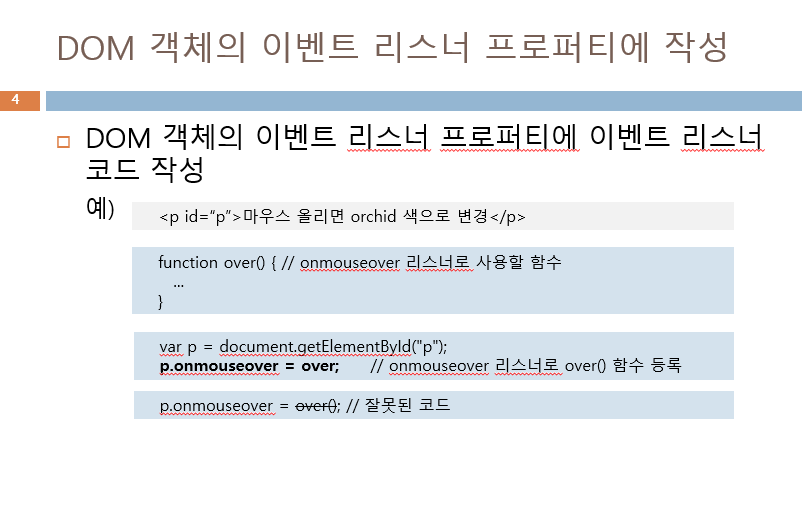

# 프론트엔드 수업 23.09.07

## DOM 객체 동적 생성

document.createElement(”태그 이름”)을 사용해서 태그 이름의 DOM 객체를 생성한다. 태그 이름이 div라면 div 태그가 생성되는 것이다.

객체를 생성하고 객체를 통해 태그 내부에 innerHTML로 내용을 넣을 수도 있고, setAttribute()로 속성을 넣을 수도 있고, 점 연산자로 접근해서 css 스타일을 적용할 수도 있다.

다음과 같이 활용한다.

```jsx
var newDIV = document.createElement("div");
newDIV.innerHTML = "새로 생성된 DIV입니다.";
newDiV.setAttribute("id", "myDiv");
newDIV.style.backgroundColor = "yellow";
```

DOM 트리에 삽입하거나 DOM 객체를 삭제할 수도 있다. 부모.appendChild(DOM 객체); 는 부모의 자식으로 DOM 객체를 추가하고, 부모.removeChild(자식 DOM 객체); 는 원하는 자식 객체를 삭제한다.

다음은 활용 예제이다.

```html
<!DOCTYPE html>
<html lang="en">
<head>
    <meta charset="UTF-8">
    <meta name="viewport" content="width=device-width, initial-scale=1.0">
    <title>Document</title>
    <script>
        function di(){
            let n = document.getElementById("parent"); // body
            let m = document.createElement("div");
            m.innerHTML="new div";
            m.setAttribute("id", "new"); // <div id="new" style>new div</div>
            m.style.backgroundColor="orange";

            m.onclick = function(){
                let p = this.parentElement; // 부모 태그 요소를 가리킨다.
                p.removeChild(this) // 자신을 부모로부터 제거하는 작업
            };
            n.appendChild(m);
        }
    </script>
</head>
<body id="parent">
    <p>
        So lovely day so lovely Errday with you so lovely Du durudu durudu du
        durudu Spell L.o.v.e.L.e.e
        <a href="javascript:di()">생성노드</a>
    </p>
</body>
</html>
```

## a 태그에 자바 스크립트 함수를 집어넣는 방법

a href = “javascript:di()” 처럼 작성하면 a 태그에 자바 스크립트의 di() 함수를 사용할 수 있다.

## getElementsByName()

태그에 지정한 name을 토대로 이름이 같은 것들을 찾아서 배열 형태로 불러온다.

이름을 토대로 불러올 때 실제 값을 가져오려면 인덱스를 통한 접근에 추가적으로 value까지 적어줘야 된다.

다음은 getElementsByName()과 DOM 객체 생성을 함께 활용한 예제이다.

```html
<!DOCTYPE html>
<html lang="en">
<head>
    <meta charset="UTF-8">
    <meta name="viewport" content="width=device-width, initial-scale=1.0">
    <title>Document</title>
    <script>
        function addr(){
            let result=document.getElementById("addr"); // ul 영역
            let add = document.getElementsByName("aa")[0].value +', '+
            document.getElementsByName("tel")[0].value;
            let item = document.createElement("li"); // li 태그 생성
            let node = document.createTextNode(add);

            item.appendChild(node); // li에 내가 입력한 이름과 전화번호가 들어간다.
            result.appendChild(item); // ul에 li가 들어간다.
        }

        function re(){
            document.getElementById("addr").innerHTML = ""; // 초기화
        }
    </script>
</head>
<body>
    이름: <input type="text" name="aa"><br>
    전화번호 : <input type="tel" name="tel"><br>
    
    <input type="submit" value="저장" onclick="addr()">
    <input type="submit" value="리셋" onclick="re()">
    <ul id="addr">
      
    </ul>
</body>
</html>
```

## DOM 객체 동적 생성 및 삭제 실습

```html
<!DOCTYPE html>
<html lang="en">
<head>
    <meta charset="UTF-8">
    <meta name="viewport" content="width=device-width, initial-scale=1.0">
    <title>Document</title>
    <script>
        function p_add1(){
            let div1Area = document.getElementById("div1");
            let p1 = document.createElement("p");
            p1.innerHTML = "서버";
           
            p1.onclick = function(){
                let parent = this.parentElement;
                parent.removeChild(this);
            };
            div1Area.appendChild(p1);
        }

        function p_add2(){
            let div2Area = document.getElementById("div2");
            let p2 = document.createElement("p");
            p2.innerHTML = "짜장면";
           
            p2.onclick = function(){
                let parent = this.parentElement;
                parent.removeChild(this);
            };
            div2Area.appendChild(p2);
        }
    </script>
</head>
<body>
    <h1>Q.컴퓨터 분야 뭐가 관심있니?</h1>
    <input type="button" onclick="p_add1()" value="답보기" />
    <div id="div1"></div>
    <h1>Q.뭐 먹고 싶니?</h1>
    <input type="button" onclick="p_add2()" value="답보기" />
    <div id="div2"></div>
</body>
</html>
```

## 이벤트 리스너

이벤트 리스너는 발생한 이벤트에 대처하기 위해 작성된 자바 스크립트 코드이다. 이름은 이벤트 이름 앞에 on을 덧붙인다.(예 : onmousedown은 mousedown 이벤트의 리스너)

이벤트 리스너를 만드는 방법은 HTML 태그 내에 작성하는 방법, DOM 객체의 이벤트 리스너 프로퍼티에 작성하는 방법, DOM 객체의 addEventListener() 메소드를 이용하는 방법, 익명 함수를 이용하는 방법 등이 있다.

HTML 태그 내에 이벤트 리스너를 작성하는 방법은 HTML 태그의 이벤트 리스너 속성에 리스너 코드를 직접 작성한다.

DOM 객체의 이벤트 리스너 프로퍼티에 이벤트 리스너 코드를 작성하는 방법의 예시는 다음과 같다.



DOM 객체의 addEventListener() 메소드를 활용하는 방법은 다음과 같다.


## 익명 함수로 이벤트 리스너 작성

익명 함수는 함수 이름 없이 필요한 곳에 함수의 코드를 바로 작성할 수 있다. 코드가 짧거나 한 곳에서만 사용하는 경우에는 익명 함수를 사용하는 것이 편리하다.

익명 함수로 이벤트 리스너를 작성하는 예시는 다음과 같다.


## 브라우저에 발생하는 다양한 이벤트들


다음은 mouse 커서를 올렸을 때와 내렸을 때 이벤트가 발생하게 만든 예제이다. 이벤트 발생 시점은 onload로 문서 로딩이 완료된 이후에 mouse 커서를 올리고 내려야 되게끔 설정했다.

```html
<!DOCTYPE html>
<html lang="en">
<head>
    <meta charset="UTF-8">
    <meta name="viewport" content="width=device-width, initial-scale=1.0">
    <title>Document</title>
    <script>
        function init(){
            let p = document.getElementById("p");
            p.onmouseover = over; // over()를 onmouseover 리스너로 등록
            p.onmouseout = out; //out()을 onmouseout 리스너로 등록
        }

        function over(){
            p.style.backgroundColor="green";
        }

        function out(){
            p.style.backgroundColor='red';
        }
    </script>
</head>
<body onload="init()">
    <p id="p">마우스 올리면 색 변함</p>
</body>
</html>
```