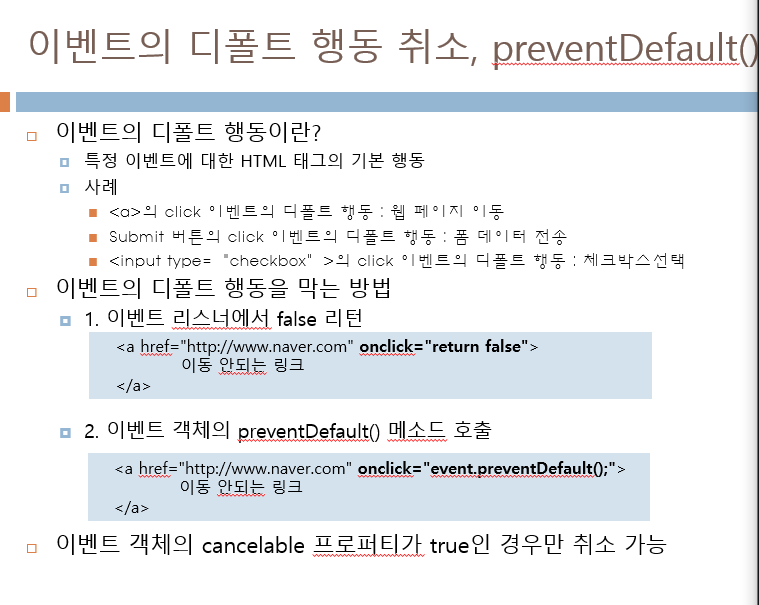

# 프론트엔드 수업 23.09.08

## 자바 스크립트 복습

클릭하면 display 값이 none이었던 것을 보이게 만드는 작업

```html
 <!DOCTYPE html>
<html lang="en">
<head>
    <meta charset="UTF-8">
    <meta name="viewport" content="width=device-width, initial-scale=1.0">
    <title>Document</title>
    <script>
        function on(){
            let n = document.getElementsByTagName("p");
            n[0].style.display = "block";
            n[1].style.display = "block";
        }
    </script>
</head>
<body>
    
    <p style="display: none;">one</p>
    <p style="display: none;">two</p>
    <button onclick="on()">클릭</button>
</body>
</html>
```

## 자바 스크립트 이벤트 작업

하나의 함수로 p태그에 마우스를 올리면 경고창이 실행되고 버튼을 클릭하면 다른 내용으로 경고창이 실행되는 예제이다.

```html
<!DOCTYPE html>
<html lang="en">
<head>
    <meta charset="UTF-8">
    <meta name="viewport" content="width=device-width, initial-scale=1.0">
    <title>Document</title>
    <script>
        function on(e){
            alert(e.type);
        }
    </script>
</head>
<body>
    <p id="p">마우스 올려보기</p>
    <!-- 1. 이벤트를 HTML 태그 안에 작성 -->
    <button onclick="on(event)">클릭</button>
    <script>
        // 2. 이벤트 리스너 프로퍼티에 작성
        document.getElementById("p").onmouseover = on;
    </script>
</body>
</html>
```

## 이벤트의 디폴트 행동 취소 preventDefault()



## 이벤트 흐름


## 캡처 리스너와 버블 리스너

DOM 객체.addEventListener(이벤트명, 함수명, true or false)


다음은 캡처 리스너와 버블 리스너를 생성하고 사용하는 예제이다.

```html
<!DOCTYPE html>
<html lang="en">
<head>
    <meta charset="UTF-8">
    <meta name="viewport" content="width=device-width, initial-scale=1.0">
    <title>Document</title>
    <script>
        
    </script>
</head>
<body>
    <p>안녕<span>하세요</span></p>
    <form>
        <input type="text" name="a">
        <input type="button" value="확인" id="bu">
    </form>

    <div id="di"></div>
    <script>
        let n = document.getElementById("di");
        let b = document.getElementById("bu");

        // body 객체에 캡처 리스너 등록 -> cap()
        // 캡처 단계에서 cap() 실행
        // true이면 캡처 리스너, false이면 버블 리스너
        document.body.addEventListener("click", cap, true);

        // target 객체에 버블 리스너 등록 -> bub()
        // 버블 단계에서 bub() 실행
        // true이면 캡처 리스너, false이면 버블 리스너
        b.addEventListener("click", bub, false);

        function cap(e){
            let obj = e.currentTarget;
            let m = obj.tagName;
            n.innerHTML += m + e.type;
        }

        function bub(e){
            let obj = e.currentTarget;
            let m = obj.tagName;
            n.innerHTML += m + e.type;
        }
    </script>
</body>
</html>
```

## 이벤트 흐름을 중단시키는 방법

이벤트 객체의 stopPropagation()을 호출한다. 이 메소드를 호출하면 이벤트 흐름을 중단시킬 수 있다.

## 이벤트 객체에 들어 있는 정보

이벤트 객체의 프로퍼티와 메소드로 현재 발생한 이벤트에 관한 다양한 정보를 얻을 수 있다. 프로퍼티와 메소드는 이벤트의 종류마다 조금씩 다르다.

이벤트 객체의 공통 멤버는 다음과 같다.


그 중 target 프로퍼티는 다음과 같다.


## 자바 스크립트의 for-each문

자바에서는 for i in 배열 형태를 사용하지만 자바 스크립트는 for(let i of n)으로 of를 사용한다.

## input type = “text” 에 들어가는 내용 가져오기

innerHTML로 가져올 수 없고 value로 가져와야 된다.

input type=”text”에 id를 지정했다면 우선 document.getElementById(id이름)으로 해당 input type 태그 영역을 알아오고 그 영역에서 점 연산자로 value에 접근해야 한다.

다음은 그 예제이다.

```html
<!DOCTYPE html>
<html lang="en">
<head>
    <meta charset="UTF-8">
    <meta name="viewport" content="width=device-width, initial-scale=1.0">
    <title>Document</title>
    <script>
        
    </script>
</head>
<body>
    수식<input type="text" id="exp" /><br />
    답<input type="text" id="answer" />
    <input type="button" value="계산" onclick="on()" />

    <script>
        function on(){
            let a = document.getElementById("exp");
            let b = document.getElementById("answer");
            b.value = eval(a.value);
        }
    </script>
</body>
</html>
```

## 라디오 버튼과 체크 박스

라디오 버튼은 하나만 선택되게 해야 하므로 name을 설정할 때 모든 요소가 이름이 같아야 한다. 다만 value 값은 다르다.

다음은 라디오 버튼의 예제이다.

```html
<!DOCTYPE html>
<html lang="en">
<head>
    <meta charset="UTF-8">
    <meta name="viewport" content="width=device-width, initial-scale=1.0">
    <title>Document</title>
    <script>
        
    </script>
</head>
<body>
    <form>
        <input type="radio" name="city" value="seoul">서울
        <input type="radio" name="city" value="busan">부산
        <input type="radio" name="city" value="chunchen">춘천
        <input type="button" value="체크" onclick="on()" />
    </form>
    <script>
        function on(){
            let n = null;
            let c = document.getElementsByName("city");

            for(let i=0; i<c.length; i++){
                if(c[i].checked == true){
                    n=c[i];
                }
            }
            if(n!=null){
                alert(n.value + "선택하였다");
            }
            else{
                alert("아무것도 선택하지 않았다");
            }
        }
    </script>
</body>
</html>
```

체크박스는 하나만 선택될 필요는 없지만 여러 개의 체크박스가 하나의 덩어리로 묶이기 위해서는 name을 모두 같게 설정해주어야 한다. 다만 value 값은 다르다.

다음은 checkbox의 예제이다.

```html
<!DOCTYPE html>
<html lang="en">
<head>
    <meta charset="UTF-8">
    <meta name="viewport" content="width=device-width, initial-scale=1.0">
    <title>Document</title>
    <script>
        
    </script>
</head>
<body>
    <form>
        <input type="checkbox" name="ch" value="80" onclick="score(this)">자바 80점
        <input type="checkbox" name="ch" value="50" onclick="score(this)">HTML 50점
        <input type="checkbox" name="ch" value="90" onclick="score(this)">CSS 90점<br>
    
        총합<input type="text" id="tot" value="0">
      </form>
    <script>
        let sum = 0;
        function score(obj){
            if(obj.checked){
                sum+=parseInt(obj.value);
            }
            else{
                sum-=parseInt(obj.value);
            }
            let n = document.getElementById("tot");
            n.value = sum;
        }
    </script>
</body>
</html>
```

## select 객체와 onchange

```html
<!DOCTYPE html>
<html lang="en">
<head>
    <meta charset="UTF-8">
    <meta name="viewport" content="width=device-width, initial-scale=1.0">
    <title>Document</title>
    <script>
        function on(){
            let n = document.getElementById("aa");
            let m = document.getElementById("bb");
            let b = n.selectedIndex; // 선택한 옵션의 인덱스를 알아낸다.
            m.src = n.options[b].value; // value 값을 src 속성에 대입한다.
        }
    </script>
</head>
<body>
    <select id="aa" onchange="on()">
        <option value="C:/Users/EZEN/Desktop/duck.jpg">오리</option>
        <option value="C:/Users/EZEN/Desktop/라면.jpg">라면</option>
    </select>

    <span id="span">동물!!</span>
    <p></p>
</body>
</html>
```

## 계산기 만들기 실습

계산이 끝나고 C를 안누르고 바로 숫자를 입력해서 계산하면 이상한 값이 나오는 게 흠이지만 모양만은 완벽한 계산기!

```html
<!DOCTYPE html>
<html lang="en">
<head>
    <meta charset="UTF-8">
    <meta name="viewport" content="width=device-width, initial-scale=1.0">
    <title>Document</title>
    <style>
        button{
            width: 40px;
        }
    </style>
</head>
<body>
    <h1>계산기</h1>
    <hr />
    <table>
        <tbody>
            <tr>
                <td colspan="4"><input type="text" id="result"/></td>
            </tr>
            <tr>
                <td><button value="C" name="c" onclick="onC()">C</button></td>
                <td><button value="=" name="equal" onclick="onEqual()">=</button></td>
            </tr>
            <tr>
                <td><button value="7" name="num">7</button></td>
                <td><button value="8" name="num">8</button></td>
                <td><button value="9" name="num">9</button></td>
                <td><button value="/" name="op">/</button></td>
            </tr>
            <tr>
                <td><button value="4" name="num">4</button></td>
                <td><button value="5" name="num">5</button></td>
                <td><button value="6" name="num">6</button></td>
                <td><button value="*" name="op">*</button></td>
            </tr>
            <tr>
                <td><button value="1" name="num">1</button></td>
                <td><button value="2" name="num">2</button></td>
                <td><button value="3" name="num">3</button></td>
                <td><button value="-" name="op">-</button></td>
            </tr>
            <tr>
                <td><button value="0" name="num">0</button></td>
                <td><button value="+" name="op">+</button></td>
            </tr>
        </tbody>
    </table>

    <script>
        let n = document.getElementsByName("num"); // 숫자들만
        let o = document.getElementsByName("op"); // 연산 기호들만
        let r = document.getElementById("result"); // 결과가 나오는 텍스트필드
        let sum = "";
        
        for(let i=0; i<n.length; i++){
            n[i].addEventListener("click", function(){
                let c = parseInt(this.value);
                r.value = c;
                sum += c;
            });
        }

        for(let i=0; i<o.length; i++){
            o[i].addEventListener("click", function(){
                let op = this.value;
                r.value = op;
                sum += op;
            });
        }

        function onEqual(){
            r.value = eval(sum);
        }

        function onC(){
            r.value = 0;
            sum = 0;
        }
    </script>
</body>
</html>
```

## 실습

글자 입력하고 버튼 누르면 밑에 글자가 출력되게 만들기

```html
<!DOCTYPE html>
<html lang="en">
<head>
    <meta charset="UTF-8">
    <meta name="viewport" content="width=device-width, initial-scale=1.0">
    <title>Document</title>
    <script>
        function on(){
            let a = document.getElementById("a");
            let add = document.createElement("p");
            let body = document.getElementById("body");
            add.innerHTML = a.value;
            body.appendChild(add);
            
        }
    </script>
</head>
<body id="body">
    <input type="text" id="a" />
    <input type="button" value="check" onclick="on()" />
</body>
</html>
```

마우스 커서를 글자 위에 올리면 밑줄이 생기고 내리면 밑줄이 사라지게 만들기

주의해야 할 점이 addEventListener를 사용할 때는 onmouseover처럼 on을 쓰면 안된다.

```html
<!DOCTYPE html>
<html lang="en">
<head>
    <meta charset="UTF-8">
    <meta name="viewport" content="width=device-width, initial-scale=1.0">
    <title>Document</title>
    <script></script>
</head>
<body>
    <p>마우스</p>

    <script>
        let n = document.getElementsByTagName("p")[0];
        n.addEventListener("mouseover", function(){
            n.style.textDecoration="underline";
        });
        n.addEventListener("mouseout", function(){
            n.style.textDecoration="none";
        })

    </script>
</body>
</html>
```