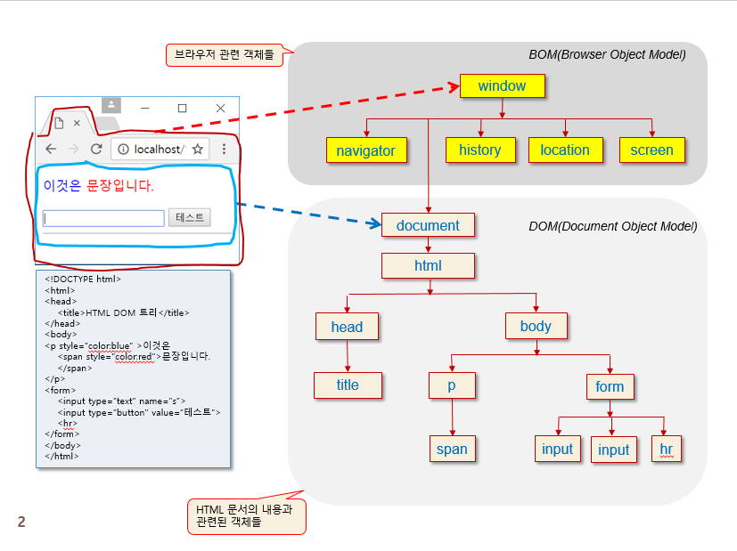

# 프론트엔드 수업 23.09.11

## BOM(Browser Object Model) 객체들

자바 스크립트로 브라우저를 제어하기 위해 지원되는 객체들이다. HTML 페이지의 내용과는 관계없다.

## 브라우저 공통 BOM 객체들과 기능

window : 브라우저 윈도우 모양을 제어한다. 새 윈도우를 열고 닫는 기능

navigator : 브라우저에 대한 다양한 정보를 제공한다.

history : 브라우저 윈도우에 로드한 URL 리스트의 히스토리를 관리한다.

location : 브라우저 윈도우에 로드된 HTML 페이지의 URL을 관리한다.

screen : 브라우저가 실행되고 있는 스크린 장치에 대한 정보를 제공한다.

## BOM과 DOM이 의미하는 것의 차이



## window 객체

window 객체는 열려 있는 브라우저 윈도우나 탭 윈도우의 속성을 나타내는 객체이다. 브라우저 윈도우나 탭 윈도우마다 별도의 window 객체를 생성한다.

### window 객체의 생성

브라우저가 새로운 웹 페이지를 로드할 때 window 객체 생성

<iframe> 태그 당 하나의 window 객체 생성

자바 스크립트 코드로 윈도우 열기 시 window 객체 생성

윈도우 열기 window.open(”웹페이지 URL”, “윈도우 이름”, “윈도우 속성”);

### 자바 스크립트 코드로 윈도우 객체에 대한 접근

window, window.self, self 이 3가지 방법으로 접근이 가능하다.

## 윈도우 모양과 window 객체의 프로퍼티


## 윈도우 열기

window.open(sURL, sWindowName, sFeature)를 사용한다.

sURL : 윈도우에 출력할 웹 페이지 주소 문자열

sWindowName : 새로 여는 윈도우의 이름 문자열로서 생략 가능

sFeature : 윈도우의 모양, 크기 등의 속성들을 표현하는 문자열, 속성들은 빈칸 없이 콤마로 분리하여 작성하며 생략 가능

### 윈도우 이름(sWindowName)의 예

_black : 이름 없는 새 윈도우를 열고, 웹 페이지 로드

_parent : 현재 윈도우(혹은 프레임)의 부모 윈도우에 웹 페이지 로드

_self : 현재 윈도우에 웹 페이지 로드

_top : 브라우저 윈도우에 웹 페이지 로드

### 윈도우 열기 사례


## setTimeout(), clearTimeout()

setTimeout()은 타임아웃 코드를 1회 호출한다.

clearTimeout()은 1회 호출되는 타임아웃 코드가 실행되기 전에 타이머를 해제한다.


## setInterval(), clearInterval()

setInterval()은 타임아웃 코드를 반복해서 실행한다.

clearInterval()은 타이머를 해제한다.


다음은 예제이다. 한글자씩 위치를 뒤로 옮기는 것을 반복한다.

```html
<!DOCTYPE html>
<html lang="en">
<head>
    <meta charset="UTF-8">
    <meta name="viewport" content="width=device-width, initial-scale=1.0">
    <title>Document</title>
    <script>
        
    </script>
</head>
<body>

    <div id="aa">자바스크립트 넘나 재밌는 것</div>

    <script>
        let n = document.getElementById("aa");
        let t = setInterval("on()", 200); // 0.2초 주기로 함수 호출
        
        n.onclick=function(e){
            clearInterval(t); // 타이머 해제
        }

        function on(){
            let a = n.innerHTML;
            let b = a.substr(0, 1); // a의 첫번째 1글자만 b에 저장
            let c = a.substr(1, a.length-1);
            a=c+b;
            n.innerHTML = a;
        }
    </script>
</body>
</html>
```

시간이 표시되다가 사라졌다가 다시 표시되고 그러는 예제

```html
<!DOCTYPE html>
<html lang="en">
<head>
    <meta charset="UTF-8">
    <meta name="viewport" content="width=device-width, initial-scale=1.0">
    <title>Document</title>
    <script>
        
    </script>
</head>
<body>
    <P id="t"></P>
    <script>
        window.onload = function () {
        setInterval(function () {
            let n = new Date();
            let m = setTimeout(function () {
                document.write(n.toLocaleString());
            }, 0);  //일단 시간출력

            setTimeout(function () {
                clearTimeout(m);
                document.body.innerHTML = "";
            }, 1000);
        }, 1000);
      };
    </script>
</body>
</html>
```

## 윈도우 위치 및 크기 조절


## 웹 페이지 스크롤


## 실습

수식의 답을 입력하고 버튼을 누르면 맞은 개수가 나오고, 틀린 문제는 line-through가 적용되게 만들기

```html
<!DOCTYPE html>
<html lang="en">
<head>
    <meta charset="UTF-8">
    <meta name="viewport" content="width=device-width, initial-scale=1.0">
    <title>Document</title>
    <script>
        
    </script>
</head>
<body>
    <label>5*3</label><input type="text" /><br />
    <label>1+2*3</label><input type="text" /><br />
    <label>12*2</label><input type="text" /><br />

    <button onclick="re()">결과</button><span id="result"></span>

    <script>
        function re(){
            let q = document.getElementsByTagName("label");
            let n = document.getElementsByTagName("input");
            let cnt = 0; // 맞은 개수
            for(let i=0; i<q.length; i++){
                if(eval(q[i].innerHTML)==n[i].value){
                    cnt+=1;
                }
                else{
                    q[i].style.textDecoration="line-through";
                }
            }
            document.getElementById("result").innerHTML = cnt;
        }
    </script>
</body>
</html>
```

내가 쓴 비번과 내가 쓴 비번 확인이 일치하면 성공이라는 알림 메시지 창을, 다르면 다시 입력하라는 메시지 창을 띄우는 예제

```html
<!DOCTYPE html>
<html lang="en">
<head>
    <meta charset="UTF-8">
    <meta name="viewport" content="width=device-width, initial-scale=1.0">
    <title>Document</title>
    <script>
        
    </script>
</head>
<body>
    <form id="aa">
        비번 <input type="password" name="pa" id="p"><br />
        비번 확인 <input type="password" name="pp" id="pi"><br />
        <input type="submit" value="제출">
    </form>
    <script>
        window.onload=function(){
            document.getElementById("aa").onsubmit=function(){
                let n = document.getElementById("p").value; // 내가 쓴 비번 값
                let m = document.getElementById("pi").value; // 내가 쓴 비번 확인 값

                if(n==m){
                    alert("성공");
                }
                else{
                    alert("다시 입력");
                    return false;
                }

            };
        };
    </script>
</body>
</html>
```

## location 객체

윈도우에 로드된 웹 페이지의 URL 정보를 나타내는 객체이다.


## navigator 객체

현재 작동중인 브라우저에 대한 다양한 정보를 나타내는 객체이다.


## screen 객체

브라우저가 실행되는 스크린 장치에 관한 정보를 담고 있는 객체이다.


## history 객체

윈도우에서 방문한 웹 페이지 리스트(히스토리)를 나타내는 객체


## script 태그의 defer 속성

defer 속성은 페이지가 모두 로드된 후에 해당 외부 스크립트가 실행됨을 명시한다. defer 속성은 boolean 속성으로 명시하지 않으면 false 값을 가지게 되고, 명시하면 true 값을 가지게 된다.

이 속성은 script 태그 요소가 외부 스크립트를 참조하는 경우에만 사용할 수 있으므로, src 속성이 명시된 경우에만 사용할 수 있다.

## 실습

### 문제가 자동으로 생성되고 10초가 지나면 자동 채점되게 다음과 같은 사진 처럼 만들기


자바 스크립트 부분(t.js 파일)

```jsx
let q = document.getElementsByClassName("op")
let arr = new Array();
let option = ["+", "-", "*", "/"];
for(let i=0; i<q.length; i++){
    num1 = Math.floor(Math.random()*100);
    num2 = Math.floor(Math.random()*100);
    arr.push(num1 + " " + option[Math.floor(Math.random()*4)] + " " + num2);
}

setInterval(function(){for(let i=0; i<q.length; i++){
    q[i].innerHTML = arr[i];
}}, 1000);

let s = document.getElementsByClassName("sec");

let timer = setInterval(function(){
    s[0].innerHTML = parseInt(s[0].innerHTML) - 1;
    if(s[0].innerHTML <= 0){
        clearInterval(timer);
    }
}, 1000);

setTimeout(function(){
    let q = document.getElementsByClassName("op");
    let n = document.getElementsByTagName("input");
    let cnt = 0; // 맞은 개수
    for(let i=0; i<q.length; i++){
        if(eval(q[i].innerHTML)==n[i].value){
            cnt+=1;
        }
        else{
            q[i].style.textDecoration="line-through";
        }
    }
    document.getElementsByClassName("res")[0].innerHTML = cnt;
}, 10000)
```

html 부분

```html
<!DOCTYPE html>
<html lang="en">
<head>
    <meta charset="UTF-8">
    <meta name="viewport" content="width=device-width, initial-scale=1.0">
    <title>Document</title>
    <link rel="stylesheet" href="t.css" />
    <script src="t.js" defer></script>
</head>
<body>
    <h1>문제는 자동으로 생성되며, 10초가 지나면 자동 채점</h1>
    <h3>남은시간<span class="sec"> 10</span></h3>
    <hr />
    <span class="op"></span><input type="text"><br />
    <span class="op"></span><input type="text"><br />
    <span class="op"></span><input type="text"><br />
    <span class="op"></span><input type="text"><br />
    <input type="button" value="다시" class="re"><span class="res"></span>
</body>
</html>
```

css 부분(t.css 파일)

```css
.op{
    float: left;
    width: 90px;
    margin-left: 30px;
}

.res{
    width: 120px;
}
```

선생님이 작성한 자바 스크립트 부분(t.js 파일)

```jsx
let opEle = document.querySelectorAll(".op");
let ansEle = document.querySelectorAll(".ans");
let secEle = document.querySelector(".sec");
let resEle = document.querySelector(".res");
let reBtn = document.querySelector(".re");

let time = 10;
let ops = new Array("+", "-", "*", "/");
let num1 = 0;
let num2 = 0;

window.onload = function () {
  let timer = setInterval(function () {
    secEle.innerText = time--;

    if (time < 0) {
      clearInterval(timer);

      let cnt = 0;
      for (let i = 0; i < opEle.length; i++) {
        if (eval(opEle[i].innerText) === parseInt(ansEle[i].value)) cnt++;
        else {
          opEle[i].style.textDecoration = "line-through";
          ansEle[i].style.color = "red";

          ansEle[i].value = eval(opEle[i].innerText);
        }
      }
      resEle.innerText = "정답 : " + cnt + "개";
    }
  }, 1000);
};

let op = "";
for (let i = 0; i < opEle.length; i++) {
  num1 = Math.floor(Math.random() * 101);
  num2 = Math.floor(Math.random() * 101);
  opEle[i].innerText =
    num1 + " " + ops[Math.floor(Math.random() * 4)] + " " + num2;
}
reBtn.addEventListener("click", function () {
  location.reload();
});
```

선생님이 작성한 html 부분

```html
<!DOCTYPE html>
<html lang="ko">
  <head>
    <link rel="stylesheet" href="t.css" />
    <script src="t.js" defer></script>
  </head>
  <body>
    <h2>문제는 자동으로 생성되며, 10초가 지나면 자동 채점</h2>
    <h3>
      남은시간
      <span class="sec">10</span>
    </h3>

    <hr />

    <span class="op"></span><input type="text" class="ans" /><br />
    <span class="op"></span><input type="text" class="ans" /><br />
    <span class="op"></span><input type="text" class="ans" /><br />
    <span class="op"></span><input type="text" class="ans" /><br />
    <input type="button" value="다시" class="re" /><span class="res"></span>

    <script></script>
  </body>
</html>
```

선생님이 작성한 css 부분(t.css 파일)

```css
.op {
  float: left;
  width: 90px;
  margin-left: 30px;
}
.ans {
  width: 120px;
}
```

### 문자열이 작성된 웹 페이지 팝업창을 띄우기

```html
**<!DOCTYPE html>
<html lang="en">
<head>
    <meta charset="UTF-8">
    <meta name="viewport" content="width=device-width, initial-scale=1.0">
    <title>Document</title>
    <script>
        function ch(){
            let n = window.open("", "v", "width=180, height=50");
            n.document.write("자바스크립");
        }
    </script>
</head>
<body>
    <p>자바스크립트</p>
    <script>
        // 3가지 방법
        // 1. 태그 안에 on~~ 을 적는 것
        // 2. 함수 등록
        // 3. addEventListener
        document.body.onload = ch; // 로딩될 때 ch 함수 호출하라는 의미
    </script>
</body>
</html>**
```

### h2 태그를 생성해서 태그 내에 텍스트 넣기

```html
<!DOCTYPE html>
<html lang="en">
<head>
    <meta charset="UTF-8">
    <meta name="viewport" content="width=device-width, initial-scale=1.0">
    <title>Document</title>
    <script>
        window.onload = function(){
            let n = document.createElement("h2"); // h2 태그 동적 생성
            let m = document.createTextNode("스크립트");

            n.appendChild(m); // h2 태그의 자식으로 TextNode 추가
            document.body.appendChild(n); // body 태그의 자식으로 h2 태그 추가
        };
    </script>
</head>
<body>
</body>
</html>
```

### img 태그를 생성하고 setAttribute로 속성을 설정해서 body에 자식으로 추가하기

```html
<!DOCTYPE html>
<html lang="en">
<head>
    <meta charset="UTF-8">
    <meta name="viewport" content="width=device-width, initial-scale=1.0">
    <title>Document</title>
    <script>
        window.onload = function(){
            let i = document.createElement("img");
            i.setAttribute('src', "C:/Users/EZEN/Desktop/라면.jpg");
            i.setAttribute("width", 300);
            i.setAttribute("height", 200);

            document.body.appendChild(i);
            //  
        }
    </script>
</head>
<body>
</body>
</html>
```

### 텍스트로 html에 작성될 내용을 모두 더해서 변수에 저장하고, body 태그의 innerHTML에 그 값을 대입하여 html 내용을 채우기

```html
<!DOCTYPE html>
<html lang="en">
<head>
    <meta charset="UTF-8">
    <meta name="viewport" content="width=device-width, initial-scale=1.0">
    <title>Document</title>
    <script>
        window.onload = function(){
            let n = "";
            n += "<ul>";
            n += "<li>자바</li>";
            n += "<li>스크립트</li>";
            n += "<li>제이쿼리</li>";
            n += "</ul";

            document.body.innerHTML = n;
        }
    </script>
</head>
<body>
</body>
</html>
```

### 다음에 제시된 사진처럼 만들기

p 태그를 출력하는 웹 페이지가 로드되면 다 로드된 이후에 “thank you” 라는 문자열이 있는 150*100 크기의 새 윈도우를 출력하면 된다.


```html
<!DOCTYPE html>
<html lang="en">
<head>
    <meta charset="UTF-8">
    <meta name="viewport" content="width=device-width, initial-scale=1.0">
    <title>Document</title>
    <script>
        window.onload = function(){
            let n = window.open("", "새 윈도우", "width=180, height=100");
            n.document.write("thank you");
        }
            
    </script>
</head>
<body>
    <p>자바스크립트를 배워보자</p>
</body>
</html>
```

### 체크 표시를 클릭하면 line-through와 글자색 gray로 변경

내가 작성한 코드

```html
<!DOCTYPE html>
<html lang="en">
<head>
    <meta charset="UTF-8">
    <meta name="viewport" content="width=device-width, initial-scale=1.0">
    <title>Document</title>
    <style>
        span{
            margin-right: 10px;
        }
        p{
            font-weight: 500;
            font-size: 20px;
            margin-bottom: 10px;
            text-indent: 3em;
        }
    </style>
    <script>
        function on1(){
            let p1 = document.getElementById("p1");            
            p1.style.textDecoration="line-through";
            p1.style.color="gray";
            
        }
        function on2(){
            let p2 = document.getElementById("p2");
            p2.style.textDecoration="line-through";
            p2.style.color="gray";
        }
        function on3(){
            let p3 = document.getElementById("p3");
            p3.style.textDecoration="line-through";
            p3.style.color="gray";
        }
        function on4(){
            let p4 = document.getElementById("p4");
            p4.style.textDecoration="line-through";
            p4.style.color="gray";
        }
        function on5(){
            let p5 = document.getElementById("p5");
            p5.style.textDecoration="line-through";
            p5.style.color="gray";
        }
        
    </script>
</head>
<body>
    <h1>할 일 목록</h1>
    <p id="p1"><span onclick="on1()">&check;</span> 할 일 1</p>
    <p id="p2"><span onclick="on2()">&check;</span> 할 일 2</p>
    <p id="p3"><span onclick="on3()">&check;</span> 할 일 3</p>
    <p id="p4"><span onclick="on4()">&check;</span> 할 일 4</p>
    <p id="p5"><span onclick="on5()">&check;</span> 할 일 5</p>
</body>
</html>
```

더 효율적으로 개선된 코드

```html

```