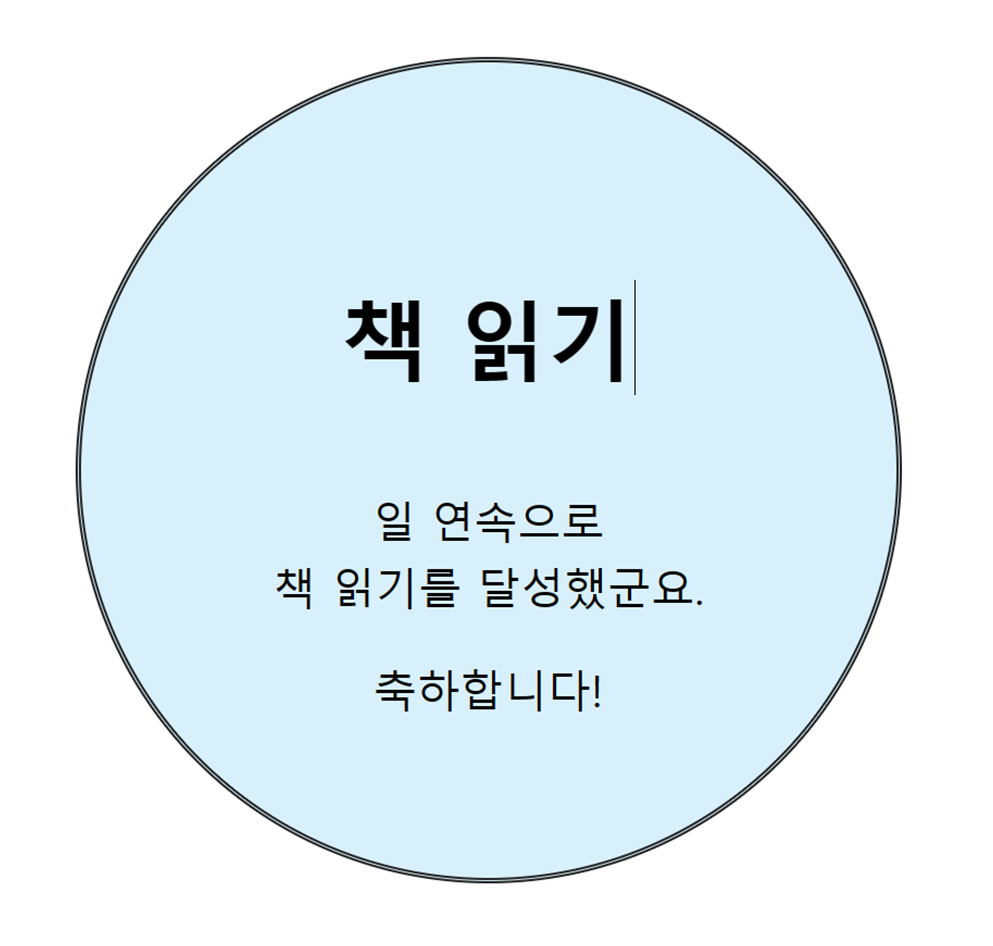

# 프론트엔드 수업 23.09.12

## 실습

다음에 제시된 사진처럼 만들기



```html
<!DOCTYPE html>
<html lang="en">
<head>
    <meta charset="UTF-8">
    <meta name="viewport" content="width=device-width, initial-scale=1.0">
    <title>Document</title>
    <style>
        div{
            border: 2px double black;
            width: 400px;
            height: 400px;
            background-color: #D8F0FC;
            margin: 100px auto;
            border-radius: 50%;
            text-align: center;
            
        }
        h1{
            margin-top: 120px;
            font-size: 2.5em;
        }
        p{
            font-weight: 500;
            font-size: large;
        }
        
    </style>

</head>
<body>
    <div>
        <h1>책 읽기</h1>
        <p><span id="re"></span>일 연속으로<br />
            책 읽기를 달성했군요.</p>
        <p>축하합니다!</p>
    </div>

    <script>
        let now = new Date("2023-09-12");
        let f = new Date("2023-08-01");
        let a = now.getTime(); // 9월 12일까지 지난 시간(밀리초 단위)
        let b = f.getTime(); // 8월 1일까지 지난 시간(밀리초 단위)
        let c = a-b; // 8월 1일부터 9월 12일까지 지난 시간(밀리초 단위)

        c = Math.round(c/(1000*60*60*24)); // 밀리초를 일로 변환하고 반올림
        document.querySelector("#re").innerText = c;

    </script>
</body>
</html>
```

더보기를 클릭하면 설명이 나오게 만들기

```html
<!DOCTYPE html>
<html lang="en">
<head>
    <meta charset="UTF-8">
    <meta name="viewport" content="width=device-width, initial-scale=1.0">
    <title>Document</title>
    <style>
        #container{
            margin-top: 50px;
            margin-left: 80px;
        }
    </style>
    <script>
        function on(){
            let n = document.createElement("p");
            n.innerHTML = "DOM은 Document Object Model의 줄임말입니다.";
            let info = document.getElementById("info");
            info.appendChild(n);
        }
    </script>

</head>
<body>
    <div id="container">    
        <h1>DOM을 공부합시다</h1>
        <a href="#" onclick="on(); this.onclick='';">더 보기</a>    
        <div id="info"></div>
    </div>
</body>
</html>
```

## const 키워드

const가 앞에 붙은 변수는 상수가 되어 자바의 final 같은 역할을 한다. 초기에 지정된 값을 바꿀 수 없으며, 값을 바꾸려고 시도할 경우 실행했을 때 에러가 발생한다.

콘솔 창이나 웹 페이지에 출력할 때 에러가 발생해서 출력되지 않고 그 다음 코드도 실행되지 않는다.

```html
<!DOCTYPE html>
<html lang="en">
<head>
    <meta charset="UTF-8">
    <meta name="viewport" content="width=device-width, initial-scale=1.0">
    <title>Document</title>

</head>
<body>
    <script>
        let name = "철수";

        const age = 15; // const는 상수값이라서 값을 수정할 수 없음
        age = 30; // 에러 발생
        console.log(age);
        console.log(name);
    </script>
</body>
</html>
```

## 복습

float와 float를 취소하는 clear

```html
<!DOCTYPE html>
<html lang="en">
<head>
    <meta charset="UTF-8">
    <meta name="viewport" content="width=device-width, initial-scale=1.0">
    <title>Document</title>
    <style>
        body{
            margin: 0;
            padding: 0;
            height: 100%;
        }
        header{
            width: 100%;
            height: 20px;
            background-color: red;
        }
        nav{
            width: 20%;
            height: 280px;
            background-color: orange;
            float: left;
        }
        section{
            width: 60%;
            height: 280px;
            background-color: yellow;
            float: left;
        }
        aside{
            width: 20%;
            height: 280px;
            background-color: green;
            float: left;
        }
        footer{
            width: 100%;
            height: 20px;
            background-color: blue;
            clear: both; /* float한 부분을 없애는 과정 */
        }
    </style>

</head>
<body>
    <header>header</header>

    <nav>navigation</nav>

    <section>section</section>

    <aside>aside</aside>

    <footer>foot</footer>
</body>
</html>
```