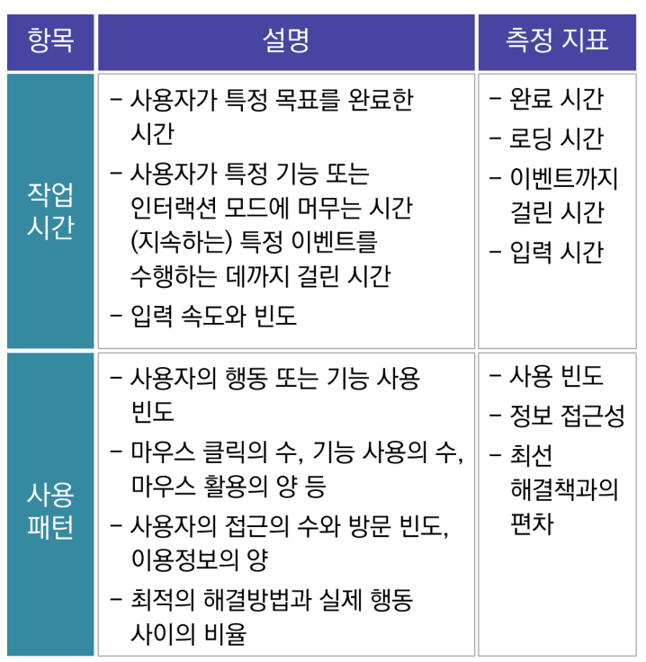

# 화면 구현 인강 23.10.02

# UI 설계 검토

## 설계 개발 프로세스

UX / UI 기획 → UI 설계 문서 → GUI 디자인 → GUI 가이드라인 → 코딩 개발

### UX / UI 기획

우리가 제공하려는 서비스에서 상호작용을 설계하여 좋은 사용성과 상호작용 수단과 방식을 제공한다.

### UI 설계 문서 작성

프로젝트 및 사업을 진행할 때 여러 이해관계자가 원활하게 커뮤니케이션을 하기 위한 문서 작성이다.

### GUI 디자인

설계 문서를 기반으로 그래픽 디자인 작업을 하는 것을 말한다.

### GUI 가이드라인

그래픽 작업을 통하여 생성된 이미지를 이용하여 화면에 배치하는 작업을 말한다.

### 코딩 개발

개발자는 GUI 가이드 문서를 이용하여 실제 화면을 코딩한다.

## UI 디자인 문서

UI 디자인 문서는 이해관계자 간의 커뮤니케이션 도구이다.

상세 수준에 따라 그래픽 디자인과 개발 결과가 달라질 수 있고, 개발 및 출시 후 UI 의도와 결정의 근거가 된다.

### 디자인 문서 작성법

화면 스케치, Wireframe 디자인, 화면의 상세 요소에 대한 기술, 동작에 대한 명세로 구분된다.

화면 스케치는 주요 화면에 대한 컨셉 스케치로 화면의 큰 스타일 및 대략적인 정보를 배치한다. 몇 가지 안에 대하여 내부 검토 후 선택한다.

Wireframe 디자인은 자세한 화면 구성으로 UI 구성요소를 채워 넣는 일이다. 실제 적용 가능한 UI 구성요소를 적용하고 실제 화면에서 보이는 것과 유사한 크기의 Font, Image Size 등으로 구성한다.

화면의 상세 요소에 대한 기술은 자세한 화면의 구성 및 요소에 대한 설명이다. 디자인 및 개발 시 주의사항 및 요구사항을 설명한다.

동작에 대한 명세는 각각의 화면을 설명하는 구성 이외에 전체 화면 간의 흐름을 볼 수 있는 내용이다. 화면 사이의 이동을 표현하기 위해 Flowchart와 유사한 도구를 사용한다.

### 디자인 가이드라인 작성법

최우선 목적에 집중하여 사용자에게 가장 중요한 목적이 무엇인지 판단하고, 최우선 목적에 맞게 디자인 되었는지 고려한다.

작성할 때는 최대한 간결하게 작성해야 한다. 정말 필요한 정보인지 판단하여 필요한 정보만 삽입하고, 가장 적당한 디자인을 통해 최대한의 효과를 창출한다.

정보를 적절한 스타일로 제공하고 중요한 것은 강조해야 한다. 중요한 정보를 강조하여 사용자에게 전달력을 높인다.

동작하는 방법을 알려주는 디자인이어야 한다. 사용자가 디자인을 통해 무엇을 어떻게 해야 할지 알려주는 형식의 디자인이 필요하다. 이때 Color, Size, Font, Layout 등을 고려한다.

인터랙션을 활용해야 한다. 혁신적인 인터랙션을 통해 쉽게 사용할 수 있도록 유도한다.

Pixel은 해상도를 고려한 디자인 Pixel을 조정한다.

Text보다는 Image를 활용하여 정확한 의미를 전달한다.

기타 고려해야 할 사항으로는 가독성이 보장되는 텍스트 크기와 색상 선택, 간섭없이 누를 수 있는 버튼 사이즈 고려, 다양한 디바이스에서 사용 가능한 디자인, 직접 입력보다 사용자가 선택할 수 있는 UI 사용 등이 있다.

## UI 설계 시 고려사항

화면 설계 시 실제 화면과 1:1 구도로 작업해야 전체적인 컨텐츠의 구조를 파악할 수 있다.

디자이너와의 커뮤니케이션이 원활해야 한다.

UI 화면 설계 작업을 실제 화면과 같은 구도로 작업해야 하며, 컨텐츠 구성 및 배치는 반드시 이유와 목적이 있어야 한다.

사업의 전략 → 컨셉 → 서비스 컨셉 → 메인-서브 페이지의 컨셉 → UI 설계 순으로 진행되며, 모든 기획은 사용자의 입장을 고려하고, UI 화면 설계와 문서는 직관적이며 쉽게 구성한다.

관련 문서에는 Wireframe, 스토리보드, UI 시나리오(글과 그림으로 설명이 들어간 문서), Workflow, IA(Information Architecture), DFD(Data Flow Diagram) 등이 있다.

### IA(Information Architecture)

IA는 사이트에서 데이터만 털어내기 → 카드 분류 → 분류 패턴 제작 → Tree 형식의 구조 제작 순으로 이루어진다.

### 사이트맵

IA에서 간단하게 페이지 중심으로 맵을 만든 것을 말한다.

사이트 전체를 쉽게 이해할 수 있게 해준다.

### DFD(Data Flow Diagram)

DFD는 데이터의 흐름 다이어그램을 뜻한다.

데이터가 어디서 와서 어디로 흘러가는지 정의가 필요할 때 반드시 만들어 주어야 한다.

### 기능설계서

기능 Input과 Output에 대한 정의가 가장 중요하다.

무엇을 집어넣어서 무엇을 내보낼 것인지에 대한 정의가 있어야 한다.

### Flowchart

사용자가 서비스를 이용하면서 여러 가지 시나리오를 조사하고, 여러 가지 조건들을 Flowchart로 작성한다.

사용자 측면 뿐만 아니라, 데이터 측면에서도 필요한 경우 Flowchart를 만들 필요성이 있다.

# UI 설계 피드백

## 디자인 검토 및 협업

다음은 그래픽 디자인과 개발 간 조율과 협업에 대한 UI 디자이너의 중요한 역할들이다.

### 초기 UI 디자인 리뷰 및 수정

목적은 서비스 기획 의도, 법률, 보안, 사내 정책 등을 고려하여 검토하기 위한 것이다.

방법은 GUI 가이드, 개발이 있다.

GUI 가이드는 화면 설계에 대한 자세한 의도 전달 확인을 한다.

개발은 상세 UI 정의 누락 여부 확인, 기술 및 일정에 대한 개발 가능성 검토를 한다.

### 디자인 및 개발 진행 중 UI 리뷰 및 수정

목적은 디자인 중간 진행 상황을 체크하기 위한 것이다.

방법은 GUI 가이드, 개발이 있다.

GUI 가이드는 의도와 다른 그래픽 디자인 결과에 대한 수정사항을 검토한다.

개발은 개발 중 구현 이슈, 일정상의 이슈 및 개발 결과와 UI가 다른 경우 확인한다.

### 기획팀, 디자이너, 개발팀 협업 이슈

빠른 대안 찾기와 전체를 고려한 디자인 수정 작업으로 기획된 디자인으로 개발이 어려운 경우 다른 대안을 찾고, 그 문제점을 파악 후 알맞은 디자인으로 교체한다.

개발 기간 단축을 위한 효율적인 업무 체계로 디자인 협업 소프트웨어를 활용한 실시간 업무 협의 체계를 도입한다.

## 디자인 검증

### 사용성 테스트(Usability Test)

사용성 테스트는 사용자의 니즈를 발견하는 방법이다.

상세한 문제점 진단 및 개선 방향 제시가 가능하고, 문제의 중요도를 판단해 작업의 우선순위를 정하는 데 도움이 된다.

형성 사용성 테스트(Formative Usability Test)는 시스템을 형성하는 과정에서 도움이 되는 테스트 방법이다. 사용성의 문제점을 발견하거나 디자인 결정에 이용된다. 문제점을 빠르게 찾을 수 있다는 장점이 있다.

총괄 사용성 테스트(Summative Usability Test)는 개발 후반부에 시행한다. 수행 데이터 분석을 통해 데이터적인 검증결과를 도출한다.

사용성 테스트의 평가 절차 중 테스트 시나리오 수행과 측정 및 기록 단계에서는 실제 사용 상황을 가정해서 미리 작성된 목표 시나리오에 맞춰 기기 조작을 실행한다. 수행 시간, 수행도, 특이사항, 주요 오류 유형 측정 및 기록 등이 이루어진다.

사용성 테스트의 평가 절차 중 사용자 만족도 평가와 개선 보안 사항 발굴 단계에서는 제품에 대한 상요자 인터페이스의 주요 구성 요소별 사용자 만족도를 평가하고 사용성을 높이기 위해 개선하고 보완해야 할 요소를 발굴한다.

사용성 테스트의 평가 절차 중 문제점의 개선 및 보완을 위한 새로운 아이디어 탐색(반복 실행) 단계에서는 주요 사용상 오류의 원인을 진단하고, 이를 개선 및 보완하기 위한 아이디에이션(Ideation)을 진행한다. 또한 향후 사용자 인터페이스 개발을 위한 새로운 아이디어를 탐색한다.

사용성 테스트의 작업 시간, 사용 패턴, 정확성, 완성도, 학습 용이성, 일관성은 다음과 같다.

### Heuristic Evaluation

평가 척도에 따른 준수 여부를 사용성 전문가들이 판단하는 방법론이다.

시스템 개발, 평가에 사용하며, 시스템 인터페이스의 문제점을 파악하기 위해 평가 목적으로 개념화 시킨 방법론이다.

장점은 전문가들만 모여지면 언제든지 활용할 수 있어서 시간과 비용이 절약된다는 점이다.

단점은 전문가 개인의 편견이 개입될 수 있다는 점이다.

Heuristic Evaluation의 평가 단계는 계획 → 평가자 결정 → 실행 → 결과 분석 순으로 이루어진다.

평가 척도는 다음과 같다.

### Cognitive Walkthrough

인지적 시찰법이다.

사용자 조사방법으로 시스템 이해의 난이도 및 배우기 쉬운지를 평가한다.

편리성 여부의 평가로서 설명 또는 안내 없이 사용하는지 검증한다.

어떤 한 시점에서 적합한 행동을 취하는지 여부의 평가로 연속된 행동을 단계별로 분석한다.

A단계에서는 평가하고자 하는 인터페이스의 대표성을 가진 대상을 사용자 관점에서 선정한다.

B단계에서는 행동 단계 예측 및 연속된 행동의 단계마다 학습 이론 기반의 질문을 한다.

C단계에서는 예상 행동을 유도하는지의 여부를 평가하고, 시스템에서 제공하는 피드백이 사용자가 원하는 방법으로 실행되는지 판단한다.

장점은 웹사이트 같은 애플리케이션의 기능 면에서 특정 범위를 정의하기 유용하고, 해당 인터페이스가 효과적으로 탐색하기에 쉬운지, 어려운지를 보여주는 지표로 사용할 수 있다는 것이다. 또한 음성이나 화면 기반의 시스템 평가에 적합하다는 점이다.

# 프로토타입 확인

## 프로토타입의 필요성

### 프로토타입

프로토타입은 원래의 형태 또는 전형적인 예로 기초 또는 표준을 말한다.

시제품이 나오기 전의 제품의 원형이다.

### 프로토타이핑

프로토타이핑은 개발자들과 사용자들의 의사소통 상의 효과를 증진하기 위한 시스템 개발 기법이다.

제품의 구체적인 형태를 디자인 하는 작업이다.

개발자와 사용자 간의 상호 이해 및 지식 교환을 위한 작업이다.

### 프로토 타이핑 과정

1단계에서는 사용자 요구사항 분석을 위해 시스템 설계자와 사용자 간에 함께 작업한다.

2단계에서는 요구사항을 만족하는 4세대 언어(4GL : Forth Generation Language)를 사용하고, CASE 도구를 이용하여 앞으로 개발될 시스템의 가장 핵심적인 기능 위주로 개발한다.

3단계에서는 사용자가 프로토타입 사용 및 요구사항을 확인하고 여러 가지 보완점을 제안한다.

4단계에서는 프로토타입의 수정과 보완 작업을 진행하여 수정 후 3단계~4단계를 반복하면서 사용자의 요구사항을 확인하고 제안된 보완점을 다시 수정하는 작업을 거쳐 최종적인 결과물을 만들어낸다.

### 장단점

장점은 사용자 중심 개발방법으로 최종 사용자의 요구를 극대화 할 수 있고, 개발 시간이 단축되며, 초기 오류 발견으로 변경이 용이하다는 점이다.

단점은 시스템의 문서로 만드는 과정이 지나치게 축소될 가능성이 있어서 추후 유지보수의 불필요한 노력이 발생한다는 점, 최종적으로 수정 및 변경 발생 시 개발 시간 소요와 비용이 발생한다는 점, 전체 품질과 장기적인 유지보수가 어렵다는 점이 있다.

### 목적과 필요성

요구분석의 어려움을 해결하기 위해 필요하다.

요구사항에 대해 사용자와 커뮤니케이션의 수단이 되므로 필요하다.

사용자와 의사소통 및 개발 타당성을 검토하기 위해 필요하다.

서비스의 플로우 또는 구조 점검을 위해 필요하다.

또한 사용자의 참여를 유도하기 위해 필요하다.

## 프로토타입의 종류

### 종류

콘셉트를 신속하게 표현하는 경우에는 시각적 구현의 충실도가 떨어지고, 기능적 구현의 충실도는 높아진다. 콘셉트, 아이디어를 신속하게 외형적으로 표현할 수 있고, 기능적인 문제점 발견 및 업무 흐름에 관련된 문제점을 찾을 때 유용하다. 프로토타입의 품질이 낮기 때문에 UX 콘셉트, 아이디어의 방향성 점검 시에 사용한다.

인터랙션, 기능 위주인 경우에는 시각적 구현의 충실도가 떨어지고, 기능적 구현의 충실도는 높아진다. 각각의 인터랙션, 기능에 대한 점검이 목적이며, 제품의 기능적인 요구수준을 파악할 수 있다. 특정 기능을 깊이 다루거나 여러 개의 화면을 연속해서 프로토타이핑한다. 기술적 구현 충실도까지 고려하는 경우에 유용하게 사용한다.

디자인, 사용성 위주인 경우에는 시각적 구현의 충실도가 높아지고, 기능적 구현의 충실도는 낮아진다. 비주얼 디자인까지 입힌 다음 사용성을 점검하는 것이 목적이며, 콘텐츠를 실제와 유사하게 반영한다. 개별 화면 단위로 제작한다. 감성적인 만족도 체크와 깊은 연관이 있다.

높은 품질의 프로토타입인 경우에는 시각적 구현의 충실도와 기능적 구현의 충실도가 모두 높다. 신제품 개발 시 사용자 반응을 점검하는 목적으로 사용한다. 프로토타입을 통한 사용자 테스트가 프로젝트에서 큰 비중을 차지한다. 기술, 콘텐츠도 깊이 있게 반영되며 많은 이해 관계자가 참여한다. 이는 사용자 테스트와 깊은 연관이 있다.

### 충실도에 따른 방법

저수준 프로토타이핑(Low-fidelity prototyping)은 빠른 시간 안에 프로토타이핑이 필요한 경우에 사용한다. 작은 공간과 적은 시간을 들여 구현할 수 있다.

저수준 프로토 타이핑의 종류에는 스케치, 페이퍼 프로토타입, Wireframe 등이 있다.

스케치는 비교적 간단한 형태로 아이디어를 표현하고, 다른 사람들과 브레인스토밍 하는 재료로 활용한다. 페이퍼 프로토타이핑을 위한 전 단계이거나 페이퍼 프로토타이핑 자체가 되는 경우이다.

페이퍼 프로토타입은 종이로 해당 서비스를 간단하게 만들어 실제 구현되는 것처럼 테스트하는 방법이다. 제작이 간단하고 빠르고 수정도 용이하다. 언제 어디서든 할 수 있고, 협업 작업이 쉽다. 시간, 노력, 비용이 적게 든다.

Wireframe은 페이퍼 프로토타이핑 결과를 한 단계 더 구현 충실도가 높은 형태로 정리하는 데 적합하다. UI 구성, 콘텐츠 배치, 내비게이션 흐름 등을 표현하는 데 활용한다. 정적인 화면들로 구성되어 이용의 흐름과 같이 실제 사용자들이 마주치는 경험을 그대로 표현하지는 못한다.

고수준 프로토타이핑(High-fidelity prototyping)은 사용자가 직접 참여한 사용성 평가 등에서 활용한다. 디자인의 시제품, 소프트웨어의 베타 버전 등 프로젝트의 최종 결과물과 유사도, 완성도가 높은 프로토타입을 활용한다.

고수준 프로토타이핑에는 디지털 프로토타입이 있다.

디지털 프로토타입은 일정 및 제작 인력이 충분하고 실제 동작하는 프로토타입으로 꼭 확인해야 할 중요한 부분이 있는 경우에 사용한다. 마우스 클릭, 키보드 입력 등 인터랙션에 대한 사용자 반응을 바로 확인할 수 있다. 프로토타이핑 툴을 이용하여 사용한다.