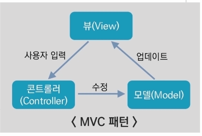

# 화면구현 인강 23.09.16

## 화면 구현

화면 구현은 UI 요구사항을 확인하여 설계한 UI 설계를 기반으로 화면을 구현하는 것이다.

우리가 일상에서 눈으로 보는 다양한 서비스를 만들어 내는 것이다.

## 아키텍처와 소프트웨어

아키텍처는 건축에서 가장 많이 활용되는 의미로 설계, 뼈대를 구성한다.

아키텍처는 비즈니스 요구 사항을 만족시키기 위해 전체 시스템에 대한 구조를 정의하는 것이다.

소프트웨어는 건축과 달리 무형으로 존재하는 다양한 동작들로 구성되어 있다.

소프트웨어에서의 아키텍처란 무형으로 존재하는 다양한 동작들을 어떻게 구현할지 설계하고 그 뼈대를 만들어 내는 것을 말한다.

## 소프트웨어에서의 화면 구현

소프트웨어는 다양한 사용자 입력과 그에 따른 출력을 화면에서 모두 구현한다.

소프트웨어에서의 화면 구현은 입력과 출력을 모두 포함하는 개념이다.

## 아키텍처 설계 고려사항

사용자 요구 사항에 맞춰 설계해야 한다.

변화되는 비즈니스 전략에 대응하기 위해 확장 가능한 형태로 설계해야 한다.

조직의 기술 수준, 규모, 형태와 비즈니스 형태를 분석해서 시스템을 사용할 조직에 맞게 설계해야 한다.

## 아키텍처의 특징

아키텍처는 소프트웨어 요소 간의 관계 정보를 가진다.

하나 이상의 아키텍처 요소와 한 가지 이상의 연관 관계로 구성될 수 있다.

시스템의 공통성을 추상화 시켜서 다양한 행동과 개념, 패턴, 접근 방법, 결과 등을 나타낸다.

외부에 드러나는 시스템 요소의 행위는 다른 시스템 요소와의 상호 작용 방법을 제시한다.

시스템의 전체적인 구조를 표현한다.

## 아키텍처 구성요소

참조 모델, 아키텍처 패턴, 참조 아키텍처, 소프트웨어 아키텍처로 구분해서 구성되어 있다.

### 참조 모델

비즈니스 또는 시스템 문제를 해결하는 데 참여하는 일반적인 기능의 구분을 하는 것을 말한다.

### 아키텍처 패턴

아키텍처에 있는 일련의 제약사항을 표현하고 시스템 구조를 체계적으로 구성하기 위한 기본적인 스키마를 말한다.

대표적으로 클라이언트-서버 구조, MVC 패턴, 마스터 슬레이브 패턴 등이 있다.

MVC 패턴은 다음과 같이 뷰, 컨트롤러, 모델이 유기적으로 동작하는 것을 말한다.

### 참조 아키텍처

참조 모델을 구성하는 요소들을 소프트웨어로 구현한 단위와 이들 간의 데이터 흐름이다.

각 참조 모델의 기능에 대해 시스템 또는 애플리케이션의 분할된 구조이며, 참조 모델은 기능 분할된 구조를 나타낸다.

### 소프트웨어 아키텍처

목표 시스템의 기능적 또는 비기능적 요구 사항, 기술적, 자원적 제약 등을 고려하여 하나 이상의 참조 아키텍처를 수정하거나 보완하는 것을 말한다.

## 아키텍처의 기능

간략화 : 이해하고 추론할 정도의 간결성을 유지하는 것

추상화 : 추상적인 표현을 사용하여 복잡도를 관리하는 것

가시성 : 시스템이 포함해야 할 것들을 시각적으로 표현하는 것

관점 모형 : 이해당사자의 관심사에 따른 모형을 제시하는 것

의사소통 수단 : 이해당사자 간의 원활한 의사소통의 수단으로 이용되는 것

## 아키텍처 모델, 역할, 뷰

### 개념 모델(IEEE1471-2000)

이해관계자, 관심, 뷰 포인트, 뷰, 모델 등이 있다.

이해 관계자는 시스템 아키텍처의 이해 관계자를 의미한다.

이해 관계자의 종류는 아키텍처 개발자, 시스템 운영자, DBA, 최종 사용자, 경영자, PM, 비즈니스 분석가 등이 있다.

관심은 기능 요구 사항과 비기능 요구 사항, 정적인 구조와 동적인 동작, 개념, 논리 물리 레벨의 관점 및 표시, 성능이나 보안, 서비스 내용 및 배치 등 개발에 관계되는 요소 등을 포함한다.

뷰 포인트는 뷰를 기술 및 분석하기 위한 모델이다. 모델에 적용하는 모델링 기법, 분석 기법 등을 규정한다.

뷰는 여러 이해 관계자의 관심사에 본 시스템의 전체를 표현한다.

모델은 UML 다이어그램 등이 있다.

IEEE1471-2000은 IEEE 1471은 소프트웨어 구조에 대한 기술을 규정한 IEEE 표준이다.

‘ISO/IEC 42010, 시스템과 소프트웨어 공학-구조 기술’을 대체하는 것을 IEEE1471-2000에서 새롭게 정의하고 있다.

### 아키텍처 역할

고객 대응, 프로젝트 관리 파트 대응, 개발 파트 대응, 솔루션 담당 등이 있다.

고객 대응은 시스템의 품질 속성을 도출하고 Trade-off 분석을 통해 구현 가능한 아키텍처를 제시한다. 의사 결정을 조정하고 근거 자료 확보를 위해 고객 및 시스템 사용자와의 의사소통을 담당한다.

프로젝트 관리 파트 대응은 개발 프로세스의 일정을 계획할 때 아키텍처 관점에서 의견을 제공한다. 개발 위험 요소를 파악하여 관련 의사 결정권자에게 통지하거나 이를 완화 시키는 방법을 강구한다.

개발 파트 대응은 개발팀과 도출된 아키텍처를 구현하는 데 고려해야 하는 여러 가지 설계 이슈 가이드를 제공하고, 리뷰에 관한 의사소통을 개발한다.

솔루션 담당은 아키텍처 구현을 위해 사용되는 다수의 솔루션 적용에 필요한 기술적 또는 기능적 이슈에 대해 소통하고, 솔루션 벤더, 컨설턴트 등과 의사소통을 담당한다.

### 아키텍처 뷰

시스템의 여러 가지 측면을 고려하기 위해 다양한 관점을 바탕으로 정의하는 것이다.

아키텍처 개발자, PM, 경영자 등이 아키텍처 뷰를 통해서 시스템을 이해하고 설계하게 된다.

아키텍처 뷰의 예시로는 Perry and Wolf’s Model, Shaw and Garlan’s Model, 4+1 View Model 등이 있다.

Perry and Wolf’s Model은 요소, 표현법, 근거를 통해서 보여준다.

요소는 프로세싱, 데이터, 연결이 있고, 표현법(Form)은 속성과 관계로 나타낸다. 근거는 아키텍처를 정의하는데 고려되는 다양한 선택에 대한 근거로 기능성, 성능, 신뢰성, 경제성 등이 있다.

Shaw and Garlan’s Model은 컴포넌트, 커넥터, 패턴을 통해서 보여준다.

컴포넌트는 할당된 임무를 제공하는 실행 가능한 요소이고, 커넥터는 컴포넌트 간 상호작용 중재자 역할을 한다. 패턴은 컴포넌트와 커넥터가 조합되는 방법에 대한 제약 사항을 말한다.

4+1 View Model은 5개의 모델이 있다. 사용자 사례 관점(Use Case View), 설계 관점(Design View), 구현 관점(Implementation View), 프로세스 관점(Process View), 배치 관점(Deployment View)의 뷰 모델을 갖는다.

사용자 사례 관점은 시스템의 외부 사용자 관점에서 사용 사례와 이들 간의 관계를 정의하고 시스템 아키텍처를 도출한다.

설계 관점은 상위 수준에서 시스템의 논리적인 구조와 행위를 클래스, 인터페이스, 협력 관계로 정의한다. 또한 클래스나 컴포넌트의 종류와 관계를 설명하고 설계가 실제로 구현되는지 설명하고, 시스템의 기능 요구 사항을 설명한다.

구현 관점은 시스템의 병렬 처리 및 동기화 처리를 위한 스레드와 프로세스를 정의한다.

프로세스 관점은 독립적으로 실행되는 컴포넌트와 이들 간의 관계를 정의한다.

배치 관점은 실행되는 시스템 하드웨어와 소프트웨어의 관계를 정의한다.

## 아키텍처 설계의 중요성

아키텍처는 여러 이해 관계자 간의 의사소통 수단이 된다. 즉, 아키텍처는 시스템을 효과적으로 관리할 수 있는 수준에서 고려사항을 표현하고 조율하는 공용어의 역할을 하기 때문에 중요한 역할을 한다.

아키텍처는 초기 설계 의사 결정 방향에 대한 선언의 역할을 한다. 고려사항들의 우선 순위를 분석할 수 있는 최초 산출물로, 성능, 개발비용과 품질 간의 절충 등이 모두 아키텍처에 따라 결정된다. 이처럼 아키텍처를 설계하는 것은 전체적인 비용 등에도 영향을 미치기 때문에 중요한 역할을 한다.

아키텍처는 재사용이 가능하며, 타 시스템에도 적용 가능한 시스템에 대한 추상화된 표현이기 때문에 요구 사항이 유사한 시스템에 적용할 수 있다. 이를 통해 재사용하여 소프트웨어 제품 라인을 구성할 수 있다. 재사용이 된다면 비용, 시간 등을 절감할 수 있기 때문에 아키텍처를 잘 설계해 놓는 것이 중요하다.

## 아키텍처 설계 순서

다음과 같은 순서로 아키텍처를 설계한다.

시스템 환경의 이해 → 요구 사항 분석 → 아키텍처 분석 → 아키텍처 설계 → 검증 및 승인

### 시스템 환경의 이해

현재 상황을 이해하고 분석하여 앞으로의 환경 변화에 따른 미래 요구 사항을 예측한다. 이 과정에서 추가적인 아키텍처의 품질 속성 및 요구 사항을 파악할 수 있다는 장점이 있다.

이 과정에서 아키텍처에 영향을 미치는 요소에는 기술적 환경, 배경과 경험, 개발 조직, 이해 관계자, 품질 요구 사항 등이 있다.

### 요구 사항 분석

이해 관계자의 다양한 요구 사항을 이해하고 분석해서 소프트웨어 품질 요구 사항을 정형화하여 명세한다. 이 부분이 중요한 이유는 무엇인가를 만들 때 제작을 요청한 사람의 요구 사항을 정확하게 이해하고 명세하고 있어야 제작 이후에 잘 만들어졌는지 평가가 가능하기 때문이다.

이 과정에서 요구 사항을 정형화하여 명세하는 방법으로는 요구 사항 취득 → 식별 → 명세 → 분류 → 검증의 단계를 거치고, 기능적 또는 비기능적 요구 사항을 분류하고 명세한다.

### 아키텍처 분석

품질 요소를 식별하고, 품질 요소의 우선순위를 결정하고, 그에 따른 전술을 개발한다.

품질 요소 식별에서는 기능성, 신뢰성 효율성, 유지 보수성, 이식성을 고려한다.

품질 요소의 우선순위를 결정할 때는 품질 요소의 목표 및 영향도를 식별하고 품질 시나리오를 작성한다.

전술 개발 단계에서는 품질 속성별로 개발하고 명세한다.

### 아키텍처 설계

관점을 정의하고, 뷰를 정의하고, 아키텍처 스타일을 선택하고, 후보 아키텍처를 도출한다.

관점 정의에서는 이해 당사자를 파악하고 이해 당사자별 관점을 정의한다.

뷰 정의에서는 시나리오로 표현된 품질 요구사항을 정의한다. 아키텍처 패턴, 설계 전술 등을 결정하고 실체화하고 뷰를 작성한다.

아키텍처 스타일 선택에서는 Pipe-Filter, MVC, Layer 등 여러 패턴을 혼용하여 적용한다.

후보 아키텍처 도출에서는 Context Diagram 및 각종 뷰별로 다이어그램을 작성하고, SAD(Software Architecture Description)을 기술한다.

### 검증 및 승인

다양한 설계 고려사항이 합리적으로 결정되었는지 확인하고 검증하는 단계이다.

실제 무엇인가를 구현하거나 설계했을 때, 요구사항에 맞게 만들어졌는지를 확인할 기준이 있어야 하고, 그 기준에 맞게 평가할 필요가 있기 때문에 중요한 단계라고 할 수 있다.

검증 및 승인 단계는 아키텍처 평가, 아키텍처 상세화, 아키텍처 승인 과정을 거친다.

아키텍처 평가는 요구 사항 만족 적합성 평가, 품질 속성 간 Tradeoff 관계 평가(ATAM) 등이 있다. ATAM은 Architecture Tradeoff Analysis Method이다.

아키텍처 상세화는 반복적으로 진행하며, Persistency, Transaction 등의 설계 메커니즘을 도출하고 디자인 패턴을 고려한다.

아키텍처 승인에서는 고객 및 이해 당사자의 최종 승인이 이루어진다. 승인이 되는 순간이 아키텍처의 설계가 마무리되는 순간이다.

## 아키텍처 설계의 상세 절차

### 요구 사항 분석

요구 사항 분석 단계에서는 요구 사항 검토, 중요 속성 식별, 시나리오 작성을 한다.

요구 사항 검토는 활동 및 역할 소개, 비즈니스 목표 이해, 시스템 환경 이해를 하는 것이다.

중요 속성 식별은 중요 기능 요구 사항 식별, 핵심 물질 속성 식별을 하는 것이다.

시나리오 작성은 시나리오 도출, 시나리오 우선 순위 정하기, 시나리오를 정제하여 실제 시나리오 작성을 하는 것이다.

### 설계 뷰 작성

설계 뷰 작성 단계에서는 아키텍처 요구 사항 검토, 아키텍터 실체화, 아키텍처 정제 및 명세화를 한다.

아키텍처 요구 사항 검토는 아키텍처 요구 사항을 확인하고, 기능 요구 사항을 확인하고, 아키텍처 드라이버를 식별한다.

아키텍처 실체화는 아키텍처 패턴을 선정하고, 모듈 분할 및 책임을 담당하고, 아키텍처 뷰를 작성한다.

아키텍처 정제 및 명세화는 인터페이스 및 모듈을 정제하고, 아키텍처를 검토하는 것을 반복한다.

### 설계 검증

설계 검증 단계에서는 아키텍처 이해, 아키텍처 분석, 아키텍처 검증을 한다.

아키텍처 이해는 전체적인 아키텍처의 동 소개 및 역할 소개를 하고, 비즈니스/아키텍처의 목표를 소개한다. 그리고 작성된 아키텍처를 소개한다.

아키텍처 분석은 아키텍처 접근 방법을 식별하고 품질 속성 시나리오를 작성하고 시나리오/아키텍처를 상세 분석한다.

아키텍처 검증은 품질 속성 시나리오를 검증하고 아키텍처 접근 방법을 검증해서 검증 결과를 발표하고 문서화한다.

## 라이브러리

프로그램의 제작 시 필요한 기능들의 집합으로 어디서든 호출하여 사용 가능한 클래스, 함수 등으로 구성되어 있다.

## 프레임워크

프로그램의 기본 구조를 말한다. 원하는 기능 구현에 집중하여 개발할 수 있도록 기본적으로 필요한 기능을 갖추고 있는 것이다. 라이브러리는 프레임워크에 포함되는 관계이다.

프레임워크만으로는 실행할 수 없으며, 프레임워크에 의존하여 개발하여야 한다. 또한 프레임워크가 정한 규칙을 준수해야 한다. 프레임 워크의 예로는 스프링, 장고 등이 있다.

## 플랫폼

우리가 작성한 프로그램의 실행 환경이다. 플랫폼 위에 다른 플랫폼이 존재하는 것이 가능하다.

Window, Linux, macOs 등이 OS 플랫폼이고, 앱스토어, 구글 플레이 스토어 등이 어플 플랫폼이다.

## 비즈니스 아키텍처

비즈니스 아키텍처는 비즈니스를 성공적으로 이끌기 위한 시스템 설계를 의미하며, 요구 사항을 만족하는 시스템 개발을 위한 비즈니스 모델을 도식화 하는 것을 의미한다.

비즈니스 목표와 비즈니스의 전략을 이해하여 이에 맞게 부합하는 아키텍처를 설계하는 것이 비즈니스 아키텍처이다.

비즈니스 아키텍처의 정의의 단계는 미션과 비전 목표를 정의하고, 비즈니스 모델 및 구조를 정의하고, 비즈니스 모델을 위한 기능 및 프로세스를 정의하는 단계로 이루어진다.

비즈니스 아키텍처는 기업 경영 목표와 목적에 연계되어 모든 의사결정이 이뤄질 수 있도록 하는 역할을 한다.

모든 의사결정을 하는 것이기 때문에 비즈니스 아키텍처는 경영 혁신 도구의 역할을 할 수 있고, 경영 전략이 프로세스, 정보, 조직 및 IT 측면에서 효과적으로 구현될 수 있도록 하는 구현 계획이 가능하다. 또한 혁신, 개선이 필요한 분야를 도출할 수 있는 도구가 될 수 있고, 경영 중심의 프레임워크를 제공할 수 있다.

## 비즈니스 아키텍처의 특성

기업의 핵심 사항만 표현한다.

기술적인 요건의 정의가 용이하다.

관련 부서 간의 의사소통과 계획을 촉진한다.

제품이나 기술과는 독립적으로 기술한다.

기업에 대한 다양한 관점을 반영한다.

효율적인 변경이 가능해야 한다.

확장성이 있어야 한다.

## 비즈니스 아키텍처의 효과

기술적인 지원이 필요한 분야의 도출이 가능하다.

경영 활동과 현재 제안된 IT 투자 간의 관련성 파악이 가능하다.

기업 경영의 변화에 따라서 기술 요건이 어떻게 변화할지 미리 파악할 수 있다.

기술 변화가 기업에 미치는 영향을 파악할 수 있다.

현업 부서와 IT 부서 간의 의사소통 수단으로 사용할 수 있다.

## 비즈니스 아키텍처 작업 단계

## 시스템 아키텍처의 정의와 특징

시스템 아키텍처는 시스템이 어떻게 동작하는지 나타내는 구조를 도식화한 것을 의미한다.

시스템 아키텍처는 시스템 구성 및 동작 원리를 나타낸다.

시스템 구성요소에 대해 설계 및 구현을 지원하는 수준으로 자세히 기술한다.

구성요소 간의 관계 및 시스템 외부 환경과의 관계가 나타나기 때문에 시스템을 어떻게 만들지에 대한 큰 그림을 그릴 수 있게 해준다.

요구 사항 및 시스템 전체 수명 주기를 고려하여 설계한다.

시스템 전체에 대한 논리적인 기능 체계와 실현을 위한 구성방식, 최적화를 목표로 한다.

## 시스템 아키텍처의 역할

시스템의 구조를 파악하고, 다양한 시스템 구성 요소의 상호 작용에 대해 정의하고, 역할 및 프로토콜, 인터페이스를 정의하고, 다른 기종 시스템 간의 상호 운영성을 확보하는 역할을 한다.

또한 신규나 기존(Legacy) 시스템의 응용 및 데이터의 연결성을 확보하고, 아키텍처 설계, 분석 단계의 방향성을 유지하고, 아키텍처 설계, 분석 시의 성능을 발휘할 수 있도록 구성하고, 요소 기술별 개선점을 도출하고 보완하는 역할을 한다.

## 시스템 아키텍처 구성 요소

시스템 아키텍처는 크게 하드웨어와 소프트웨어로 나누어지고, 각각은 다양한 구성 요소들로 다시 나누어진다. 구성 요소는 다음과 같다.

## 시스템 아키텍처 구성 기술

시스템 플랫폼, OS 및 기타 소프트웨어, Storage 기술, 이중화 및 부하 분산 기술 등이 있다.

시스템 플랫폼에는 M/F(메인 프레임), Unix 서버, Window 서버 등이 있다.

OS 및 기타 소프트웨어에는 Web 서버 소프트웨어, 미들웨어, 메일 소프트웨어, 시스템 관리 소프트웨어 등이 있다.

Storage 기술에는 RAID, DAS(Direct Attached Storage), NAS(Network Attached Storage), SAN(Storage Area Network) 등이 있다.

이중화 및 부하 분산 기술에는 HA(High Availability), WAS Cluster, L4 Switch 등이 있다.

## 시스템 아키텍처의 주요 산출물

### 분석, 설계 단계의 주요 산출물

요구 사항 정의서(시스템 분야), 아키텍처 설계서, 시스템 용량 산정, 개발환경 정의서 등이 있다.

요구 사항 정의서(시스템 분야)는 제안서 리뷰, 고객 조직 정의, 시스템 비기능적 요구 사항 정의, 시스템 운영 시 요구 사항 정의, 교육 및 지원에 관한 요구 사항 정의 등의 역할을 한다.

아키텍처 설계서는 하드웨어 설계, 디스크 레이아웃 설계, 백업 방안 설계, 장애 대응 방안 설계, 데이터 베이스 구조 설계, 시스템 연계 방안 설계, 시스템 관리 아키텍처 설계 등의 역할을 한다.

시스템 용량 산정은 구현될 응용 아키텍처를 확인하고 트랜잭션 처리 현황을 분석하는 역할, CPU/메모리/디스크 용량을 산정하고 선정된 하드웨어 모델을 검증하는 등의 역할을 수행한다.

### 구축 단계의 주요 산출물

전개 시나리오, 운영자 매뉴얼(운영자 가이드), 설치 확인서 등이 있다.

전개 시나리오는 구축 상세 일정 및 체크리스트를 작성하고, 전개 대상을 정의하고, 전개 대상별 점검 항목을 결정하고, 전개 방법을 결정하고, 전개 팀 구성 및 담당자를 결정하고, 각 전개 대상별 작업 절차를 개발하는 등의 역할을 한다.

운영자 매뉴얼(운영자 가이드)는 시스템 운영에 필요한 항목을 도출해서 서버 및 시스템 소프트웨어 가동 종료에 대한 스크립트를 작성한다. 장애 대응 방안을 수립하고 비상 연락망을 구성하는 역할도 수행한다.

## 데이터 아키텍처 정의 및 특징

데이터 아키텍처는 최상위의 단계에서부터 데이터베이스 단계까지 데이터에 관한 모든 구조를 통합하여 연계시킨 아키텍처를 말한다.

DB를 관리하는 DBMS를 기반으로 해서 그 상위로 어떤 데이터들이 어떻게 관리가 되는지에 관해서 데이터를 보여주는 아키텍처이다.

프로젝트 전체의 데이터베이스, 데이터 구조를 도식화하는 것이 주 목적이다.

또한 기능, 프로세스, 애플리케이션에 활용될 핵심 데이터 및 정보를 명확히 정의하는 것이 주 목적이다.

데이터의 주제 영역, 개념 모델을 정의하는 것이 데이터 아키텍처의 주 역할이다.

데이터 아키텍처는 데이터 통합 및 분산 방안을 정의하고, 데이터 표준과 설계 원칙을 정의한다.

데이터 아키텍처는 전사적인 데이터 아키텍처 구죽을 목적으로 분류하고 정의하기 때문에 전사 중심 데이터인 키 주제 영역을 정의하고, 업무 활동을 고려하여 메인 주제 영역을 정의한다는 특징을 가진다. 또한 데이터 아키텍처는 전사적인 참조 모델을 개발하여 일관된 데이터 구조 구축 기반을 제공하기 위한 분류 기준이 되고, 개체 집합이나 행위 집합 단위 그룹으로 주제 영역을 분류하고 데이터 모델링을 진행하므로 향후 통합에 유리하다는 특징을 가진다.

## 데이터 아키텍처의 구성

Data Principle, DA Framework, Data Governance, Data Reference Model 등으로 구성되어 있다.

Data Principle은 전사적 데이터 관리 및 유지하기 위한 기본 원칙을 제공하는 것이다.

DA Framework는 전사 데이터 해석 및 이해하는 기본 틀을 제공한다.(구조, 흐름을 관리한다.)

DA Framework는 Data Structure, Data Flow, Data Management와 같이 3가지 요소로 구성된다.

Data Governance는 전사 데이터 관리 및 유지, 통제, 수단을 제공한다.(표준화, QA, 조직 등)

## 데이터 아키텍처 프레임워크

다음 그림에서 위쪽일수록 추상화가 중요하고, 아래쪽일수록 상세화가 중요한 개념이다.

또한 각 관점마다 요구하는 것이 다르다.

### (전사, 계획) Planner 관점에서의 데이터 구조와 데이터 흐름

데이터 구조 : 기업 경영 목표를 달성하기 위해 필요한 주요 비즈니스 데이터의 대상 및 범위로서 데이터 구성 및 데이터 주제 영역을 정의한다.

데이터 흐름 : 기업을 중심으로 외부의 기관 및 관련 업체 간에 흐름 및 내부 데이터 분산 구조를 정의한다.

### (개념, 관리) Owner 관점에서의 데이터 구조와 데이터 흐름

데이터 구조 : 개념(상위) 수준에서 전사적인 핵심 정보 실체와 관계를 정의한다.

데이터 흐름 : 전사 관점에서 분산된 시스템 간 비즈니스 데이터 흐름의 관계를 정의한다.

### (물리, 설계) Builder 관점에서의 데이터 구조와 데이터 흐름

데이터 구조 : 논리적으로 명확히 표현되는 실체와 실체 간의 관계 및 속성으로서 논리적인 데이터 구조를 정의한다.

데이터 흐름 : 시스템 간 흐름이 발행하는 데이터에 대한 명확한 요건을 정의한다. 

### (논리, 설계) Designer 관점에서의 데이터 구조와 데이터 흐름

데이터 구조 : 데이터의 물리적인 구조를 표현한다. 실 세계에서의 데이터의 이용을 위한 접근 및 저장구조이다.

데이터 흐름 : 데이터 흐름의 대상이 되는 데이터의 물리적인 단위 및 변환/정제 규칙을 정의한다.

## 시스템 아키텍처의 하드웨어와 소프트웨어의 차이

하드웨어는 Mainframe, Storage 등 물리적인 장비가 있는 것을 의미하고, 소프트웨어는 Linux, WAS, RDBMS 등 소프트웨어 형태로 동작하는 것을 의미한다.

## 소프트웨어 디자인 패턴

소프트웨어 디자인에서 계속 재현되는 문제를 해결하는 재사용 가능한 해결법이다.

디자인 패턴의 중요한 내용 중 하나로 객체 지향 모델링이 있다.

## 디자인 패턴

객체 지향 프로그래밍에서 공통으로 디자인 문제를 찾아내고 해결하는 가이드라인이다.

특정 유형의 프로그래밍 문제를 해결하는 방식을 제공해주는 역할을 한다.

알고리즘과 같이 프로그램 코드로 바로 변환될 수 있는 형태는 아니지만, 특정 상황에서 구조적인 문제를 해결하는 방식을 설명한다.

## 디자인 문제

라이브러리, 패키지, 모듈, 프레임워크 등이 없다면 어떤 문제가 발생하는가?

프로그래머들은 시행착오를 반복하게 된다. 그리고 클래스, 함수, 메소드를 직접 만들어서 프로그래밍 해야 한다. 이때 설계의 오류, 개발팀 내의 커뮤니케이션의 오류와 해당 문제가 앞으로 지속해서 발생할 가능성이 생긴다.

## 디자인 패턴의 장점 및 필요성

디자인 패턴은 개발자의 경험을 모아서 공통적인 소프트웨어 디자인 문제를 해결하는 데 도움이 된다.

디자인 패턴은 교육의 도구이자 프로그래밍의 필수적인 부분이다.

디자인 문제와 그 해결책을 찾을 때 디자인 패턴이 간결한 용어 모음을 제공한다.

업무 논의 및 디자인 문서를 작성할 때 등 상호 간 의사결정의 용어로 쓰인다.

개발자 간의 원활한 의사소통과 소프트웨어 구조 파악이 용이하고, 재사용을 통한 개발 시간을 단축할 수 있다.

## 디자인 패턴의 단점

객체 지향 설계 위주의 사용, 객체 지향 구현 위주의 사용, 초기 투자 비용의 부담의 단점이 있다.

## 디자인 패턴 분류

### 소프트웨어 생성 패턴(Creation Pattern)

객체의 생성 과정에 관여하는 패턴이다.

소프트웨어 생성 패턴의 예로는 싱글톤(Singleton) 패턴, 빌더(Builder) 패턴, 팩토리 메소드 패턴, 추상 팩토리(Abstract Factory) 패턴, 원형(Prototype) 패턴 등이 있다.

싱글톤 패턴은 클래스의 인스턴스가 하나임을 보장하고 접근할 수 있는 전역적인 접근점을 제공한다.

빌더 패턴은 복학 객체의 생성과정과 표현과정을 분리시켜 동일한 생성과정에서 다양한 표현을 생성한다.

팩토리 메소드 패턴은 객체를 생성하는 인터페이스를 정의하지만, 인스턴스를 만드는 클래스는 서브 클래스에서 결정한다.

추상 팩토리 패턴은 구체적인 클래스를 지정하지 않고 관련성이 있거나 독립적인 객체들을 생성하기 위한 인터페이스를 제공한다.

원형 패턴은 생성할 객체의 종류를 명시하는데 원형이 되는 예시물을 이용한다. 새로운 객체를 이 원형들을 복사함으로써 생성한다.

### 구조 패턴(Structural Pattern)

클래스나 객체의 합성에 관한 패턴이다.

구조 패턴의 예로는 적응자(Adapter or Wrapper) 패턴, 브리지(Bridge) 패턴, 컴포지트(Composite) 패턴, 데코레이터(Decorator) 패턴, 퍼사드(Facade) 패턴, 프록시(Proxy) 패턴 등이 있다.

적응자 패턴은 클래스의 인터페이스를 사용자가 기대하는 다른 인터페이스로 변환하는 패턴이다. 호환성이 없는 인터페이스 때문에 함께 동작할 수 없는 클래스들이 함께 작동하도록 해주는 패턴이다.

브리지 패턴은 구현부에 추상층을 분리하여 각자 변형할 수 있는 패턴이다.

컴포지트 패턴은 객체들의 관계를 트리 구조로 부분-전체 계층을 표현하는 패턴으로, 사용자가 단일/복합 객체 모두 동일하게 다룬다.

데코레이터 패턴은 주어진 상황 및 용도에 따라 어떤 객체에 덧붙이는 패턴이다. 기능 확장이 필요할 때 대신 쓸 수 있는 대안이다.

퍼사드 패턴은 서브 시스템에 있는 인터페이스 집합에 하나의 인터페이스를 제공한다. 서브 시스템을 좀 더 쉽게 사용하기 위해 고수준의 인터페이스를 정의한다.

프록시 패턴은 어떤 다른 객체로 접근하는 것을 통제하기 위해 그 객체의 매니저 혹은 자리 채움자를 제공한다.

### 행동 패턴

클래스나 객체들이 상호작용하는 방법과 책임을 분산하는 방법이다.

행동 패턴의 예로는 커맨드(Command) 패턴, 인터프리터(Interpreter) 패턴, 이터레이터(Iterator) 패턴, 메디에이터(Mediator) 패턴, 옵저버 패턴, 상태(State) 패턴, 스트레이트지(Strategy) 패턴, 템플릿(Template) 패턴, 비지터(Visiter) 패턴 등이 있다.

커맨드 패턴은 요청을 객체로 캡슐화하여 서로 다른 사용자의 매개 변수화, 요청 저장 혹은 로깅, 연산의 취소를 지원하게 만든다.

인터프리터 패턴은 주어진 언어에 대해서 문법을 위한 표현 수단을 정의한다. 해당 언어로 된 문장을 해석하는 해석기를 사용하는 패턴이다.

이터레이터 패턴은 내부 표현 부를 노출하지 않고, 어떤 객체 집합의 원소들을 순차적으로 접근할 수 있는 방법을 제공한다.

메디에이터 패턴은 한 집합에 속해있는 객체들의 상호작용을 캡슐화하는 객체를 정의한다.

옵저버 패턴은 객체들 사이에 1:N의 의존 관계를 정의한다. 어떤 객체의 상태가 변할 때, 의존 관계에 있는 모든 객체가 통지 받고 자동으로 갱신된다.

상태 패턴은 객체의 내부 상태가 변경될 때 행동을 변경하도록 허락한다. 객체는 자신의 클래스가 변경되는 것처럼 보이게 된다.

스트레이트지 패턴은 동일 계열의 알고리즘을 정의한다. 각각 캡슐화하며, 이들을 상호 교환이 가능하도록 한다.

템플릿 패턴은 객체의 연산에서 알고리즘의 뼈대만 정의하고 나머지는 서브 클래스에서 이루어지게 한다. 알고리즘의 구조는 변경하지 않고, 알고리즘의 각 단계를 서브 클래스에서 재정의 하게 한다.

비지터 패턴은 객체 구조를 이루는 원소에 대해 수행할 연산을 표현한다.

## 싱글톤(Singleton) 패턴

애플리케이션이 시작될 때 어떤 클래스가 한 번만 메모리에 할당된다.

메모리에 인스턴스를 만들어서 사용한다.

생성자를 여러 차례 호출하더라도 객체는 하나만 생성되고 최초로 생성된 인스턴스만 반환한다.

동일 인스턴스를 재사용하기 위한 패턴이다.

Database Connection Pool처럼 객체를 여러 개 생성해서 사용하는 상황에서 많이 사용한다.

싱글톤 패턴의 기본적인 선언은 단일 스레드 환경에서 사용하면 문제가 없다. 하지만 멀티 스레딩 환경에서 동시에 접근할 경우에는 인스턴스가 두 개 생성될 가능성이 생긴다. 이를 해결하기 위해 getInstance() 메소드를 동기화 하여 해결한다.

또 다른 문제로는 synchronized 키워드를 이용한 멀티스레드 환경에서 선언할 때 문제가 생긴다. synchronized 키워드를 사용한 동기화의 경우 실행 시간이 느려진다. 속도가 느려지는 것에 문제가 없다면 사용이 가능하다. 하지만 속도가 문제가 된다면 해결책은 DCL(Double Checking Locking)을 사용해서 동기화 영역을 축소하여 해결할 수 있다.

하지만 DCL을 사용한 선언도 문제가 있다. 멀티코어 환경에서 실행되는 애플리케이션에서 하나의 CPU를 제외하고, 다른 CPU가 lock이 걸리게 된다. 멀티 코어 환경에서 사용하기 부적합하다.

Eager initialization 방법으로 선언할 때도 문제점이 있다. 프로그램이 실행된 후 처음부터 끝까지 객체가 메모리에 존재하게 된다. 인스턴스를 사용하지 않더라도 계속 존재하게 된다. 이때 volatile 키워드를 쓰게 되면 스레딩 환경에서 동기화 키워드로 컴파일러가 특정 변수에 대한 옵티마이저가 캐싱을 적용하지 못하도록 하는 키워드로서, 모든 스레드에 대해 항상 최신의 값을 유지할 수 있게 한다. volatile 키워드를 사용해서 문제를 해결한다.

중첩 클래스를 이용한 Holder 선언(lazy Initialization 기법)을 사용하면 메모리 점유율 면에서 유리하고, 성능 문제도 없다.

## 팩토리 메소드(Factory Method) 패턴

객체를 생성하기 위한 인터페이스를 정의하고 어떤 클래스의 인스턴스인지 서브클래스에서 결정하는 것이다. 팩토리 메소드 패턴을 이용하고 서브 클래스에서 클래스 인스턴스를 제작한다.

new 키워드를 호출하는 부분을 서브 클래스에서 하게 된다.

객체를 만들어 내는 공장을 만드는 패턴이다.

팩토리 메소드 패턴은 클래스 간의 결합도를 낮춘다. 이때 결합도는 클래스에 변경 이슈가 생겼을 경우 다른 클래스에 영향을 주는 정도를 말한다.

추상 팩토리 패턴은 인터페이스를 이용하여 서로 연관되거나 의존하는 객체를 구상 클래스로 지정하지 않고 생성하는 것이다.

팩토리 메소드의 선언은 추상 클래스로 Super Class를 선언하고 Super Class를 상속받는 Sub Class를 선언하는 방법이 있다. 이후 Sub Class에서 클래스를 선언하는 팩토리 클래스의 클래스 타입으로 해당 클래스를 생성한다.

## 빌더(Builder Method) 패턴

복잡한 객체를 생성하는 방법이자 표현하는 방법을 정의하는 클래스이다. 서로 다른 표현이라도 이를 생성할 수 있는 동일한 구축 공정을 제공한다.

빌더 패턴은 서로 다른 표현 방식을 가지는 객체를 동일한 방식으로 생성하고 싶을 경우에 사용한다.

객체를 생성하는 부분과 실제 표현하는 것에 독립성을 기여한다.

객체를 생성할 때 부분 생성 후 최종 결과를 얻어가는 방식으로 객체 생성과정을 상세히 볼 수 있다.

객체 생성을 추가하는 것은 쉽고, 새로운 객체 구성을 추가하는 것은 어렵다.

생성되는 객체의 구성을 명확히 하여 추가하거나 수정해야 하는 부분이 없어야 한다.

빌더 클래스의 선언은 class 안에 중첩 static class를 생성하고, 바깥쪽 class의 argument들을 안쪽 static class(builder class)로 옮긴다. builder class의 생성자를 public static으로 선언하고 필요한 파라미터를 요청한다.

builder class에는 선택적 파라미터에 대한 setter method를 포함하고 있다. 선택적 인자를 설정한 후 같은 builder object를 리턴한다.

클라이언트 프로그램이 요청하는 object를 받을 수 있도록 build method를 제작하고, build method에서는 바깥쪽 class의 생성자가 builder 클래스의 인자를 받을 수 있도록 제공한다.